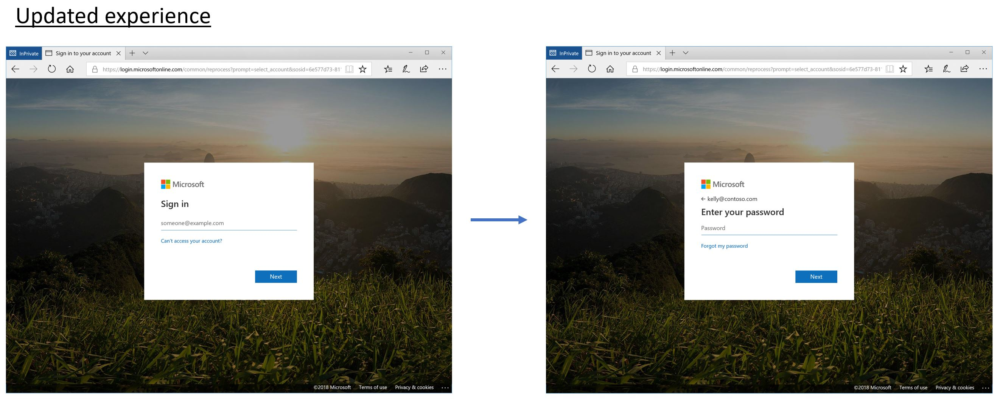

# Updates to the sign-in experience for online services

We’re updating our sign-in experience for Microsoft’s online services, such as Office 365 and Azure. While this is only a visual change, you’ll notice that the screens seem less cluttered and more straightforward, making it easier for you to focus on what you need to do — sign-in.

## Current UI versus new UI

Check out the existing UI compared to the new UI. The new UI is more streamlined and focused, with a more updated look and feel.

## When will the new UI appear?

Here’s a timeline of when to expect this change to happen:

| Timeframe | Change |
|-----------|--------|
| Early-May | You’ll start to see a notification banner on your existing sign-in page. From here you can learn about and prepare for the changes. |
| Mid-May   | The notification banner changes to include a link to preview the updated UI. When in the preview, you can still use a link to switch back to the existing experience. |
| Mid-June  | The updated sign-in UI is available, and everyone defaults to the new UI experience. |

## Related info

If you’re an admin, you can find more info about these updates based on product.

- **Office 365**. Get more details about the updates to [Office 365 Message Center](https://portal.office.com/adminportal/home#/MessageCenter?id=MC133397&MCLinkSource=DigestMail). You must sign in using your admin authentication to access this site.

- **Other online services**. Get more details about the updates by reading this [blog post](https://cloudblogs.microsoft.com/enterprisemobility/2018/04/04/upcoming-improvements-to-the-azure-ad-sign-in-experience/).
