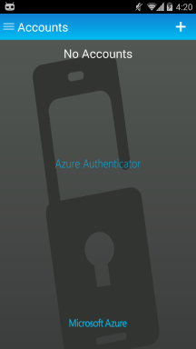

<properties 
	pageTitle="Azure Authenticator for Android" 
	description="Learn how to upgrade to the latest version of ." 
	services="multi-factor-authentication" 
	documentationCenter="" 
	authors="billmath" 
	manager="terrylan" 
	editor="bryanla"/>

<tags 
	ms.service="multi-factor-authentication" 
	ms.workload="identity" 
	ms.tgt_pltfrm="na" 
	ms.devlang="na" 
	ms.topic="article" 
	ms.date="06/02/2015" 
	ms.author="billmath"/>

# Moving to the new Azure Authenticator app for Android

With the release of the [Azure Authenticator app for Android](https://play.google.com/store/apps/details?id=com.azure.authenticator), the old Multi-Factor Authentication app is being replaced.  The Multi-Factor Authentication app will continue to work but should you decide to move to the new Azure Authenticator app then this article will provide guidance on doing so.  

## How to move to the new Azure Authenticator app for Android
**Step 1:** Install Azure Authenticator for Android.

**Step 2:** Activate your accounts with the new app

First of all make sure, you have the QR code or code and URL for manual entry handy for the account you’d like to add to the app.

> [AZURE.NOTE]  Not sure of how to get the QR code? Contact your administrator for assistance.
 Unable to activate your account with the new app? Contact your administrator.

Once you have the QR code in front of you, launch the app. Click +. This will launch the camera to scan the QR code.  If you are unable to scan the QR code, you always have the manual entry option. 

To confirm that the account is successfully activated, verify that the new account shows up on the accounts pages. 

Follow this step for all your accounts that you’d like to migrate to the new app.

**Step 3:**  Uninstall the old Multi-Factor Authentication app from your phone.

Once you have added all the accounts to the new app uninstall the old app from your phone.

Curious how to remove individual accounts from the old app?
Tap on the account. You’ll get an option to “Remove multi-factor auth”. 

**Additional Resources**

* [Azure Multi-Factor Authentication on MSDN](https://msdn.microsoft.com/library/azure/dn249471.aspx) 