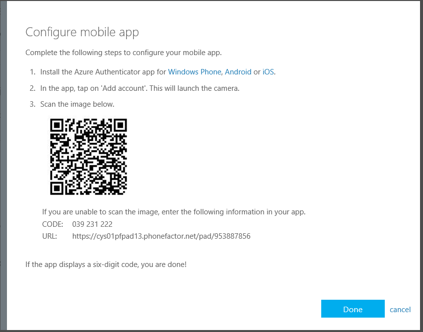
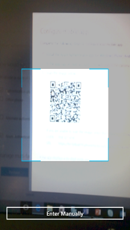
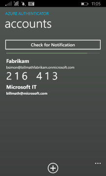
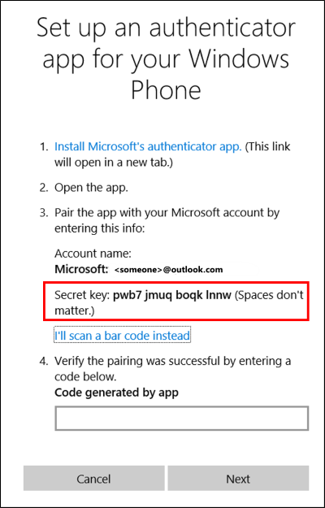

<properties 
	pageTitle="Azure Authenticator app for mobile phones" 
	description="Learn how to upgrade to the latest version of Azure Authenticatior." 
	services="multi-factor-authentication" 
	documentationCenter="" 
	authors="billmath" 
	manager="stevenpo" 
	editor="curtland"/>

<tags 
	ms.service="multi-factor-authentication" 
	ms.workload="identity" 
	ms.tgt_pltfrm="na" 
	ms.devlang="na" 
	ms.topic="article" 
	ms.date="08/04/2016" 
	ms.author="billmath"/>

# Moving to the new Azure Authenticator app

With the release of the Azure Authenticator app, available for [Windows Phone](http://www.windowsphone.com/en-us/store/app/azure-authenticator/03a5b2bf-6066-418f-b569-e8aecbc06e50), [Android](https://play.google.com/store/apps/details?id=com.azure.authenticator), and [IOS](https://itunes.apple.com/us/app/azure-authenticator/id983156458), the old Multi-Factor Authentication app is being replaced.  The Multi-Factor Authentication app will continue to work but should you decide to move to the new Azure Authenticator app then this article can assist you.  

## How to move to the new Azure Authenticator app 

**Step 1:** Install Azure Authenticator.

**Step 2:** Activate your accounts with the new app

First of all make sure, you have the QR code or code and URL for manual entry handy for the account you’d like to add to the app.

> [AZURE.NOTE] Not sure of how to get the QR code? Contact your help desk for assistance.
> 
> Unable to activate your account with the new app? Contact your help desk.
>

Once you have the QR code in front of you, launch the app. Click +. 

This will launch the camera to scan the QR code.  If you are unable to scan the QR code, you always have the manual entry option. 

To confirm that the account is successfully activated, verify that the new account shows up on the accounts pages. 

Follow this step for all your accounts that you’d like to migrate to the new app.

**Step 3:**  Uninstall the old Multi-Factor Authentication app from your phone.

Once you have added all the accounts to the new app uninstall the old app from your phone.

## How to add an account using the barcode scanner

- First, go to your security verification settings page.  For information on how to get to this page see [Changing your Security Settings](multi-factor-authentication-end-user-manage-settings.md).

- Click on the Configure button. 
 

- This will bring up a screen with a barcode on it.
  

- Now open the Azure Authenticator app, you should be taken to the accounts page.  Here you will see a list of accounts that you have setup.  If you want to add a new account click the + sign.  This will open the scanner.

- Scan the barcode. 

- Wait while the account is activated.

- And that's it.  You should now see the new account on the accounts page.

## How to add an Azure account manually

If you want to add an account manually, you can do it by doing the following:

- First, go to your security verification settings page.  For information on how to get to this page see [Changing your Security Settings](multi-factor-authentication-end-user-manage-settings.md).

- Click on the Configure button. 
 

- This will bring up a screen with a barcode on it.  Note he code and URL under the barcode.
  

- Now open the Azure Authenticator app, you should be taken to the accounts page.  Here you will see a list of accounts that you have setup.  If you want to add a new account click the + sign.  This will open the scanner.

- Click the Enter Manually button at the bottom.

- Enter the code and the url that is provided on the same page that shows you the barcode.  This goes in the code and url boxes on the mobile app.  This will begin the activation.

- Wait while the account is activated.

- And that's it.  You should now see the new account on the accounts page.

## How to add a non-Azure account manually

If you want to add an non-Azure account manually, for example, your Microsoft account, you can do it by doing the following:  

- Adding a non-Azure account manually can be done either by scanning the QR code or by entering the secret key.
- If you are going to enter the secret key manually, obtain the secret key from the site the account is associated with.  For example, in Outlook.com you go to your account settings, your security settings, and select setup an authentication app.  You need to select I cannot scan the barcode to get the secret key.
- 

- Open the Azure Authenticator app, you should be taken to the accounts page.  Here you will see a list of accounts that you have setup.  If you want to add a new account click the + sign.  This will open the scanner.

- Either scan the QR code or click the Enter Manually button at the bottom.  If you scan the QR code skip the next step, as activation will begin immediately.

- If entering the secret key manually, enter the account name and the Secret Key that is provided on the same page that shows you the barcode.  This goes in the code and url boxes on the mobile app.  This will begin the activation.

- Wait while the account is activated.  You should now see the new account added.

- Complete the process by entering the code that is below your account (in this case it is 875 756) and entering it into the box on the page you received the secret key from and click Next.  

## How to add an account using TouchID
The Azure Authenticator mobile app on iOS supports Touch ID.  Azure Multi-Factor Authentication allows organizations to require a PIN in addition to having possession of their registered device. With this new feature, iOS users with Touch ID-enabled devices won’t need to enter the PIN anymore. Once set up, users just scan their fingerprint instead of entering PIN and tapping Approve.

Setting up Touch ID with Azure Authenticator is really simple. You just complete a normal verification challenge with PIN, and if your device supports Touch ID, we’ll automatically set it up for you. 

From that point forward, when you are required to verify your sign-in, you tap on the push notification received and scan your fingerprint instead of entering your PIN.

## How to delete an account

To remove individual accounts from the Azure Authenticator App simply tap on the account. You’ll get an option to “Delete”. 

