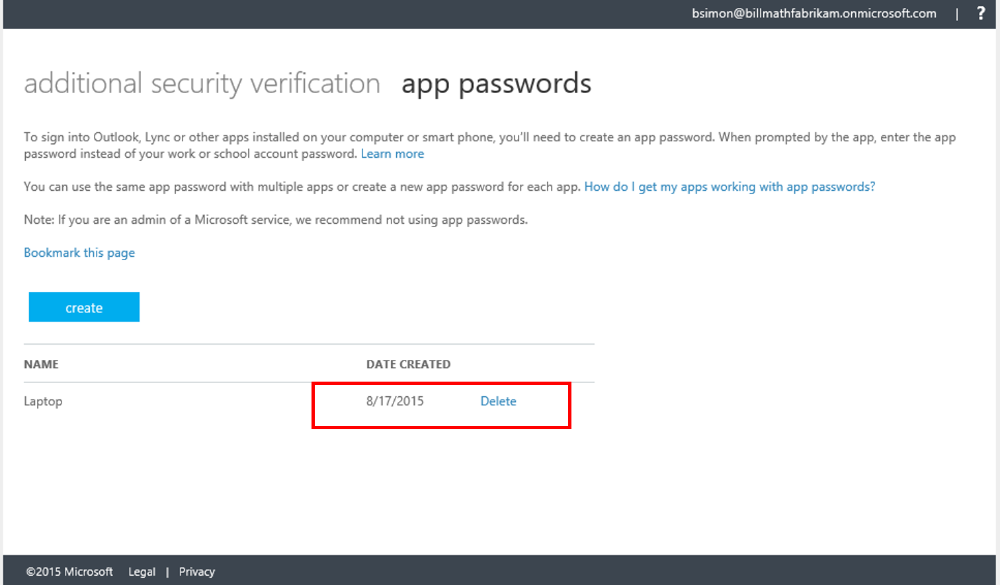
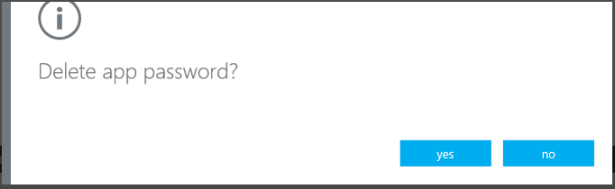
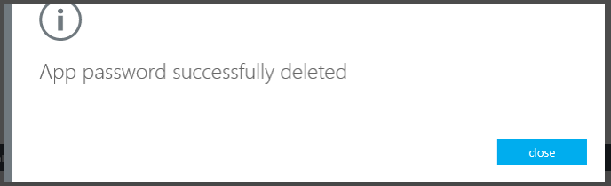
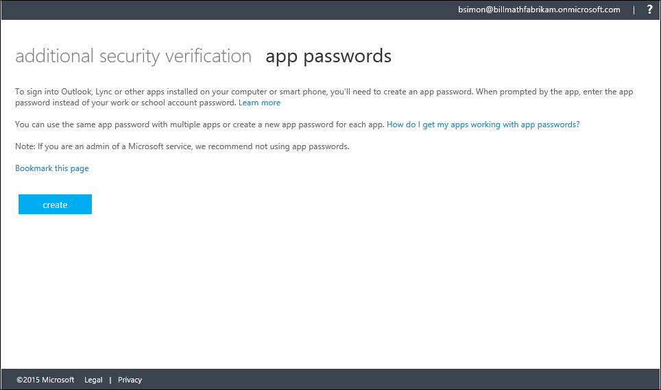

<properties 
	pageTitle="What are App Passwords in Azure MFA?" 
	description="This page will help users understand what app passwords are and what they are used for with regard to Azure MFA." 
	services="multi-factor-authentication" 
	documentationCenter="" 
	authors="billmath" 
	manager="stevenpo" 
	editor="curtland"/>

<tags 
	ms.service="multi-factor-authentication" 
	ms.workload="identity" 
	ms.tgt_pltfrm="na" 
	ms.devlang="na" 
	ms.topic="article" 
	ms.date="05/12/2016" 
	ms.author="billmath"/>

# What are App Passwords in Azure Multi-Factor Authentication?

Certain non-browser apps, such as the Apple native email client that uses Exchange Active Sync, currently do not support multi-factor authentication. Multi-factor authentication is enabled per user. This means that if a user has been enabled for multi-factor authentication and they are attempting to use non-browser apps, they will be unable to do so. An app password allows this to occur.

>[AZURE.NOTE] Modern Authentication for the Office 2013 Clients
>
> Office 2013 clients (including Outlook) now support new Authentication Protocols and can be enabled to support Multi-Factor Authentication.  This means that once enabled, app passwords are not required for use with Office 2013 clients.  For more information see [Office 2013 modern authentication public preview announced](https://blogs.office.com/2015/03/23/office-2013-modern-authentication-public-preview-announced/).
 
## How to use app passwords

The following are some things to remember on how to use app passwords.

- The actual password is automatically generated and is not supplied by the user. This is because the automatically generated password, is harder for an attacker to guess and is more secure.
- Currently there is a limit of 40 passwords per user. If you attempt to create one after you have reached the limit, you will be prompted to delete one of your existing app passwords in order to create a new one.
- It is recommended that app passwords be created per device and not per application. For example, you can create one app password for your laptop and use that app password for all of your applications on that laptop.
- You are given an app password the first time you sign-in.  If you need additional ones, you can create them.
 

Once you have an app password, you use this in place of your original password with these non-browser apps.  So for instance, if you are using multi-factor authentication and the Apple native email client on your phone.  Use the app password so that it can bypass multi-factor authentication and continue to work.

## Creating and deleting app passwords
During your initial sign-in you are given an app password that you can use.  Additionally you can also create and delete app passwords later on.  How you do this depends on how you use multi-factor authentication.  Choose the one that most applies to you.

How you use multi-factor authentiation|Description
:------------- | :------------- | 
[I use it with Office 365](#creating-and-deleting-app-passwords-with-office-365)|  This means that you will want to create app passwords through the Office 365 portal.
[I don't know](#creating-and-deleting-app-passwords-with-myapps-portal)|This means you will want create app passwords through [https://myapps.microsoft.com](https://myapps.microsoft.com)
[I use it with Microsoft Azure](#create-app-passwords-in-the-azure-portal)| This means that you will want create app passwords through the Azure portal.

## Creating and deleting app passwords with Office 365 

If you use multi-factor authentication with Office 365 you will want to create and delete app passwords through the Office 365 portal.

### To create app passwords in the Office 365 portal
--------------------------------------------------------------------------------

1. Log on to the [Office 365 portal](https://login.microsoftonline.com/).
2. In the top right corner select the widget and choose Office 365 Settings.
3. Click on Additional security verification.
4. On the right, click the link that says **Update my phone numbers used for account security.**

5. This will take you to the page that will allow you to change your settings.

6. At the top, next to additional security verification, click on **app passwords.**
7. Click **Create**.

8. Enter a name for the app password and click **Next**.

9. Copy the app password to the clipboard and paste it into your app.

### To delete app passwords using the Office 365 portal
--------------------------------------------------------------------------------

1. Log on to the [Office 365 portal](https://login.microsoftonline.com/).
2. In the top right corner select the widget and choose Office 365 Settings.
3. Click on Additional security verification.
4. On the right, click the link that says **Update my phone numbers used for account security.**

5. This will take you to the page that will allow you to change your settings.

6. At the top, next to additional security verification, click on **app passwords.**
7. Next to the app password you want to delete, click **Delete**.

8. Confirm the deletion by clicking **yes**.

9. Once the app password is deleted you can click **close**.

## Creating and deleting app passwords with Myapps portal.
If you are not sure how you use multi-factor authentication, then you can always create adn delete app passwords through the myapps portal.

### To create an app password using the Myapps portal

1. Sign-in to [https://myapps.microsoft.com](https://myapps.microsoft.com)	
2. At the top, select profile.
3. Select Additional Security Verification.

4. This will take you to the page that will allow you to change your settings.

5. At the top, next to additional security verification, click on **app passwords.**
6. Click **Create**.

7. Enter a name for the app password and click **Next**.

8. Copy the app password to the clipboard and paste it into your app.

### To delete an app password using the Myapps portal

1. Sign-in to [https://myapps.microsoft.com](https://myapps.microsoft.com)	
2. At the top, select profile.
3. Select Additional Security Verification.

4. This will take you to the page that will allow you to change your settings.

5. At the top, next to additional security verification, click on **app passwords.**
6. Next to the app password you want to delete, click **Delete**.

7. Confirm the deletion by clicking **yes**.

8. Once the app password is deleted you can click **close**.

## Create app passwords in the Azure portal

If you use multi-factor authentication with Azure you will want to create app passwords through the Azure portal.

### To create app passwords in the Azure portal

1. Sign-in to the Azure Management portal.
2. At the top, right-click on your user name and select Additional Security Verification.
3. On the proofup page, at the top, select app passwords
4. Click **Create**.
5. Enter a name for the app password and click **Next**
6. Copy the app password to the clipboard and paste it into your app.

### To delete app passwords in the Azure portal

1. Sign-in to the Azure Management portal.
2. At the top, right-click on your user name and select Additional Security Verification.
3. At the top, next to additional security verification, click on **app passwords.**
4. Next to the app password you want to delete, click **Delete**.
5. Confirm the deletion by clicking **yes**.
6. Once the app password is deleted you can click **close**.
