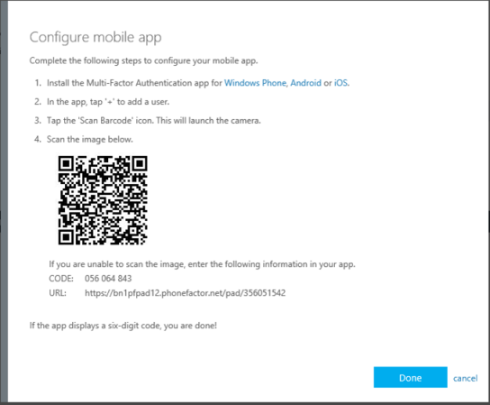
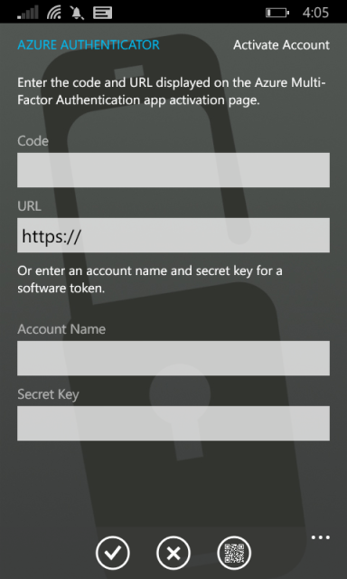
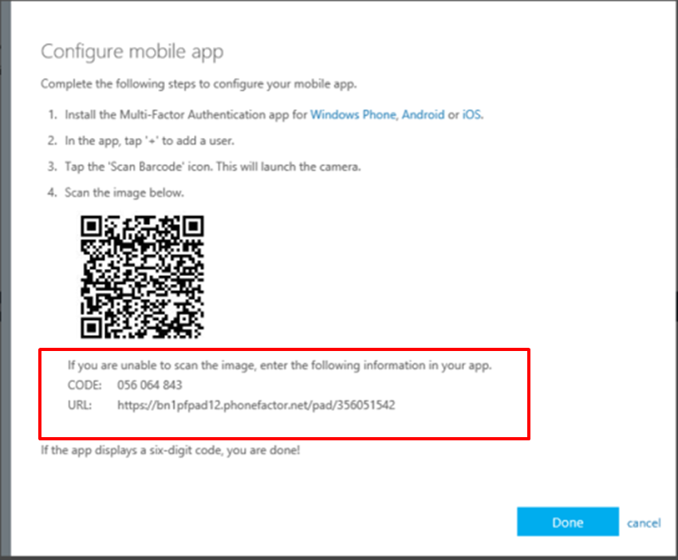

<properties
	pageTitle="Use a mobile app as your contact method with Azure Multi-Factor Authentication | Microsoft Azure"
	description="This article shows you how to use a mobile app as the primary contact method for Azure Multi-Factor Authentication."
	services="multi-factor-authentication"
	documentationCenter=""
	authors="kgremban"
	manager="femila"
	editor="curtland"/>

<tags
	ms.service="multi-factor-authentication"
	ms.workload="identity"
	ms.tgt_pltfrm="na"
	ms.devlang="na"
	ms.topic="article"
	ms.date="08/30/2016"
	ms.author="kgremban"/>

# Use a mobile app as your contact method with Azure Multi-Factor Authentication

If you want to use the Microsoft Authenticator app as your primary contact method, you can use this article.  It walks you through setting up Azure Multi-Factor Authentication to use your mobile app as your primary contact method.

The Microsoft Authenticator app is available for [Windows Phone](http://go.microsoft.com/fwlink/?Linkid=825071), [Android](http://go.microsoft.com/fwlink/?Linkid=825072), and [iOS](http://go.microsoft.com/fwlink/?Linkid=825073).

## Use Microsoft Authenticator as your contact method

1. On the **Additional security verification** screen, select **Mobile app** from the drop-down list.
2. Select either **Notification** or **One-time password**, and select **Set up**.

	

3. On the phone that has the Microsoft Authenticator app installed, open the app and select **+** to add an account.
4. Specify that you want to add a work or school account. This opens the QR code scanner. If your camera is not working properly, you can select to enter your company information manually. For more information, see [Add an account manually](#add-an-account-manually).

	

	

5. Scan the QR code picture that appeared with the screen for configuring the mobile app.  Select **Done** to close the QR code screen.  

	

	If you cannot get the QR code to scan, you can enter the information manually.

	

6. When activation finishes on the phone, select **Contact me**.  This step sends either a notification or a verification code to your phone.  Select **Verify**.

	

7. If your company requires a PIN for approving sign-in verification, enter it.

	

8. After PIN entry is complete, select **Close**.  At this point, your verification should be successful.
9. We recommend that you enter your mobile phone number in case you lose access to your mobile app. Specify your country from the drop-down list, and enter your mobile phone number in the box next to the country name. Select **Next**.
10. At this point, you have set up your contact method. Now it's time to set up app passwords for non-browser apps, such as Outlook 2010 or older. If you don't use these apps, select **Done**.  Otherwise, continue to the next step.

	

11. If you're using non-browser apps, copy the provided app password and paste the password into your apps. For steps on individual apps such as Outlook and Lync, see How to change the password in your email to the app password and How to change the password in your application to the app password.
12. Select **Done**.

## Add an account manually
If you want to add an account manually:

1. Select the **Enter account manually** button.  

	

	

2. If you have an account that already has Azure Multi-Factor Authentication, enter the code and the URL that are provided on the same page that shows you the barcode. This info goes in the **Code** and **URL** boxes on the mobile app.

	

3. When the activation has finished, select **Contact me**. This step sends either a notification or a verification code to your phone. Select **Verify**.
