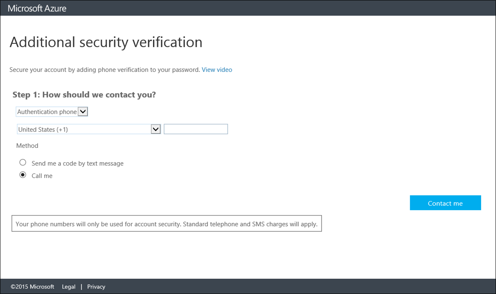

<properties 
	pageTitle="Use mobile phone as your contact method with Azure MFA" 
	description="This page will show users how to use their mobile phone as the primary contact method for Azure MFA." 
	services="multi-factor-authentication" 
	documentationCenter="" 
	authors="billmath" 
	manager="stevenp" 
	editor="curtland"/>

<tags 
	ms.service="multi-factor-authentication" 
	ms.workload="identity" 
	ms.tgt_pltfrm="na" 
	ms.devlang="na" 
	ms.topic="article" 
	ms.date="08/24/2015" 
	ms.author="billmath"/>

# Use mobile phone as your contact method with Azure Multi-Factor Authentication

If you want to use your mobile phone as your primary contact method you can use this article.  It will walk you through setting up multi-factor authentication to use your mobile phone for either a call or text as your contact method.

## To use your mobile phone as your contact method
<ol>
<li>Select Authentication Phone from the drop-down</li>

<li>Specify your country from the drop-downn and enter your mobile phone number.</li>
<li>Select the mode you would prefer to use with your mobile phone - text or call.</li>
<li>Click Next.</li>
<li>Click the Verify Now button. This will initiate a call or text to your mobile phone. Be sure to have it with you. Depending on the mode you selected, Text or Call, your response will be different.
		<ul><li>If you selected the text mode, a 6 digit code will be texted to you. Enter this code in the box that is displayed in the browser</li>
		<li>If you selected the call mode, you will receive a phone call. Respond to the call using the # sign on your phone.</li></ul>
<li>Click Next</li>
<li>At this point, you have setup your contact method and now it is time to setup app passwords for non-browser apps such as Outlook 2010 or older. If you do not use these apps click **Done**.  Otherwise continue to the next step.
<li>If you are using these apps then copy the app password provided.</li>

<li>Paste the password that was copied to the clipboard into your non-browser application. For steps on individual applications such as Outlook and Lync see How to change the password in your email to the app password and How to change the password in your application to the app password.</li>
<li>Click Done.</li>

 