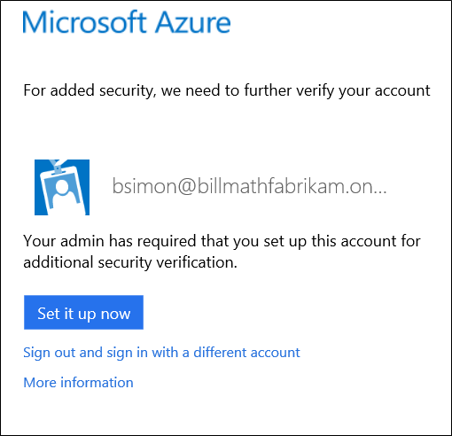

<properties 
	pageTitle="Signing in for the first time with Azure Multi-Factor Authentication" 
	description="This page describes what the user experience will be the first time they signin." 
	services="multi-factor-authentication"
	keywords="how to use azure directory, active directory in the cloud, active directory tutorial" 
	documentationCenter="" 
	authors="billmath" 
	manager="stevenp" 
	editor="curtland"/>

<tags 
	ms.service="multi-factor-authentication" 
	ms.workload="identity" 
	ms.tgt_pltfrm="na" 
	ms.devlang="na" 
	ms.topic="article" 
	ms.date="08/04/2016" 
	ms.author="billmath"/>
# Setup experience for Azure Multi-Factor Authentication

 Additional security verification settings are used when an admin has configured your account to require that both your password and a response from your phone must be used to verify your identity. If an administrator has configured your account to require additional security verification, **you will be unable to sign-in until you have completed the auto-enrollment process**. 

## Determine how you will use multi-factor authentication

 The first time that you sign in after your account has been configured, you will be prompted to begin the auto-enrollment process.  You can begin this process by clicking **Set it up now.** 

Using the enrollment process you will be able to specify your preferred method of verification.  This can be any of the following in the table below.  For additional information including a walk-through simply click on one of the methods.

Method|Description
:------------- | :------------- | 
[Mobile Phone Call](multi-factor-authentication-end-user-first-time-mobile-phone.md)|  Places an automated voice call to the Authentication phone. The user answers the call and presses # in the phone keypad to authenticate. This phone number will not be synchronized to on-premises Active Directory.
[Mobile Phone Text Message](multi-factor-authentication-end-user-first-time-mobile-phone.md)|Sends a text message containing a verification code to the user. The user is prompted to either reply to the text message with the verification code or to enter the verification code into the sign-in interface.
[Office Phone Call](multi-factor-authentication-end-user-first-time-office-phone.md)|Places an automated voice call to the user. The user answers the call and presses # in the phone keypad to authenticate.
[Mobile app](multi-factor-authentication-end-user-first-time-mobile-app.md)|Pushes a notification to the Microsoft Authenticator app on the user’s smartphone or tablet. The user taps “Verify” in the app to authenticate. Alternately, the app can also be used as an OTP token for offline authentication. The user enters the token into the sign-in screen to authenticate. 
  The Microsoft Authenticator app can operate in 2 different modes to provide the additional security that a multi-factor authentication service can provide. These are the following:<li>**Notification** - In this mode, the Microsoft Authenticator app prevents unauthorized access to accounts and stops fraudulent transactions. This is done using a push notification to your phone or registered device. Simply view the notification and if it is legitimate select Authenticate. Otherwise you may choose Deny or choose to deny and report the fraudulent notification. For information on reporting fraudulent notifications see How to use the Deny and Report Fraud Feature for Multi-Factor Authentication.</li>
<li>**One-Time Password** - In this mode, the Microsoft Authenticator app can be used as a software token to generate an OATH verification code. This verification code can then be entered along with the username and password to provide the second form of authentication.</li> 
 The Microsoft Authenticator app is available for [Windows Phone](http://www.windowsphone.com/en-us/store/app/azure-authenticator/03a5b2bf-6066-418f-b569-e8aecbc06e50), [Android](https://play.google.com/store/apps/details?id=com.azure.authenticator), and [IOS](https://itunes.apple.com/us/app/azure-authenticator/id983156458).

 
