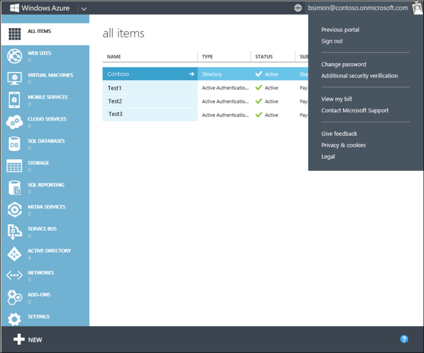

<properties 
	pageTitle="Manage your Azure MFA settings in the Azure portal" 
	description="This page will show users where in the Azure portal they need to go to manage their Azure MFA settings." 
	services="multi-factor-authentication" 
	documentationCenter="" 
	authors="billmath" 
	manager="stevenp" 
	editor="curtland"/>

<tags 
	ms.service="multi-factor-authentication" 
	ms.workload="identity" 
	ms.tgt_pltfrm="na" 
	ms.devlang="na" 
	ms.topic="article" 
	ms.date="08/24/2015" 
	ms.author="billmath"/>

# Manage your Azure Multi-Factor Authentication settings in the Azure portal

If you use multi-factor authentication with Azure you will want to manage your additional security verification settings through the Azure portal.

## To access additional security verification settings in the Azure portal

<ol>
<li>Log on to the Azure portal.
<li>At the top of the Azure portal, click on your username. This will bring up a drop-down box.
<li>From the drop-down box, select Additional security verification. This will open the additional security verification section.

<li>You should now be on the proof-up page and you can change your settings.</li>

 