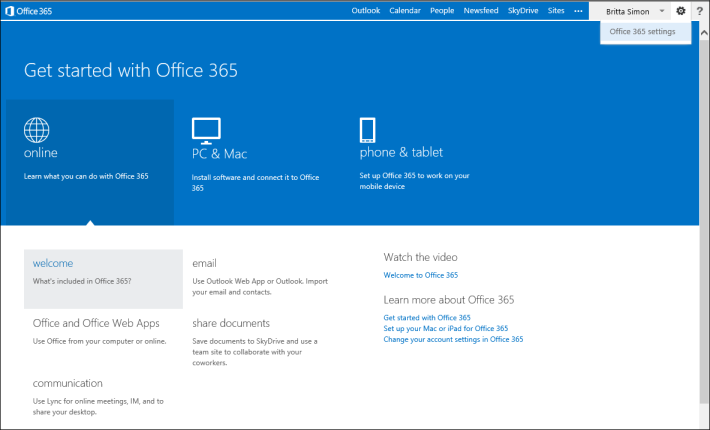
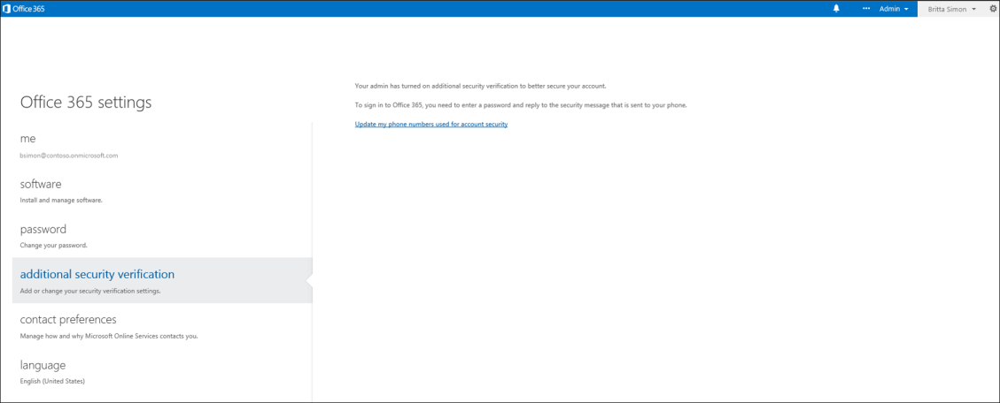

<properties 
	pageTitle="Manage your Azure MFA settings in the Office 365 portal" 
	description="This page will show users where in the Office 365 portal they need to go to manage their Azure MFA settings." 
	services="multi-factor-authentication" 
	documentationCenter="" 
	authors="billmath" 
	manager="stevenpo" 
	editor="curtland"/>

<tags 
	ms.service="multi-factor-authentication" 
	ms.workload="identity" 
	ms.tgt_pltfrm="na" 
	ms.devlang="na" 
	ms.topic="article" 
	ms.date="08/24/2015" 
	ms.author="billmath"/>

# Manage your Azure Multi-Factor Authentication settings in the Office 365 portal

If you use multi-factor authentication with Office 365 you will want to manage your additional security verification settings through the Office 365 portal.

## To access additional security verification settings in the Office 365 portal

<ol>

<li>Log on to the [Office 365 portal](https://login.microsoftonline.com/).</li>
<li>At the top, click the icon that looks like a little cog. This will display a drop-down that says Office 365 settings.</li>

<li>Click on the Office 365, settings. This will open the settings page.</li>
<li>On the left, click additional security verification.</li>

<li>On the right, click the link that says Update my phone numbers used for account security.  This will redirect you to a new page.  You will have to verify how you are again using either your phone or the mobile app</li>
<li>Once this completes you should be on the proof-up page and you can change your settings.</li>

 