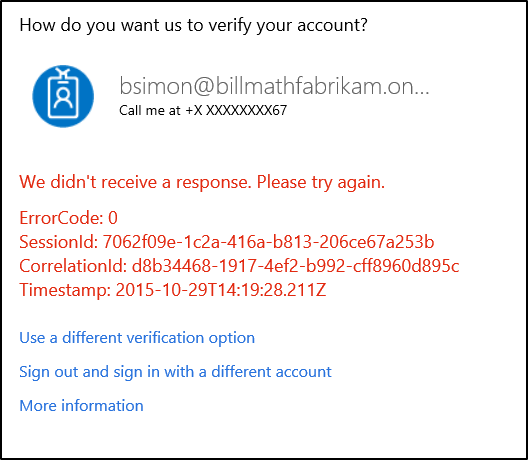
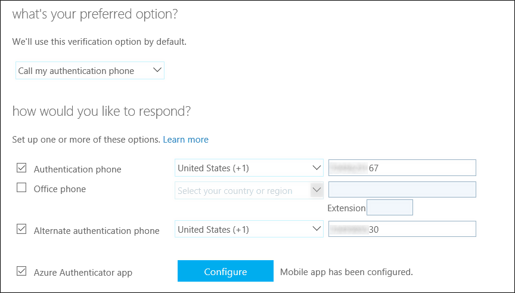
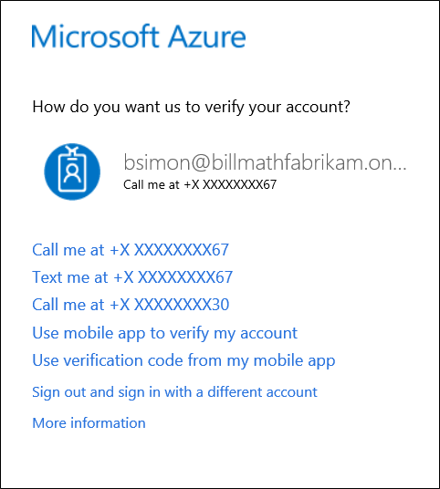
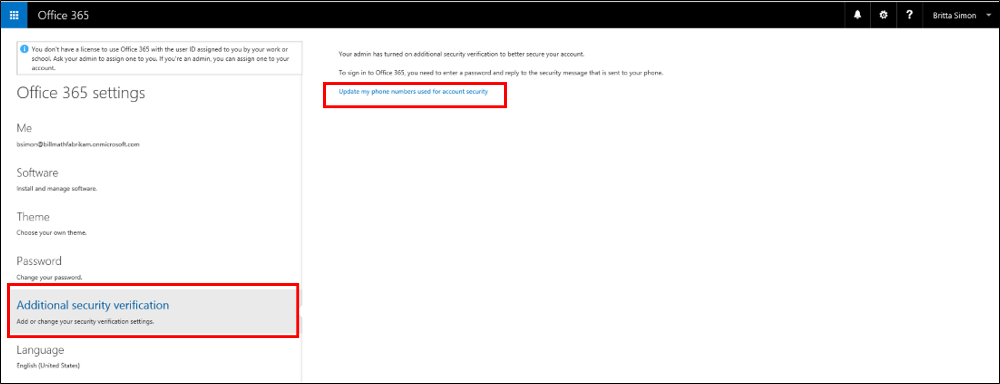

<properties 
	pageTitle="Having trouble with Azure Multi-Factor Authentication | Microsoft Azure" 
	description="This document will provide users information on what to do if they run into an issue with Azure Multi-Factor Authentication." 
	services="multi-factor-authentication"
	keywords = "multifactor authentication client, authentication problem, correlation ID"
	documentationCenter="" 
	authors="billmath" 
	manager="stevenpo" 
	editor="curtland"/>

<tags 
	ms.service="multi-factor-authentication" 
	ms.workload="identity" 
	ms.tgt_pltfrm="na" 
	ms.devlang="na" 
	ms.topic="article" 
	ms.date="08/04/2016" 
	ms.author="billmath"/>

# Having trouble with Azure Multi-Factor Authentication
>[AZURE.IMPORTANT]
>Help us make this page better.  If you do not find an answer to your issue on this page, please provide detailed feedback so that we can get this added.

The following information is provided to help you with some of the common issues that you may experience.

- [Correlation ID Errors](#correlation-id-errors)
- [I have lost my phone or it was stolen](#i-have-lost-my-phone-or-it-was-stolen)
- [I want to change my phone number](#i-want-to-change-my-phone-number)
- [I have a new phone and need to change my phone number](#i-have-a-new-phone-and-need-to-change-my-phone-number)
- [I am not receiving a code on my phone](#i-am-not-receiving-a-code-or-a-call-on-my-phone)
- [App passwords are not working](#app-passwords-are-not-working)
- [How do I clean up Microsoft Authenticator from my old device and move to a new one?](#how-do-i-clean-up-microsoft-authenticator-from-my-old-device-and-move-to-a-new-one)
- [I didn't find an answer to my problem](#i-didnt-find-an-answer-to-my-problem)

##Correlation ID Errors
If you've tried the troubleshooting steps below and are still running into problems, you can post a question on the [Azure AD Forums](https://social.msdn.microsoft.com/forums/azure/home?forum=WindowsAzureAD), [Search the Microsoft Knowledge Base (KB)](https://www.microsoft.com/en-us/Search/result.aspx?q=azure%20active%20directory%20connect&form=mssupport) or [contact support](https://support.microsoft.com/en-us) and we'll take a look at your problem as soon as we can.

When you contact support, it is recommended to include the following information:

 - **General description of the error** – what exact error message did the user see?  If there was no error message, describe the unexpected behavior you noticed, in detail.
 - **Page** – what page were you on when you saw the error (include the URL)?
 - **ErrorCode** - the specific error code you are receiving.
 - **SessionId** - the specific session id you are receiving.
 - **Correlation ID** – what was the correlation id code generated when the user saw the error.
 - **Timestamp** – what was the precise date and time you saw the error (include the timezone)?
 
 

 - **User ID** – what was the ID of the user who saw the error (e.g. user@contoso.com)?
 - **Information about the user** – was the user federated, password hash synced, cloud only?  Did the user have an Azure AD Premium, Enterprise Mobility, or Azure AD Basic license assigned?  Is the user using Office 365? etc.

Including this information will help us to solve your problem as quickly as possible.

## I have lost my phone or it was stolen?
If your phone was lost or stolen, it is recommended that you have your administrator reset your [app passwords](multi-factor-authentication-manage-users-and-devices.md#delete-users-existing-app-passwords) and clear any [remembered devices](multi-factor-authentication-manage-users-and-devices.md#restore-mfa-on-all-suspended-devices-for-a-user).

In order to get back into your account you have two options.  The first is, if you have setup an alternate authentication phone number you can use this to get back into your account and change your security settings.

If you have specified a secondary authentication phone number you can sign-in using it. 

Notice in the screen shot above, two phone numbers have been setup.  One ending in 67 and the second ending in 30.
  
To sign in using the alternate phone number, sign-in as you normally would, then simply choose **Use a different verification option**.

Then select your other phone number.  In this case, you would select **Call me at +X XXXXXXXX30**

>[AZURE.IMPORTANT]
>It is important to configure a secondary authentication phone number.  Because your primary phone number and your mobile app are probably on the same phone, the secondary phone number is the only way you will be able to get back into your account if your phone is lost or stolen.

If you have not configured a secondary authentication phone number then you will have to contact your administrator and have them clear you settings so the next time you sign-in, you will be prompted to [setup multi-factor authentication](multi-factor-authentication-manage-users-and-devices.md#require-selected-users-to-provide-contact-methods-again) again.

## I want to change my phone number
Depending on how you use mutli-factor authentication, there are a few places where you can change your settings like your phone number.   Use the table below to help you choose the one that best describes you.

How you use multi-factor authentiation|Description
:------------- | :------------- | 
[I use it with Office 365](#changing-your-settings-with-office-365)|  This means that you will want to change your settings through the Office 365 portal.
[I don't know](#changing-your-settings-with-the-myapps-portal)|This means you will want to sign-in to [http://myapps.microsoft.com](http://myapps.microsoft.com) and change your setting here.
[I use it with Microsoft Azure](#changing-your-settings-with-microsoft-azure)| This means that you will want to change your settings through the Azure portal.

 
### Changing your settings with Office 365

If you use multi-factor authentication with Office 365 you will want to manage your additional security verification settings through the Office 365 portal.

#### To change your settings in the Office 365 portal

1. Log on to the [Office 365 portal](https://login.microsoftonline.com/).
2. In the top right corner select the widget and choose Office 365 Settings.
3. Click on Additional security verification.
4. On the right, click the link that says **Update my phone numbers used for account security.**

5. This will take you to the page that will allow you to change your settings.

### Changing your settings with the Myapps portal

If you are not sure how you use multi-factor authentication, then you can always change your settings through the myapps portal.

#### To change your settings in the Myapps portal

1. Sign-in to [https://myapps.microsoft.com](https://myapps.microsoft.com)	
2. At the top, select profile.
3. Select Additional Security Verification.

4. This will take you to the page that will allow you to change your settings.

### Changing your settings with Microsoft Azure

If you use multi-factor authentication with Azure you will want to change your settings through the Azure portal.

#### To access additional security verification settings in the Azure portal

1. Log on to the Azure portal.
2. At the top of the Azure portal, click on your username. This will bring up a drop-down box.
3. From the drop-down box, select Additional security verification.

4. This will take you to the page that will allow you to change your settings.

##I have a new phone and need to change my phone number

If you have a new phone and need to change the primary contact number that mfa uses, you can do this in one of two ways.

>[AZURE.IMPORTANT]
>It is important to configure a secondary authentication phone number.  Because your primary phone number and your mobile app are probably on the same phone, the secondary phone number is the only way you will be able to get back into your account if your phone is lost or stolen.

The first is using a secondary authentication method.  If you have specified a secondary authentication phone number you can sign-in using it. 

Notice in the screen shot above, two phone numbers have been setup.  One ending in 67 and the second ending in 30.
  
To sign in using the alternate phone number, sign-in as you normally would, then simply choose **Use a different verification option**.

Then select your other phone number.  In this case, you would select **Call me at +X XXXXXXXX30**

The second is by contacting your administrator or the person who setup mfa for you.  You only need to do this if you have not configured a secondary authentication phone number.  Otherwise you will have to contact your administrator or the person who setup mfa and have them clear you settings so the next time you sign-in, you will be prompted to [setup multi-factor authentication](multi-factor-authentication-manage-users-and-devices.md#require-selected-users-to-provide-contact-methods-again) again.

##I am not receiving a code or a call on my phone

First, you need to ensure the following:

- If you have selected to receive a phone call to your mobile phone, ensure that you have an adequate cell signal.  Your delivery speed and availability may vary by location and service provider.
- If you selected to receive verification codes by text message to your mobile phone, make sure your service plan and device supports text message delivery. Your delivery speed and availability may vary by location and service provider. Also make sure that you have an adequate cell signal when trying to receive these codes.
- If you chose to receive a verification via the mobile app, ensure that you have a significant cell signal.  Also remember that delivery speed and availability may vary by location and service provider. 

If you have a smartphone, we recommend you use the [Azure Authenticator app](multi-factor-authentication-microsoft-authenticator.md).

You can switch between receiving your verification codes via text messages through the mobile app by choosing **Use a different verification option** when you sign-in. 

 

Sometimes delivery of one of these services is more reliable than the other.

Be aware that if you received multiple verification codes, only the newest one will work. 

If you previously configured a backup phone, it is recommended that you try again by selecting that phone when prompted from the sign in page. If you don’t have another method configured, contact your admin and ask them to clear you settings so the next time you sign-in, you will be prompted to [setup multi-factor authentication](multi-factor-authentication-manage-users-and-devices.md#require-selected-users-to-provide-contact-methods-again) again.

##App passwords are not working
First, make sure that you have entered the app password correctly.  If it is still not working try signing-in and [create a new app password](multi-factor-authentication-end-user-app-passwords.md).  If this does not work, contact your administrator and have them [delete your existing app passwords](multi-factor-authentication-manage-users-and-devices.md#delete-users-existing-app-passwords) and then create a new one and use that one.

##How do I clean up Microsoft Authenticator from my old device and move to a new one?
When you uninstall the app from your device or reflash the device, it does not remove the activation on the back end. You should use the steps outlined in [moving to a new device.](multi-factor-authentication-microsoft-authenticator.md#how-to-move-to-the-new-microsoft-authenticator-app).

##I didn't find an answer to my problem
If didn't find an answer to your problem on this page, you can post a question on the [Azure AD Forums](https://social.msdn.microsoft.com/forums/azure/home?forum=WindowsAzureAD), [Search the Microsoft Knowledge Base (KB)](https://www.microsoft.com/en-us/Search/result.aspx?q=azure%20active%20directory%20connect&form=mssupport) or [contact support](https://support.microsoft.com/en-us).

Also, you can contact your administrator or the person who setup multi-factor authentication for you and see if they can assist you.

Finally, be sure to leave some detailed feedback on this page so that we can update this page and continue to make it better by providing more information.
