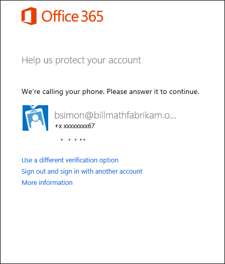
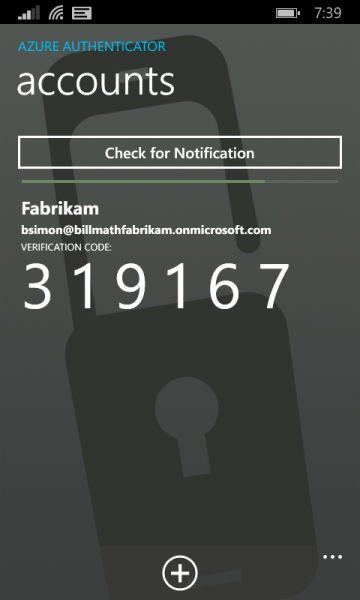

<properties 
	pageTitle="Azure MFA Signin experience with Azure Multi-Factor Authentication" 
	description="This page will provide you guidance on where to go to see the various signin methods available with Azure MFA."
	keywords="user authentication, sign-in experience, sign-in with mobile phone, sign-in with office phone" 
	services="multi-factor-authentication" 
	documentationCenter="" 
	authors="billmath" 
	manager="stevenpo" 
	editor="curtland"/>

<tags 
	ms.service="multi-factor-authentication" 
	ms.workload="identity" 
	ms.tgt_pltfrm="na" 
	ms.devlang="na" 
	ms.topic="article" 
	ms.date="05/12/2016" 
	ms.author="billmath"/>

# The sign in experience with Azure Multi-Factor Authentication
> [AZURE.NOTE]  The following documentation provided on this page shows a typical sign-in experience.  For help with signing in see [Having trouble with Azure Multi-Factor Authentication](multi-factor-authentication-end-user-manage-settings.md)

## What will your sign in experience be?
Depending on how you sign in and use multi-factor authentication, your experience will differ.  In this section we will provide information on what to expect when you sign in.  Choose the one that best describes what you are doing:

What are you doing?|Description
:------------- | :------------- | 
[Signing in with mobile or office phone](#signing-in-with-mobile-or-office-phone) | This is what you can expect from signing in using your mobile or office phone.
[Signing in with the mobile app using notification](#signing-in-with-the-mobile-app-using-notification) | This is what you can expect from signing in the mobile app with notifications.
[Signing in with the mobile app using verification code](#signing-in-with-the-mobile-app-using-verification-code)|This is what you can expect from signing in the mobile app with a verification code.
[Signing in with an alternate method](#signing-in-with-an-alternate-method)|This will show you what to expect if you want to use an alternate method.

## Signing in with mobile or office phone

The following information will describe the experience of using multi-factor authentication with your mobile or office phone.

### To sign in with a call to your office or mobile phone

- Sign in to an application or service such as Office 365 using your user name and password.
- Microsoft will call you.

- Answer the phone and hit the # key.

- You should now be signed in.</li>

## Signing in with the mobile app using notification

The following information will describe the experience of using multi-factor authentication with your mobile app when you are sent a notification.

### To sign in with a notification sent to your mobile app

- Sign in to an application or service such as Office 365 using your user name and password.
- Microsoft will send a notification.

- Answer the phone and hit the verify key.

- You should now be signed in.

## Signing in with the mobile app using verification code

The following information will describe the experience of using multi-factor authentication with your mobile app when you are using it with a verification code.

### To sign in using a verification code with your mobile app

- Sign in to an application or service such as Office 365 using your user name and password.
- Microsoft will prompt you for a verification code.

- Open the Azure Authenticator app on your phone and enter the code in the box where you are signing in.

- You should now be signed in.

## Signing in with an alternate method

The following section will show you how to sign in with an alternate method when your primary method may not be available.

### To sign in with an alternate method

- Sign in to an application or service such as Office 365 using your user name and password.
- Select use a different verification option.  You will be present with a choice of different options. The number you see will be based on how many you have setup.

- Choose an alternate method and sign in.

 