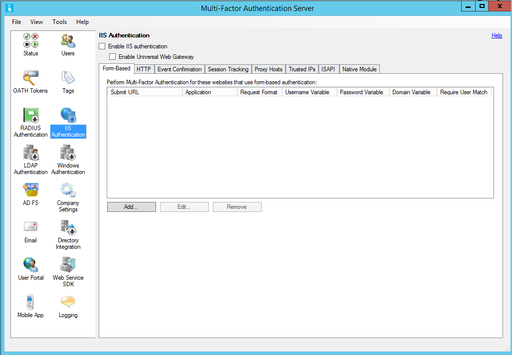
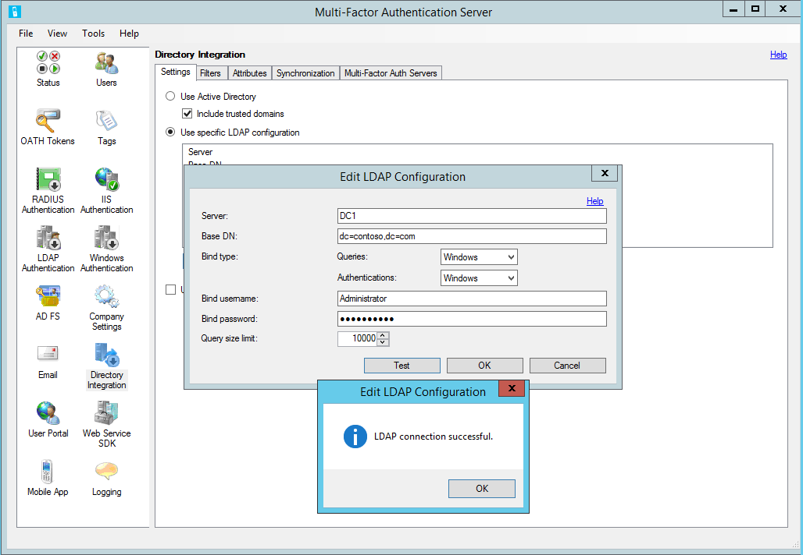

---
title: Use Azure MFA Server with AD FS 2.0 | Microsoft Docs
description: This is the Azure Multi-Factor authentication page that describes how to get started with Azure MFA and AD FS 2.0.
services: multi-factor-authentication
documentationcenter: ''
author: kgremban
manager: femila
editor: yossib

ms.assetid: 96168849-241a-4499-a224-d829913caa7e
ms.service: multi-factor-authentication
ms.workload: identity
ms.tgt_pltfrm: na
ms.devlang: na
ms.topic: get-started-article
ms.date: 10/14/2016
ms.author: kgremban

---
# Secure cloud and on-premises resources using Azure Multi-Factor Authentication Server with AD FS 2.0
This article is for organizations that are federated with Azure Active Directory, and want to secure resources that are on-premises or in the cloud. Protect your resources by using the Azure Multi-Factor Authentication Server and configuring it to work with AD FS so that two-step verification is triggered for high value end points.

This documentation covers using the Azure Multi-Factor Authentication Server with AD FS 2.0.  Get more information on [Securing cloud and on-premises resources using Azure Multi-Factor Authentication Server with Windows Server 2012 R2 AD FS](multi-factor-authentication-get-started-adfs-w2k12.md).

## Secure AD FS 2.0 with a proxy
To secure AD FS 2.0 with a proxy, install the Azure Multi-Factor Authentication Server on the ADFS proxy server and configure the Server.

### Configure IIS authentication
1. Within the Azure Multi-Factor Authentication Server, click the **IIS Authentication** icon in the left menu.
2. Click the **Form-Based** tab.
3. Click the **Add…** button.
   

4. To detect username, password, and domain variables automatically, enter the Login URL (like https://sso.contoso.com/adfs/ls) within the Auto-Configure Form-Based Website dialog box and click OK.
5. Check the **Require Azure Multi-Factor Authentication user match** box if all users have been or will be imported into the Server and subject to two-step verification. If a significant number of users have not yet been imported into the Server and/or will be exempt from two-step verification, leave the box unchecked. For additional information on this feature, see the help file.
6. If the page variables cannot be detected automatically, click the **Specify Manually…** button in the Auto-Configure Form-Based Website dialog box.
7. In the Add Form-Based Website dialog box, enter the URL to the ADFS login page in the Submit URL field (like https://sso.contoso.com/adfs/ls) and enter an Application name (optional). The Application name appears in Azure Multi-Factor Authentication reports and may be displayed within SMS or Mobile App authentication messages. See the help file for more information on the Submit URL.
8. Set the Request format to “POST or GET.”
9. Enter the Username variable (ctl00$ContentPlaceHolder1$UsernameTextBox) and Password variable (ctl00$ContentPlaceHolder1$PasswordTextBox). If your form-based login page displays a domain textbox, enter the Domain variable as well. You may need to navigate to the login page in a web browser, right-click on the page and select **View Source** to find the names of the input boxes within the login page.
10. Check the **Require Azure Multi-Factor Authentication user match** box if all users have been or will be imported into the Server and subject to two-step verification. If a significant number of users have not yet been imported into the Server and/or will be exempt from two-step verification, leave the box unchecked.
    

11. Click the **Advanced…** button to review advanced settings. You can configure settings including the ability to select a custom denial page file, to cache successful authentications to the website using cookies, and to select how to authenticate the primary credentials.
12. Since the ADFS proxy server is not likely to be joined to the domain, you can use LDAP to connect to your domain controller for user import and pre-authentication. In the Advanced Form-Based Website dialog box, click the **Primary Authentication** tab and select **LDAP Bind** for the Pre-authentication Authentication type.
13. When complete, click the **OK** button to return to the Add Form-Based Website dialog box. See the help file for more information on the advanced settings.
14. Click the **OK** button to close the dialog box.
15. Once the URL and page variables have been detected or entered, the website data displays in the Form-Based panel.
16. Click the **Native Module** tab and select the server, the website that the ADFS proxy is running under (like “Default Web Site”) or the ADFS proxy application (like “ls” under “adfs”) to enable the IIS plug-in at the desired level.
17. Click the **Enable IIS authentication** box at the top of the screen.
18. The IIS authentication is now enabled.

### Configure directory integration
You enabled IIS authentication, but to perform the pre-authentication to your Active Directory (AD) via LDAP you must configure the LDAP connection to the domain controller.

1. Click the **Directory Integration** icon.
2. On the Settings tab, select the **Use specific LDAP configuration** radio button.
   

3. Click the **Edit…** button.
4. In the Edit LDAP Configuration dialog box, populate the fields with the information required to connect to the AD domain controller. Descriptions of the fields are included in the table below. This information is also included in the Azure Multi-Factor Authentication Server help file.
5. Test the LDAP connection by clicking the **Test** button.
   

6. If the LDAP connection test was successful, click the **OK** button.

### Configure company settings
1. Next, click the **Company Settings** icon and select the **Username Resolution** tab.
2. Select the **Use LDAP unique identifier attribute for matching usernames** radio button.
3. If users enter their username in “domain\username” format, the Server needs to be able to strip the domain off the username when it creates the LDAP query. That can be done through a registry setting.
4. Open the registry editor and go to HKEY_LOCAL_MACHINE/SOFTWARE/Wow6432Node/Positive Networks/PhoneFactor on a 64-bit server. If on a 32-bit server, take the “Wow6432Node” out of the path. Create a DWORD registry key called “UsernameCxz_stripPrefixDomain” and set the value to 1. Azure Multi-Factor Authentication is now securing the ADFS proxy.

Ensure that users have been imported from Active Directory into the Server. See the [Trusted IPs section](#trusted-ips) if you would like to whitelist internal IP addresses so that two-step verification is not required when signing in to the website from those locations.

## AD FS 2.0 Direct without a proxy
You can secure AD FS when the AD FS proxy is not used. Install the Azure Multi-Factor Authentication Server on the AD FS server and configure the Server per the following steps:

1. Within the Azure Multi-Factor Authentication Server, click the **IIS Authentication** icon in the left menu.
2. Click the **HTTP** tab.
3. Click the **Add…** button.
4. In the Add Base URL dialogue box, enter the URL for the ADFS website where HTTP authentication is performed (like https://sso.domain.com/adfs/ls/auth/integrated) into the Base URL field. Then, enter an Application name (optional). The Application name appears in Azure Multi-Factor Authentication reports and may be displayed within SMS or Mobile App authentication messages.
5. If desired, adjust the Idle timeout and Maximum session times.
6. Check the **Require Azure Multi-Factor Authentication user match** box if all users have been or will be imported into the Server and subject to two-step verification. If a significant number of users have not yet been imported into the Server and/or will be exempt from two-step verification, leave the box unchecked. For additional information on this feature, see the help file.
7. Check the cookie cache box if desired.
   

8. Click the **OK** button.
9. Click the **Native Module** tab and select the server, the website (like “Default Web Site”), or the ADFS application (like “ls” under “adfs”) to enable the IIS plug-in at the desired level.
10. Click the **Enable IIS authentication** box at the top of the screen. Azure Multi-Factor Authentication is now securing ADFS.

Ensure that users have been imported from Active Directory into the Server. See the Trusted IPs section if you would like to whitelist internal IP addresses so that two-step verification is not required when signing in to the website from those locations.

## Trusted IPs
Trusted IPs allow users to bypass Azure Multi-Factor Authentication for website requests originating from specific IP addresses or subnets. For example, you may want to exempt users from two-step verification when they sign in from the office. For this, you would specify the office subnet as a Trusted IPs entry.

### To configure trusted IPs
1. In the IIS Authentication section, click the **Trusted IPs** tab.
2. Click the **Add…** button.
3. When the Add Trusted IPs dialog box appears, select one of the **Single IP**, **IP range**, or **Subnet** radio buttons.
4. Enter the IP address, range of IP addresses, or subnet that should be whitelisted. If entering a subnet, select the appropriate Netmask and click the **OK** button. The trusted IP has now been added.

