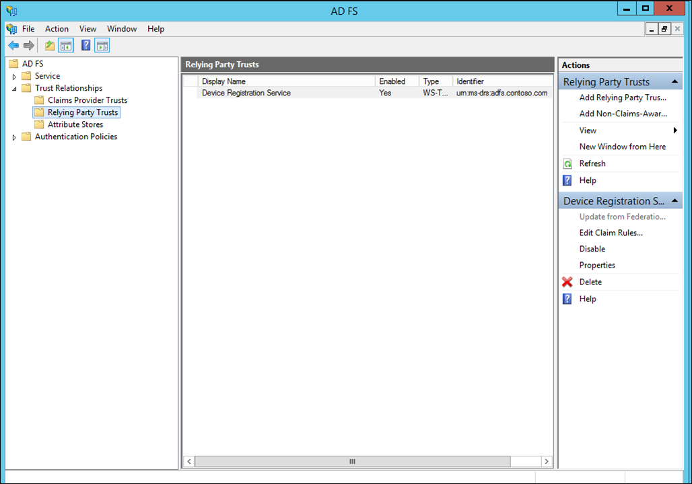
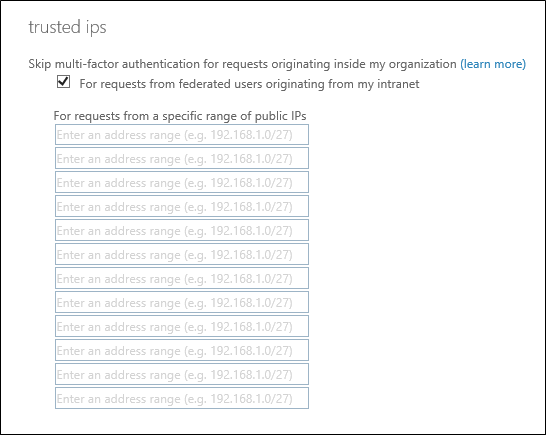

<properties 
	pageTitle="Securing cloud resources with Azure Multi-Factor Authentication and AD FS" 
	description="This is the Azure Multi-Factor authentication page that describes how to get started with Azure MFA and AD FS in the cloud." 
	services="multi-factor-authentication" 
	documentationCenter="" 
	authors="billmath" 
	manager="stevenpo" 
	editor="curtland"/>

<tags 
	ms.service="multi-factor-authentication" 
	ms.workload="identity" 
	ms.tgt_pltfrm="na" 
	ms.devlang="na" 
	ms.topic="article" 
	ms.date="08/24/2015" 
	ms.author="billmath"/>

# Securing cloud resources with Azure Multi-Factor Authentication and AD FS

If your organization is federated with Azure Active Directory and you have resources that are accessed by Azure AD, you can use Azure Multi-Factor Authentication or Active Directory Federation Services to secure these resources. Use the procedures below to secure Azure Active Directory resources with either Azure Multi-Factor Authentication or Active Directory Federation Services.

## To secure Azure AD resources using AD FS do the following: 

1. Use the steps outlined in [turn-on multi-factor authentication](active-directory/multi-factor-authentication-get-started-cloud.md#turn-on-multi-factor-authentication-for-users) for users to enable an account.
2. Use the following procedure to setup a claims rule:

- 	Start the AD FS Management console.
- 	Navigate to Relying Party Trusts and right-click on the Relying Party Trust. Select Edit Claim Rules…
- 	Click Add Rule…
- 	From the drop down, select Send Claims Using a Custom Rule and click Next.
- 	Enter a name for the claim rule.
- 	Under Custom rule: add the following:

		=> issue(Type = "http://schemas.microsoft.com/claims/authnmethodsreferences", Value = "http://schemas.microsoft.com/claims/multipleauthn");

	Corresponding claim:

		<saml:Attribute AttributeName="authnmethodsreferences" AttributeNamespace="http://schemas.microsoft.com/claims">
		<saml:AttributeValue>http://schemas.microsoft.com/claims/multipleauthn</saml:AttributeValue>
		</saml:Attribute>
- Click OK. Click Finish. Close the AD FS Management console.

Users then can complete signing in using the on-premises method (such as smartcard).

## Trusted IPs for federated users
Trusted IPs allow administrators to by-pass multi-factor authentication for specific IP address or for federated users that have requests originating from within their own intranet. The following sections will describe how to configure Azure Multi-Factor Authentication Trusted IPs with federated users and by-pass multi-factor authentication, when a request originates from within a federated users intranet.  This is achieved by configuring AD FS to use a pass through or filter an incoming claim template with the Inside Corporate Network claim type.  This example uses Office 365 for our Relying Party Trusts.

### Configure the AD FS claims rules

The first thing we need to do is to configure the AD FS claims. We will be creating two claims rules, one for the Inside the Corporate Network claim type and an additional one for keeping our users signed in.

1. Open AD FS Management.
2. On the left, select Relying Party Trusts.
3. In the middle, right-click on Microsoft Office 365 Identity Platform and select **Edit Claim Rules…**

4. On Issuance Transform Rules click **Add Rule.**

5. On the Add Transform Claim Rule Wizard, select Pass Through or Filter an Incoming Claim from the drop down and click Next.

6. In the box next to Claim rule name, give your rule a name. For example: InsideCorpNet.
7. From the drop-down, next to Incoming claim type, select Inside Corporate Network.

8. Click Finish.
9. On Issuance Transform Rules click **Add Rule**.
10. On the Add Transform Claim Rule Wizard, select Send Claims Using a Custom Rule from the drop down and click Next.
11. In the box under Claim rule name: enter Keep Users Signed In.
12. In the Custom rule box enter:
	    
		c:[Type == "http://schemas.microsoft.com/2014/03/psso"]
			=> issue(claim = c);

13. Click **Finish**.
14. Click **Apply**.
15. Click **Ok**.
16. Close AD FS Management.

### Configure Azure Multi-Factor Authentication Trusted IPs with Federated Users
Now that the claims are in place, we cane configure trusted ips.

1. Sign-in to the Azure Management Portal.
2. On the left, click Active Directory.
3. Under, Directory click on the directory you wish to setup Trusted IPs on.
4. On the Directory you have selected, click Configure.
5. In the multi-factor authentication section, click Manage service settings.
6. On the Service Settings page, under Trusted IPs, select **For requests from federated users originating from my intranet.**

7. Click save.
8. Once the updates have been applied, click close.

That’s it! At this point, federated Office 365 users should only have to use MFA when a claim originates from outside the corporate intranet.

