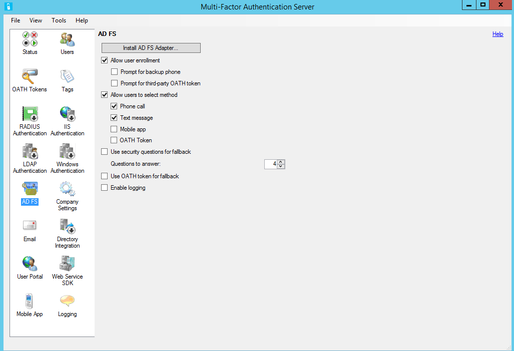
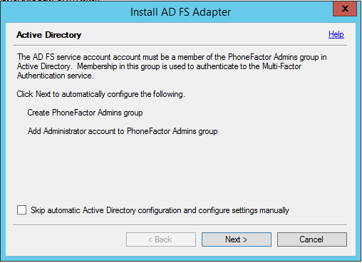
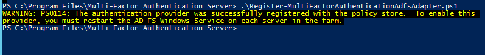
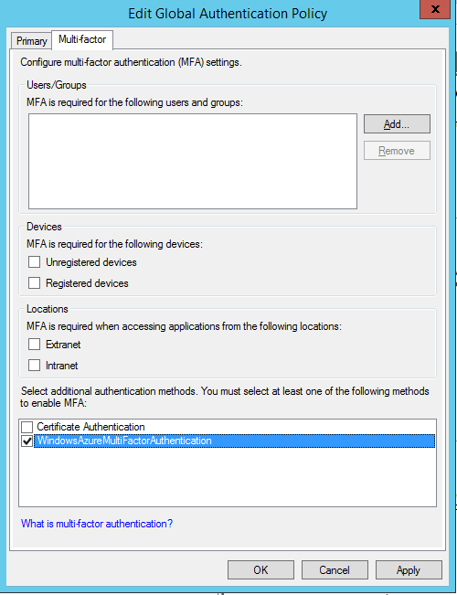

<properties
	pageTitle="Secure cloud and on-premises resources by using Azure Multi-Factor Authentication Server with Windows Server 2012 R2 AD FS"
	description="This article describes how to get started with Azure Multi-Factor Authentication and AD FS in Windows Server 2012 R2."
	services="multi-factor-authentication"
	documentationCenter=""
	authors="billmath"
	manager="stevenpo"
	editor="curtland"/>

<tags
	ms.service="multi-factor-authentication"
	ms.workload="identity"
	ms.tgt_pltfrm="na"
	ms.devlang="na"
	ms.topic="get-started-article"
	ms.date="05/12/2016"
	ms.author="billmath"/>

# Secure cloud and on-premises resources by using Azure Multi-Factor Authentication Server with AD FS in Windows Server 2012 R2

If your organization uses Active Directory Federation Services (AD FS) and you want to secure cloud or on-premises resources, you can deploy and configure Azure Multi-Factor Authentication Server to work with AD FS. This configuration triggers multi-factor authentication for high-value endpoints.

In this article, we discuss using Azure Multi-Factor Authentication Server with AD FS in Windows Server 2012 R2. For more information, read about how to [secure cloud and on-premises resources by using Azure Multi-Factor Authentication Server with AD FS 2.0](multi-factor-authentication-get-started-adfs-adfs2.md).

## Secure Windows Server 2012 R2 AD FS with Azure Multi-Factor Authentication Server

When you install Azure Multi-Factor Authentication Server, you have the following options:

- Install Azure Multi-Factor Authentication Server locally on the same server as AD FS
- Install the Azure Multi-Factor Authentication adapter locally on the AD FS server, and then install Multi-Factor Authentication Server on a different computer

Before you begin, be aware of the following information:

- You are not required to install Azure Multi-Factor Authentication Server on your AD FS server. However, you must install the Multi-Factor Authentication adapter for AD FS on a Windows Server 2012 R2 that is running AD FS. You can install the server on a different computer if it is a supported version and you install the AD FS adapter separately on your AD FS federation server. See the following procedures to learn how to install the adapter separately.
- When the Multi-Factor Authentication Server AD FS adapter was designed, it was anticipated that AD FS could pass the name of the relying party to the adapter, which could be used as an application name. However, this turned out not to be the case. If your organization is using text message or mobile app authentication methods, the strings defined in Company Settings contain a placeholder, <$*application_name*$>. This placeholder is not automatically replaced when you use the AD FS adapter. We recommend that you remove the placeholder from the appropriate strings when you secure AD FS.

- The account that you use to sign in must have user rights to create security groups in your Active Directory service.

- The Multi-Factor Authentication AD FS adapter installation wizard creates a security group called PhoneFactor Admins in your instance of Active Directory and then adds the AD FS service account of your federation service to this group. We recommend that you verify on your domain controller that the PhoneFactor Admins group is indeed created and that the AD FS service account is a member of this group. If necessary, manually add the AD FS service account to the PhoneFactor Admins group on your domain controller.
- For information about installing the Web Service SDK with the user portal, read about [deploying the user portal for Azure Multi-Factor Authentication Server.](multi-factor-authentication-get-started-portal.md)

### Install Azure Multi-Factor Authentication Server locally on the AD FS server

1. Download and install Azure Multi-Factor Authentication Server on your AD FS federation server. For installation information, read about [getting started with Azure Multi-Factor Authentication Server](multi-factor-authentication-get-started-server.md).
2. In the Azure Multi-Factor Authentication Server management console, click the **AD FS** icon, and then select the options **Allow user enrollment** and **Allow users to select method**.
3. Select any additional options you'd like to specify for your organization.
4. Click **Install AD FS Adapter**.

5. If the computer is joined to a domain and the Active Directory configuration for securing communication between the AD FS adapter and the Multi-Factor Authentication service is incomplete, the **Active Directory** window will be displayed. Click **Next** to automatically complete this configuration, or select the **Skip automatic Active Directory configuration and configure settings manually** check box, and then click **Next**.
6. If the computer is not joined to a domain and the local group configuration for securing communication between the AD FS adapter and the Multi-Factor Authentication service is incomplete, the **Local Group** window will be displayed. Click **Next** to automatically complete this configuration, or select the **Skip automatic Local Group configuration and configure settings manually** check box, and then click **Next**.
7. In the installation wizard, click **Next**. Azure Multi-Factor Authentication Server creates the PhoneFactor Admins group and adds the AD FS service account to the PhoneFactor Admins group.

8. On the **Launch Installer** page, click **Next**.
9. In the Multi-Factor Authentication AD FS adapter installer, click **Next**.
10. Click **Close** when the installation is finished.
11. When the adapter has been installed, you must register it with AD FS. Open Windows PowerShell and run the following command: 
    `C:\Program Files\Multi-Factor Authentication Server\Register-MultiFactorAuthenticationAdfsAdapter.ps1`
   

12. Edit the global authentication policy in AD FS to use your newly registered adapter. In the AD FS management console, go to the **Authentication Policies** node. In the **Multi-factor Authentication** section, click the **Edit** link next to the **Global Settings** section. In the **Edit Global Authentication Policy** window, select **Multi-Factor Authentication** as an additional authentication method, and then click **OK**. The adapter is registered as WindowsAzureMultiFactorAuthentication. You must restart the AD FS service for the registration to take effect.

At this point, Multi-Factor Authentication Server is set up to be an additional authentication provider to use with AD FS.

## Install a standalone instance of the AD FS adapter by using the Web Service SDK
1. Install the Web Service SDK on the server that is running Multi-Factor Authentication Server.
2. Copy the following files from the \Program Files\Multi-Factor Authentication Server directory to the server on which you plan to install the AD FS adapter:
  - MultiFactorAuthenticationAdfsAdapterSetup64.msi
  - Register-MultiFactorAuthenticationAdfsAdapter.ps1
  - Unregister-MultiFactorAuthenticationAdfsAdapter.ps1
  - MultiFactorAuthenticationAdfsAdapter.config
3. Run the MultiFactorAuthenticationAdfsAdapterSetup64.msi installation file.
4. In the Multi-Factor Authentication AD FS adapter installer, click **Next** to perform the installation.
5. Click **Close** when the installation is finished.
6. Edit the MultiFactorAuthenticationAdfsAdapter.config file by doing the following:
 
|MultiFactorAuthenticationAdfsAdapter.config Step| Sub step|
|:------------- | :------------- |
|Set the **UseWebServiceSdk** node to **true**.||
|Set the value for **WebServiceSdkUrl** to the URL of the Multi-Factor Authentication Web Service SDK.||
|Configure the Web Service SDK.  *Option 1*: By using a user name and password|<ol type="a"><li>Set the value for  **WebServiceSdkUsername** to an account that is a member of the PhoneFactor Admins security group. Use the &lt;domain&gt;&#92;&lt;user name&gt; format.<li>Set the value for **WebServiceSdkPassword** to the appropriate account password.</li></ol>
|Configure the Web Service SDK, *continued*  *Option 2*: By using a client certificate|<ol type="a"><li>Obtain a client certificate from a certificate authority for the server that is running the Web Service SDK. Learn how to [obtain client certificates](https://technet.microsoft.com/library/cc770328.aspx).</li><li>Import the client certificate to the local computer personal certificate store on the server that is running the Web Service SDK. Note: Make sure that the certificate authority's public certificate is in Trusted Root Certificates certificate store.</li><li>Export the public and private keys of the client certificate to a .pfx file.</li><li>Export the public key in Base64 format to a .cer file.</li><li>In Server Manager, verify that the Web Server (IIS)\Web Server\Security\IIS Client Certificate Mapping Authentication feature is installed. If it is not installed, select **Add Roles and Features** to add this feature.</li><li>In IIS Manager, double-click **Configuration Editor** in the website that contains the Web Service SDK virtual directory. Note: It is very important to do this at the website level and not at the virtual directory level.</li><li>Go to the **system.webServer/security/authentication/iisClientCertificateMappingAuthentication** section.</li><li>Set **enabled** to **true**.</li><li>Set **oneToOneCertificateMappingsEnabled** to **true**.</li><li>Click the **...** button next to **oneToOneMappings**, and then click the **Add** link.</li><li>Open the Base64 .cer file you exported earlier. Remove *-----BEGIN CERTIFICATE-----*, *-----END CERTIFICATE-----*, and any line breaks. Copy the resulting string.</li><li>Set **certificate** to the string copied in the preceding step.</li><li>Set **enabled** to **true**.</li><li>Set **userName** to an account that is a member of the PhoneFactor Admins security group. Use the &lt;domain&gt;&#92;&lt;user name&gt; format.</li><li>Set the password to the appropriate account password, and then close Configuration Editor.</li><li>Click the **Apply** link.</li><li>In the Web Service SDK virtual directory, double-click **Authentication**.</li><li>Verify that **ASP.NET Impersonation** and **Basic Authentication** are set to **Enabled** and all other items are set to **Disabled**.</li><li>In the Web Service SDK virtual directory, double-click **SSL Settings**.</li><li>Set **Client Certificates** to **Accept**, and then click **Apply**.</li><li>Copy the .pfx file you exported earlier to the server that is running the AD FS adapter.</li><li>Import the .pfx file to the local computer personal certificate store.</li><li>Right-click and select **Manage Private Keys**, and then grant read access to the account you used to sign in to the AD FS service.</li><li>Open the client certificate and copy the thumbprint from the **Details** tab.</li><li>In the MultiFactorAuthenticationAdfsAdapter.config file, set **WebServiceSdkCertificateThumbprint** to the string copied in the previous step.</li></ol>
| Edit the Register-MultiFactorAuthenticationAdfsAdapter.ps1 script by adding *-ConfigurationFilePath &lt;path&gt;* to the end of the `Register-AdfsAuthenticationProvider` command, where *&lt;path&gt;* is the full path to the MultiFactorAuthenticationAdfsAdapter.config file.||

To register the adapter, run the \Program Files\Multi-Factor Authentication Server\Register-MultiFactorAuthenticationAdfsAdapter.ps1 script in PowerShell. The adapter is registered as WindowsAzureMultiFactorAuthentication. You must restart the AD FS service for the registration to take effect.
