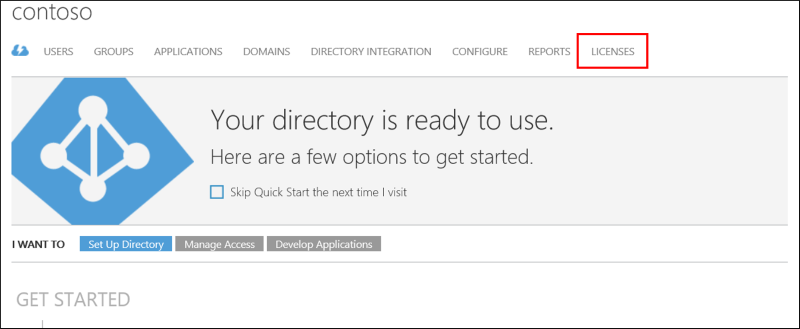
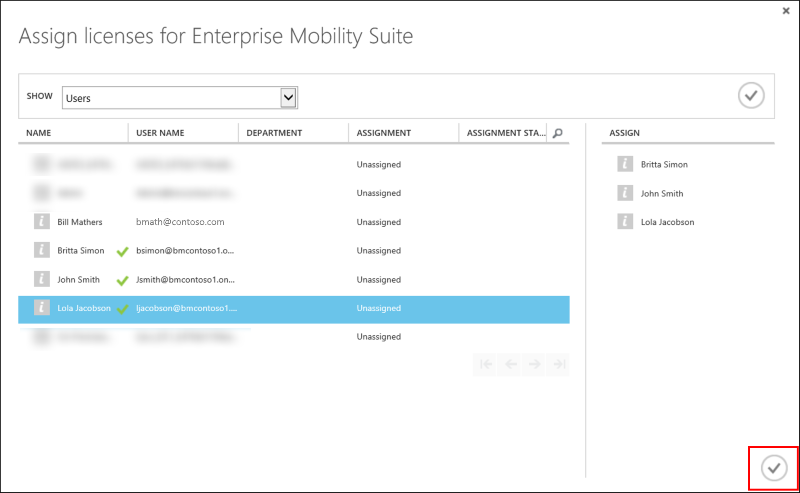

# Assigning an Azure MFA, Azure AD Premium, or Enterprise Mobility license to users
If you have purchased Azure MFA, Azure AD Premium, or Enterprise Mobility Suite licenses, you do not need to create a Multi-Factor Auth provider. Once you assign the licenses to your users, you can begin enabling them for MFA.

## To assign a license
1. Sign in to the [Azure classic portal](https://manage.windowsazure.com) as an administrator.
2. On the left, select **Active Directory**.
3. On the Active Directory page, double-click the directory that has the users you wish to enable.
4. At the top of the directory page, select **Licenses**.
   
5. On the Licenses page, select **Azure Multi-Factor Authentication**, **Active Directory Premium**, or **Enterprise Mobility Suite**.  If you only have one, then it should be selected automatically.
6. At the bottom of the page, click **Assign**.
   
7. In the box that comes up, click next to the users or groups you want to assign licenses to.  You should see a green check mark appear.
8. Click the check mark icon to save the changes.
   
9. You should see a message saying how many licenses were assigned and how many may have failed.  Click **Ok**.
   

## Next steps

- For more information, see [What is Microsoft Azure Active Directory licensing?](../active-directory/active-directory-licensing-what-is.md)
