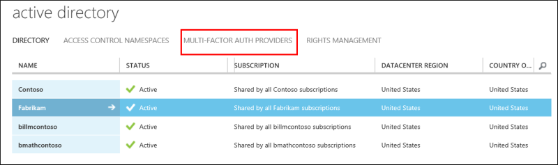
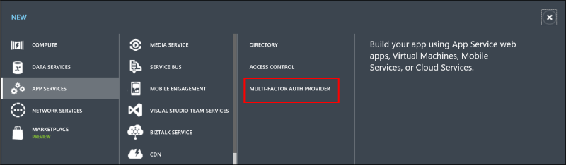
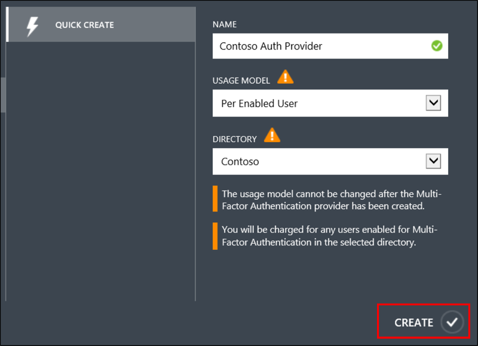
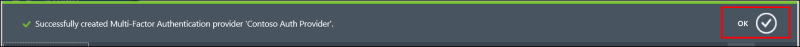

<properties 
	pageTitle="Getting started with Microsoft Azure Multi-Factor Auth Provider" 
	description="Learn how to create an Azure Multi-Factor Auth Provider." 
	services="multi-factor-authentication" 
	documentationCenter="" 
	authors="billmath" 
	manager="stevenpo" 
	editor="curtand"/>

<tags 
	ms.service="multi-factor-authentication" 
	ms.workload="identity" 
	ms.tgt_pltfrm="na" 
	ms.devlang="na" 
	ms.topic="get-started-article" 
	ms.date="08/04/2016" 
	ms.author="billmath"/>

# Getting started with an Azure Multi-Factor Auth Provider
Multi-factor authentication is available by default for global administrators who have Azure Active Directory and Office 365 users. However, if you wish to take advantage of [advanced features](multi-factor-authentication-whats-next.md) then you must purchase the full version of Azure MFA. 

> [AZURE.NOTE]  An Azure Multi-Factor Auth Provider is used to take advantage of features provided by the full version of Azure MFA. It is for users who **do not have licenses through Azure MFA, Azure AD Premium, or EMS**.  Azure MFA, Azure AD Premium, and EMS include the full version of Azure MFA by default.  If you have licenses then you do not need an Azure Multi-Factor Auth Provider. 

An Azure Multi-Factor Auth provider is required if you wish to download the SDK.

> [AZURE.IMPORTANT]  If you wish to download the SDK, you will need to create an Azure Multi-Factor Auth Provider even if you have Azure MFA, AAD Premium, or EMS licenses.  If you create an Azure Multi-Factor Auth Provider for this purpose and already have licenses, it is required to create the Provider with the **Per Enabled User** model and link the Provider to the directory that contains the Azure MFA, Azure AD Premium, or EMS licenses.  This will ensure that you are not billed unless you have more unique users using the SDK than the number of licenses you own.
 
Use the following steps to create an Azure Multi-Factor Auth Provider.

## To create a Multi-Factor Auth Provider
--------------------------------------------------------------------------------

1. Log on to the **Azure classic portal** as an Administrator.
2. On the left, select **Active Directory**.
3. On the Active Directory page, at the top, select **Multi-Factor Authentication Providers**.

4. At the bottom, click **New**.

5. Under **App Services**, select **Multi-Factor Auth Provider**

6. Select **Quick Create**.

5. Fill in the following fields and select **Create**.
	1. **Name** – The name of the Multi-Factor Auth Provider.
	2. **Usage Model** – The usage model of the Multi-Factor Authentication Provider.
		- Per Authentication – purchasing model that charges per authentication. Typically used for scenarios that use Azure Multi-Factor Authentication in a consumer-facing application.
		- Per Enabled User – purchasing model that charges per enabled user. Typically used for employee access to applications such as Office 365.
	2. **Directory** – The Azure Active Directory tenant that the Multi-Factor Authentication Provider is associated with. Please be aware of the following:
		- You do not need an Azure AD directory to create a Multi-Factor Auth Provider.  Simply leave the box blank if you are only planning to use the Azure Multi-Factor Authentication Server or SDK.
		- The Multi-Factor Auth Provider must be associated with an Azure AD directory to take advantage of the advanced features.
		- Azure AD Connect, AAD Sync, or DirSync are only a requirement if you are synchronizing your on-premises Active Directory environment with an Azure AD directory.  If you only use an Azure AD directory that is not synchronized, then this is not required. 
	
5. Once you click create, the Multi-Factor Authentication Provider is created and you should see a message stating: **Successfully created Multi-Factor Authentication Provider**. Click **Ok**.
	
