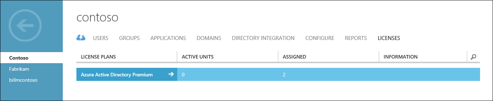

<properties 
	pageTitle="Getting started with Azure Multi-Factor Authentication in the cloud" 
	description="This is the Azure Multi-Factor authentication page that describes how to get started with Azure MFA in the cloud." 
	services="multi-factor-authentication" 
	documentationCenter="" 
	authors="billmath" 
	manager="stevenpo" 
	editor="curtand"/>

<tags 
	ms.service="multi-factor-authentication" 
	ms.workload="identity" 
	ms.tgt_pltfrm="na" 
	ms.devlang="na" 
	ms.topic="get-started-article" 
	ms.date="02/16/2016" 
	ms.author="billmath"/>

# Getting started with Azure Multi-Factor Authentication in the cloud

Now that we have determined that we are using multi-factor authentication in the cloud, let's get going!  Getting started with Azure Multi-Factor Authentication is only a few short clicks away.  Please note that if you are using Multi-Factor Authentication for Office 365 or Multi-Factor Authentication for Azure Administrators you can skip to step 3.  

1. [Sign up for an Azure subscription](https://azure.microsoft.com/pricing/free-trial/)
	- If you do not already have an Azure subscription, you need to sign-up for one. If you are just starting out and using Azure MFA you can use a trial subscription
2. [Create a Multi-Factor Auth Provider](#creating-an-azure-multi-factor-auth-provider)  or [assign licenses to users](#assigning-an-azure-ad-premium-or-enterprise-mobility-license-to-users)
	- Next you need to do one of the following.  Create an Azure Multi-Factor Auth Provider and assign it to your directory or assign licenses to your users.  Licenses are available for users who have Azure MFA, Azure AD Premium and/or EMS.  Azure Multi-Factor Authentication is included in Azure Active Directory Premium. It is also included within the Enterprise Mobility Suite. If you have enough licenses for all of your users to use multi-factor authentication, you do not need to create an Auth Provider. 
3. [Turn on Multi-Factor Authentication for your users](#turn-on-multi-factor-authentication-for-users)
	- Enable Azure MFA on your users either through the Office 365 or Azure portal. 
4. [Send email to end users to notify them about MFA](#send-email-to-end-users)
	- Once a user has had multi-factor authentication turned on for their account, it is recommended that you notify them by sending an email. The user will be prompted to complete the process the next time they sign-in, so the email lets them know what to expect. 

## Creating an Azure Multi-Factor Auth Provider
Multi-factor authentication is available by default for global administrators who have Azure Active Directory and Office 365 users. However, if you wish to take advantage of advanced features then you must purchase the full version of Azure MFA. 

An Azure Multi-Factor Auth Provider is used to take advantage of features provided by the full version of Azure MFA. It is for users who do not have licenses through Azure MFA, Azure AD Premium or EMS.  Azure MFA, Azure AD Premium, and EMS include the full version of Azure MFA by default.  IF you have licenses then you do not need an Azure Multi-Factor Auth Provider.  The following steps show how to create an Azure Mutli-Factor Auth Provider.

### To create a Multi-Factor Auth Provider
--------------------------------------------------------------------------------

1. Log on to the Azure Portal as an Administrator.
2. On the left, select Active Directory.
3. On the Active Directory page, at the top, select Multi-Factor Authentication Providers. Then at the bottom, click **New**.
4. Under App Services, select Multi-Factor Auth Providers, and select Quick Create.
5. Fill in the following fields and select Create.
	1. Name – The name of the Multi-Factor Auth Provider.
	2. Usage Model – The usage model of the Multi-Factor Authentication Provider.
		- Per Authentication – purchasing model that charges per authentication. Typically used for scenarios that use Azure Multi-Factor Authentication in a consumer-facing application.
		- Per Enabled User – purchasing model that charges per enabled user. Typically used for employee access to applications such as Office 365.
	2. Directory – The Azure Active Directory tenant that the Multi-Factor Authentication Provider is associated with. Please be aware of the following:
		- You do not need an Azure AD directory to create a Multi-Factor Auth Provider.  This can be left blank if you are planning to use the Azure Multi-Factor Authentication Server or SDK only.
		- You need to associate the Multi-Factor Auth Provider with an Azure AD directory to take advantage of advanced features.
		- Azure AD Connect, AAD Sync, or DirSync are only a requirement if you are synchronizing your on-premises Active Directory environment with an Azure AD directory.  If you only use an Azure AD directory that is not synchronized, then synchronization is not required.
		

5. Once you click create, the Multi-Factor Authentication Provider is created and you should see a message stating: Successfully created Multi-Factor Authentication Provider. Click Ok.

	 
## Assigning an Azure MFA, Azure AD Premium or Enterprise Mobility license to users

If you have purchased Azure MFA, Azure AD Premium or Enterprise Mobility Suite licenses, you do not need to create a Multi-Factor Auth provider. You need to simply assign the licenses to your users and then you can begin enabling them for MFA.

### To assign an Azure MFA, Azure AD Premium or Enterprise Mobility Suite License
--------------------------------------------------------------------------------

1. Sign-in to the Azure Portal as an Administrator.
2. On the left, select **Active Directory**.
3. On the Active Directory page, double-click on the directory that has the users you wish to enable.
4. At the top of the directory page, select **Licenses**.
5. On the Licenses page, select Azure Multi-Factor Authentication, Active Directory Premium or Enterprise Mobility Suite, and then click Assign.

6. In the dialog box, select the users or groups you want to assign licenses to, and then click the check mark icon to save the changes.

## Turn-on multi-factor authentication for users

User accounts in Azure Multi-Factor Authentication have the following three distinct states:

State | Description |Non-browser apps affected| Notes 
:-------------: | :-------------: |:-------------: |:-------------: |
Disabled | The default state for a new user not enrolled in multi-factor authentication.|No|The user is not using multi-factor authentication.
Enabled |The user has been enrolled in multi-factor authentication.|No.  They continue to work until the registration process is completed.|The user is enabled but has not completed the registration process. They will be prompted to complete the process at next sign-in.
Enforced|The user has been enrolled and has completed the registration process for using multi-factor authentication.|Yes.  They won't work until app passwords are created and used. | The user may or may not have completed registration. If they have completed the registration process, then they are using multi-factor authentication. Otherwise, the user will be prompted to complete the process at next sign-in.

Use the following procedure to enable MFA for your users.

### To turn on multi-factor authentication
--------------------------------------------------------------------------------
1.  Sign-in to the Azure Management Portal as an Administrator.
2.  On the left, click Active Directory.
3.  Under, Directory click on the directory for the user you wish to enable.
4.  At the top, click Users.
5.  At the bottom of the page, click Manage Multi-Factor Auth.
6.  Find the user that you wish to enable for multi-factor authentication. You may need to change the view at the top. Ensure that the status is disabled and place a check in the box next to their name.
7.  On the right, click Enable. Click enable multi-factor auth.
8.  Once you have enabled your users, it is recommended that you notify them.  This can be done with an email.  It should also inform them how they can use their non-browser apps to avoid being locked out.

To change the state using Windows PowerShell, you can use the following.  You can change `$st.State` to equal one of the states mentioned.

		$st = New-Object -TypeName Microsoft.Online.Administration.StrongAuthenticationRequirement
		$st.RelyingParty = "*"
		$st.State = “Enabled”
		$sta = @($st)
		Set-MsolUser -UserPrincipalName bsimon@contoso.com -StrongAuthenticationRequirements $sta

## Send email to end users

Once you have enabled your users, it is advised that you send your users an email that informs them that they will need to provide their contact information. The following is an email template that can be used. It includes a link to a video that the users can watch.

		Subject: ACTION REQUIRED: Your password for Outlook and other apps needs updated

		Body:

		For added security, we have enabled multi-factor authentication for your account. 

		Action Required: You will need to complete the enrollment steps below to make your account secure with multi-factor authentication.  

		What to expect once MFA is enabled:

		Multi-factor authentication requires a password that you know and a phone that you have in order to sign into browser applications and to access Office 365, Azure portals.

		For Office 365 non-browser applications such as outlook, lync, a mail client on your mobile device etc, a special password called an app password is required instead of your account password to sign in. App passwords are different than your account password, and are generated during the multi-factor authentication set up process. 

		Please follow these enrollment steps to avoid interruption of your Office 365 service:

			1.  Sign in to the Office 365 Portal at http://portal.microsoftonline.com.
			2.  Follow the instructions to set up your preferred multi-factor authentication method when signing into Office 365 using a web browser. 
			3.  Create one app password for each device.
			4.  Enter the same app password in all applicable apps on that device e.g. Outlook, Mail client, Lync, Word, Powerpoint, Excel, CRM etc. 
			5.  Update your Office client applications or other mobile applications to use an app password.

		You can visit http://aka.ms/mfasetup to create app passwords or change your MFA Setting.  Please bookmark this.

		NOTE: Before entering an app password, you will need to clear the sign-in information (delete sign-in info), restart the application,   and sign-in with the username and app password. Follow the steps documented : http://technet.microsoft.com/library/dn270518.aspx#apppassword.

		Watch a video showing these steps at http://g.microsoftonline.com/1AX00en/175.

		Best Regards,
		Your Administrator

## Next Steps
Now that you have setup multi-factor authentication in the cloud, you can configure and setup your deployment.  See [Configuring Azure Multi-Factor Authentication.](multi-factor-authentication-whats-next.md)
