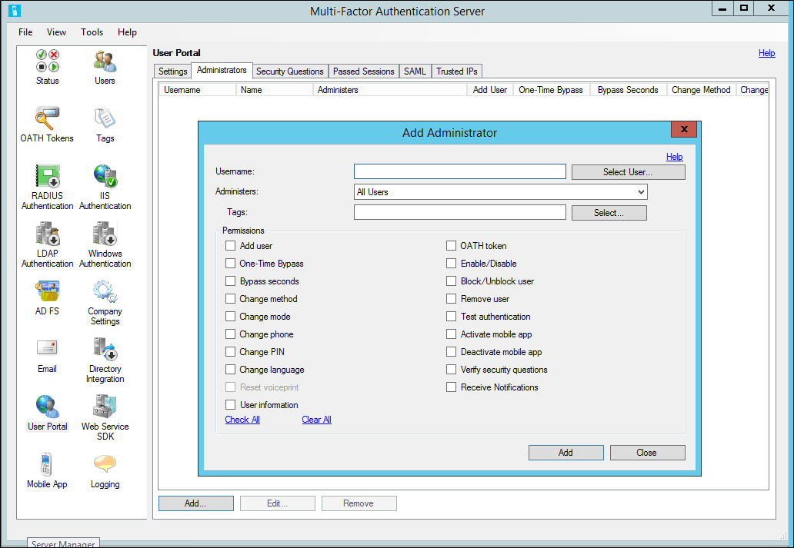
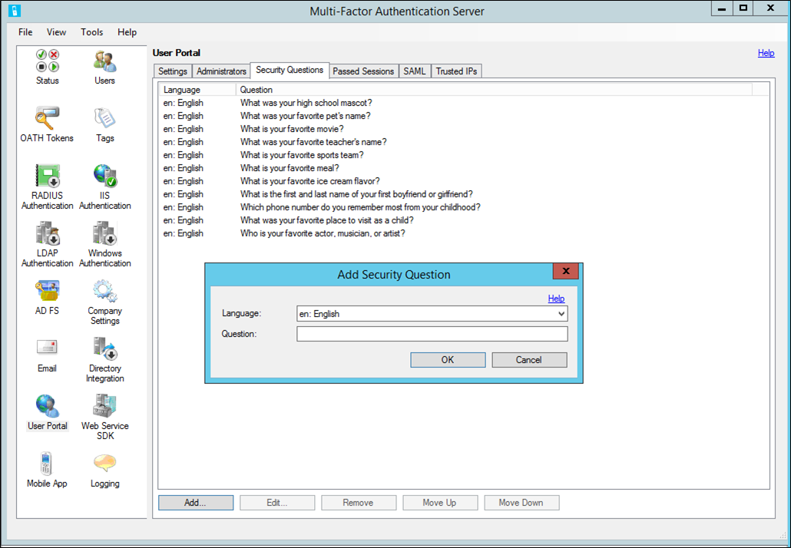
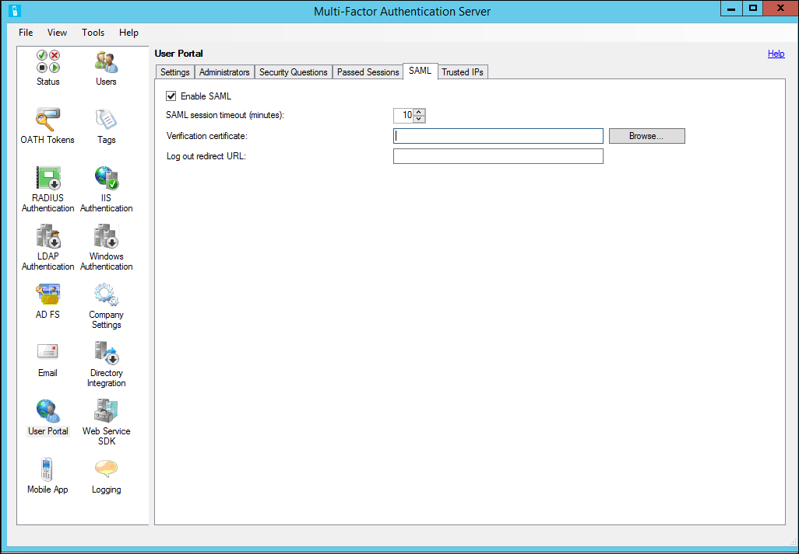
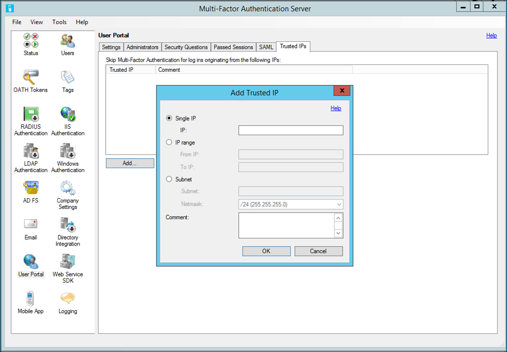

# Deploy the user portal for the Azure Multi-Factor Authentication Server
The user portal is an IIS web site that allows users to enroll in Azure Multi-Factor Authentication and maintain their accounts. A user may change their phone number, change their PIN, or choose to bypass two-step verification during their next sign-on.

Users sign in to the user portal with their normal username and password, then either complete a two-step verification call or answer security questions to complete their authentication. If user enrollment is allowed, users configure their phone number and PIN the first time they sign in to the user portal.

User Portal Administrators may be set up and granted permission to add new users and update existing users.

>[!NOTE] 
>The user portal is only available with Multi-Factor Authentication Server. If you use Multi-Factor Authentication in the cloud, refer your users to the [Set up your account for two-step verification](./end-user/multi-factor-authentication-end-user-first-time.md) or [Manage your settings for two-step verification](./end-user/multi-factor-authentication-end-user-manage-settings.md).

## Deploy the user portal on the same server as the Azure Multi-Factor Authentication Server
The following pre-requisites are required to install the user portal on the same server as the Azure Multi-Factor Authentication Server:

* IIS, including asp.net and IIS 6 meta base compatibility (for IIS 7 or higher)
* An account with admin rights for the computer and Domain if applicable. The account needs permissions to create Active Directory security groups.

To deploy the user portal, follow these steps:

1. In the Azure Multi-Factor Authentication Server, click the **User Portal** icon in the left menu, then click **Install User Portal**.
2. Click **Next**.
3. Click **Next**.
4. If the computer is domain-joined, and Active Directory is not configured to secure communication between the user portal and the Azure Multi-Factor Authentication service, then the Active Directory step is displayed. Click the **Next** button to automatically complete this configuration.
5. Click **Next**.
6. Click **Next**.
7. Click **Close**.
8. Open a web browser from any computer and navigate to the URL where the user portal was installed (e.g. https://www.publicwebsite.com/MultiFactorAuth). Ensure that no certificate warnings or errors are displayed.

## Deploy the user portal on a separate server
If the server where Azure Multi-Factor Authentication Server is running is not internet-facing, you should install the user portal on a separate, internet-facing server. 

If your organization uses the Microsoft Authenticator app as one of the verification methods, and want to deploy the user portal on its own server, complete the following requirements: 

* Use v6.0 or higher of the Azure Multi-Factor Authentication Server.
* Install the user portal on an internet-facing web server running Microsoft internet Information Services (IIS) 6.x or higher.
* When using IIS 6.x, ensure ASP.NET v2.0.50727 is installed, registered, and set to **Allowed**.
* When using IIS 7.x or higher, ASP.NET and IIS 6 Metabasea Compatibility role services are required.
* Secure the user portal with an SSL certificate.
* Secure the Azure Multi-Factor Authentication Web Service SDK with an SSL certificate.
* Ensure that the user portal can connect to the Azure Multi-Factor Authentication Web Service SDK over SSL.
* Ensure that the user portal can authenticate to the Azure Multi-Factor Authentication Web Service SDK using the credentials of a service account in the "PhoneFactor Admins" security group. This service account and group exist in Active Directory if the Azure Multi-Factor Authentication Server is running on a domain-joined server. This service account and group exist locally on the Azure Multi-Factor Authentication Server if it is not joined to a domain.

Installing the user portal on a server other than the Azure Multi-Factor Authentication Server requires the following three steps:

1. Install the web service SDK on the same server as the Azure Multi-Factor Authentication Server
2. Install the user portal
3. Configure the User Portal Settings in the Azure Multi-Factor Authentication Server

### Step 1: Install the web service SDK
If the Azure Multi-Factor Authentication Web Service SDK is not already installed on the Azure Multi-Factor Authentication Server, go to that server and open the Azure Multi-Factor Authentication Server. Click the **Web Service SDK** icon, then **Install Web Service SDK**. Follow the instructions presented. 

The Web Service SDK must be secured with an SSL certificate. A self-signed certificate is okay for this purpose, but it must be imported into the “Trusted Root Certification Authorities” store of the Local Computer account on the server. Now the Web Service SDK can trust that certificate when initiating the SSL connection.

### Step 2: Install the user portal
Before installing the user portal on a separate server, be aware of the following best practices:

* It is helpful to open a web browser on the internet-facing web server and navigate to the URL of the Web Service SDK that was entered into the web.config file. If the browser can get to the web service successfully, it should prompt you for credentials. Enter the username and password that were entered into the web.config file exactly as it appears in the file. Ensure that no certificate warnings or errors are displayed.
* If a reverse proxy or firewall is sitting in front of the user portal web server and performing SSL offloading, you can edit the user portal's web.config file and add the following key to the `<appSettings>` section so that the User Portal can use http instead of https:

    `<add key="SSL_REQUIRED" value="false"/>`

#### To install the user portal
1. Open Windows Explorer on the server with Azure MFA Server and navigate to the folder where the Azure Multi-Factor Authentication Server is installed (e.g. C:\Program Files\Multi-Factor Authentication Server). Copy the 32-bit or 64-bit version of the MultiFactorAuthenticationUserPortalSetup installation file to the internet-facing server.
2. On the internet-facing web server, run the file with administrator rights. The easiest way to do this is to open a command prompt as an administrator and navigate to the location where the installation file was copied.
3. Run the MultiFactorAuthenticationUserPortalSetup64 install file, change the Site and Virtual Directory name if desired.
4. After finishing the install of the User Portal, browse to C:\inetpub\wwwroot\MultiFactorAuth (or appropriate directory based on the virtual directory name) and edit the web.config file.
5. Locate the USE_WEB_SERVICE_SDK key and change the value from **false** to **true**. 
6. Locate the WEB_SERVICE_SDK_AUTHENTICATION_USERNAME key and set the value to the username of the service account in the PhoneFactor Admins security group. Use a qualified username, like domain\username or machine\username. 
7. Locate the WEB_SERVICE_SDK_AUTHENTICATION_PASSWORD key and set the value to the password of the service account in the PhoneFactor Admins security group.
8. Locate the pfup_pfwssdk_PfWsSdk setting and change the value from “http://localhost:4898/PfWsSdk.asmx” to the URL of the Web Service SDK that is running on the Azure Multi-Factor Authentication Server (e.g. https://computer1.domain.local/MultiFactorAuthWebServiceSdk/PfWsSdk.asmx). Since SSL is used for this connection, refer to the Web Service SDK by server name, not IP address, since the SSL certificate was issued for the server name. If the server name does not resolve to an IP address from the internet-facing server, add an entry to the hosts file on that server to map the name of the Azure Multi-Factor Authentication Server to its IP address. Save the web.config file after changes have been made.

    Go to [Secure your resources using Azure Multi-Factor Authentication Server with AD FS](multi-factor-authentication-get-started-adfs-w2k12.md#edit-the-multifactorauthenticationadfsadapterconfig-file) for more details about editing the config file.

7. If the website that the user portal was installed under (e.g. Default Web Site) has not already been bound with a publicly signed certificate, install the certificate on the server, open IIS Manager, and bind the certificate to the website.
8. Open a web browser from any computer and navigate to the URL where User Portal was installed (e.g. https://www.publicwebsite.com/MultiFactorAuth). Ensure that no certificate warnings or errors are displayed.

### Step 3: Configure the user portal settings in the Azure Multi-Factor Authentication Server
Now that the user portal is installed, you need to configure the Azure Multi-Factor Authentication Server to work with the portal.

Azure Multi-Factor Authentication server provides several options for the user portal.  The following table provides a list of these options and an explanation of what they are used for.

| User Portal Settings | Description |
|:--- |:--- |
| User Portal URL | Enter the URL of where the portal is being hosted. |
| Primary authentication | Specify the type of authentication to use when signing in to the portal.  Either Windows, Radius, or LDAP authentication. |
| Allow users to log in | Allow users to enter a username and password on the sign-in page for the User portal.  If this is not selected, the boxes are grayed out. |
| Allow user enrollment | Allow a user to enroll in Multi-Factor Authentication by taking them to a setup screen that prompts them for additional information such as telephone number. Prompt for backup phone allows users to specify a secondary phone number. Prompt for third-party OATH token allows users to specify a third-party OATH token. |
| Allow users to initiate One-Time Bypass | Allow users to initiate a one-time bypass.  If a user sets this up, it will take effect the next time the user signs in. Prompt for bypass seconds provides the user with a box so they can change the default of 300 seconds. Otherwise, the one-time bypass is only good for 300 seconds. |
| Allow users to select method | Allow users to specify their primary contact method.  This can be phone call, text message, mobile app, or OATH token. |
| Allow users to select language | Allow users to change the language that is used for the phone call, text message, mobile app, or OATH token. |
| Allow users to activate mobile app | Allow users to generate an activation code to complete the mobile app activation process that is used with the server.  You can also set the number of devices they can activate the app on, between 1 and 10. |
| Use security questions for fallback | Allow security questions in case two-step verification fails.  You can specify the number of security questions that must be successfully answered. |
| Allow users to associate third-party OATH token | Allow users to specify a third-party OATH token. |
| Use OATH token for fallback | Allow for the use of an OATH token in case two-step verification is not successful. You can also specify the session timeout in minutes. |
| Enable logging | Enable logging on the user portal. The log files are located at: C:\Program Files\Multi-Factor Authentication Server\Logs. |

The majority of these settings are visible to the user once they are enabled and signed in to the user portal.

### To configure the user portal settings in the Azure Multi-Factor Authentication Server
1. In the Azure Multi-Factor Authentication Server, click the **User Portal** icon. On the Settings tab, enter the URL to the user portal in the **User Portal URL** textbox. If email functionality has been enabled, this URL is included in the emails that are sent to users when they are imported into the Azure Multi-Factor Authentication Server.
2. Choose the settings that you want to use in the User Portal. For example, if users are allowed to choose their authentication methods, ensure that **Allow users to select method** is checked, along with the methods they can choose from.
3. Click the **Help** link in the top right corner for help understanding any of the settings displayed.

## Administrators tab
Use the **Administrators** tab to add users who will have administrative privileges.  When adding an administrator, you can fine-tune the permissions that they receive. Click the **Add** button, select a user and their permissions, and then click **Add**.

## Security Questions
Use the **Security Questions** tab to specify the security questions that users will need answer if the **Use security questions for fallback** option is selected.  Azure Multi-Factor Authentication Server comes with default questions that you can use. You can change the order or add your own questions.  When adding your own questions, you can specify the language you would like those questions to appear in as well.

## SAML
Use the **SAML** tab to configure the user portal to accept claims from an identity provider using SAML.  You can specify the timeout session, the verification certificate, and the Log out redirect URL.

## Trusted IPs
Use the **Trusted IPs** tab to specify either single IP addresses or IP address ranges that can be added so that users who sign in from one of these address don't have to complete two-step verification.

## Self-Service User Enrollment
If you want your users to sign in and enroll, you must select the **Allow users to log in** and **Allow user enrollment** options under the Settings tab. Remember that the settings you select affect the user sign-in experience.

For example, when a user signs in to the user portal for the first time, they are then taken to the Azure Multi-Factor Authentication User Setup page.  Depending on how you have configured Azure Multi-Factor Authentication, the user may be able to select their authentication method.  

If they select the Voice Call verification method or have been pre-configured to use that method, the page will prompt the user to enter their primary phone number and extension if applicable.  They may also be allowed to enter a backup phone number.  

If the user is required to use a PIN when they authenticate, the page will also prompt them to create a PIN.  After entering their phone number(s) and PIN (if applicable), the user clicks the **Call Me Now to Authenticate** button.  Azure Multi-Factor Authentication will perform a phone call verification to the user’s primary phone number.  The user must answer the phone call and enter their PIN (if applicable) and press # to move on to the next step of the self-enrollment process.   

If the user selects the Text Message verification method or has been pre-configured to use that method, the page will prompt the user for their mobile phone number.  If the user is required to use a PIN when they authenticate, the page will also prompt them to enter a PIN.  After entering their phone number and PIN (if applicable), the user clicks the **Text Me Now to Authenticate** button.  Azure Multi-Factor Authentication will perform an SMS verification to the user’s mobile phone.  The user receives the text message with a one-time-passcode (OTP), then replies to the message with that OTP plus their PIN (if applicable).

   

If the user selects the Mobile App verification method, the page will prompt the user to install the Microsoft Authenticator app on their device and generate an activation code.  After installing the app, the user clicks the Generate Activation Code button.    

> [!NOTE]
> To use the Microsoft Authenticator app, the user must enable push notifications for their device.

The page then displays an activation code and a URL along with a barcode picture.  If the user is required to use a PIN when they authenticate, the page will also prompt them to enter a PIN.  The user enters the activation code and URL into the Microsoft Authenticator app or uses the barcode scanner to scan the barcode picture and clicks the Activate button.    

After the activation is complete, the user clicks the **Authenticate Me Now** button.  Azure Multi-Factor Authentication will perform a verification to the user’s mobile app.  The user must enter their PIN (if applicable) and press the Authenticate button in their mobile app to move on to the next step of the self-enrollment process.  

If the administrators have configured the Azure Multi-Factor Authentication Server to collect security questions and answers, the user is then taken to the Security Questions page.  The user must select four security questions and provide answers to their selected questions.    

  

The user self-enrollment is now complete and the user is signed in to the user portal.  Users can sign back in to the user portal at any time in the future to change their phone numbers, PINs, authentication methods, and security questions if allowed by their administrators.

