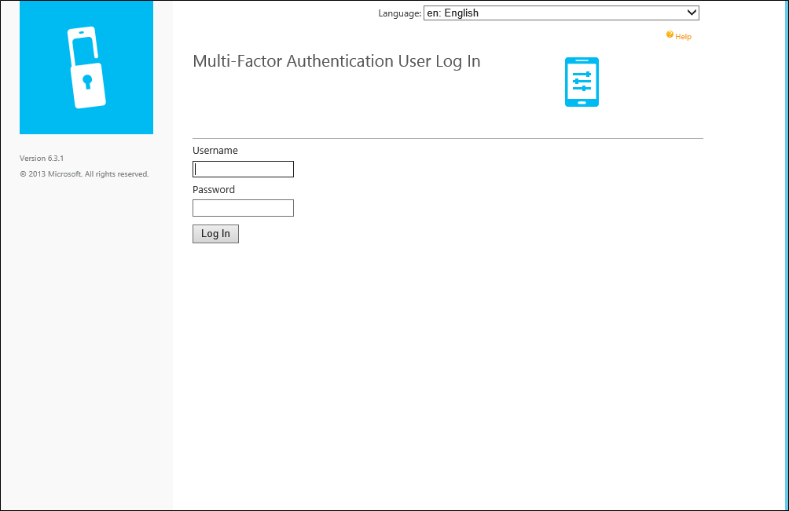
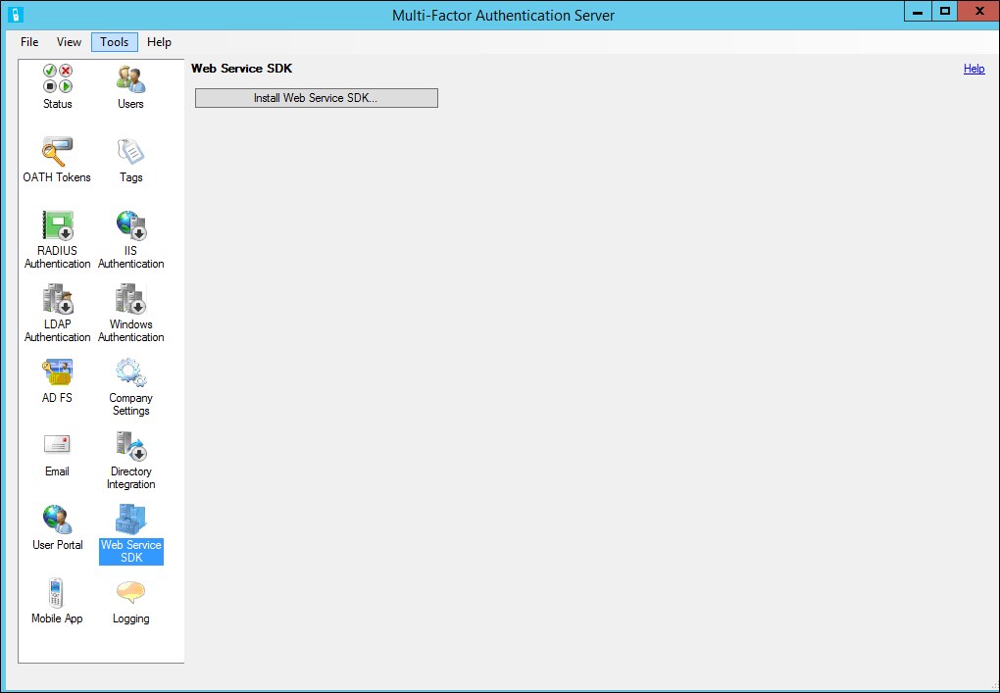
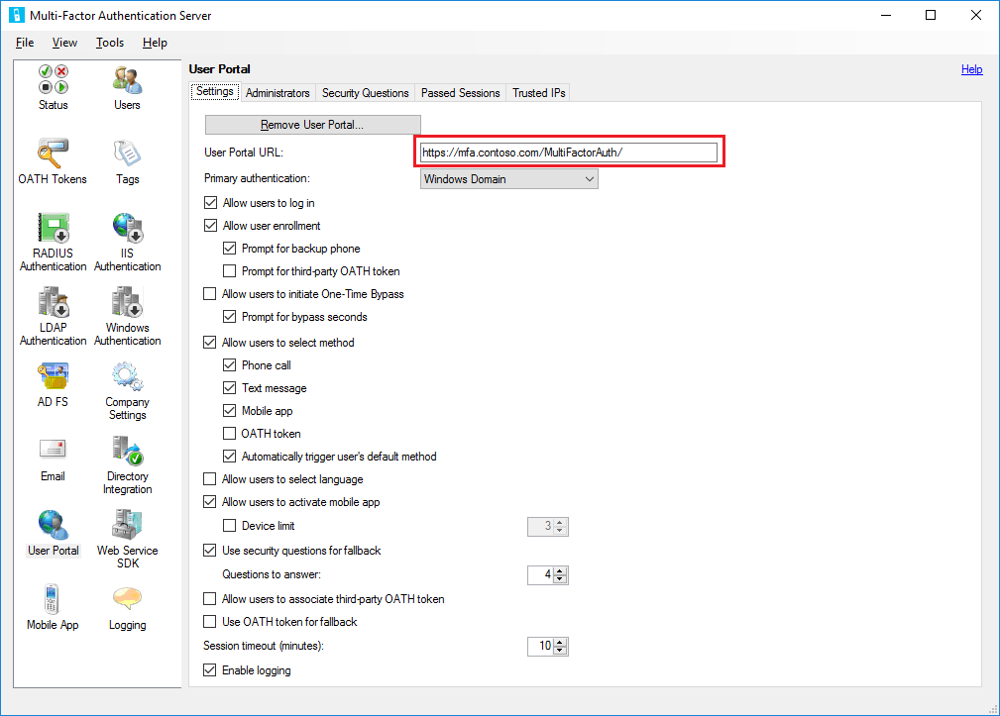

<properties 
	pageTitle="Deploying the user portal for the Azure Multi-Factor Authentication Server" 
	description="This is the Azure Multi-factor authentication page that describes how to get started with Azure MFA and the user portal." 
	services="multi-factor-authentication" 
	documentationCenter="" 
	authors="billmath" 
	manager="terrylan" 
	editor="bryanla"/>

<tags 
	ms.service="multi-factor-authentication" 
	ms.workload="identity" 
	ms.tgt_pltfrm="na" 
	ms.devlang="na" 
	ms.topic="article" 
	ms.date="06/02/2015" 
	ms.author="billmath"/>

# Deploying the user portal for the Azure Multi-Factor Authentication Server

The User Portal allows the administrator to install and configure the Azure Multi-Factor Authentication User Portal. The User Portal is an IIS web site which allows users to enroll in Azure Multi-Factor Authentication and maintain their accounts. A user may change their phone number, change their PIN, or bypass Azure Multi-Factor Authentication during their next sign on. 

Users will log in to the User Portal using their normal username and password and will either complete a Azure Multi-Factor Authentication call or answer security questions to complete their authentication. If user enrollment is allowed, a user will configure their phone number and PIN the first time they log in to the User Portal. 

User Portal Administrators may be set up and granted permission to add new users and update existing users. 

## Deploying the user portal on the same server as the Azure Multi-Factor Authentication Server

The following pre-requisites are required for installing the Users Portal on the same server as the Azure Multi-Factor Authentication Server:

- IIS needs to be installed including asp.net and IIS 6 meta base compatibility (for IIS 7 or higher) 
- Logged in user must have admin rights for the computer and Domain if applicable.  This is because the account needs permissions to create Active Directory security groups.

### To deploy the user portal for the Azure Multi-Factor Authentication Server

<ol>
<li>Within the Azure Multi-Factor Authentication Server: click User Portal icon in the left menu, click Install User Portal button. 
<li>Click Next.
<li>Click Next.
<li>If the computer is joined to a domain and the Active Directory configuration for securing communication between the User Portal and the Azure Multi-Factor Authentication service is incomplete, the Active Directory step will be displayed. Click the Next button to automatically complete this configuration.
<li>Click Next.
<li>Click Next.
<li>Click Close.
<li>Open a web browser from any computer and navigate to the URL where User Portal was installed (e.g. https://www.publicwebsite.com/MultiFactorAuth ). Ensure that no certificate warnings or errors are displayed.</li>

## Deploying the Azure Multi-Factor Authentication Server User Portal on a Separate Server

In order to use the Azure Multi-Factor Authentication App, the following are required so that the app can successfully communicate with User Portal: 

Please see Hardware and Software Requirements for hardware and software requirements:

- You must be using v6.0 or higher of the Azure Multi-Factor Authentication Server.
- User Portal must be installed on an Internet-facing web server running Microsoft® Internet Information Services (IIS) 6.x, IIS 7.x or higher.
- When using IIS 6.x, ensure ASP.NET v2.0.50727 is installed, registered and set to Allowed.
- Required role services when using IIS 7.x or higher include ASP.NET and IIS 6 Metabase Compatibility.
- User Portal should be secured with an SSL certificate.
- The Azure Multi-Factor Authentication Web Service SDK must be installed in IIS 6.x, IIS 7.x or higher on the server that the Azure Multi-Factor Authentication Server is installed on.
- The Azure Multi-Factor Authentication Web Service SDK must be secured with an SSL certificate.
- User Portal must be able to connect to the Azure Multi-Factor Authentication Web Service SDK over SSL.
- User Portal must be able to authenticate to the Azure Multi-Factor Authentication Web Service SDK using the credentials of a service account that is a member of a security group called “PhoneFactor Admins”. This service account and group exist in Active Directory if the Azure Multi-Factor Authentication Server is running on a domain-joined server. This service account and group exist locally on the Azure Multi-Factor Authentication Server if it is not joined to a domain.

Installing the user portal on a server other than the Azure Multi-Factor Authentication Server requires the following three steps:

1. Install the web service SDK
2. Install the user portal
3. Configure the User Portal Settings in the Azure Multi-Factor Authentication Server

### Install the web service SDK

If the Azure Multi-Factor Authentication Web Service SDK is not already installed on the Azure Multi-Factor Authentication Server, go to that server and open the Azure Multi-Factor Authentication Server. Click the Web Service SDK icon, click the Install Web Service SDK… button and follow the instructions presented. The Web Service SDK must be secured with an SSL certificate. A self-signed certificate is okay for this purpose, but it has to be imported into the “Trusted Root Certification Authorities” store of the Local Computer account on the User Portal web server so that it will trust that certificate when initiating the SSL connection. 

### Install the user portal

Before installing the user portal on a seperate server, be aware of the following:

- It is helpful to open a web browser on the Internet-facing web server and navigate to the URL of the Web Service SDK that was entered into the web.config file. If the browser can get to the web service successfully, it should prompt you for credentials. Enter the username and password that were entered into the web.config file exactly as it appears in the file. Ensure that no certificate warnings or errors are displayed.
- If a reverse proxy or firewall is sitting in front of the User Portal web server and performing SSL offloading, you can edit the User Portal web.config file and add the following key to the <appSettings> section so that the User Portal can use http instead of https. <add key="SSL_REQUIRED" value="false"/>

#### To install the user portal

<ol>

<li>Open Windows Explorer on the Azure Multi-Factor Authentication Server server and navigate to the folder where the Azure Multi-Factor Authentication Server is installed (e.g. C:\Program Files\Multi-Factor Authentication Server). Choose the 32-bit or 64-bit version of the MultiFactorAuthenticationUserPortalSetup installation file as appropriate for the server that User Portal will be installed on. Copy the installation file to the Internet-facing server.</li> 

<li>On the Internet-facing web server, the setup file must be run with administrator rights. The easiest way to do this is to open a command prompt as an administrator and navigate to the location where the installation file was copied.</li>

<li>Run the MultiFactorAuthenticationUserPortalSetup64 install file, change the Site and Virtual Directory name if desired.</li>

<li>After finishing the install of the User Portal, browse to C:\inetpub\wwwroot\MultiFactorAuth (or appropriate directory based on the virtual directory name) and edit the web.config file.</li>

<li>Locate the USE_WEB_SERVICE_SDK key and change the value from false to true. Locate the WEB_SERVICE_SDK_AUTHENTICATION_USERNAME and WEB_SERVICE_SDK_AUTHENTICATION_PASSWORD keys and set the values to the username and password of the service account that is a member of the PhoneFactor Admins security group (see the Requirements section above). Be sure to enter the Username and Password in between the quotation marks at the end of the line, (value=””/>). It is recommended to use a qualified username (e.g. domain\username or machine\username).</li> 

<li>Locate the pfup_pfwssdk_PfWsSdk setting and change the value from “http://localhost:4898/PfWsSdk.asmx” to the URL of the Web Service SDK that is running on the Azure Multi-Factor Authentication Server (e.g. https://computer1.domain.local/MultiFactorAuthWebServiceSdk/PfWsSdk.asmx). Since SSL is used for this connection, you must reference the Web Service SDK by server name and not IP address since the SSL certificate will have been issued for the server name and the URL used must match the name on the certificate. If the server name does not resolve to an IP address from the Internet-facing server, add an entry to the hosts file on that server to map the name of the Azure Multi-Factor Authentication Server to its IP address. Save the web.config file after changes have been made.</li>

<li>If the website that User Portal was installed under (e.g. Default Web Site) has not already been binded with a publicly-signed certificate, install the certificate on the server if not already installed, open IIS Manager and bind the certificate to the website.</li>

<li>Open a web browser from any computer and navigate to the URL where User Portal was installed (e.g. https://www.publicwebsite.com/MultiFactorAuth ). Ensure that no certificate warnings or errors are displayed.</li>

## Configure the user portal settings in the Azure Multi-Factor Authentication Server
Now that the portal is installed, you need to configure the Azure Multi-Factor Authentication Server to work with the portal.

### To configure the user portal settings in the Azure Multi-Factor Authentication Server

1. In the Azure Multi-Factor Authentication Server, click on the User Portal icon. On the Settings tab, enter the URL to the User Portal in the User Portal URL textbox. This URL will be inserted into emails that are sent to users when they are imported into the Azure Multi-Factor Authentication Server if the email functionality has been enabled.
2. Choose the settings that you want to use in the User Portal. For example, if users are allowed to control their authentication methods, ensure that Allow users to select method is checked along with the methods they can choose from.
3. Click the Help link in the top right corner for help understanding any of the settings displayed.

 