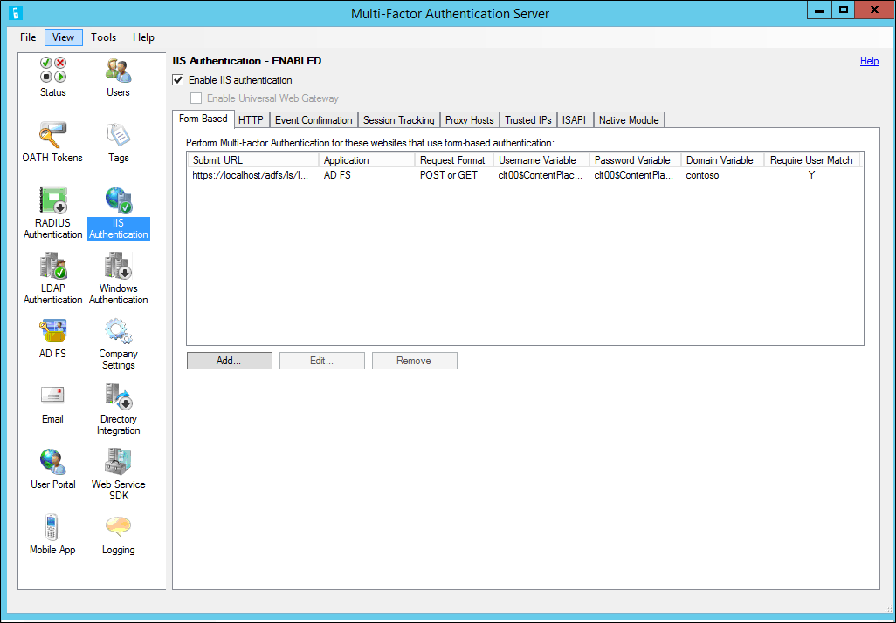

<properties 
	pageTitle="IIS Authentication and Azure Multi-Factor Authentication Server" 
	description="This is the Azure Multi-factor authentication page that will assist in deploying IIS Authentication and Azure Multi-Factor Authentication Server." 
	services="multi-factor-authentication" 
	documentationCenter="" 
	authors="billmath" 
	manager="stevenpo" 
	editor="curtand"/>

<tags 
	ms.service="multi-factor-authentication" 
	ms.workload="identity" 
	ms.tgt_pltfrm="na" 
	ms.devlang="na" 
	ms.topic="get-started-article" 
	ms.date="08/04/2016" 
	ms.author="billmath"/>

# IIS Authentication

The IIS Authentication section of the Azure Multi-Factor Authentication Server allows you to enable and configure IIS authentication for integration with Microsoft IIS web applications. The Azure Multi-Factor Authentication Server installs a plug-in which can filter requests being made to the IIS web server in order to add Azure Multi-Factor Authentication. The IIS plug-in provides support for Form-Based Authentication and Integrated Windows HTTP Authentication. Trusted IPs can also be configured to exempt internal IP addresses from two-factor authentication. 

## Using Form-Based IIS Authentication with Azure Multi-Factor Authentication Server

To secure an IIS web application that uses form-based authentication, install the Azure Multi-Factor Authentication Server on the IIS web server and configure the Server per the following procedure.

1. Within the Azure Multi-Factor Authentication Server click the IIS Authentication icon in the left menu.
2. Click the Form-Based tab.
3. Click the Add… button.
4. To detect username, password and domain variables automatically, enter the Login URL (e.g. https://localhost/contoso/auth/login.aspx) within the Auto-Configure Form-Based Website dialog box and click OK.
5. Check the Require Multi-Factor Authentication user match box if all users have been or will be imported into the Server and subject to multi-factor authentication. If a significant number of users have not yet been imported into the Server and/or will be exempt from multi-factor authentication, leave the box unchecked.
6. If the page variables cannot be detected automatically, click the Specify Manually… button in the Auto-Configure Form-Based Website dialog box.
7. In the Add Form-Based Website dialog box, enter the URL to the login page in the Submit URL field and enter an Application name (optional). The Application name appears in Azure Multi-Factor Authentication reports and may be displayed within SMS or Mobile App authentication messages. See the help file for more information on the Submit URL. 
8. Select the correct Request format. This is set to “POST or GET” for most web applications.
9. Enter the Username variable, Password variable and Domain variable (if it appears on the login page). You may need to navigate to the login page in a web browser, right-click on the page and select “View Source” to find the names of the input boxes within the page.
10. Check the Require Azure Multi-Factor Authentication user match box if all users have been or will be imported into the Server and subject to multi-factor authentication. If a significant number of users have not yet been imported into the Server and/or will be exempt from multi-factor authentication, leave the box unchecked. See the help file for additional information on this feature.
11.  Click the Advanced… button to review advanced settings, including the ability to select a custom denial page file, to cache successful authentications to the website for a period of time using cookies and to select whether to authenticate the primary credentials against the Windows Domain, an LDAP directory or a RADIUS server. When complete click the OK button to return to the Add Form-Based Website dialog box. See the help file for more information on the advanced settings.
12. Click the OK button.
13. Once the URL and page variables have been detected or entered, the website data will display in the Form-Based panel.
14. See the Enable IIS Plug-ins for Azure Multi-Factor Authentication Server section directly below to complete the IIS authentication configuration. 

## Using Integrated Windows Authentication with Azure Multi-Factor Authentication Server

To secure an IIS web application that uses Integrated Windows HTTP authentication, install the Azure Multi-Factor Authentication Server on the IIS web server and configure the Server per the following procedure. 

1. Within the Azure Multi-Factor Authentication Server click the IIS Authentication icon in the left menu.
2. Click the HTTP tab. Click the Form-Based tab.
3. Click the Add… button.
4. In the Add Base URL dialogue box, enter the URL for the website where HTTP authentication is performed (e.g. http://localhost/owa) into the Base URL field and enter an Application name (optional). The Application name appears in Azure Multi-Factor Authentication reports and may be displayed within SMS or Mobile App authentication messages.
5. Adjust the Idle timeout and Maximum session times if the default is not sufficient.
6. Check the Require Multi-Factor Authentication user match box if all users have been or will be imported into the Server and subject to multi-factor authentication. If a significant number of users have not yet been imported into the Server and/or will be exempt from multi-factor authentication, leave the box unchecked. See the help file for additional information on this feature. 
7. Check the cookie cache box if desired.
8. Click the OK button.
9. See the [Enable IIS Plug-ins for Azure Multi-Factor Authentication Server](#enable-iis-plug-ins-for-azure-multi-factor-authentication-server) section directly below to complete the IIS authentication configuration. 

## Enable IIS Plug-ins for Azure Multi-Factor Authentication Server

Once you have configured the Form-Based or HTTP authentication URLs and settings, you must select the locations where the Azure Multi-Factor Authentication IIS plug-ins should be loaded and enabled in IIS. Use the following procedure:

1. If running on IIS 6, click the ISAPI tab and select the website that the web application is running under (e.g. Default Web Site) to enable the Azure Multi-Factor Authentication ISAPI filter plug-in for that site.
2. If running on IIS 7 or higher, click the Native Module tab and select the server, website(s) or application(s) to enable the IIS plug-in at the desired level(s).
3. Click the Enable IIS authentication box at the top of the screen. Azure Multi-Factor Authentication is now securing the selected IIS application. Ensure that users have been imported into the Server. See the Trusted IPs section below if you would like to whitelist internal IP addresses so that two- factor authentication is not required when logging into the website from those locations. 

## Trusted IPs

The Trusted IPs allows users to bypass Azure Multi-Factor Authentication for website requests originating from specific IP addresses or subnets. For example, you may want to exempt users from Azure Multi-Factor Authentication while logging in from the office. For this, you would specify the office subnet as an Trusted IPs entry. To configure Trusted IPs use the following procedure:

1. In the IIS Authentication section, click the Trusted IPs tab. 
2. Click the Add… button.
3. When the Add Trusted IPs dialog box appears, select the Single IP, IP range or Subnet radio button.
4. nter the IP address, range of IP addresses or subnet that should be whitelisted. If entering a subnet, select the appropriate Netmask and click the OK button. The whitelist has now been added.
