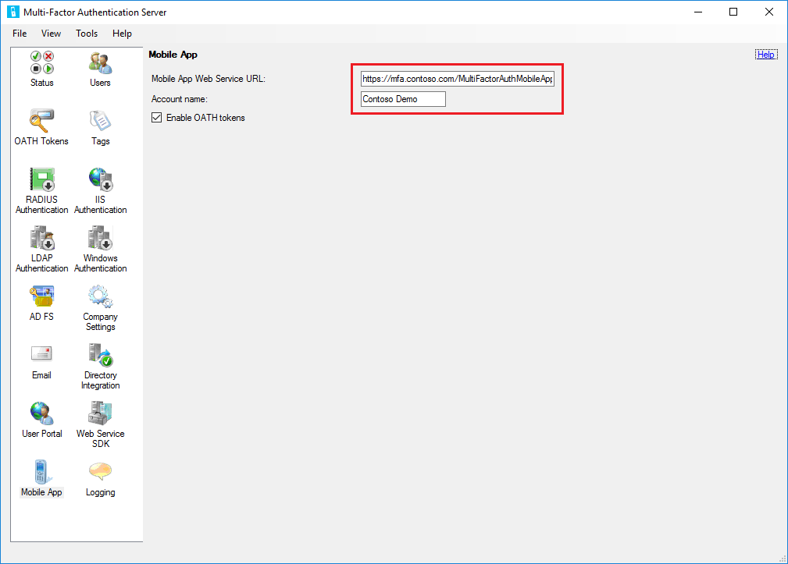

<properties 
	pageTitle="Getting started the MFA Server Mobile App Web Service" 
	description="The Azure Multi-Factor Authentication App offers an additional out-of-band authentication option.  It allows the MFA server to use push notifications to users." 
	services="multi-factor-authentication" 
	documentationCenter="" 
	authors="billmath" 
	manager="stevenpo" 
	editor="curtland"/>

<tags 
	ms.service="multi-factor-authentication" 
	ms.workload="identity" 
	ms.tgt_pltfrm="na" 
	ms.devlang="na" 
	ms.topic="get-started-article" 
	ms.date="05/12/2016" 
	ms.author="billmath"/>

# Getting started the MFA Server Mobile App Web Service

The Azure Multi-Factor Authentication App offers an additional out-of-band authentication option. Instead of placing an automated phone call or SMS to the user during login, Azure Multi-Factor Authentication pushes a notification to the Azure Multi-Factor Authentication App on the user’s smartphone or tablet. The user simply taps “Authenticate” (or enters a PIN and taps “Authenticate”) in the app to log in. 

In order to use the Azure Multi-Factor Authentication App, the following are required so that the app can successfully communicate with Mobile App Web Service: 

- Please see Hardware and Software Requirements for hardware and software requirements
- You must be using v6.0 or higher of the Azure Multi-Factor Authentication Server
- Mobile App Web Service must be installed on an Internet-facing web server running Microsoft® Internet Information Services (IIS) IIS 7.x or higher.  For more information on IIS see [IIS.NET](http://www.iis.net/).
- Ensure ASP.NET v4.0.30319 is installed, registered and set to Allowed
- Required role services include ASP.NET and IIS 6 Metabase Compatibility
- Mobile App Web Service must be accessible via a public URL
- Mobile App Web Service must be secured with an SSL certificate.
- The Azure Multi-Factor Authentication Web Service SDK must be installed in IIS 7.x or higher on the server that the Azure Multi-Factor Authentication Server
- The Azure Multi-Factor Authentication Web Service SDK must be secured with an SSL certificate.
- Mobile App Web Service must be able to connect to the Azure Multi-Factor Authentication Web Service SDK over SSL
- Mobile App Web Service must be able to authenticate to the Azure Multi-Factor Authentication Web Service SDK using the credentials of a service account that is a member of a security group called “PhoneFactor Admins”. This service account and group exist in Active Directory if the Azure Multi-Factor Authentication Server is running on a domain-joined server. This service account and group exist locally on the Azure Multi-Factor Authentication Server if it is not joined to a domain.

Installing the user portal on a server other than the Azure Multi-Factor Authentication Server requires the following three steps:

1. Install the web service SDK
2. Install the mobile app web service
3. Configure the mobile app settings in the Azure Multi-Factor Authentication Server
4. Activate the Azure Multi-Factor Authentication App for end users

## Install the web service SDK

If the Azure Multi-Factor Authentication Web Service SDK is not already installed on the Azure Multi-Factor Authentication Server, go to that server and open the Azure Multi-Factor Authentication Server. Click the Web Service SDK icon, click the Install Web Service SDK… button and follow the instructions presented. The Web Service SDK must be secured with an SSL certificate. A self-signed certificate is okay for this purpose, but it has to be imported into the “Trusted Root Certification Authorities” store of the Local Computer account on the User Portal web server so that it will trust that certificate when initiating the SSL connection. 

## Install the mobile app web service
Before installing the mobile app web service, be aware of the following:

- If the Azure Multi-Factor Authentication User Portal is already installed on the Internet-facing server, the username, password and URL to the Web Service SDK can be copied from the User Portal’s web.config file. 
- It is helpful to open a web browser on the Internet-facing web server and navigate to the URL of the Web Service SDK that was entered into the web.config file. If the browser can get to the web service successfully, it should prompt you for credentials. Enter the username and password that were entered into the web.config file exactly as it appears in the file. Ensure that no certificate warnings or errors are displayed.
- If a reverse proxy or firewall is sitting in front of the Mobile App Web Service web server and performing SSL offloading, you can edit the Mobile App Web Service web.config file and add the following key to the <appSettings> section so that the Mobile App Web Service can use http instead of https. However SSL is still required from the Mobile App to the firewall/reverse proxy. <add key="SSL_REQUIRED" value="false"/> 

### To install the mobile app web service

<ol>
<li>Open Windows Explorer on the Azure Multi-Factor Authentication Server and navigate to the folder where the Azure Multi-Factor Authentication Server is installed (e.g. C:\Program Files\Azure Multi-Factor Authentication). Choose the 32-bit or 64-bit version of the Azure Multi-Factor AuthenticationPhoneAppWebServiceSetup installation file as appropriate for the server that Mobile App Web Service will be installed on. Copy the installation file to the Internet-facing server.</li> 

<li>On the Internet-facing web server, the setup file must be run with administrator rights. The easiest way to do this is to open a command prompt as an administrator and navigate to the location where the installation file was copied.</li>  

<li>Run the Multi-Factor AuthenticationMobileAppWebServiceSetup install file, change the Site if desired and change the Virtual directory to a short name such as “PA”. A short virtual directory name is recommended since users must enter the Mobile App Web Service URL into the mobile device during activation.</li> 

<li>After finishing the install of the Azure Multi-Factor AuthenticationMobileAppWebServiceSetup, browse to C:\inetpub\wwwroot\PA (or appropriate directory based on the virtual directory name) and edit the web.config file.</li>  

<li>Locate the WEB_SERVICE_SDK_AUTHENTICATION_USERNAME and WEB_SERVICE_SDK_AUTHENTICATION_PASSWORD keys and set the values to the username and password of the service account that is a member of the PhoneFactor Admins security group (see the Requirements section above). This may be the same account being used as the Identity of the Azure Multi-Factor Authentication User Portal if that has been previously installed. Be sure to enter the Username and Password in between the quotation marks at the end of the line, (value=””/>). It is recommended to use a qualified username (e.g. domain\username or machine\username).</li>  

<li>Locate the pfMobile App Web Service_pfwssdk_PfWsSdk setting and change the value from “http://localhost:4898/PfWsSdk.asmx” to the URL of the Web Service SDK that is running on the Azure Multi-Factor Authentication Server (e.g. https://computer1.domain.local/MultiFactorAuthWebServiceSdk/PfWsSdk.asmx). Since SSL is used for this connection, you must reference the Web Service SDK by server name and not IP address since the SSL certificate will have been issued for the server name and the URL used must match the name on the certificate. If the server name does not resolve to an IP address from the Internet-facing server, add an entry to the hosts file on that server to map the name of the Azure Multi-Factor Authentication Server to its IP address. Save the web.config file after changes have been made.</li>  

<li>If the website that Mobile App Web Service was installed under (e.g. Default Web Site) has not already been binded with a publicly-signed certificate, install the certificate on the server if not already installed, open IIS Manager and bind the certificate to the website.</li>  

<li>Open a web browser from any computer and navigate to the URL where Mobile App Web Service was installed (e.g. https://www.publicwebsite.com/PA ). Ensure that no certificate warnings or errors are displayed.</li> 

### Configure the mobile app settings in the Azure Multi-Factor Authentication Server
Now that the mobile app web service is installed, you need to configure the Azure Multi-Factor Authentication Server to work with the portal.

#### To configure the mobile app settings in the Azure Multi-Factor Authentication Server

1. In the Azure Multi-Factor Authentication Server, click on the User Portal icon. If users are allowed to control their authentication methods, on the Settings tab, under Allow users to select method , check Mobile App . Without this feature enabled, end users will be required to contact your Help Desk to complete activation for the Mobile App.
2. Check the Allow users to activate Mobile App box.
3. Check the Allow User Enrollment box.
4. Click the Mobile App icon.
5. Enter the URL being used with the virtual directory which was created when installing the Azure Multi-Factor AuthenticationMobileAppWebServiceSetup. An Account Name may be entered in the space provided. This company name will display in the mobile application. If left blank, the name of your Multi-Factor Auth Provider created in the Azure Management Portal will be displayed. 

 