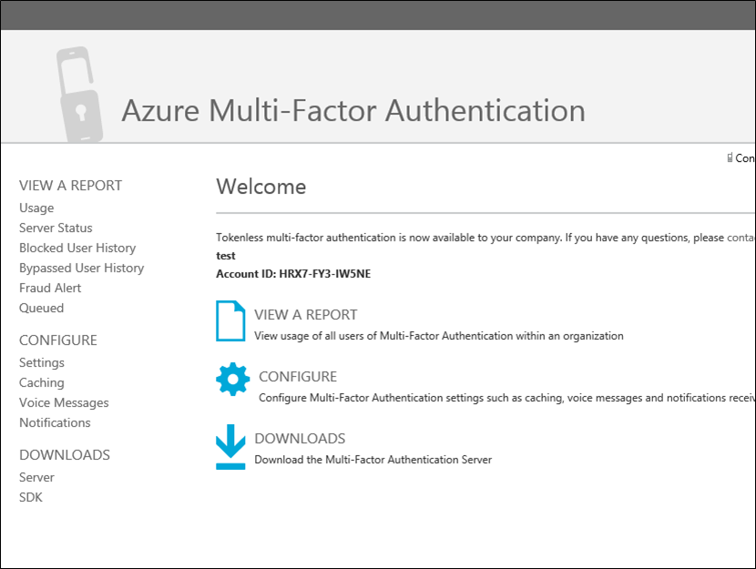
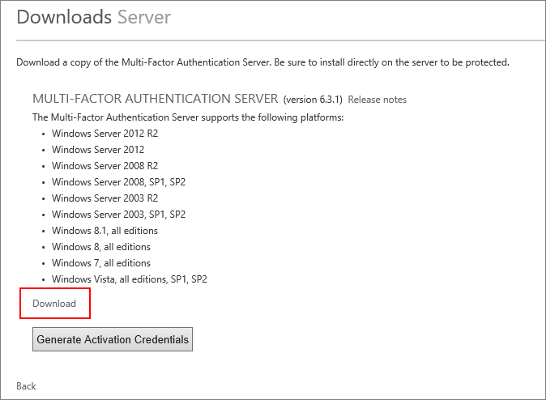
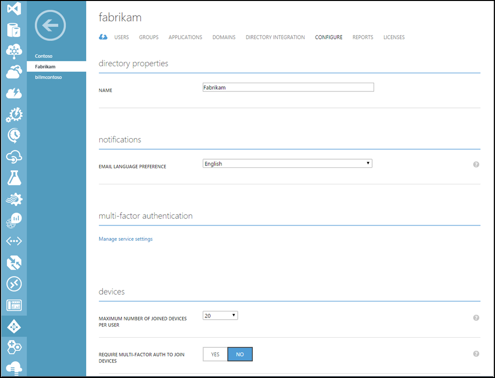
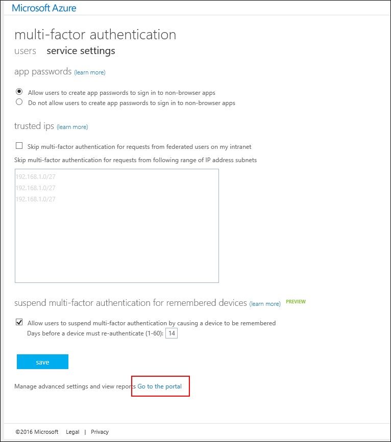
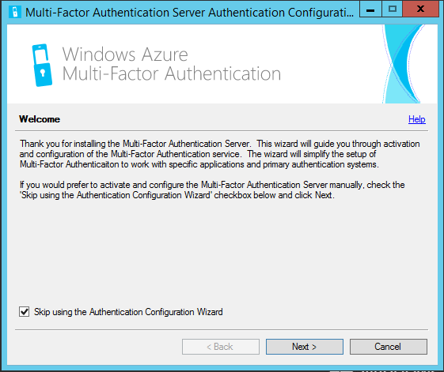

<properties 
	pageTitle="Getting started with the Azure Multi-Factor Authentication Server" 
	description="This is the Azure Multi-factor authentication page that describes how to get started with Azure MFA Server." 
	services="multi-factor-authentication"
	keywords="authentication server, azure multi factor authentication app activation page, authentication server download" 
	documentationCenter="" 
	authors="billmath" 
	manager="stevenpo" 
	editor="curtand"/>

<tags 
	ms.service="multi-factor-authentication" 
	ms.workload="identity" 
	ms.tgt_pltfrm="na" 
	ms.devlang="na" 
	ms.topic="get-started-article" 
	ms.date="08/04/2016" 
	ms.author="billmath"/>

# Getting started with the Azure Multi-Factor Authentication Server

Now that we have determined whether to use on-premises multi-factor authentication, let’s get going. This page covers a new installation of the server and getting it setup with on-premises Active Directory. If you already have the PhoneFactor server installed and are looking to upgrade, see [Upgrading to the Azure Multi-Factor Server](multi-factor-authentication-get-started-server-upgrade.md) or if you are looking for information on installing just the web service see [Deploying the Azure Multi-Factor Authentication Server Mobile App Web Service](multi-factor-authentication-get-started-server-webservice.md).

## Download the Azure Multi-Factor Authentication Server

There are two different ways that you can download the Azure Multi-Factor Authentication Server. Both are done via the Azure portal. The first is by managing the Multi-Factor Auth Provider directly. The second is via the service settings. The second option requires either a Multi-Factor Auth Provider or an Azure MFA, Azure AD Premium or Enterprise Mobility Suite license.

### To download the Azure Multi-Factor Authentication server from the Azure portal
--------------------------------------------------------------------------------

1. Sign in to the Azure Portal as an Administrator.
2. On the left, select Active Directory.
3. On the Active Directory page, at the top click **Multi-Factor Auth Providers**
4. At the bottom click **Manage**
5. This will open a new page.  Click **Downloads.**

6. Above **Generate Activation Credentials**, click **Download.**

7. Save the download.

### To download the Azure Multi-Factor Authentication Server via the service settings

1. Sign in to the Azure Portal as an Administrator.
2. On the left, select Active Directory.
3. Double click on your instance of Azure AD.
4. At the top click **Configure**

5. Under multi-factor authentication select **Manage service settings**
6. On the services settings page, at the bottom of the screen click **Go to the portal**.

7. This will open a new page. Click **Downloads.**
8. Above **Generate Activation Credentials**, click **Download.**
9. Save the download.

## Install and Configure the Azure Multi-Factor Authentication Server
Now that you have downloaded the server you can install it and configure it.  Be sure that the server you are installing it on meets the following requirements:

Azure Multi-Factor Authentication Server Requirements|Description|
:------------- | :------------- | 
Hardware|<li>200 MB of hard disk space</li><li>x32 or x64 capable processor</li><li>1 GB or greater RAM</li>
Software|<li>Windows Server 2008 or greater if the host is a server OS</li><li>Windows 7 or greater if the host is a client OS</li><li>Microsoft .NET 4.0 Framework</li><li>IIS 7.0 or greater if installing the user portal or web service SDK</li>

### Azure Multi-Factor Authentication Server firewall requirements
--------------------------------------------------------------------------------
Each MFA server must be able to communicate on port 443 outbound to the following:

- https://pfd.phonefactor.net
- https://pfd2.phonefactor.net
- https://css.phonefactor.net

If outbound firewalls are restricted on port 443, the following IP address ranges will need to be opened:

IP Subnet|Netmask|IP Range
:------------- | :------------- | :------------- |
134.170.116.0/25|255.255.255.128|134.170.116.1 – 134.170.116.126
134.170.165.0/25|255.255.255.128|134.170.165.1 – 134.170.165.126
70.37.154.128/25|255.255.255.128|70.37.154.129 – 70.37.154.254

If you are not using Azure Multi-Factor Authentication Event Confirmation features and if users are not authenticating with the Multi-Factor Auth mobile apps from devices on the corporate network the IP ranges can be reduced to the following:

IP Subnet|Netmask|IP Range
:------------- | :------------- | :------------- |
134.170.116.72/29|255.255.255.248|134.170.116.72 – 134.170.116.79
134.170.165.72/29|255.255.255.248|134.170.165.72 – 134.170.165.79
70.37.154.200/29|255.255.255.248|70.37.154.201 – 70.37.154.206

### To install and configure the Azure Multi-Factor Authentication server
--------------------------------------------------------------------------------

1. Double-click on the executable. This will begin the installation.
2. On the Select Installation Folder screen, make sure that the folder is correct and click Next.
3. Once the installation complete, click Finish.  This will launch the configuration wizard.
4. On the configuration wizard welcome screen, place a check in **Skip using the Authentication Configuration Wizard** and click **Next**.  This will close the wizard and start the server.

5. Back on the page that we downloaded the server from, click the **Generate Activation Credentials** button.  Copy this information into the Azure MFA Server in the boxes provided and click **Activate**.

The above steps show an express setup with the configuration wizard.  You can re-run the authentication wizard by selecting it from the Tools menu on the server.

##Import users from Active Directory

Now that the server is installed and configured you can quickly import users into the Azure MFA Server. 

### To import users from Active Directory
--------------------------------------------------------------------------------

1. In the Azure MFA Server, on the left, select **Users**.
2. At the bottom, select **Import from Active Directory**.
3. Now you can either search for individual users or search the AD directory for OUs with users in them.  In this case, we will specify the users OU.
4. Highlight all of the users on the right and click **Import**.  You should receive a pop-up telling you that you were successful.  Close the import window.

## Send Users an email
Now that you have imported your users into the Azure Multi-Factor Authentication server, it is advised that you send your users an email that informs them that they have been enrolled in multi-factor authentication.

With the Azure Multi-Factor Authentication Server there are various ways to configure your users for using multi-factor authentication.  For instance, if you know the users’ phone numbers or were able to import the phone numbers into the Azure Multi-Factor Authentication Server from their company’s directory, the email will let users know that they have been configured to use Azure Multi-Factor Authentication, provide some instructions on using Azure Multi-Factor Authentication and inform the user of the phone number they will receive their authentications on.  

The content of the email will vary depending on the method of authentication that has been set for the user (e.g. phone call, SMS, mobile app).  For example, if the user is required to use a PIN when they authenticate, the email will tell them what their initial PIN has been set to.  Users are usually required to change their PIN during their first authentication.

If users’ phone numbers have not been configured or imported into the Azure Multi-Factor Authentication Server, or users are pre-configured to use the mobile app for authentication, you can send them an email that lets them know that they have been configured to use Azure Multi-Factor Authentication and it will direct them to complete their account enrollment through the Azure Multi-Factor Authentication User Portal.  A hyperlink will be included that the user clicks on to access the User Portal. When the user clicks on the hyperlink, their web browser will open and take them to their company’s Azure Multi-Factor Authentication User Portal.   

### Configuring email and email templates

By clicking on the email icon on the left you can setup the settings for sending these emails.  This is where you can enter the SMTP information of your mail server and it allows you to send a blanket wide email by adding a check to the Send mails to users check box.

On the Email Content tab, you will see all of the various email templates that are available to choose from.  So depending on how you have configured your users to use multi-factor authentication, you can choose the template that best suits you.

## How the Azure Multi-Factor Authentication Server handles user data

When you use the Multi-Factor Authentication (MFA) Server on-premises, a user’s data is stored in the on-premises servers. No persistent user data is stored in the cloud. When the user performs a two-factor authentication, the MFA Server sends data to the Azure MFA cloud service to perform the authentication. When these authentication requests are sent to the cloud service, the following fields are sent in the request and logs so that they are available in the customer's authentication/usage reports. Some of the fields are optional so they can be enabled or disabled within the Multi-Factor Authentication Server. The communication from the MFA Server to the MFA cloud service uses SSL/TLS over port 443 outbound. These fields are:

- Unique ID - either username or internal MFA server ID
- First and Last Name - optional
- Email Address - optional
- Phone Number - when doing a voice call or SMS authentication
- Device token - when doing mobile app authentication
- Authentication Mode 
- Authentication Result 
- MFA Server Name 
- MFA Server IP 
- Client IP – if available

In addition to the fields above, the authentication result (success/denial) and reason for any denials is also stored with the authentication data and available through the authentication/usage reports.

## Advanced Azure Multi-Factor Authentication Server Configurations
For additional information on advanced setup and configuration information use the table below.

Method|Description
:------------- | :------------- | 
[User Portal](multi-factor-authentication-get-started-portal.md)|  Information on setup and configuring the User portal including deployment and user self-service.
[Active Directory Federation Service](multi-factor-authentication-get-started-adfs.md)|Information on setting up Azure Multi-Factor Authentication with AD FS.
[RADIUS Authenticaton](multi-factor-authentication-get-started-server-radius.md)|  Information on setup and configuring the Azure MFA Server with RADIUS.
[IIS Authentication](multi-factor-authentication-get-started-server-iis.md)|Information on setup and configuring the Azure MFA Server with IIS.
[Windows Authenticaton](multi-factor-authentication-get-started-server-windows.md)|  Information on setup and configuring the Azure MFA Server with Windows Authentication.
[LDAP Authentication](multi-factor-authentication-get-started-server-ldap.md)|Information on setup and configuring the Azure MFA Server with LDAP Authentication.
[Remote Desktop Gateway and Azure Multi-Factor Authentication Server using RADIUS](multi-factor-authentication-get-started-server-rdg.md)|  Information on setup and configuring the Azure MFA Server with Remote Desktop Gateway using RADIUS.
[Sync with Windows Server Active Directory](multi-factor-authentication-get-started-server-dirint.md)|Information on setup and configuring synchronization between Active Directory and the Azure MFA Server.
[Deploying the Azure Multi-Factor Authentication Server Mobile App Web Service](multi-factor-authentication-get-started-server-webservice.md)|Information on setup and configuring the Azure MFA server web service.
