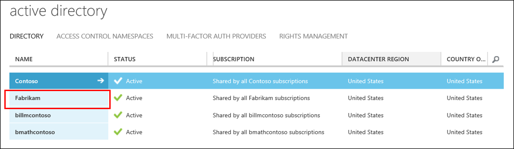
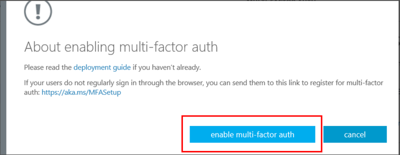
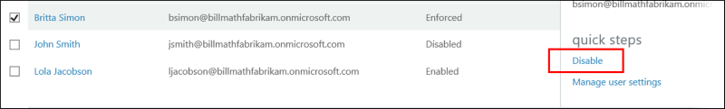
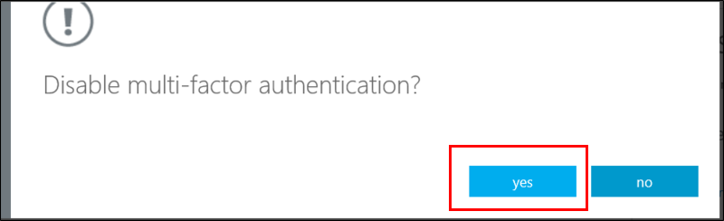
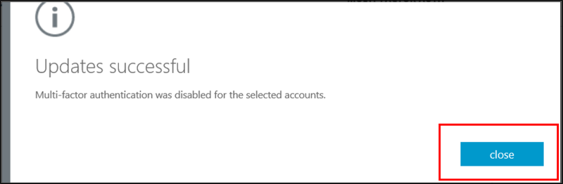

<properties 
	pageTitle="Microsoft Azure Multi-Factor Authentication User States" 
	description="Learn about user states in Azure MFA." 
	services="multi-factor-authentication" 
	documentationCenter="" 
	authors="billmath" 
	manager="stevenpo" 
	editor="curtand"/>

<tags 
	ms.service="multi-factor-authentication" 
	ms.workload="identity" 
	ms.tgt_pltfrm="na" 
	ms.devlang="na" 
	ms.topic="article" 
	ms.date="05/12/2016" 
	ms.author="billmath"/>

# User States in Azure Multi-Factor Authentication

User accounts in Azure Multi-Factor Authentication have the following three distinct states:

State | Description |Non-browser apps affected| Notes 
:-------------: | :-------------: |:-------------: |:-------------: |
Disabled | The default state for a new user not enrolled in multi-factor authentication.|No|The user is not using multi-factor authentication.
Enabled |The user has been enrolled in multi-factor authentication.|No.  They continue to work until the registration process is completed.|The user is enabled but has not completed the registration process. They will be prompted to complete the process at next sign-in.
Enforced|The user has been enrolled and has completed the registration process for using multi-factor authentication.|Yes.  Apps require app passwords. | The user may or may not have completed registration. If they have completed the registration process, then they are using multi-factor authentication. Otherwise, the user will be prompted to complete the process at next sign-in.

## Changing a user state
A users state changes depending on whether or not it has been setup for MFA and whether the user has completed the process.  When you turn MFA on for a user, the users state will change from disabled to enabled.  Once the user, whose state has been changed to enabled, signs in and completes the process, their state will change to enforced.  

### To view a user's state
--------------------------------------------------------------------------------
1.  Sign in to the **Azure classic portal** as an Administrator.
2.  On the left, click **Active Directory**.
3.  Under, **Directory** click on the directory for the user you wish to enable.

4.  At the top, click **Users**.
5.  At the bottom of the page, click **Manage Multi-Factor Auth**.

6.  This will open a new browser tab.  You will be able to view the users state.

###To change the state from disabled to enabled
1.  Sign in to the **Azure classic portal** as an Administrator.
2.  On the left, click **Active Directory**.
3.  Under, **Directory** click on the directory for the user you wish to enable.

4.  At the top, click **Users**.
5.  At the bottom of the page, click **Manage Multi-Factor Auth**.

6.  This will open a new browser tab.  Find the user that you wish to enable for multi-factor authentication. You may need to change the view at the top. Ensure that the status is **disabled.**

7.  Place a **check** in the box next to their name.
7.  On the right, click **Enable**. 

8.  Click **enable multi-factor auth**.

9.  You should notice the user's state has changed from **disabled** to **enabled**.

10.  After you have enabled your users, it is recommended that you notify them via email.  It should also inform them how they can use their non-browser apps to avoid being locked out.

### To change the state from enabled/enforced to disabled
1.  Sign in to the **Azure classic portal** as an Administrator.
2.  On the left, click **Active Directory**.
3.  Under, **Directory** click on the directory for the user you wish to enable.

4.  At the top, click **Users**.
5.  At the bottom of the page, click **Manage Multi-Factor Auth**.

6.  This will open a new browser tab.  Find the user that you wish to disable. You may need to change the view at the top. Ensure that the status is either **enabled** or **enforced.**
7.  Place a **check** in the box next to their name.
7.  On the right, click **Disable**. 

8.  You will be prompted to confirm this.  Click **Yes**.

9.  You should then see that it was successful.  Click **close.**
