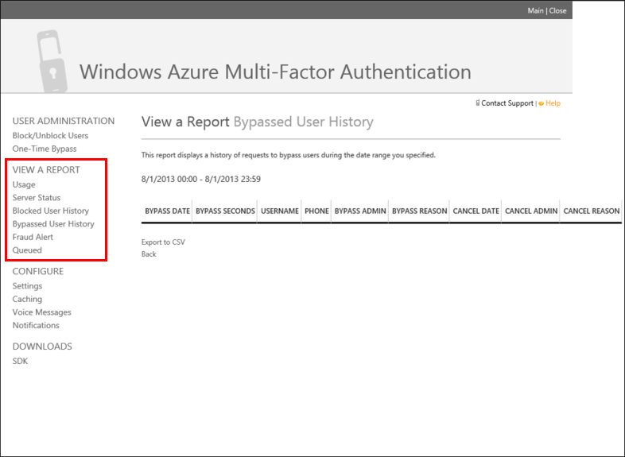

<properties 
	pageTitle="Azure Multi-Factor Authentication Reports" 
	description="This describes how to use the Azure Multi-Factor Authentication feature - reports." 
	services="multi-factor-authentication" 
	documentationCenter="" 
	authors="billmath" 
	manager="stevenpo" 
	editor="curtand"/>

<tags 
	ms.service="multi-factor-authentication" 
	ms.workload="identity" 
	ms.tgt_pltfrm="na" 
	ms.devlang="na" 
	ms.topic="article" 
	ms.date="05/12/2016" 
	ms.author="billmath"/>

# Reports in Azure Multi-Factor Authentication

Azure Multi-Factor Authentication provides several reports that can be used by you and your organization. These reports can be accessed through the Multi-Factor Authentication Management Portal, which requires that you have an Azure MFA Provider, or an Azure MFA, Azure AD Premium or Enterprise Mobility Suite license. The following is a list of the available reports.

You can access reports through the Azure Management portal.

Name| Description
:------------- | :------------- | 
Usage | The usage reports display information on overall usage, user summary and user details.
Server Status|This report displays the status of Multi-Factor Authentication Servers associated with your account.
Blocked User History|These reports show the history of requests to block or unblock users.
Bypassed User History|Shows the history of requests to bypass Multi-Factor Authentication for a user's phone number.
Fraud Alert|Shows a history of fraud alerts submitted during the date range you specified.
Queued|Lists reports queued for processing and their status. A link to download or view the report is provided when the report is complete.

## To view reports

1.	Log on to http://azure.microsoft.com
2.	On the left, select Active Directory.
3.	Select one of the following options:
	- **Option 1**: Click the Multi-Factor Auth Providers tab. Select your MFA provider and click the Manage button at the bottom.
	- **Option 2**: Select your directory and click the Configure tab. Under the multi-factor authentication section, select Manage service settings. At the bottom of the MFA Service Settings page, click the Go to the portal link.
4.	In the Azure Multi-Factor Authentication Management Portal, you will see the View a Report section in the left navigation. From here you can select the reports described above.

**Additional Resources**

* [For Users](multi-factor-authentication-end-user.md)
* [Azure Multi-Factor Authentication on MSDN](https://msdn.microsoft.com/library/azure/dn249471.aspx)
 