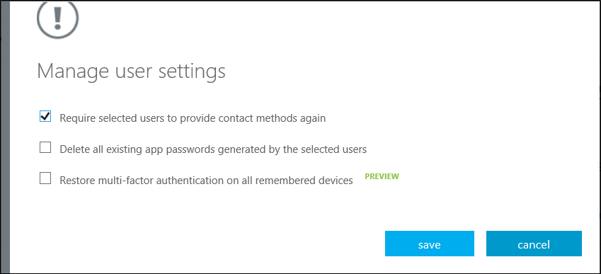
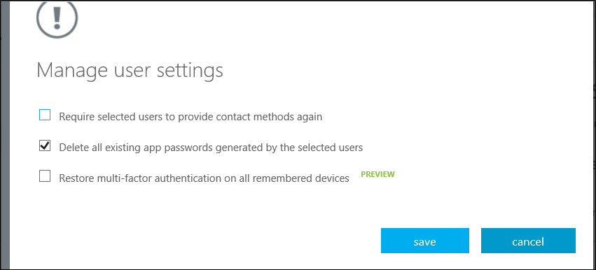
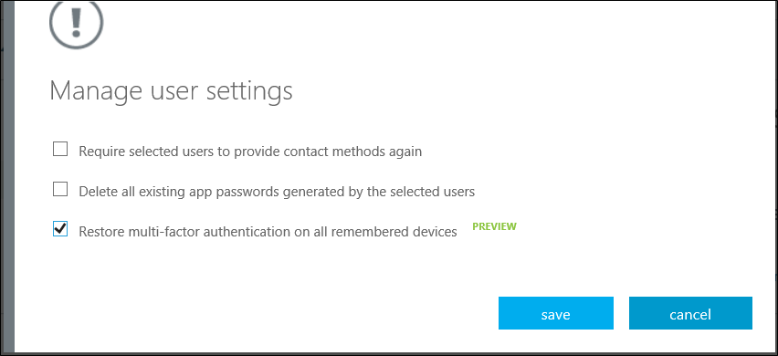

<properties 
	pageTitle="Azure Multi-Factor Authentication Reports" 
	description="This describes how to change user settings such as forcing the users to do the proof-up process again." 
	documentationCenter="" 
	services="multi-factor-authentication" 
	authors="billmath" 
	manager="stevenpo" 
	editor="curtand"/>

<tags 
	ms.service="multi-factor-authentication" 
	ms.workload="identity" 
	ms.tgt_pltfrm="na" 
	ms.devlang="na" 
	ms.topic="article" 
	ms.date="08/24/2015" 
	ms.author="billmath"/>

# Managing user settings with Azure Multi-Factor Authentication in the cloud

As an administrator, you can manage the following user and device settings.  

- [Require selected users to provide contact methods again](#require-selected-users-to-provide-contact-methods-again)
- [Delete users existing app passwords](#delete-users-existing-app-passwords)
- [Restore MFA on all suspended devices for a user (Public Preview)](#restore-mfa-on-all-suspended-devices-for-a-user)

This is helpful if a computer or device is lost or stolen or you need to remove a users access.

## Require selected users to provide contact methods again

This setting will forces the user to complete the registration process again when he or she signs in. Be aware that non-browser apps will continue to work if the user has app passwords for them.  You can delete the users app passwords by also selecting **Delete all existing app passwords generated by the selected users**.

### How to require users to provide contact methods again

<ol>
<li>Sign-in to the Azure Management Portal.</li>
<li>On the left, click Active Directory.</li>
<li>Under, Directory click on the directory for the user you want to require to provide their contact method again.</li>
<li>At the top, click Users.</li>
<li>At the bottom of the page, click Manage Multi-Factor Auth. This will open the multi-factor authentication page.
<li>Find the user that you wish to manage and place a check in the box located next to the name. You may need to change the view at the top.</li>
<li>This will bring up the **Manage user settings** link on the right. Click it.</li> 
<li>Place a check in **require selected users to provide contact methods again**.</li>

<li>Click save.</li>
<li>Click close</li>

## Delete users existing app passwords

This deletes all of the app passwords that a user has created. Non-browser apps that were associated with these app passwords will cease to work until a new app password is created.

### How to delete users existing app passwords

<ol>
<li>Sign-in to the Azure Management Portal.</li>
<li>On the left, click Active Directory.</li>
<li>Under, Directory click on the directory for the user you wish to delete app passwords for.</li>
<li>At the top, click Users.</li>
<li>At the bottom of the page, click Manage Multi-Factor Auth. This will open the multi-factor authentication page.
<li>Find the user that you wish to manage and place a check in the box located next to the name. You may need to change the view at the top.</li>
<li>This will bring up the **Manage user settings** link on the right. Click it.</li> 
<li>Place a check in **delete all existing app passwords generated by the selected users**.</li>

<li>Click save.</li>
<li>Click close.</li>

## Restore MFA on all suspended devices for a user

Administrators have the ability to reset Multi-Factor Authentication on their devices and browsers. This is done by restoring Multi-Factor Authentication for a user’s devices and browsers. When doing this, this will remove the suspension from all of the user’s devices and browsers. 

### How to restore MFA on all suspended devices for a user

<ol>
<li>Sign-in to the Azure Management Portal.</li>
<li>On the left, click Active Directory.</li>
<li>Under, Directory click on the directory for the user you wish to restore mfa on.</li>
<li>At the top, click Users.</li>
<li>At the bottom of the page, click Manage Multi-Factor Auth. This will open the multi-factor authentication page.
<li>Find the user that you wish to manage and place a check in the box located next to the name. You may need to change the view at the top.</li>
<li>This will bring up the **Manage user settings** link on the right. Click it.</li> 
<li>Place a check in restore Multi-Factor Authentication on all suspended devices.</li>

<li>Click save.</li>
<li>Click close.</li>

