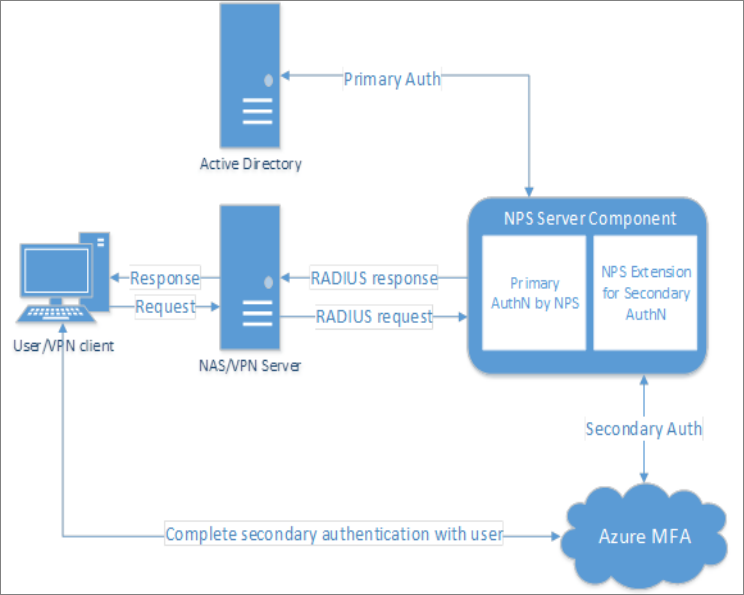

# Integrate your existing NPS infrastructure with Azure Multi-Factor Authentication - Public preview

The Network Policy Server (NPS) extension for Azure MFA adds cloud-based MFA capabilities to your authentication infrastructure using your existing servers. With the NPS extension, you can add phone call, SMS, or phone app verification to your existing authentication flow without having to install, configure, and maintain new servers. 
 
When using the NPS extension for Azure MFA, the authentication flow includes the following components: 

1. **NAS/VPN Server** receives requests from VPN clients and converts them into RADIUS requests to NPS servers. 
2. **NPS Server** connects to Active Directory to perform the primary authentication for the RADIUS requests and, upon success, passes the request to any installed extensions.  
3. **NPS Extension** triggers a request to Azure MFA for the secondary authentication. Once the extension receives the response, and if the MFA challenge succeeds, it completes the authentication request by providing the NPS server with security tokens that include an MFA claim, issued by Azure STS.  
4. **Azure MFA** communicates with Azure Active Directory to retrieve the user’s details and performs the secondary authentication using a verification method configured to the user.

The following diagram illustrates this high-level authentication request flow: 



## Prerequisites

The NPS extension is meant to work with your existing infrastructure. Make sure you have the following prerequisites before you begin.

### Licenses

The NPS Extension for Azure MFA is available to customers with [licenses for Azure Multi-Factor Authentication](multi-factor-authentication.md) (included with Azure AD Premium, EMS, or an MFA subscription).

### Software

Windows Server 2008 R2 SP1 or above with the NPS component enabled.

### Libraries

-	[Visual C++ Redistributable Packages for Visual Studio 2013 (X64)](https://www.microsoft.com/download/details.aspx?id=40784)
-	[Microsoft Azure Active Directory Module for Windows PowerShell version 1.1.166.0](https://connect.microsoft.com/site1164/Downloads/DownloadDetails.aspx?DownloadID=59185)

### Azure Active Directory

Everyone using the NPS extension must be synced to Azure Active Directory using Azure AD Connect, and must be enabled for MFA.

When you install the extension, you need the directory ID and admin credentials for your Azure AD tenant. You can find your directory ID in the [Azure portal](https://portal.azure.com). Sign in as an administrator, select the **Azure Active Directory** icon on the left, then select **Properties**. Copy the GUID in the **Directory ID** box and save.


## Install the NPS extension

> [!IMPORTANT]
> Install the NPS extension on a different server than the VPN access point. 

To install the NPS Extension for Azure MFA:

1.	[Download the NPS Extension](https://aka.ms/npsmfa) from the Microsoft Download Center
2.	Copy the binary to the Network Policy Server you want to configure
3.	Run *setup.exe* and follow the installation instructions

Once you complete the installation, the installer creates a PowerShell script in this location: `C:\Program Files\Microsoft\AzureMfa\Config` (where C:\ is your installation drive). This PowerShell script performs the following actions:

-	Create a self-signed certificate.
-	Associate the public key of the certificate to the service principal on Azure AD.
-	Store the cert in the local machine cert store.
-	Grant access to the certificate’s private key to Network User.
-	Restart the NPS.

Unless you want to use your own certificates (instead of the self-signed certificates that the PowerShell script generates), run the PowerShell Script to complete the installation. If you install the extension on multiple servers, each one should have its own certificate so that you don't have downtime when you renew the certificates. 

## Configure your NPS extension

This section includes design considerations and suggestions for successful NPS extension deployments.

### Configurations limitations

- The NPS extension is for new deployments, and is not meant to work with your existing deployment. For this reason, the NPS extension for Azure MFA does not include tools to migrate users and settings from MFA Server to the cloud.

- The NPS extension uses the UPN from the on-premises Active directory to identify the user on Azure MFA for performing the Secondary Auth. The extension cannot be configured to use a different identifier like alternate login ID or custom AD field other than UPN.  

### Control RADIUS clients that require MFA

Once you enable MFA for a RADIUS client using the NPS Extension, all authentications for this client are required to perform MFA. If you want to enable MFA for some RADIUS clients but not others, you can configure two NPS servers and install the extension on only one of them. Configure RADIUS clients that you want to require MFA to send requests to the NPS server configured with the extension, and other RADIUS clients to the NPS server not configured with the extension.

### Prepare for users that aren't enrolled for MFA

If you have users that aren't enrolled for MFA, you can determine what happens when they try to authenticate. Use the registry setting *REQUIRE_USER_MATCH* in the registry path *HKLM\Software\Microsoft\AzureMFA* to control the feature behavior. This setting has a single configuration option:

| Key | Value | Default |
| --- | ----- | ------- |
| REQUIRE_USER_MATCH | TRUE/FALSE | Not set (equivalent to TRUE) |

The purpose of this setting is to determine what to do when a user is not enrolled for MFA. When the key does not exist, is not set, or is set to TRUE, and the user is not enrolled, then the extension fails the MFA challenge. When the key is set to FALSE and the user is not enrolled, authentication proceeds without performing MFA.

You can choose to create this key and set it to FALSE during user onboarding. Since setting the key permits users that aren't enrolled for MFA to sign in without being challenged, you should remove this key before going to production.

## Troubleshooting

### How do I verify that the client cert is installed as expected?

Look for the self-signed certificate created by the installer in the cert store, and check that the private key has permissions granted to user **NETWORK SERVICE**. The cert will have a subject name of **CN \<tenantid\>, OU = Microsoft NPS Extension**

-------------------------------------------------------------

### How can I verify that my client cert is associated to my tenant in Azure Active Directory?

Open PowerShell command prompt and run the following commands:

```
> import-module MSOnline
> Connect-MsolService
> Get-MsolServicePrincipalCredential -AppPrincipalId "981f26a1-7f43-403b-a875-f8b09b8cd720" -ReturnKeyValues 1 
```

These commands print all the certificates associating your tenant with your instance of the NPS extension in your PowerShell session. Look for your certificate by exporting your client cert as a "Base-64 encoded X.509(.cer)" file without the private key, and compare it with the list from PowerShell.

Valid-From and Valid-Until timestamps, which are in human-readable form, can be used to filter out obvious misfits if the command returns more than one cert.

-------------------------------------------------------------

### Why are my requests failing with ADAL token error?

This error could be due to one of several reasons. Use these steps to help troubleshoot:

1. Restart your NPS server.
2. Verify that that client cert is installed as expected.
3. Verify that the certificate is associated with your tenant on Azure AD.
4. Verify that https://login.windows.net/ is accessible from the server running the extension.

-------------------------------------------------------------

### Why does authentication fail with an error in HTTP logs stating that the user is not found?

Verify that AD Connect is running, and that the user is present in both Windows Active Directory and Azure Active Directory.

------------------------------------------------------------

### Why do I see HTTP connect errors in logs with all my authentications failing?

Verify that https://adnotifications.windowsazure.com is reachable from the server running the NPS extension.

## Next steps

See how to integrate Azure MFA with [Active Directory](multi-factor-authentication-get-started-server-dirint.md), [RADIUS authentication](multi-factor-authentication-get-started-server-radius.md), and [LDAP authentication](multi-factor-authentication-get-started-server-ldap.md).
