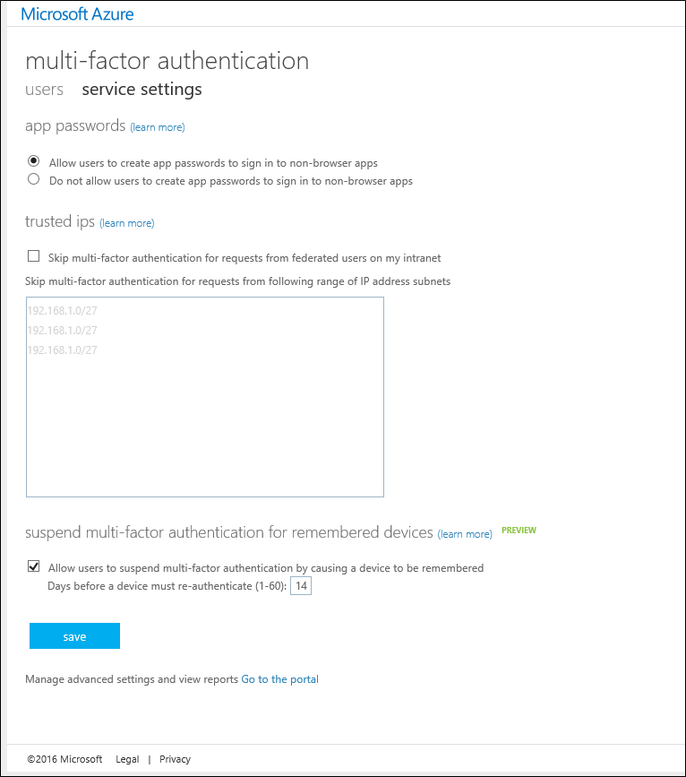

# Building Multi-Factor Authentication into Custom Apps (SDK)

The Azure Multi-Factor Authentication Software Development Kit (SDK) lets you build two-step verification directly into the sign-in or transaction processes of applications in your Azure AD tenant.

The Multi-Factor Authentication SDK is available for C#, Visual Basic (.NET), Java, Perl, PHP, and Ruby. The SDK provides a thin wrapper around two-step verification. It includes everything you need to write your code, including commented source code files, example files, and a detailed ReadMe file. Each SDK also includes a certificate and private key for encrypting transactions that are unique to your Multi-Factor Authentication Provider. As long as you have a provider, you can download the SDK in as many languages and formats as you need.

The structure of the APIs in the Multi-Factor Authentication SDK is simple. Make a single function call to an API with the multi-factor option parameters (like verification mode) and user data (like the telephone number to call or the PIN number to validate). The APIs translate the function call into web services requests to the cloud-based Azure Multi-Factor Authentication Service. All calls must include a reference to the private certificate that is included in every SDK.

Because the APIs do not have access to users registered in Azure Active Directory, you must provide user information in a file or database. Also, the APIs do not provide enrollment or user management features, so you need to build these processes into your application.

> [!IMPORTANT]
> To download the SDK, you need to create an Azure Multi-Factor Auth Provider even if you have Azure MFA, AAD Premium, or EMS licenses. If you create an Azure Multi-Factor Auth Provider for this purpose and already have licenses, make sure to create the Provider with the **Per Enabled User** model. Then, link the Provider to the directory that contains the Azure MFA, Azure AD Premium, or EMS licenses. This configuration ensures that you are only billed if you have more unique users using the SDK than the number of licenses you own.

## Download the SDK
Downloading the Azure Multi-Factor SDK requires an [Azure Multi-Factor Auth Provider](multi-factor-authentication-get-started-auth-provider.md).  This requires a full Azure subscription, even if Azure MFA, Azure AD Premium, or Enterprise Mobility Suite licenses are owned.  To download the SDK, navigate to the Multi-Factor Management Portal. You can reach the portal either by managing the Multi-Factor Auth Provider directly, or by clicking the **"Go to the portal"** link on the MFA service settings page.

### Download from the Azure classic portal
1. Sign in to the [Azure classic portal](https://manage.windowsazure.com) as an Administrator.
2. On the left, select **Active Directory**.
3. On the Active Directory page, at the top select **Multi-Factor Auth Providers**
4. At the bottom select **Manage**. A new page opens.
5. On the left, at the bottom, click **SDK**.
   

6. Select the language you want and click one the associated download links.
7. Save the download.

### Download from the service settings
1. Sign in to the [Azure classic portal](https://manage.windowsazure.com) as an Administrator.
2. On the left, select **Active Directory**.
3. Double-click your instance of Azure AD.
4. At the top click **Configure**
5. Under multi-factor authentication, select **Manage service settings**
   
6. On the services settings page, at the bottom of the screen click **Go to the portal**. A new page opens.
   
7. On the left, at the bottom, click **SDK**.
8. Select the language you want and click one the associated download links.
9. Save the download.

## What's in the SDK
The SDK includes the following items:

* **README**. Explains how to use the Multi-Factor Authentication APIs in a new or existing application.
* **Source files** for Multi-Factor Authentication
* **Client certificate** that you use to communicate with the Multi-Factor Authentication service
* **Private key** for the certificate
* **Call results.** A list of call result codes. To open this file, use an application with text formatting, such as WordPad. Use the call result codes to test and troubleshoot the implementation of Multi-Factor Authentication in your application. They are not authentication status codes.
* **Examples.** Sample code for a basic working implementation of Multi-Factor Authentication.

> [!WARNING]
> The client certificate is a unique private certificate that was generated especially for you. Do not share or lose this file. It’s your key to ensuring the security of your communications with the Multi-Factor Authentication service.

## Code sample
This code sample shows you how to use the APIs in the Azure Multi-Factor Authentication SDK to add standard mode voice call verification to your application. Standard mode is a telephone call that the user responds to by pressing the # key.

This example uses the C# .NET 2.0 Multi-Factor Authentication SDK in a basic ASP.NET application with C# server-side logic, but the process is similar in other languages. Because the SDK includes source files, not executable files, you can build the files and reference them or include them directly in your application.

> [!NOTE]
> When implementing Multi-Factor Authentication, use the additional methods (phone call or text message) as secondary or tertiary verification to supplement your primary authentication method (username and password). These methods are not designed as primary authentication methods.

### Code Sample Overview
This sample code for a simple web demo application uses a telephone call with a # key response to verify the user's authentication. This telephone call factor is known in Multi-Factor Authentication as standard mode.

The client-side code does not include any Multi-Factor Authentication-specific elements. Because the additional authentication factors are independent of the primary authentication, you can add them without changing the existing sign-on interface. The APIs in the Multi-Factor SDK let you customize the user experience, but you might not need to change anything at all.

The server-side code adds standard-mode authentication in Step 2. It creates a PfAuthParams object with the parameters that are required for standard-mode verification: username, telephone number, and mode, and the path to the client certificate (CertFilePath), which is required in each call. For a demonstration of all parameters in PfAuthParams, see the Example file in the SDK.

Next, the code passes the PfAuthParams object to the pf_authenticate() function. The return value indicates the success or failure of the authentication. The out parameters, callStatus, and errorID, contain additional call result information. The call result codes are documented in the call results file in the SDK.

This minimal implementation can be written in a few lines. However, in production code, you would include more sophisticated error handling, additional database code, and an enhanced user experience.

### Web Client Code
The following is web client code for a demo page.

    <%@ Page Language="C#" AutoEventWireup="true" CodeFile="Default.aspx.cs" Inherits="\_Default" %>

    <!DOCTYPE html>

    <html xmlns="http://www.w3.org/1999/xhtml">
    <head runat="server">
    <title>Multi-Factor Authentication Demo</title>
    </head>
    <body>
    <h1>Azure Multi-Factor Authentication Demo</h1>
    <form id="form1" runat="server">

    

    Username:&nbsp; 
    Password:&nbsp; 
    

    <div">
    <asp:TextBox id="username" runat="server" width="100px"/> 
    <asp:Textbox id="password" runat="server" width="100px" TextMode="password" /> 
    

    <asp:Button id="btnSubmit" runat="server" Text="Log in" onClick="btnSubmit_Click"/>

    
<asp:Label ID="lblResult" runat="server"></asp:Label>

    </form>
    </body>
    </html>

### Server-Side Code
In the following server-side code, Multi-Factor Authentication is configured and run in Step 2. Standard mode (MODE_STANDARD) is a telephone call to which the user responds by pressing the # key.

    using System;
    using System.Collections.Generic;
    using System.Linq;
    using System.Web;
    using System.Web.UI;
    using System.Web.UI.WebControls;

    public partial class \_Default : System.Web.UI.Page
    {
        protected void Page_Load(object sender, EventArgs e)
        {
        }

        protected void btnSubmit_Click(object sender, EventArgs e)
        {
            // Step 1: Validate the username and password
            if (username.Text != "Contoso" || password.Text != "password")
            {
                lblResult.ForeColor = System.Drawing.Color.Red;
                lblResult.Text = "Username or password incorrect.";
            }
            else
            {
                // Step 2: Perform multi-factor authentication

                // Add call details from the user database.
                PfAuthParams pfAuthParams = new PfAuthParams();
                pfAuthParams.Username = username.Text;
                pfAuthParams.Phone = "5555555555";
                pfAuthParams.Mode = pf_auth.MODE_STANDARD;

                // Specify a client certificate
                // NOTE: This file contains the private key for the client
                // certificate. It must be stored with appropriate file
                // permissions.
                pfAuthParams.CertFilePath = "c:\\cert_key.p12";

                // Perform phone-based authentication
                int callStatus;
                int errorId;

                if(pf_auth.pf_authenticate(pfAuthParams, out callStatus, out errorId))
                {
                    lblResult.ForeColor = System.Drawing.Color.Green;
                    lblResult.Text = "Multi-Factor Authentication succeeded.";
                }
                else
                {
                    lblResult.ForeColor = System.Drawing.Color.Red;
                    lblResult.Text = "Multi-Factor Authentication failed.";
                }
            }

        }
    }
