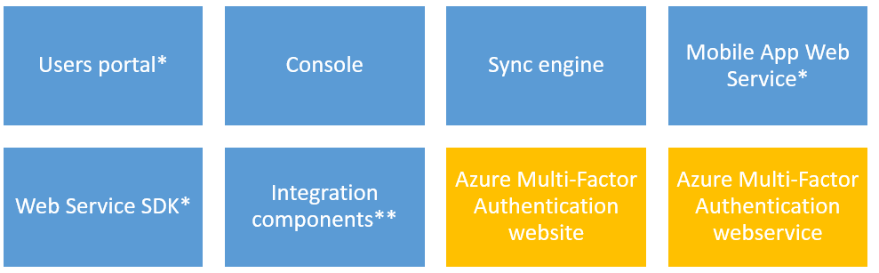

<properties 
	pageTitle="Security Best Practices for using Azure MFA" 
	description="This document provides best practices around using Azure MFA with Azure accounts" 
	services="multi-factor-authentication" 
	documentationCenter="" 
	authors="billmath" 
	manager="stevenpo" 
	editor="curtland"/>

<tags 
	ms.service="multi-factor-authentication" 
	ms.workload="identity" 
	ms.tgt_pltfrm="na" 
	ms.devlang="na" 
	ms.topic="article" 
	ms.date="08/04/2016" 
	ms.author="billmath"/>

# Security Best Practices for using Azure Multi-Factor Authentication with Azure AD accounts

When it comes to enhancing your authentication process, multi-factor authentication is the preferred choice for most organizations. Azure Multi-Factor Authentication (MFA) enables companies to meet their security and compliance requirements while providing a simple sign-in experience for their users. This article will cover some best practices that you should consider when planning for the adoption of Azure MFA. 

## Best Practices for Azure Multi-Factor Authentication in the cloud
In order to provide all of your users with multi-factor authentication and take advantages of the extended features that Azure Multi-Factor Authentication offers, you will need to enable Azure Multi-Factor Authentication on all of your users.  This is accomplished by using one of the following:

- Azure AD Premium or the Enterprise Mobility Suite 
- Multi-Factor Auth Provider

### Azure AD Premium/Enterprise Mobility Suite

The first recommended step for adopting Azure MFA in the cloud using Azure AD Premium or the Enterprise Mobility Suite is to assign licenses to your users.  Azure Multi-Factor Authentication is part of these suites and as such your organization doesn't need anything additional to extend the multi-factor authentication capability to all users.
 
When setting up Multi-Factor Authentication consider following:

- You do not need to create a Multi-Factor Auth Provider.  Azure AD Premium and the Enterprise Mobility Suite comes with Azure Multi-Factor Authentication.  If you create an Auth Provider you could get double billed.
- Azure AD Connect is only a requirement if you are synchronizing your on-premises Active Directory environment with an Azure AD directory. If you only use an Azure AD directory that is not synchronized with an on-premises instance of Active Directory, you do not need Azure AD Connect.

### Multi-Factor Auth Provider

If you do not have Azure AD Premium or the Enterprise Mobility Suite then the first recommended step for adopting Azure MFA in the cloud is to create an MFA Auth Provider. Although MFA is available by default for global administrators who have Azure Active Directory, when you are deploying MFA for your organization you need to extend the multi-factor authentication capability to all users and to do that you need a Multi-Factor Auth Provider. 
When selecting the Auth Provider, you need to select a directory and consider the following:

- You do not need an Azure AD directory to create a Multi-Factor Auth Provider. 
- You will need to associate the Multi-Factor Auth Provider with an Azure AD directory if you wish to extend multi-factor authentication to all of your users and/or want your global administrators to be able to take advantage of features such as the management portal, custom greetings, and reports.
- DirSync or AAD Sync are only a requirement if you are synchronizing your on-premises Active Directory environment with an Azure AD directory. If you only use an Azure AD directory that is not synchronized with an on-premises instance of Active Directory, you do not need DirSync or AAD Sync.
- If you have Azure AD Premium or the Enterprise Mobility Suite, you do not need to create a Multi-Factor Auth provider. You only need to assign a user a license and then you can begin turning on MFA for users.
- Make sure to choose the right usage model for your business (per auth or per enabled user), once you select the usage model you can’t change it.

### User Account
When enabling MFA for your users, user accounts can be in one of three core states: disabled, enabled or enforced. 
Use the guidelines below to ensure you are using the most appropriate option for your deployment:

- When the user’s state is set to disabled, that user is not using multi-factor authentication. This is the default state.
- When the user’s state is set to enabled, it means that the user is enabled but has not completed the registration process. They will be prompted to complete the process at next sign-in. This setting doesn’t affect non browser apps. All apps will continue to work until the registration process is completed.
- When the user’s state is set to enforced, it means that the user may or may not have completed registration. If they have completed the registration process then they are using multi-factor authentication. Otherwise, the user will be prompted to complete the registration process at next sign-in. This setting does affect non browser apps. These apps will not work until app passwords are created and used.
- Use the User Notification Template available in the article [Getting started with Azure Multi-Factor Authentication in the cloud](multi-factor-authentication-get-started-cloud.md) to send an email to your users regarding MFA adoption.

### Supportability

Since the vast majority of the users are accustomed to using only passwords to authenticate, it is important that your company bring awareness to all users regarding this process. This awareness can reduce the likelihood that users will call your help desk for minor issues related to MFA. 
However, there are some scenarios where temporarily disabling MFA is necessary. Use the guidelines below to understand how to handle those scenarios:

- Make sure your technical support personnel are trained to handle scenarios where the mobile app or phone is not receiving a notification or phone-call and for this reason the user is unable to sign in. They can enable a one-time bypass option to allow a user to authenticate a single time by "bypassing" multi-factor authentication. The bypass is temporary and expires after the specified number of seconds. 
- If necessary, you can leverage the Trusted IPs capability in Azure MFA. This feature allows administrators of a managed or federated tenant the ability to bypass multi-factor authentication for users that are signing in from the company’s local intranet. The features are available for Azure AD tenants that have Azure AD Premium, Enterprise Mobility Suite or Azure Multi-Factor Authentication licenses.

## Best Practices for Azure Multi-Factor Authentication on-premises
If your company decided to leverage its own infrastructure to enable MFA, it will be necessary to deploy an Azure Multi-Factor Authentication Server on-premises. The MFA Server components are shown in the diagram below:

*Not installed by default  **Installed but not enabled by default

Azure Multi-Factor Authentication Server can be used to secure cloud resources and on-premises resources that are accessed by Azure AD accounts.  However this can only accomplished by using federation.  That is, you must have AD FS and have it federated with your Azure AD tenant.
When setting up Multi-Factor Authentication Server consider following:

- If you are securing Azure AD resources using Active Directory Federation Services, then the 1st factor of authentication is performed on-premises using AD FS and the 2nd factor is performed on-premises by honoring the claim.
- It is not a requirement that the Azure Multi-Factor Authentication Server be installed on your AD FS federation server however the Multi-Factor Authentication Adapter for AD FS must be installed on a Windows Server 2012 R2 running AD FS. You can install the server on a different computer, as long as it is a supported version and install the AD FS adapter separately on your AD FS federation server. See the procedure below for instructions on installing the adapter separately.
- The Multi-Factor Authentication AD FS Adapter installation wizard creates a security group called PhoneFactor Admins in your Active Directory and then adds the AD FS service account of your federation service to this group.It is recommended that you verify on your domain controller that the PhoneFactor Admins group is indeed created and that the AD FS service account is a member of this group. If necessary, add the AD FS service account to the PhoneFactor Admins group on your domain controller manually.

### User Portal
This portal runs in an Internet Information Server (IIS) web site, which allows self-service capabilities and provides a full set of user administration capabilities. Use the guidelines below to configure this component:

- IIS 6 or greater is required
- ASP.NET  v2.0.507207 have to be installed and registered
- This server can be deployed in a perimeter network.

### App Passwords
If your organization is federated using SSO with Azure AD and you are going to be using Azure MFA, then be aware of the following when using app passwords (remember that this only applies to federated (SSO) is used):

- The App Password is verified by Azure AD and therefore bypasses federation. Federation is only used when setting up App Password.
- For federated (SSO) users passwords will be stored in the organizational id. If the user leaves the company, that info has to flow to organizational id using DirSync in real time. Account disable/deletion may take up to 3 hours to sync, delaying disable/deletion of App Password in Azure AD.
- On-premises Client Access Control settings are not honored by App Password
- No on-premises authentication logging / auditing capability is available for App Password
- More end-user education is required for the Microsoft Lync 2013 client. 
- Certain advanced architectural designs may require using a combination of organizational username and passwords and app passwords when using multi-factor authentication with clients, depending on where they authenticate. For clients that authenticate against an on-premises infrastructure, you would use an organizational username and password. For clients that authenticate against Azure AD, you would use the app password.
- By default, users cannot create app passwords, if your company requires that or if you need to allow users to create app password in some scenarios, ensure that the option Allow users to create app passwords to sign into non-browser applications is selected.

## Additional Considerations
Use the list below to understand some additional considerations and best practices for each component that will be deployed on-premises:

Method|Description
:------------- | :------------- | 
[Active Directory Federation Service](multi-factor-authentication-get-started-adfs.md)|Information on setting up Azure Multi-Factor Authentication with AD FS.
[RADIUS Authenticaton](multi-factor-authentication-get-started-server-radius.md)|  Information on setup and configuring the Azure MFA Server with RADIUS.
[IIS Authentication](multi-factor-authentication-get-started-server-iis.md)|Information on setup and configuring the Azure MFA Server with IIS.
[Windows Authenticaton](multi-factor-authentication-get-started-server-windows.md)|  Information on setup and configuring the Azure MFA Server with Windows Authentication.
[LDAP Authentication](multi-factor-authentication-get-started-server-ldap.md)|Information on setup and configuring the Azure MFA Server with LDAP Authentication.
[Remote Desktop Gateway and Azure Multi-Factor Authentication Server using RADIUS](multi-factor-authentication-get-started-server-rdg.md)|  Information on setup and configuring the Azure MFA Server with Remote Desktop Gateway using RADIUS.
[Sync with Windows Server Active Directory](multi-factor-authentication-get-started-server-dirint.md)|Information on setup and configuring synchronization between Active Directory and the Azure MFA Server.
[Deploying the Azure Multi-Factor Authentication Server Mobile App Web Service](multi-factor-authentication-get-started-server-webservice.md)|Information on setup and configuring the Azure MFA server web service.
[Advanced VPN Configuration with Azure Multi-Factor Authentication](multi-factor-authentication-advanced-vpn-configurations.md)|Information on configuring Cisco ASA, Citrix Netscaler, and Juniper/Pulse Secure VPN appliances using LDAP or RADIUS. 

## Additional Resources
While this article highlights some best practices for Azure MFA, there are other resources that you can also use while planning your MFA deployment. The list below has some key articles that can assist you during this process:

- [Reports in Azure Multi-Factor Authentication](multi-factor-authentication-manage-reports.md)
- [Setup experience for Azure Multi-Factor Authentication](multi-factor-authentication-end-user-first-time.md)
- [Azure Multi-Factor Authentication FAQ](multi-factor-authentication-faq.md)
