<properties 
	pageTitle="Azure Multi-Factor Authentication - What's Next" 
	description="This is the Azure Multi-factor authentication page that describes what to do next with MFA.  This includes reports, fraud alert, one-time bypass, custom voice messages, caching, trusted ips and app passwords." 
	services="multi-factor-authentication" 
	documentationCenter="" 
	authors="billmath" 
	manager="stevenpo" 
	editor="curtand"/>

<tags 
	ms.service="multi-factor-authentication" 
	ms.workload="identity" 
	ms.tgt_pltfrm="na" 
	ms.devlang="na" 
	ms.topic="article" 
	ms.date="08/24/2015" 
	ms.author="billmath"/>

# Configuring Azure Multi-Factor Authentication

The following article will help you manage Azure Multi-Factor Authentication now that you are up and running.  It covers a variety of topics that will allow you to get the most out of Azure Multi-Factor Authentication.  Please be aware that not all of these features are available in every version of Azure Multi-Factor Authentication.

Feature| Description| What is covered
:------------- | :------------- | :------------- | 
[Fraud alert](#fraud-alert)|Fraud alert can be configured and setup so that your users can report fraudulent attempts to access their resources.|How to setup, configure and report fraud
[One-time bypass](#one-time-bypass) |A one-time bypass allows a user to authenticate a single time by "bypassing" multi-factor authentication.|How to setup and configure a one-time bypass
[Custom Voice Messages](#custom-voice-messages) |Custom voice messages allow you to use your own recordings or greetings with multi-factor authentication. |How to setup and configure custom greetings and messages
[Caching](#caching)|Caching allows you to set a specific time period so that subsequent authentication attempts succeed automatically. |How to setup and configure authentication caching.
[Trusted IPs](#trusted-ips)|Trusted IPs is a feature of multi-factor authentication that allows administrators of a managed or federated tenant the ability to bypass multi-factor authentication for users that are signing in from the company’s local intranet.|Configure and setup IP addresses that are exempt for multi-factor authentication	
[App Passwords](#app-passwords)|App passwords allows an application that is not mfa aware to bypass multi-factor authentication and continue working.|Information about app passwords.
[Suspend Multi-Factor Authentication for remembered devices and browsers (Public Preview)](#suspend-multi-factor-authentication-for-remembered-devices-and-browsers-public-preview)|Allows you to suspend MFA for a set number of days after a user has successfully signed in using MFA.|Information about enabling this feature and setting up the number of days.

## Fraud Alert
Fraud alert can be configured and setup so that your users can report fraudulent attempts to access their resources.  Users can report fraud either with the mobile app or through their phone.

### To setup and configure fraud alert

1. Log on to [http://azure.microsoft.com](http://azure.microsoft.com)
2. On the left, select Active Directory.
3. At the top select Multi-Factor Auth Providers. This will bring up a list of your Multi-Factor Auth Providers.
4. If you have more than one Multi-Factor Auth Provider, select the one you wish to enable fraud alerting on and click Manage at the bottom of the page. If you have only one, just click Manage. This will open the Azure Multi-Factor Authentication Management Portal.
5. On the Azure Multi-Factor Authentication Management Portal, on the left, click Settings.
6. Under the Fraud Alert section, place a check in Allow users to submit Fraud Alerts.
7. If you want users to be blocked when fraud is reported, place a check in Block user when fraud is reported.
8. In the box under Code To Report Fraud During Initial Greeting enter a number code that can be used during call verification. If a user enters this code, instead of the # sign, then a fraud alert will be reported.
9. At the bottom, click Save.

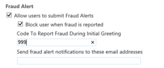

### To report fraud alert
Fraud alert can be reported two ways.  Either through the mobile app or through the phone.  

### To report fraud alert with the mobile app
<ol>
<li>When a verification is sent to your phone click on it and it will start the Multi-Factor Authentication app.</li>
<li>To report fraud, click the Cancel and Report Fraud. This will bring up a box that says your organizations IT</li> Support staff will be notified. Click report fraud.
<li>On the app, click Close.</li></ol>

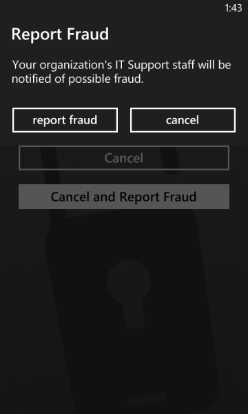

### To report fraud alert with the phone
<ol>
<li>When a verification call comes in to your phone answer it.</li>
<li>To report fraud, enter the code that has been configured to correspond with reporting fraud via the phone and then the # sign. You will be notified that a fraud alert has been submitted.</li>
<li>End the call.</li></ol>

### To view the fraud report

1. Log on to [http://azure.microsoft.com](http://azure.microsoft.com)
2. On the left, select Active Directory.
3. At the top select Multi-Factor Auth Providers. This will bring up a list of your Multi-Factor Auth Providers.
4. If you have more than one Multi-Factor Auth Provider, select the one you wish to view the fraud alert report and click Manage at the bottom of the page. If you have only one, just click Manage. This will open the Azure Multi-Factor Authentication Management Portal.
5. On the Azure Multi-Factor Authentication Management Portal, on the left, under View A Report, click Fraud Alert.
6. Specify the date range that you wish to view in the report. Also you can specify any specific usernames, phone numbers and the users status.
7. Click Run. This will bring up a report similar to the one below. You can also click Export to CSV if you wish to export the report.

## One-time bypass

A one-time bypass allows a user to authenticate a single time by "bypassing" multi-factor authentication. The bypass is temporary and expires after the specified number of seconds.  So in situations where the mobile app or phone is not receiving a notification or phone-call, you can enable a one-time bypass so the user can access the desired resource. 

### To create a one-time bypass

<ol>
<li>Log on to [http://azure.microsoft.com](http://azure.microsoft.com)</li>
<li>On the left, select Active Directory.</li>
<li>At the top select Multi-Factor Auth Providers. This will bring up a list of your Multi-Factor Auth Providers.</li>
<li>If you have more than one Multi-Factor Auth Provider, select the one that is associated with the directory for the user you wish to create a one-time bypass for and click Manage at the bottom of the page. If you have only one, just click Manage. This will open the Azure Multi-Factor Authentication Management Portal.</li>
<li>On the Azure Multi-Factor Authentication Management Portal, on the left, under User Administration, click Settings.</li>

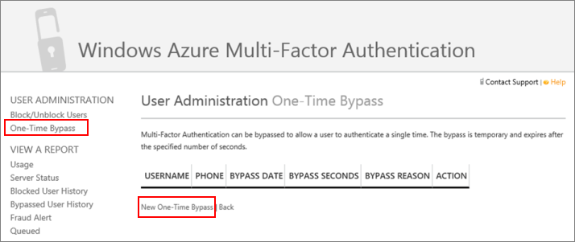

<li>On the One-Time Bypass page, click New One-Time Bypass.</li>
<li>Enter the user’s username, the number of seconds that the bypass will exist, the reason for the bypass and click Bypass.</li>

<li>At this point, the user must sign in before the one-time bypass expires.</li>

### To view the one-time bypass report

1. Log on to [http://azure.microsoft.com](http://azure.microsoft.com)
2. On the left, select Active Directory.
3. At the top select Multi-Factor Auth Providers. This will bring up a list of your Multi-Factor Auth Providers.
4. If you have more than one Multi-Factor Auth Provider, select the one you wish to view the fraud alert report and click Manage at the bottom of the page. If you have only one, just click Manage. This will open the Azure Multi-Factor Authentication Management Portal.
5. On the Azure Multi-Factor Authentication Management Portal, on the left, under View A Report, click One-Time Bypass.
6. Specify the date range that you wish to view in the report. Also you can specify any specific usernames, phone numbers and the users status.
7. Click Run. This will bring up a report similar to the one below. You can also click Export to CSV if you wish to export the report.

## Custom voice messages

Custom voice messages allow you to use your own recordings or greetings with multi-factor authentication.  These can be used in addition to or to replace the Microsoft records.

Before you begin be aware of the following:

- The current supported file formats are .wav and .mp3.
- The file size limit is 5MB.
- It is recommended that for Authentication messages that it be no longer than 20 seconds. Anything greater than this could cause the verification to fail because the user may not respond before the message finishes and the verification times out.

### To setup custom voice messages in Azure Multi-Factor Authentication
<ol>
<li>Create a custom voice message using one of the supported file formats. See Custom Voice Message Recommendations below.</li>
<li>Log on to [http://azure.microsoft.com](http://azure.microsoft.com)</li>
<li>On the left, select Active Directory.</li>
<li>At the top select Multi-Factor Auth Providers. This will bring up a list of your Multi-Factor Auth Providers.</li>
<li>If you have more than one Multi-Factor Auth Provider, select the one you wish to configure the custom voice message on and click Manage at the bottom of the page. If you have only one, just click Manage. This will open the Azure Multi-Factor Authentication Management Portal.</li>
<li>On the Azure Multi-Factor Authentication Management Portal, on the left, click Voice Messages.</li>

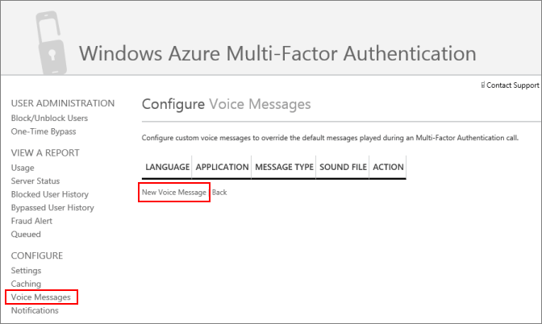

<li>Under the Voice Messages section, click New Voice Message.</li>

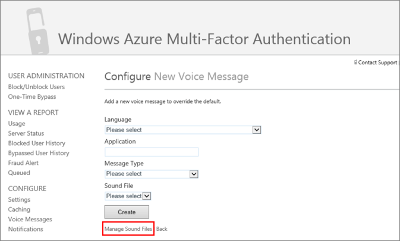

<li>On the Configure: New Voice Messages page, click Manage Sound Files.</li>

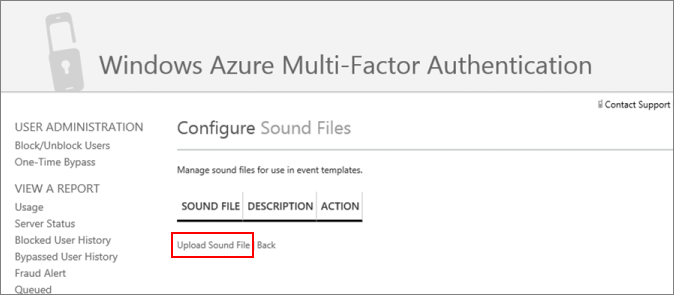

<li>On the Configure: Sound Files page, click Upload Sound File.</li>

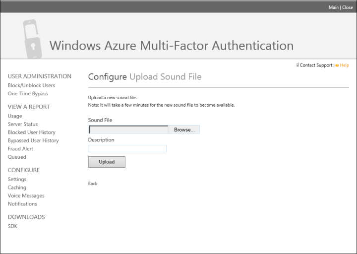

<li>On the Configure: Upload Sound File, click Browse and navigate to your voice message, click Open.</li>
<li>Add a Description and click Upload.</li>
<li>Once this completes, you will see a message that you have successfully uploaded the file.</li>
<li>On the left, click Voice Messages.</li>
<li>Under the Voice Messages section, click New Voice Message.</li>
<li>From the Language drop-down, select a language.</li>
<li>If this message is for a specific application, specify it in the Application box.</li>
<li>From the Message Type, select the message type that will be overridden with our new custom message.</li>
<li>From the Sound File drop-down, select your sound file.</li>
<li>Click Create. You will see a message that says you have successfully created a voice message.</li>

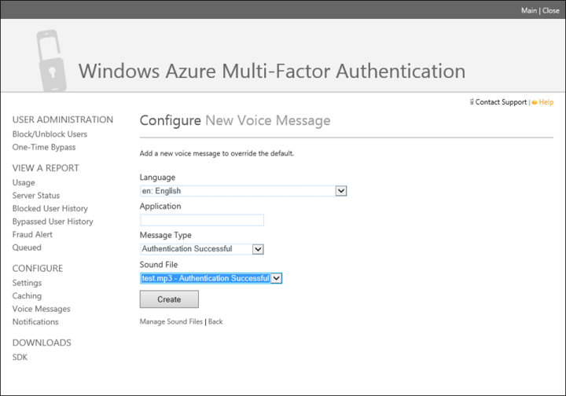

## Caching in Azure Multi-Factor Authentication

Caching allows you to set a specific time period so that subsequent authentication attempts succeed automatically.  This allows your users to avoid having to wait for phone calls or text if they authenticate within this time period.

### To setup caching in Azure Multi-Factor Authentication
<ol>

1. Log on to [http://azure.microsoft.com](http://azure.microsoft.com)
2. On the left, select Active Directory.
3. At the top select Multi-Factor Auth Providers. This will bring up a list of your Multi-Factor Auth Providers.
4. If you have more than one Multi-Factor Auth Provider, select the one you wish to enable fraud alerting on and click Manage at the bottom of the page. If you have only one, just click Manage. This will open the Azure Multi-Factor Authentication Management Portal.
5. On the Azure Multi-Factor Authentication Management Portal, on the left, click Caching.
6. On the Configure caching page click New Cache
7. Select the Cache type and the cache seconds.  Click create.

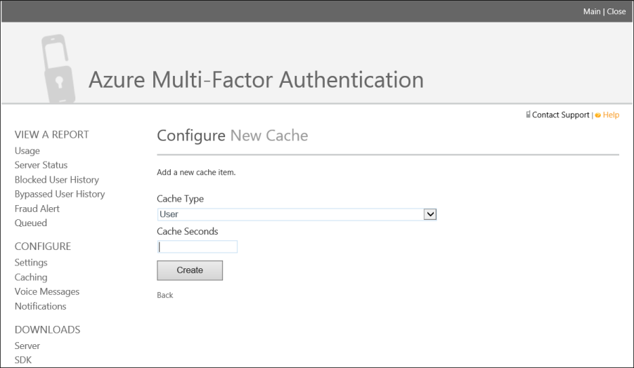

## Trusted IPs

Trusted IPs is a feature of multi-factor authentication that allows administrators of a managed or federated tenant the ability to bypass multi-factor authentication for users that are signing in from the company’s local intranet. The features are available for Azure AD tenants that have Azure AD Premium, Enterprise Mobility Suite or Azure Multi-Factor Authentication licenses.

 
Type of Azure AD Tenant| Available Trusted IP options
:------------- | :------------- | 
Managed|Specific IP address ranges – Administrators can specify a range of IP addresses that can bypass multi-factor authentication for users that are signing in from the company’s intranet..
Federated|<li>All Federated Users - All federated users who are signing-in from inside the organization will bypass multi-factor authentication using a claim issued by AD FS.</li><li>Specific IP address ranges – Administrators can specify a range of IP addresses that can bypass multi-factor authentication for users that are signing in from the company’s intranet.

This bypass only works from inside a company’s intranet. So for example, if you only selected all federated users, and a user signs in from outside the company’s intranet, that user will have to authenticate using multi-factor authentication even if the user presents an AD FS claim. The following table describes when multi-factor authentication and app passwords are required inside your corpnet and outside your corpnet when Trusted IPs is enabled.

|Trusted IPs enabled| Trusted IPs disabled
:------------- | :------------- | :------------- | 
Inside corpnet|For browser flows multi-factor authentication NOT required.|For browser flows, multi-factor authentication required
|For rich client apps, regular passwords will work if the user has not created any app passwords. Once an app password has been created, app passwords are required.|For rich client apps, app passwords required
Outside corpnet|For browser flows, multi-factor authentication required.|For browser flows, multi-factor authentication required.
|For rich client apps, app passwords required.|For rich client apps, app passwords required.

### To enable Trusted IPs

 
<ol>
<li>Sign-in to the Azure Management Portal.</li>
<li>On the left, click Active Directory.</li>
<li>Under, Directory click on the directory you wish to setup Trusted IPsing on.</li>
<li>On the Directory you have selected, click Configure.</li>
<li>In the multi-factor authentication section, click Manage service settings.</li>
<li>On the Service Settings page, under Trusted IPs, select either:
<ul>
<li>For requests from federated users originating from my intranet – All federated users who are signing in from the corporate network will bypass multi-factor authentication using a claim issued by AD FS. 

<li>For requests from a specific range of public IPs – enter the IP addresses in the boxes provided using CIDR notation. For example: xxx.xxx.xxx.0/24 for IP addresses in the range xxx.xxx.xxx.1 – xxx.xxx.xxx.254, or xxx.xxx.xxx.xxx/32 for a single IP address. You can enter up to 12 IP address ranges.</li></ul>

<li>Click save.</li>
<li>Once the updates have been applied, click close.</li>
 
## App Passwords

In some apps, like Office 2010 or older and Apple Mail you can't use multi-factor authenticaton.  To use these apps, you'll need to use "app passwords" in place of your traditional password.  The app password allows the application to bypass multi-factor authentication and continue working.

>[AZURE.NOTE] Modern Authentication for the Office 2013 Clients
>
> Office 2013 clients (including Outlook) now support new Authentication Protocols and can be enabled to support Multi-Factor Authentication.  This means that once enabled, app passwords are not required for use with Office 2013 clients.  For more information see [Office 2013 modern authentication public preview announced](https://blogs.office.com/2015/03/23/office-2013-modern-authentication-public-preview-announced/).

### Important things to know about app passwords

The following is an important list of things that you should know about app passwords.

Authentication Experience|For browser based apps|For non-browser based apps
:------------- | :------------- | :------------- 
|<ul><li>The 1st factor of authentication is performed on-premises</li><li>The 2nd factor is a phone based method carried out by Cloud Identity.</li>|<ul><li>Admins and users can use app passwords to sign-in.

- Users can have multiple app passwords which increases the surface area for theft. Since app passwords are hard to remember, it might encourage people to write this down. This is not recommended and should be discouraged because only one factor is required to login with app password.
- Apps which cache passwords and use it in on-premise scenarios might start failing since the app password will not be known outside of the organizational id. An example is Exchange emails that are on-premise but the archived mail is in the cloud. The same password will not work.
- The actual password is automatically generated and is not supplied by the user. This is because the automatically generated password, is harder for an attacker to guess and is more secure.
- Currently there is a limit of 40 passwords per user. You will be prompted to delete told to delete one of your existing app passwords in order to create a new one.
- Once multi-factor authentication is enabled on a user's account, app passwords can be used with most non-browser clients such as Outlook and Lync, but administrative actions cannot be performed using app passwords through non-browser applications such as Windows PowerShell even if that user has an administrative account.  Ensure you create a service account with a strong password to run PowerShell scripts and do not enable that account for multi-factor authentication.

>[AZURE.WARNING]  App passwords will not work in hybrid environments where clients communicate with both on-premises and cloud autodiscover endpoints.
>
>Please be aware that app passwords will not work in hybrid environments where clients communicate with both on-premises and cloud autodiscover endpoints since domain passwords are required to authenticate on-premises and app passwords are required to authenticate with the cloud.

### Naming Guidance for App Passwords
It is recommended that app password names should reflect the device on which they will be used. For instance, if you have a laptop that has non-browser apps such as Outlook, Word, and Excel, you only need to create one app password named Laptop and use that app password in all of these applications. Although you can create separate passwords for all of these applications, it is not recommended. The recommend way is to use one app password per device.

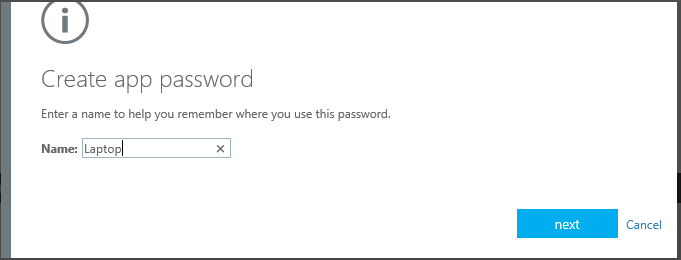

### Federated (SSO) App Passwords
Azure AD supports federation with on-premises Windows Server Active Directory Domain Services (AD DS). If your organization is federated(SSO) with Azure AD and you are going to be using Azure Multi-Factor Authentication, then the following is important information that you should be aware when using app passwords. This applies only to federated(SSO) customers.

- The App Password is verified by Azure AD and hence bypasses federation. Federation is only actively used when setting up App Password.
- For federated(SSO) users, we will never go to the Identity Provider (IdP) unlike the passive flow. The passwords will be stored in the organizational id. If the user leaves the company, that info has to flow to organizational id using DirSync in real time. Account disable/deletion may take up to 3 hours to sync, delaying disable/deletion of App Password in Azure AD.
- On-premises Client Access Control settings are not honored by App Password
- No on-premises authentication logging / auditing capability is available for App Password
- More end-user education is required for the Microsoft Lync 2013 client. For the required steps, see How to change the password in your email to the app password.
- Certain advanced architectural designs may require using a combination of organizational username and passwords and app passwords when using multi-factor authentication with clients, depending on where they authenticate. For clients that authenticate against an on-premise infrastructure, you would use an organizational username and password. For clients that authenticate against Azure AD, you would use the app password.

For example, suppose you have an architecture that consists of the following:

- You are federating your on-premise instance of Active Directory with Azure AD
- You are using Exchange online
- You are using Lync that is specifically on-premise
- You are using Azure Multi-Factor Authentication

 In these instances, you must do the following:

- When signing-in to Lync, use your organizations’ username and password.
- When attempting to access the address book via an Outlook client that connects to Exchange online, use an app password.

### Allowing app password creation
By default, users cannot create app passwords.  This feature must be enabled.  To allow users the ability to create app passwords use the following procedure.

#### To enable users to create app passwords

1. Sign-in to the Azure Management Portal.
2. On the left, click Active Directory.
3. Under, Directory click on the directory for the user you wish to enable.
4. At the top, click Users.
5. At the bottom of the page, click Manage Multi-Factor Auth. This will open the multi-factor authentication page.
6. At the top of the multi-factor authentication page, click Service Settings.
7. Ensure that the radio button next to Allow users to create app passwords to sign into non-browser applications is selected.

### Creating app passwords
Users can create app passwords during their initial registration.  They are given an option at the end of the registration process that allows them to create them.

Additionally users can also create app passwords later on by changing their settings in the Azure Portal, the Office 365 portal or by 

### To create app passwords in the Office 365 portal
--------------------------------------------------------------------------------

1. Sign-in to the Office 365 portal
2. In the top right corner select the settings widget
3. On the left, select Additional Security Verification
4. On the right, select **Update my phone numbers used for account security**
5. On the proofup page, at the top, select app passwords
6. Click **Create**
7. Enter a name for the app password and click **Next**
8. Copy the app password to the clipboard and paste it into your app.

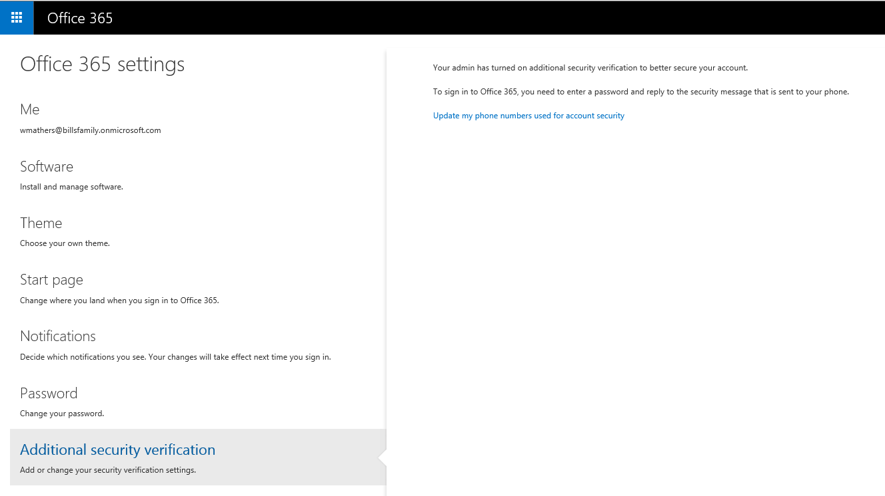

### To create app passwords in the Azure portal
--------------------------------------------------------------------------------
1. Sign-in to the Azure Management portal
3. At the top, right-click on your user name and select Additional Security Verification.
5. On the proofup page, at the top, select app passwords
6. Click **Create**
7. Enter a name for the app password and click **Next**
8. Copy the app password to the clipboard and paste it into your app.

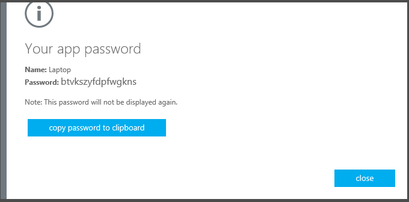

### To create app passwords if you do not have an Office 365 or Azure subscription
--------------------------------------------------------------------------------
1. Sign-in to [https://myapps.microsoft.com](https://myapps.microsoft.com)	
2. At the top, select profile.
3. Click on your user name and select Additional Security Verification.
5. On the proofup page, at the top, select app passwords
6. Click **Create**
7. Enter a name for the app password and click **Next**
8. Copy the app password to the clipboard and paste it into your app.

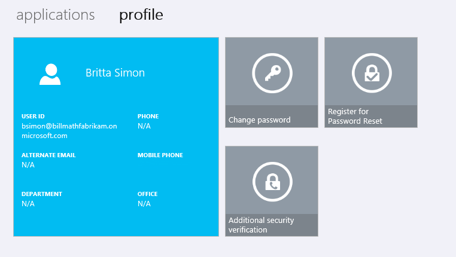

## Suspend Multi-Factor Authentication for remembered devices and browsers (Public Preview)

Suspending Multi-Factor Authentication for remembered devices and browsers is a feature that allows you to give users the option to suspend MFA for a set number of days after performing a successful sign-in using MFA. It is a free feature for all MFA users and enhances the usability for the users. However, since the users are allowed to suspend MFA, this feature may reduce account security. 

To ensure that the user accounts are secured, you should restore Multi-Factor Authentication for their devices for either of the following scenarios: 

- If their corporate account has become compromised
- If a remembered device is lost or stolen

> [AZURE.NOTE] This feature is implemented as a browser cookie cache. It will not work if your browser cookies are not enabled.

### How to enable/disable Suspend MFA for remembered devices and set

<ol>
<li>Sign-in to the Azure Management Portal.</li>
<li>On the left, click Active Directory.</li>
<li>Under Active Directory, click on the directory you wish to setup Suspend Multi-Factor Authentication for remembered devices on.</li>
<li>On the Directory you have selected, click Configure.</li>
<li>In the multi-factor authentication section, click Manage service settings.</li>
<li>On the Service Settings page, under manage user device settings, select/unselect the **Allow users to suspend multi-factor authentication by causing a device to be remembered**.</li>
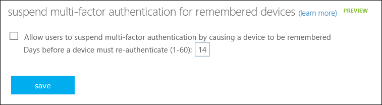
<li>Set the number of days that you want to allow the suspension. The default is 14 days.</li>
<li>Click save.</li>
<li>click close.</li>

