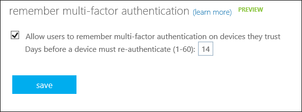
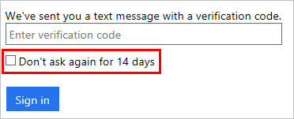

# Configure Azure Multi-Factor Authentication settings
This article helps you manage Azure Multi-Factor Authentication now that you are up and running.  It covers various topics that help you to get the most out of Azure Multi-Factor Authentication.  Not all these features are available in every version of Azure Multi-Factor Authentication.

| Feature | Description | 
|:--- |:--- |
| [Fraud alert](#fraud-alert) |Fraud alert can be configured and set up so that your users can report fraudulent attempts to access their resources. |
| [One-time bypass](#one-time-bypass) |A one-time bypass allows a user to authenticate a single time by "bypassing" multi-factor authentication. |
| [Custom Voice Messages](#custom-voice-messages) |Custom voice messages allow you to use your own recordings or greetings with multi-factor authentication. |
| [Caching](#caching-in-azure-multi-factor-authentication) |Caching allows you to set a specific time period so that subsequent authentication attempts succeed automatically. |
| [Trusted IPs](#trusted-ips) |Administrators of a managed or federated tenant can use Trusted IPs to bypass two-step verification for users that sign in from the company’s local intranet. |
| [App Passwords](#app-passwords) |An app password allows an application that is not MFA-aware to bypass multi-factor authentication and continue working. |
| [Remember Multi-Factor Authentication for remembered devices and browsers](#remember-multi-factor-authentication-for-devices-that-users-trust) |Allows you to remember devices for a set number of days after a user has successfully signed in using MFA. |
| [Selectable Verification Methods](#selectable-verification-methods) |Allows you to choose the authentication methods that are available for users to use. |

## Access the Azure MFA Management Portal

The features covered in this article are configured in the Azure Multi-Factor Authentication Management Portal. There are two ways to access the MFA management portal through the Azure classic portal. The first is by managing a Multi-Factor Auth Provider. The second is via the MFA service settings. 

### Use an Auth Provider

If you use a Multi-Factor Auth Provider for consumption-based MFA, use this method to access the management portal.

To access the MFA Management Portal via an Azure Multi-Factor Auth Provider, sign into the Azure classic portal as an administrator and select the Active Directory option. Click the **Multi-Factor Auth Providers** tab, then select your directory and click the **Manage** button at the bottom.

### Use the MFA Service Settings page 

If you have a Multi-Factor Auth Provider or an Azure MFA, Azure AD Premium, or Enterprise Mobility + Security license, use this method to access the MFA service settings page .

To access the MFA Management Portal via the MFA Service Settings page, sign into the Azure classic portal as an administrator and select the Active Directory option. Click on your directory and then click the **Configure** tab. Under the multi-factor authentication section, select **Manage service settings**. At the bottom of the MFA Service Settings page, click the **Go to the portal** link.

## Fraud Alert
Fraud alert can be configured and set up so that your users can report fraudulent attempts to access their resources.  Users can report fraud either with the mobile app or through their phone.

### Set up fraud alert
1. Navigate to the MFA Management Portal per the instructions at the top of this page.
2. In the Azure Multi-Factor Authentication Management Portal, click **Settings** under the Configure section.
3. Under the Fraud Alert section of the Settings page, check the **Allow users to submit Fraud Alerts** checkbox.
4. Select **Save** to apply your changes. 

### Configuration options

- **Block user when fraud is reported** - If a user reports fraud, their account is blocked.
- **Code To Report Fraud During Initial Greeting** - Users normally press # to confirm two-step verification. If they want to report fraud, they enter a code before pressing #. This code is **0** by default, but you can customize it.

> [!NOTE]
> Microsoft’s default voice greetings instruct users to press 0# to submit a fraud alert. If you want to use a code other than 0, you should record and upload your own custom voice greetings with appropriate instructions.

### How users report fraud 
Fraud alert can be reported two ways.  Either through the mobile app or through the phone.  

#### Report fraud with the mobile app
1. When a verification is sent to your phone, select it to open the Microsoft Authenticator app.
2. Select **Deny** on the notification. 
3. Select **Report fraud**.
4. Close the app.

#### Report fraud with a phone
1. When a verification call comes in to your phone, answer it.  
2. To report fraud, enter the fraud code (Default is 0) and then the # sign. You will be notified that a fraud alert has been submitted.
3. End the call.

### View fraud reports
1. Sign in to the [Azure classic portal](https://manage.windowsazure.com).
2. On the left, select Active Directory.
3. At the top select **Multi-Factor Auth Providers**. This brings up a list of your Multi-Factor Auth Providers.
4. Select your Multi-Factor Auth Provider and click **Manage** at the bottom of the page. The Azure Multi-Factor Authentication Management Portal opens.
5. On the Azure Multi-Factor Authentication Management Portal, under View A Report, click **Fraud Alert**.
6. Specify the date range that you wish to view in the report. You can also specify usernames, phone numbers, and the user's status.
7. Click **Run**. This brings up a report of fraud alerts. Click **Export to CSV** if you wish to export the report.

## One-time bypass
A one-time bypass allows a user to authenticate a single time without performing two-step verification. The bypass is temporary and expires after a specified number of seconds. In situations where the mobile app or phone is not receiving a notification or phone-call, you can enable a one-time bypass so the user can access the desired resource.

### Create a one-time bypass
1. Sign in to the [Azure classic portal](https://manage.windowsazure.com).
2. Navigate to the MFA Management Portal per the instructions at the top of this page.
3. In the Azure Multi-Factor Authentication Management Portal, if you see the name of your tenant or Azure MFA Provider on the left with a **+** next to it, click the **+** see different MFA Server replication groups and the Azure Default group. Select the appropriate group.
4. Under User Administration, select **One-Time Bypass**.
5. On the One-Time Bypass page, click **New One-Time Bypass**.

  

6. Enter the username, the number of seconds that the bypass will exist, and the reason for the bypass. Click **Bypass**.
7. The time limit goes into effect immediately, so the user needs to sign in before the one-time bypass expires. 

### View the one-time bypass report
1. Sign in to the [Azure classic portal](https://manage.windowsazure.com).
2. On the left, select Active Directory.
3. At the top select **Multi-Factor Auth Providers**. This brings up a list of your Multi-Factor Auth Providers.
4. Select your Multi-Factor Auth Provider and click **Manage** at the bottom of the page. The Azure Multi-Factor Authentication Management Portal opens.
5. On the Azure Multi-Factor Authentication Management Portal, on the left, under View A Report, click **One-Time Bypass**.
6. Specify the date range that you wish to view in the report. You can also specify usernames, phone numbers, and the user's status.
7. Click **Run**. This brings up a report of bypasses. Click **Export to CSV** if you wish to export the report.

## Custom voice messages
Custom voice messages allow you to use your own recordings or greetings for two-step verification. These can be used in addition to or to replace the Microsoft records.

Before you begin be aware of the following:

* The supported file formats are .wav and .mp3.
* The file size limit is 5 MB.
* Authentication messages should be shorter than 20 seconds. Anything longer than this could cause the verification to fail because the user may not respond before the message finishes, causing the verification to time out.

### Set up a custom message

There are two parts to creating your custom message. First, you upload the message, and then you turn it on for your users.

To upload your custom message:

1. Create a custom voice message using one of the supported file formats.
2. Sign in to the [Azure classic portal](https://manage.windowsazure.com).
3. Navigate to the MFA Management Portal per the instructions at the top of this page.
4. In the Azure Multi-Factor Authentication Management Portal, click **Voice Messages** under the Configure section.
5. On the Configure: Voice Messages page, click **New Voice Message**.
   
6. On the Configure: New Voice Messages page, click **Manage Sound Files**.
   
7. On the Configure: Sound Files page, click **Upload Sound File**.
   
8. On the Configure: Upload Sound File, click **Browse** and navigate to your voice message, click **Open**.
9. Add a Description and click **Upload**.
10. Once this completes, a message confirms that you have successfully uploaded the file.

To turn the message on for your users:

1. On the left, click **Voice Messages**.
2. Under the Voice Messages section, click **New Voice Message**.
3. From the Language drop-down, select a language.
4. If this message is for a specific application, specify it in the Application box.
5. From the Message Type drop-down, select the message type to be overridden with your new custom message.
6. From the Sound File drop-down, select the sound file that you uploaded in the first part.
7. Click **Create**. A message confirms that you have successfully created a voice message.
    

## Caching in Azure Multi-Factor Authentication
Caching allows you to set a specific time period so that subsequent authentication attempts within that time period succeed automatically. This is primarily used when on-premises systems such as VPN send multiple verification requests while the first request is still in progress. This allows the subsequent requests to succeed automatically after the user succeeds the first verification in progress. 

Caching is not intended to be used for sign-ins to Azure AD.

### Set up caching 
1. Sign in to the [Azure classic portal](https://manage.windowsazure.com).
2. Navigate to the MFA Management Portal per the instructions at the top of this page.
3. In the Azure Multi-Factor Authentication Management Portal, click **Caching** under the Configure section.
4. On the Configure caching page click **New Cache**.
5. Select the Cache type and the cache seconds. Click **Create**.

## Trusted IPs
Trusted IPs is a feature of Azure MFA that administrators of a managed or federated tenant can use to bypass two-step verification for users that are signing in from the company’s local intranet. This feature is available with the full version of Azure Multi-Factor Authentication, not the free version for administrators. For details on how to get the full version of Azure Multi-Factor Authentication, see [Azure Multi-Factor Authentication](multi-factor-authentication.md).

| Type of Azure AD Tenant | Available Trusted IP options |
|:--- |:--- |
| Managed |<li>Specific IP address ranges – Administrators can specify a range of IP addresses that can bypass two-step verification for users that are signing in from the company’s intranet.</li> |
| Federated |<li>All Federated Users - All federated users who are signing in from inside the organization will bypass two-step verification using a claim issued by AD FS.</li> <li>Specific IP address ranges – Administrators can specify a range of IP addresses that can bypass two-step verification for users that are signing in from the company’s intranet. |

This bypass only works from inside a company’s intranet. For example, if you selected all federated users, and a user signs in from outside the company’s intranet, that user has to authenticate using two-step verification even if the user presents an AD FS claim. 

**End-user experience inside corpnet:**

When Trusted IPs is disabled, two-step verification is required for browser flows, and app passwords are required for older rich client apps. 

When Trusted IPs is enabled, two-step verification is *not* required for browser flows, and app passwords are *not* required for older rich client apps, provided that the user hasn't already created an app password. Once an app password is in use, it remains required. 

**End-user experience outside corpnet:**

Whether Trusted IPs is enabled or not, two-step verification is required for browser flows, and app passwords are required for older rich client apps. 

### To enable Trusted IPs
1. Sign in to the [Azure classic portal](https://manage.windowsazure.com).
2. Navigate to the MFA Service Settings page per the instructions at the beginning of this article.
3. On the Service Settings page, under Trusted IPs, you have two options:
   
   * **For requests from federated users originating from my intranet** – Check the box. All federated users who are signing in from the corporate network will bypass two-step verification using a claim issued by AD FS.
   * **For requests from a specific range of public IPs** – Enter the IP addresses in the text box provided using CIDR notation. For example: xxx.xxx.xxx.0/24 for IP addresses in the range xxx.xxx.xxx.1 – xxx.xxx.xxx.254, or xxx.xxx.xxx.xxx/32 for a single IP address. You can enter up to 50 IP address ranges. Users who sign in from these IP addresses bypass two-step verification.
4. Click **Save**.
5. Once the updates have been applied, click **Close**.

## App Passwords
Some apps, like Office 2010 or older and Apple Mail, don't support two-step verification. They aren't configured to accept a second verification. To use these apps, you need to use "app passwords" in place of your traditional password. The app password allows the application to bypass two-step verification and continue working.

> [!NOTE]
> Modern Authentication for the Office 2013 Clients
> 
> Office 2013 clients (including Outlook) and newer support modern authentication protocols and can be enabled to work with two-step verification. Once enabled, app passwords are not required for these clients.  For more information, see [Office 2013 modern authentication public preview announced](https://blogs.office.com/2015/03/23/office-2013-modern-authentication-public-preview-announced/).

### Important things to know about app passwords
The following is an important list of things that you should know about app passwords.

* App passwords should only need to be entered once per app. Users don't have to keep track of them and enter them every time.
* The actual password is automatically generated and is not supplied by the user. This is because the automatically generated password is harder for an attacker to guess and is more secure.
* There is a limit of 40 passwords per user. 
* Apps which cache passwords and use it in on-premises scenarios might start failing since the app password isn't known outside of the organizational id. An example is Exchange emails that are on-premises but the archived mail is in the cloud. The same password doesn't work.
* Once multi-factor authentication is enabled on a user's account, app passwords can be used with most non-browser clients such as Outlook and Lync, but administrative actions cannot be performed using app passwords through non-browser applications such as Windows PowerShell even if that user has an administrative account.  Ensure you create a service account with a strong password to run PowerShell scripts and do not enable that account for two-step verification.

> [!WARNING]
> App passwords don't work in hybrid environments where clients communicate with both on-premises and cloud autodiscover endpoints. This is because domain passwords are required to authenticate on-premises and app passwords are required to authenticate with the cloud.

### Naming Guidance for App Passwords
App password names should reflect the device on which they are used. For instance, if you have a laptop that has non-browser apps such as Outlook, Word, and Excel, create one app password named Laptop and use that app password in these applications. Then, create another app password named Desktop for the same applications on your desktop computer. 

Microsoft recommends creating one app password per device, not one app password per application.

### Federated (SSO) App Passwords
Azure AD supports federation (single sign-on) with on-premises Windows Server Active Directory Domain Services (AD DS). If your organization is federated with Azure AD and you are going to be using Azure Multi-Factor Authentication, then the following information about app passwords is important for you. This section only applies to federated (SSO) customers.

* App passwords are verified by Azure AD and therefore bypass federation. Federation is only actively used when setting up app passwords.
* For federated (SSO) users, we never go to the Identity Provider (IdP) unlike the passive flow. The passwords are stored in the organizational id. If the user leaves the company, that info has to flow to organizational id using DirSync in real time. Account disable/deletion may take up to three hours to sync, delaying disable/deletion of App Password in Azure AD.
* On-premises Client Access Control settings are not honored by App Password.
* No on-premises authentication logging/auditing capability is available for App Password.
* Certain advanced architectural designs may require a combination of organizational username and passwords and app passwords when using two-step verification with clients, depending on where they authenticate. For clients that authenticate against an on-premise infrastructure, you would use an organizational username and password. For clients that authenticate against Azure AD, you would use the app password.

  For example, suppose you have an architecture that consists of the following:

  * You are federating your on-premise instance of Active Directory with Azure AD
  * You are using Exchange online
  * You are using Lync that is specifically on-premise
  * You are using Azure Multi-Factor Authentication

  

  In these instances, you must do the following:

  * When signing-in to Lync, use your organizations’ username and password.
  * When attempting to access the address book via an Outlook client that connects to Exchange online, use an app password.

### Allow app password creation
By default, users cannot create app passwords. This feature must be enabled. To allow users the ability to create app passwords, use the following procedure:

1. Sign in to the [Azure classic portal](https://manage.windowsazure.com).
2. Navigate to the MFA Service Settings page per the instructions at the beginning of this article.
3. Select the radio button next to **Allow users to create app passwords to sign into non-browser apps**.

### Create app passwords
Users can create app passwords during their initial registration. They are given an option at the end of the registration process that allows them to create app passwords.

Users can also create app passwords after registration by changing their settings in the Azure portal or the Office 365 portal. For more information and detailed steps for your users, see [What are app passwords in Azure Multi-Factor Authentication](./end-user/multi-factor-authentication-end-user-app-passwords.md).

## Remember Multi-Factor Authentication for devices that users trust
Remembering Multi-Factor Authentication for devices and browsers that users trust is a free feature for all MFA users. It allows you to give users the option to by-pass MFA for a set number of days after performing a successful sign-in using MFA. This can enhance usability by minimizing the number of times a user may perform two-step verification on the same device.

However, if an account or device is compromised, remembering MFA for trusted devices may affect security. If a corporate account becomes compromised or a trusted device is lost or stolen, you should [restore Multi-Factor Authentication on all devices](multi-factor-authentication-manage-users-and-devices.md#restore-mfa-on-all-remembered-devices-for-a-user). This action revokes the trusted status from all devices, and the user is required to perform two-step verification again. You can also instruct your users to restore MFA on their own devices with the instructions in [Manage your settings for two-step verification](./end-user/multi-factor-authentication-end-user-manage-settings.md#require-two-step-verification-again-on-a-device-youve-marked-as-trusted)

### How it works

Remembering Multi-Factor Authentication works by setting a persistent cookie on the browser when a user checks the "Don't ask again for **X** days" box at sign-in. The user won't be prompted for MFA again from that broswer until the cookie expires. If the user opens a different browser on the same device or clears their cookies, they are prompted to verify again. 

The "Don't ask again for **X** days" checkbox isn't shown on non-browser apps, whether or not they support modern authentication. These apps use refresh tokens that provide new access tokens every hour. When a refresh token is validated, Azure AD checks that the last time two-step verification was performed was within the configured number of days. 

Therefore, remembering MFA on trusted devices reduces the number of authentications on web apps (which normally prompt every time) but increases the number of authentications for modern-auth clients (which normally prompt every 90 days).

> [!NOTE]
>This feature is not compatible with the "Keep me signed in" feature of AD FS when users perform two-step verification for AD FS through the Azure MFA Server or a third-party MFA solution. If your users select "Keep me signed in" on AD FS and also mark their device as trusted for MFA, they won't be able to verify after the "Remember MFA" number of days expires. Azure AD requests a fresh two-step verification, but AD FS returns a token with the original MFA claim and date instead of performing two-step verification again. This sets off a verification loop between Azure AD and AD FS. 

### Enable Remember multi-factor authentication
1. Sign in to the [Azure classic portal](https://manage.windowsazure.com).
2. Navigate to the MFA Service Settings page per the instructions at the beginning of this article.
3. On the Service Settings page, under manage user device settings, check the **Allow users to remember multi-factor authentication on devices they trust** box.
   
4. Set the number of days that you want to allow the trusted devices to bypass two-step verification. The default is 14 days.
5. Click **Save**.
6. Click **Close**.

### Mark a device as trusted

Once you enable this feature, users can mark a device as trusted when they sign in by checking **Don't ask again**.

## Selectable Verification Methods
You can choose which verification methods are available for your users. The table below provides a brief overview of each method.

When your users enroll their accounts for MFA, they choose their preferred verification method out of the options that you enabled. The guidance for their enrollment process is covered in [Set up my account for two-step verification](multi-factor-authentication-end-user-first-time.md)

| Method | Description |
|:--- |:--- |
| Call to phone |Places an automated voice call. The user answers the call and presses # in the phone keypad to authenticate. This phone number is not synchronized to on-premises Active Directory. |
| Text message to phone |Sends a text message containing a verification code. The user is prompted to either reply to the text message with the verification code or to enter the verification code into the sign-in interface. |
| Notification through mobile app |Sends a push notification to your phone or registered device. The user views the notification and selects **Verify** to complete verification.  The Microsoft Authenticator app is available for [Windows Phone](http://go.microsoft.com/fwlink/?Linkid=825071), [Android](http://go.microsoft.com/fwlink/?Linkid=825072), and [IOS](http://go.microsoft.com/fwlink/?Linkid=825073). |
| Verification code from mobile app |The Microsoft Authenticator app generates a new OATH verification code every thirty seconds. The user enters this verification code into the sign-in interface. The Microsoft Authenticator app is available for [Windows Phone](http://go.microsoft.com/fwlink/?Linkid=825071), [Android](http://go.microsoft.com/fwlink/?Linkid=825072), and [IOS](http://go.microsoft.com/fwlink/?Linkid=825073). |

### How to enable/disable authentication methods
1. Sign in to the [Azure classic portal](https://manage.windowsazure.com).
2. Navigate to the MFA Service Settings page per the instructions at the beginning of this article.
3. On the Service Settings page, under verification options, select/unselect the options you wish to use.
   
4. Click **Save**.
5. Click **Close**.

