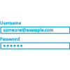
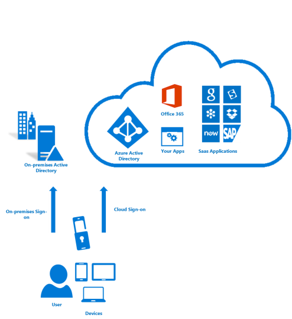

<properties 
	pageTitle="Azure Multi-Factor Authentication - What is It?" 
	description="Azure Multi-factor authentication is a method of verifying who you are that requires the use of more than just a username and password. It provides an additional layer of security to user sign-ins and transactions." 
	services="multi-factor-authentication" 
	documentationCenter="" 
	authors="billmath" 
	manager="stevenpo" 
	editor="curtland"/>

<tags 
	ms.service="multi-factor-authentication" 
	ms.workload="identity" 
	ms.tgt_pltfrm="na" 
	ms.devlang="na" 
	ms.topic="article" 
	ms.date="08/24/2015" 
	ms.author="billmath"/>

# What is Azure Multi-Factor Authentication?
Multi-factor authentication (MFA) is a method of authentication that requires the use of more than one verification method and adds a critical second layer of security to user sign-ins and transactions. It works by requiring any two or more of the following verification methods:

- Something you know (typically a password)
- Something you have (a trusted device that is not easily duplicated, like a phone)
- Something you are (biometrics)

 &nbsp;&nbsp;&nbsp;&nbsp;&nbsp; &nbsp;&nbsp;&nbsp;&nbsp;&nbsp; &nbsp;&nbsp;&nbsp;&nbsp;&nbsp; &nbsp;&nbsp;&nbsp;&nbsp;&nbsp; &nbsp;&nbsp;&nbsp;&nbsp;&nbsp;

Azure Multi-factor authentication is a method of verifying who you are that requires the use of more than just a username and password. It provides a second layer of security to user sign-ins and transactions.   

Azure Multi-Factor Authentication helps safeguard access to data and applications while meeting user demand for a simple sign-in process. It delivers strong authentication via a range of easy verification options—phone call, text message, or mobile app notification or verification code and 3rd party OATH tokens.

For an overview of how Azure Multi-Factor Authentication works see the following video.

[AZURE.VIDEO multi-factor-authentication-overview]

##Why use Azure Multi-Factor Authentication?

Today, now more than ever, people are increasingly connected.  With smart phones, tablets, laptops, and PCs, people have several different options on how they are going to connect and stay connected at any time.  People can access their accounts and applications from anywhere and this means that they can get more work done and serve their customers better.

Azure Multi-Factor Authentication is an easy to use, scalable, and reliable solution that provides a second method of authentication so your users are always protected. 

| | |
:-------------: | :-------------: | :-------------: | :-------------: |
**Easy to use**|**Scalable**|**Always Protected**|**Reliable**

- **Easy to Use** - Azure Multi-Factor Authenticaton is simple to setup and use.  The additional protection that comes with Azure Multi-Factor Authentication allows users to use and manage their own devices and, in many instances, it can be setup with just a few simple clicks.
- **Scalable** - Azure Multi-Factor Authenticaton utilizes the power of the cloud and integrates with your on-premises AD and custom apps.  This protection is even extended to your high volume mission critical scenarios.
- **Always Protected** - Azure Multi-Factor Authentication provides strong authentication using the highest industry standards.
- **Reliable** - We guarantee 99.9% availability of Azure Multi-Factor Authentication. The service is considered unavailable when it is unable to receive or process authentication requests for the multi-factor authentication.  

For additional information on why use Azure Multi-Factor Authentication see the following video.

[AZURE.VIDEO windows-azure-multi-factor-authentication]

## How Azure Multi-Factor Authentication works

The security of multi-factor authentication lies in its layered approach. Compromising multiple authentication factors presents a significant challenge for attackers. Even if an attacker manages to learn the user's password, it is useless without also having possession of the trusted device. Should the user lose the device, the person who finds it won't be able to use it unless he or she also knows the user's password.

Azure Multi-Factor Authentication helps safeguard access to data and applications while meeting user demand for a simple sign-in process.  It provides additional security by requiring a second form of authentication and delivers strong authentication via a range of easy verification options:

- phone call 
- text message
- mobile app notification—allowing users to choose the method they prefer
- mobile app verification code
- 3rd party OATH tokens

For additional information oh how it works see the following video.

[AZURE.VIDEO multi-factor-authentication-deep-dive-securing-access-on-premises]

## Methods available for multi-factor authentication
When a user signs in, an additional verification is sent to the user.  The following are a list of methods that can be used for this second verification. 

Verification Method  | Description 
------------- | ------------- |
Phone Call | A call is placed to a user’s smart phone asking them to verify that they are signing in by pressing the # sign.  This will complete the verification process.  This option is configurable and can be changed to a code that you specify.
Text Message | A text message will be sent to a user’s smart phone with a 6 digit code.  Enter this code in to complete the verification process.
Mobile App Notification | A verification request will be sent to a user’s smart phone asking them complete the verification by selecting Verify from the mobile app. This will occur if you selected app notification as your primary verification method.  If they receive this when they are not signing in, they can choose to report it as fraud.
Verification code with Mobile App | A verification code will be sent to the mobile app that is running on a user’s smart phone.  This will occur if you selected a verification code as your primary verification method.

## Available versions of Azure Multi-Factor Authentication
Azure Multi-Factor Authentication is available in three different versions.  The table below describes each of these in more detail.

Version  | Description 
------------- | ------------- |
Multi-Factor Authentication for Office 365 | This version works exclusively with Office 365 applications and is managed from the Office 365 portal. So administrators can now help secure their Office 365 resources by using multi-factor authentication.  This version comes with an Office 365 subscription.
Multi-Factor Authentication for Azure Administrators | The same subset of Multi-Factor Authentication capabilities for Office 365 will be available at no cost to all Azure administrators. Every administrative account of a Azure subscription can now get additional protection by enabling this core multi-factor authentication functionality. So an administrator that wants to access Azure portal to create a VM, a web site, manage storage, mobile services or any other Azure Service can add multi-factor authentication to his administrator account.
Azure Multi-Factor Authentication | Azure Multi-Factor Authentication offers the richest set of capabilities.  It provides additional configuration options via the Azure Management portal, advanced reporting, and support for a range of on-premises and cloud applications.  Azure Multi-Factor Authentication comes as part of Azure Active Directory Premium.

## Feature comparison of versions
The following table below provides a list of the features that are available in the various versions of Azure Multi-Factor Authentication.

Feature  | Multi-Factor Authentication for Office 365 (included in Office 365 SKUs)|Multi-Factor Authentication for Azure Administrators (included with Azure subscription) | Azure Multi-Factor Authentication (included in Azure AD Premium and Enterprise Mobility Suite) 
------------- | :-------------: |:-------------: |:-------------: |
Administrators can protect accounts with MFA| * | * (Available only for Azure Administrator accounts)|*
Mobile app as a second factor|* | * | *
Phone call as a second factor|* | * | *
SMS as a second factor|* | * | *
App passwords for clients that don't support MFA|* | * | *
Admin control over authentication methods| | | *
PIN mode| | | *
Fraud alert| | | *
MFA Reports| | | *
One-Time Bypass| | | *
Custom greetings for phone calls| | | *
Customization of caller ID for phone calls| | | *
Event Confirmation| | | *
Trusted IPs| | | *
Suspend MFA for remembered devices (Public Preview)| | | *
MFA SDK| | | *
MFA for on-premises applications using MFA server| | | *

## How to get Azure Multi-Factor Authentication

Azure Multi-Factor Authentication comes as part of Azure Active Directory Premium and the Enterprise Mobility Suite.  If you already have these then you have Azure Multi-Factor Authentication.

If you are an Office 365 users or an Azure subscriber and want to take advantage of the additional features provide by Azure Multi-Factor Authentication then continue reading.

If you do not have any of the above, then to begin using Azure Multi-Factor Authentication, you first need an Azure subscription or an [Azure trial subscription](http://azure.microsoft.com/pricing/free-trial/). 

When using Azure Multi-Factor Authentication there are two billing options available:

- **Per User**. Generally for enterprises that want to enable multi-factor authentication for a fixed number of employees who regularly need authentication.
- **Per Authentication**. Generally for enterprises that want to enable multi-factor authentication for a large group of external users who infrequently need authentication.

For pricing details see [Azure MFA Pricing.](http://azure.microsoft.com/pricing/details/multi-factor-authentication/)

Choose the model that works best for your organization.  Then to get started see [Getting Started](multi-factor-authentication-get-started.md)

## Choose the multi-factor security solution for you

Because there are several flavors of Azure Multi-Factor Authentication we must determine a couple of things in order to figure out which version is the proper one to use.  Those things are:

-	[What am I trying to secure](#what-am-i-trying-to-secure)
-	[Where are the users located](#where-are-the-users-located)

The following sections will provide guidance on determining each of these.

### What am I trying to secure?

In order to determine the correct multi-factor authentication solution, first we must answer the question of what are you trying to secure with a second method of authentication.  Is it an application that is in Azure?  Or is it a remote access system for example.  By determining what we are trying to secure, we will see to answer the question of where multi-factor authentication needs to be enabled.  

What are you trying to secure| Multi-Factor Authentication in the cloud|Multi-Factor Authentication Server 
------------- | :-------------: | :-------------: |
First party Microsoft apps|* |* |
Saas apps in the app gallery|* |* |
IIS applications published through Azure AD App Proxy|* |* |
IIS applications not published through Azure AD App Proxy | |* |
Remote access such as VPN, RDG| |* |

### Where are the users located

Next, depending on where are users are located, we can determine the correct solution to use, whether it is mutli-factor authentication in the cloud or on-premises using the MFA Server.

User Location| Solution
------------- | :------------- | 
Azure Active Directory| Multi-Factor Authentication in the cloud|
Azure AD and on-premises AD using federation with AD FS| Both MFA in the cloud and MFA Server are available options 
Azure AD and on-premises AD using DirSync, Azure AD Sync, Azure AD Connect - no password sync|Both MFA in the cloud and MFA Server are available options 
Azure AD and on-premises AD using DirSync, Azure AD Sync, Azure AD Connect - with password sync|Multi-Factor Authentication in the cloud
On-premises Active Directory|Multi-Factor Authentication Server

The following table is a comparison of the features that are a with Multi-Factor Authentication in the cloud and with the Multi-Factor Authentication Server.

 | Multi-Factor Authentication in the cloud | Multi-Factor Authentication Server
------------- | :-------------: | :-------------: |
Mobile app notification as a second factor | ● | ● |
Mobile app verification code as a second factor | ● | ●
Phone call as second factor | ● | ● 
One-way SMS as second factor | ● | ●
Two-way SMS as second factor |  | ● 
Hardware Tokens as second factor |  | ● 
App passwords for clients that don’t support MFA | ● |  
Admin control over authentication methods |  | ● 
PIN mode |  | ●
Fraud alert | ● | ●
MFA Reports | ● | ● 
One-Time Bypass | ● | ● 
Custom greetings for phone calls | ● | ● 
Customizable caller ID for phone calls | ● | ● 
Trusted IPs | ● | ● 
Suspend MFA for remembered devices (Public Preview) | ● |  
Conditional access | ● | ● 
Cache | ● | ● 

Now that we have determined whether to use cloud multi-factor authentication or the MFA Server on-premises, we can get started setting up and using Azure Multi-Factor Authentication.   **Select the icon that represents your scenario!**

  &nbsp;&nbsp;&nbsp;&nbsp;&nbsp;&nbsp;&nbsp;&nbsp;&nbsp;&nbsp;&nbsp;&nbsp;&nbsp;&nbsp;&nbsp;&nbsp;&nbsp;&nbsp;&nbsp;&nbsp;&nbsp;&nbsp;&nbsp;&nbsp;&nbsp; &nbsp;&nbsp;&nbsp;&nbsp;&nbsp;

