# Integrate your VPN infrastructure with Azure Multi-Factor Authentication (MFA) using the Network Policy Server (NPS) extension for Azure

## Overview

The Network Policy Service (NPS) extension for Azure allows organizations to safeguard Remote Authentication Dial-In User Service (RADIUS) client authentication using cloud-based [Azure Multi-Factor Authentication (MFA)](multi-factor-authentication-get-started-server-rdg.md), which provides two-step verification.

This article provides instructions for integrating the NPS infrastructure with Azure MFA using the NPS extension for Azure to enable secure two-step verification for users attempting to connect to your network using a VPN. 

The Network Policy and Access Services (NPS) gives organizations the following abilities:

* Specify central locations for the management and control of network requests to specify who can connect, what times of day connections are allowed, the duration of connections, and the level of security that clients must use to connect, and so on. Rather than specify these policies on each VPN or Remote Desktop (RD) Gateway server, these policies can be specified once in a central location. The RADIUS protocol is used to provide the centralized Authentication, Authorization, and Accounting (AAA). 
* Establish and enforce Network Access Protection (NAP) client health policies that determine whether devices are granted unrestricted or restricted access to network resources.
* Provide a means to enforce authentication and authorization for access to 802.1x-capable wireless access points and Ethernet switches.    

For more information, see [Network Policy Server (NPS)](https://docs.microsoft.com/windows-server/networking/technologies/nps/nps-top). 

To enhance security and provide high level of compliance, organizations can integrate NPS with Azure MFA to ensure that users use two-step verification to be able connect to the virtual port on the VPN server. For users to be granted access, they must provide their username/password combination with information that the user has in their control. This information must be trusted and not easily duplicated, such as a cell phone number, landline number, application on a mobile device, and so on.

Prior to the availability of the NPS extension for Azure, customers who wished to implement two-step verification for integrated NPS and Azure MFA environments had to configure and maintain a separate MFA Server in the on-premises environment as documented in Remote Desktop Gateway and Azure Multi-Factor Authentication Server using RADIUS.

The availability of the NPS extension for Azure now gives organizations the choice to deploy either an on-premises based MFA solution or a cloud-based MFA solution to secure RADIUS client authentication.
 
## Authentication Flow
When a user connects to a virtual port on a VPN server, they must first authenticate using a variety of protocols, which allow the use of a combination of user name/password and certificate-based authentication methods. 

In addition to authenticating and verifying identity, users must have the appropriate dial-in permissions. In simple implementations, these dial-in permissions that allow access are set directly on the Active Directory user objects. 

 

For simple implementations, each VPN server grants or denies access based on policies defined on each local VPN server.

In larger and more scalable implementations, the polices that grant or deny VPN access are centralized on RADIUS servers. In this case, the VPN server acts as an access server (RADIUS client) that forwards connection requests and account messages to a RADIUS server. To connect to the virtual port on the VPN server, users must be authenticated and meet the conditions defined centrally on RADIUS servers. 

When the NPS extension for Azure is integrated with the NPS, the successful authentication flow is as follows:

1. The VPN server receives an authentication request from a VPN user that includes the username and password to connect to a resource, such as a Remote Desktop session. 
2. Acting as a RADIUS client, VPN server converts the request to a RADIUS Access-Request message and sends the message (password is encrypted) to the RADIUS (NPS) server where the NPS extension is installed. 
3. The username and password combination is verified in Active Directory. If the username / password is incorrect, the RADIUS Server sends an Access-Reject message. 
4. If all conditions as specified in the NPS Connection Request and Network Policies are met (for example, time of day or group membership restrictions), the NPS extension triggers a request for secondary authentication with Azure MFA. 
5. Azure MFA communicates with Azure Active Directory, retrieves the user’s details, and performs the secondary authentication using the method configured by the user (text message, mobile app, and so on). 
6. Upon success of the MFA challenge, Azure MFA communicates the result to the NPS extension.
7. After the connection attempt is both authenticated and authorized, the NPS server where the extension is installed sends a RADIUS Access-Accept message to the VPN server (RADIUS client).
8. The user is granted access to the virtual port on VPN server and establishes an encrypted VPN tunnel.

## Prerequisites
This section details the prerequisites necessary before integrating Azure MFA with the Remote Desktop Gateway. Before you begin, you must have the following prerequisites in place.

* VPN infrastructure
* Network Policy and Access Services (NPS) role
* Azure MFA License
* Windows Server software
* Libraries
* Azure AD synched with on-premises AD 
* Azure Active Directory GUID ID

### VPN infrastructure
This article assumes that you have a working VPN infrastructure using Microsoft Windows Server 2016 in place and that the VPN server is currently not configured to forward connection requests to a RADIUS server. You will configure the VPN infrastructure to use a central RADIUS server in this guide.

If you do not have a working infrastructure in place, you can quickly create this infrastructure by following the guidance provided in numerous VPN setup tutorials you can find on the Microsoft and third-party sites. 

### Network Policy and Access Services (NPS) role

The NPS role service provides the RADIUS server and client functionality. This article assumes you have installed the NPS role on a member server or domain controller in your environment. You will configure RADIUS for a VPN configuration in this guide. Install the NPS role on a server _other_ than your VPN server.

For information on installing the NPS role service Windows Server 2012 or higher, see [Install a NAP Health Policy Server](https://technet.microsoft.com/library/dd296890.aspx). Network Access Policy (NAP) is deprecated in Windows Server 2016. For a description of best practices for NPS, including the recommendation to install NPS on a domain controller, see [Best Practices for NPS](https://technet.microsoft.com/library/cc771746).

### Licenses

Required is a license for Azure MFA, which is available through an Azure AD Premium, Enterprise Mobility plus Security (EMS), or an MFA subscription. For more information, see [How to get Azure Multi-Factor Authentication](multi-factor-authentication-versions-plans.md). For testing purposes, you can use a trial subscription.

### Software

The NPS extension requires Windows Server 2008 R2 SP1 or above with the NPS role service installed. All the steps in this guide were performed using Windows Server 2016.

### Libraries

The following two libraries are required:

* [Visual C++ Redistributable Packages for Visual Studio 2013 (X64)](https://www.microsoft.com/download/details.aspx?id=40784)
* _Microsoft Azure Active Directory Module for Windows PowerShell version 1.1.166.0_ or higher. For the latest release and installation instructions, see [Microsoft Azure Active Directory PowerShell Module Version Release History](https://social.technet.microsoft.com/wiki/contents/articles/28552.microsoft-azure-active-directory-powershell-module-version-release-history.aspx).

These libraries are not packaged with the NPS extension setup files (version 0.9.1.2), despite existing documentation that states otherwise. At a minimum, you must install the Visual C++ Redistributable Packages for Visual Studio 2013. 
The Microsoft Azure Active Directory Module for Windows PowerShell is installed, if it is not already present, through a configuration script you run as part of the setup process. There is no need to install this module ahead of time if it is not already installed.

### Azure Active Directory synched with on-premises Active Directory 

To use the NPS extension, on-premises users must be synced with Azure Active Directory and enabled for Multi-Factor Authentication. This guide assumes that on-premises users are synched with Azure Active Directory using AD Connect. Instructions for enabling users for MFA are provided below.
For information on Azure AD connect, see [Integrate your on-premises directories with Azure Active Directory](../active-directory/connect/active-directory-aadconnect.md). 

### Azure Active Directory GUID ID 
To install the NPS, you need to know the GUID of the Azure Active Directory. Instructions for finding the GUID of the Azure Active Directory are provided in the next section.

## Configure RADIUS for VPN connections

If you have installed the NPS server role on a member server, you need to configure to authenticate and authorize VPN client that request VPN connections. 

This section assumes that you have installed the Network Policy Server role but have not configured it for use in your infrastructure.

>[!NOTE]
>If you already have a working VPN server that uses a centralized RADIUS server for authentication, you can skip this section.
>

### Register Server in Active Directory
To function properly in this scenario, the NPS server needs to be registered in Active Directory.

1. Open Server Manager.
2. In Server Manager, click **Tools**, and then click **Network Policy Server**. 
3. In the Network Policy Server console, right-click **NPS (Local)**, and then click **Register server in Active Directory**. Click **OK** two times.

 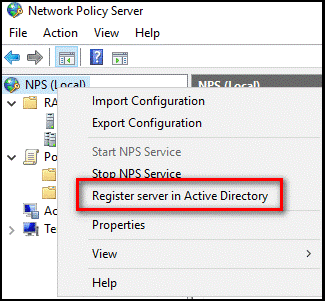

4. Leave the console open for the next procedure.

### Use wizard to configure RADIUS server
You can use a standard (wizard-based) or advanced configuration option to configure the RADIUS server. This section assumes the use of the wizard-based standard configuration option.

1. In the Network Policy Server console, click **NPS (Local)**.
2. Under Standard Configuration, select **RADIUS Server for Dial-Up or VPN Connections**, and then click **Configure VPN or Dial-Up**.

 

3. On the Select Dial-up or Virtual Private Network Connections Type page, select **Virtual Private Network Connections**, and click **Next**.

 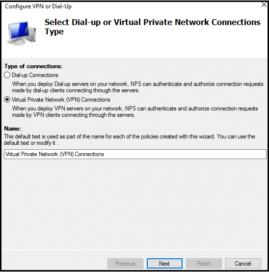

4. On the Specify Dial-Up or VPN Server page, click **Add**.
5. In the **New RADIUS client** dialog box, provide a friendly name, enter the resolvable name or IP address of the VPN server, and enter a shared secret password. Make this shared secret password long and complex. Record this password, as you need it for steps in the next section.

 

6. Click **OK**, and then **Next**.
7. On the **Configure Authentication Methods** page, accept the default selection (Microsoft Encrypted Authentication version 2 (MS-CHAPv2) or choose another option, and click **Next**.

  >[!NOTE]
  >If you configure Extensible Authentication Protocol (EAP), you must use either MS CHAPv2 or PEAP. No other EAP is supported.
 
8. On the Specify User Groups page, click **Add** and select an appropriate group, if one exists. Otherwise, leave the selection blank to grant access to all users.

 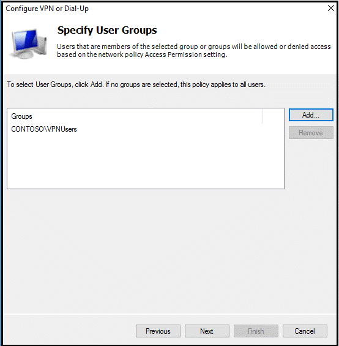

9. Click **Next**.
10. On the Specify IP Filters page, click **Next**.
11. On the Specify Encryption Settings page, accept the default settings, and click **Next**.

 

12.	On the Specify a Realm Name, leave the name blank, accept the default setting, and click **Next**.

 

13.	On the Completing New Dial-up or Virtual Private Network Connections and RADIUS clients page, click **Finish**.

 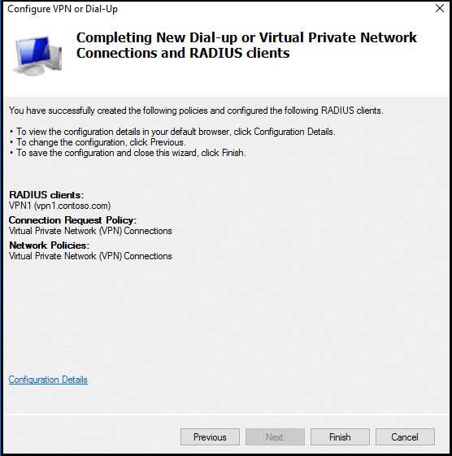

### Verify RADIUS configuration
This section details the configuration you created using the wizard.

1. On the NPS server, in the NPS (Local) console, expand RADIUS Clients, and select **RADIUS Clients**.
2. In the details pane, right-click the RADIUS client you created using wizard, and click **Properties**. The properties for your RADIUS client (the VPN server) should be similar to those shown below.

 

3. Click **Cancel**.
4. On the NPS server, in the NPS (Local) console, expand **Policies**, and select **Connection Request Policies**. You should see the VPN Connections policy that resembles the image below.

 

5. Under Policies, select **Network Policies**. You should a Virtual Private Network (VPN) Connections policy that resembles the image below.

 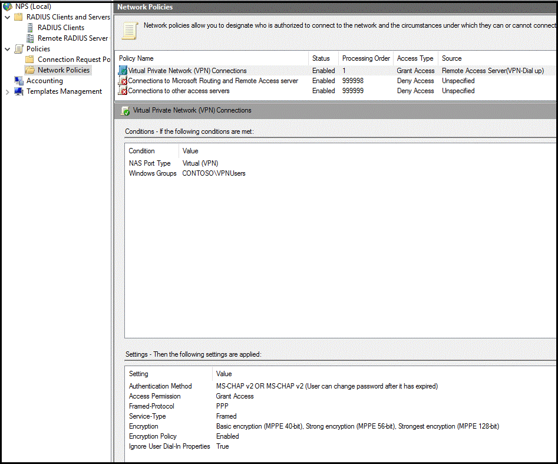

## Configure VPN Server to use RADIUS authentication
In this section, you configure the VPN server to use RADIUS authentication. This section assumes that you have a working configuration of VPN server but have not configured the VPN server to use RADIUS authentication. After configuring the VPN server, you confirm that your configuration is working as expected.

>[!NOTE]
>If you already have a working VPN server configuration that uses RADIUS authentication, you can skip this section.
>

### Configure authentication provider
1. On the VPN server, open Server Manager.
2. In Server Manager, click **Tools**, and then **Routing and Remote Access**.
3. In the Routing and Remote Access console, right-click **\[Server Name\] (local)**, and then click **Properties**.

 
 
4. In the **[Server Name} (local) Properties** dialog box, click the **Security** tab. 
5. On the **Security** tab, under Authentication provider, click **RADIUS Authentication**, and then **Configure**.

 
 
6. In the RADIUS Authentication dialog box, click **Add**.
7. In the Add RADIUS Server, in Server name, add the name or the IP address of the RADIUS server you configured in the previous section.
8. In Shared secret, click **Change** and add the shared secret password you created and recorded earlier.
9. In Time-out (seconds), change the value to a value between **30** and **60**. This is necessary to allow enough time to complete the second authentication factor.
 
 
 
10.	Click **OK** until you complete closing all dialog boxes.

### Test VPN connectivity
In this section, you confirm that the VPN client is authenticated and authorized by the RADIUS server when you attempt to connect to VPN virtual port. This section assumes you are using Windows 10 as a VPN client. 

>[!NOTE]
>If you already configured a VPN client to connect to the VPN server and have saved the settings, you can skip the steps related to configuring and saving a VPN connection object.
>

1. On your VPN client computer, click **Start**, and then **Settings** (gear icon).
2. In Window Settings, click **Network & Internet**.
3. Click **VPN**.
4. Click **Add a VPN connection**.
5. In Add a VPN connection, specify Windows (built-in) as the VPN provider, then complete the remaining fields, as appropriate, and click **Save**. 

 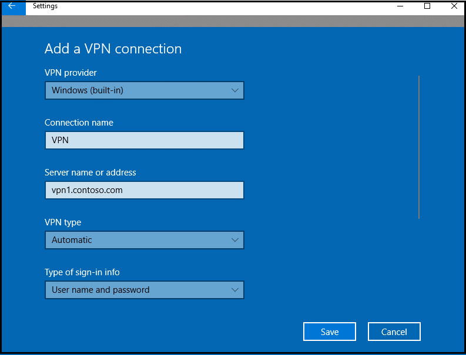
 
6. Open the **Network and Sharing Center** in Control Panel.
7. Click **Change adapter settings**.

 

8. Right-click the VPN network connection, and click Properties. 

 

9. In the VPN properties dialog box, click the **Security** tab. 
10.	On the Security tab, ensure that only **Microsoft CHAP Version 2 (MS-CHAP v2)** is selected, and click OK.

 

11.	Right-click the VPN connection, and click **Connect**.
12.	On the Settings page, click **Connect**.

A successful connection appears in the Security log on the RADIUS server as Event ID 6272, as shown below.

 

## Troubleshoot Guide
Assume that your VPN configuration was working before you configured the VPN server to use a centralized RADIUS server for authentication and authorization. In this case, it is likely that the issue may be caused by a misconfiguration of the RADIUS Server or the use of an invalid username or password. For example, if you use the alternate UPN suffix in the username, the login attempt might fail (you should use the same Account name for best results). 

To troubleshoot these issues, an ideal place to start is to examine the Security event logs on the RADIUS server. To save time searching for events, you can use the role-based Network Policy and Access Server custom view in Event Viewer, as show below. Event ID 6273 indicates events where the Network Policy Server denied access to a user. 

 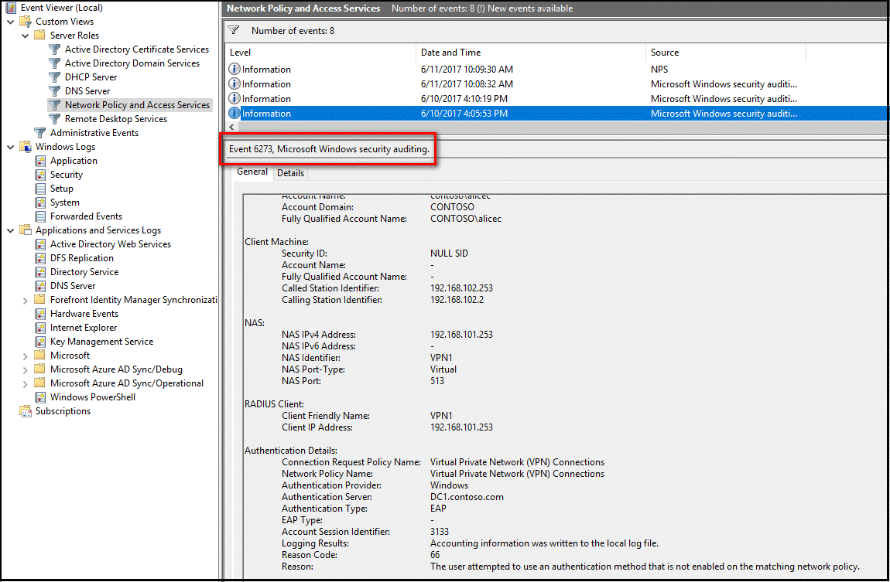
 
## Configure Multi-Factor Authentication
This section provides instructions for enabling users for MFA and for setting up accounts for two-step verification. 

### Enable multi-factor authentication
In this section, you enable Azure AD accounts for MFA. Use the **classic portal** to enable users for MFA. 

1. Open a browser, and navigate to [https://manage.windowsazure.com](https://manage.windowsazure.com). 
2. Log on as the administrator.
3. In the portal, in the left navigation, click **ACTIVE DIRECTORY**.

 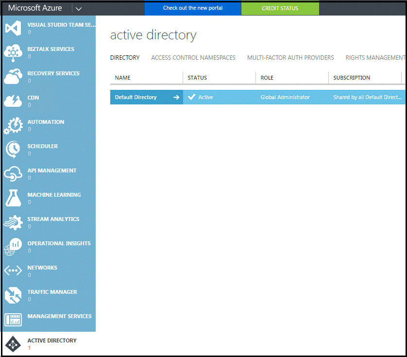

4. In the NAME column, click **Default Directory** (or another directory, if appropriate).
5. On the Quick Start page, click **Configure**.

 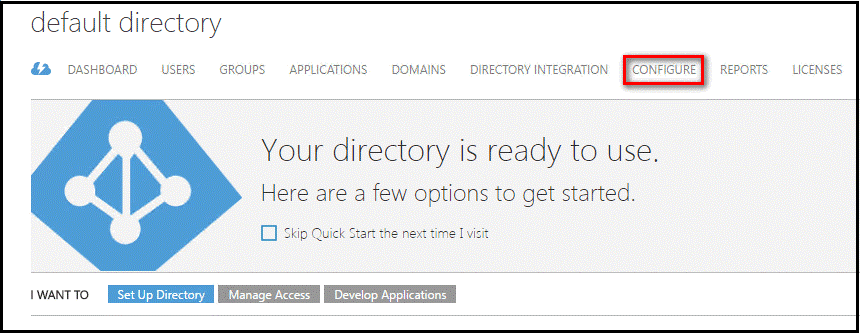

6. On the CONFIGURE page, scroll down and, in the multi-factor authentication section, click **Manage service settings**.

 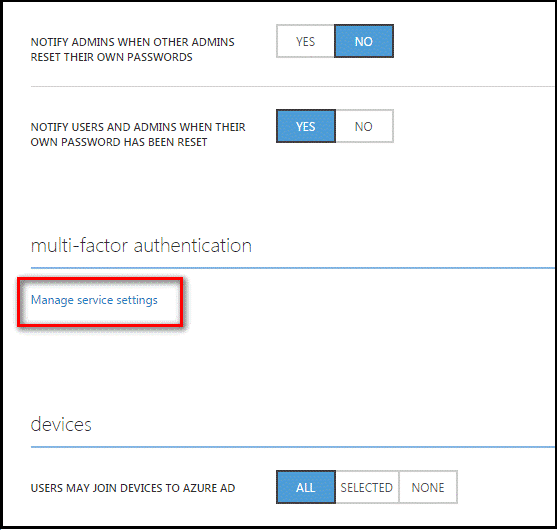
 
7. On the multi-factor authentication page, review the default service settings, and then click **Users**. 

 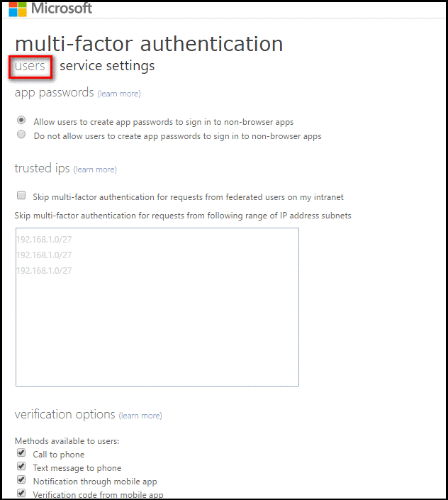
 
8. On the Users page, select the users that you wish to enable for MFA, and then click **Enable**.

 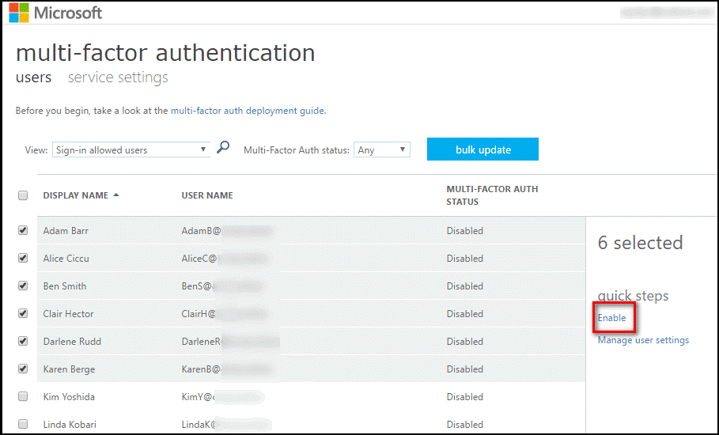
 
9. When prompted, click **Enable multi-factor auth**.

 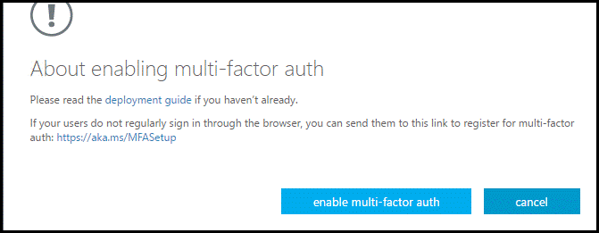
 
10.	Click **Close**. 
11.	Refresh the page. The MFA status is changed to Enabled.

For information on how to enable users for Multi-Factor Authentication, see [Getting started with Azure Multi-Factor Authentication in the cloud](multi-factor-authentication-get-started-cloud.md). 

### Configure accounts for two-step verification
Once an account has been enabled for MFA, users are not able to sign in to resources governed by the MFA policy until they have successfully configured a trusted device to use for the second authentication factor having used two-step verification.

In this section, you configure a trusted device for use with two-step verification. There are several options available for you to configure these, including the following:

* **Mobile app**. You install the Microsoft Authenticator app on a Windows Phone, Android, or iOS device. Depending on your organization’s policies, you are required to use the app in one of two modes: Receive notifications for verifications (a notification is pushed to your device) or Use verification code (you are required to enter a verification code that updates every 30 seconds). 
* **Mobile phone call or text**. You can either receive an automated phone call or text message. With the phone call option, you answer the call and press the # sign to authenticate. With the text option, you can either reply to the text message or enter the verification code into the sign-in interface.
* **Office phone call**. This process is the same as that described for automated phone calls above.

Follow these instructions for setting up a device to use the mobile app to receive push notification for verification.

1. Log on to [https://aka.ms/mfasetup](https://aka.ms/mfasetup) or any site, such as [https://portal.azure.com](https://portal.azure.com), where you required to authenticate using your MFA-enabled credentials. 
2. Upon signing in with your username and password, you are presented with a screen that prompts you to set up the account for additional security verification.

 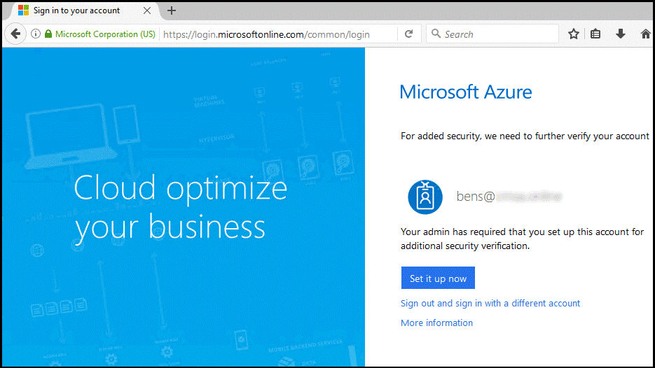

3. Click **Set it up now**.
4. On the Additional security verification page, select a contact type (authentication phone, office phone, or mobile app). Then select a country or region, and select a method. The method varies by contact type you select. For example, if you choose Mobile app, you can select whether to receive notifications for verification or to use a verification code. The steps that follow assume you choose **Mobile app** as the contact type.

 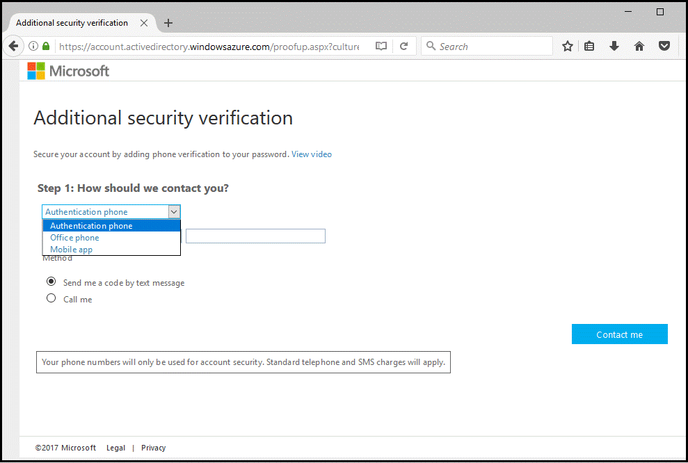

5. Select Mobile app, click **Receive notifications for verification**, and then **Set up**. 

 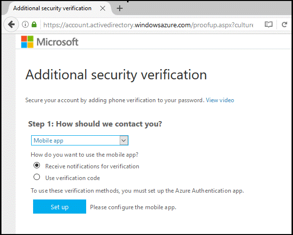
 
6. If you haven’t done so already, install the authenticator mobile app on your device. 
7. Follow the instructions in the mobile app to scan the presented bar code or enter the information manually, and then click **Done**.

 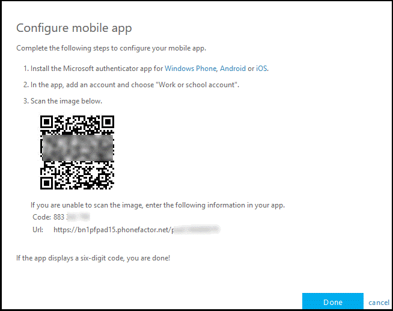

8. On the Additional security verification page, click **Contact me** and reply to notification sent to your device.
9. On the Additional security verification page, enter a contact number in case you lose access to the mobile app, and click **Next**.

 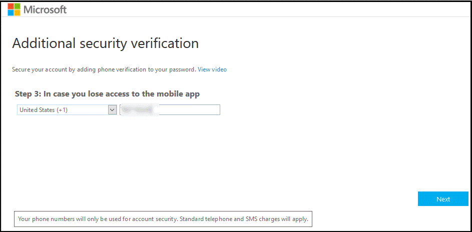
 
10.	On the Additional security verification, click **Done**.

The device is now configured to provide a second method of verification. For information on setting up accounts for two-step verification, see [Set up my account for two-step verification](./end-user/multi-factor-authentication-end-user-first-time.md).

## Install and configure NPS extension

This section provides instructions for configuring VPN to use Azure MFA for client authentication with the VPN Server.

Once you install and configure the NPS extension, all RADIUS-based client authentication that is processed by this server is required to use Azure MFA. If not all your VPN users are enrolled in Azure MFA, you can set up another RADIUS server to authenticate users who are not configured to use MFA. Or you can create a registry entry that allows challenged users to provide a second authentication factor, only if they are enrolled in MFA. 

Create a new string value named _REQUIRE_USER_MATCH in HKLM\SOFTWARE\Microsoft\AzureMfa_, and set the value to TRUE or FALSE. 

 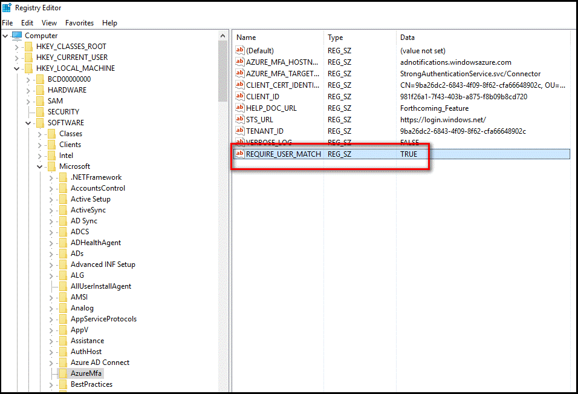
 
If the value is set to TRUE or not set, all authentication requests are subject to an MFA challenge. If the value is set to FALSE, MFA challenges are issued only to users that are enrolled in MFA. Only use the FALSE setting in testing or in production environments during an onboarding period.

### Acquire Azure Active Directory GUID ID

As part of the configuration of the NPS extension, you need to supply admin credentials and the Azure Active Directory ID for your Azure AD tenant. The steps below show you how to get the tenant ID.

1. Sign in to the Azure portal at [https://portal.azure.com](https://portal.azure.com) as the global administrator of the Azure tenant.
2. In the left navigation, click the **Azure Active Directory** icon.
3. Click **Properties**.
4. To copy your Directory ID to the clipboard, select the **Copy** icon.
 
 

### Install the NPS extension
The NPS extension needs to be installed on a server that has the Network Policy and Access Services (NPS) role installed and that functions as the RADIUS server in your design. Don't install the NPS extension on your Remote Desktop Server.

1. Download the NPS extension from [https://aka.ms/npsmfa](https://aka.ms/npsmfa). 
2. Copy the setup executable file (NpsExtnForAzureMfaInstaller.exe) to the NPS server.
3. On the NPS server, double-click **NpsExtnForAzureMfaInstaller.exe**. If prompted, click **Run**.
4. In the NPS Extension for Azure MFA dialog box, review the software license terms, check **I agree to the license terms and conditions**, and click **Install**.

 
 
5. In the NPS Extension for Azure MFA dialog box, click **Close**.  

  
 
### Configure certificates for use with the NPS extension using a PowerShell script
To ensure secure communications and assurance, you need to configure certificates for use by the NPS extension. The NPS components include a Windows PowerShell script that configures a self-signed certificate for use with NPS. 

The script performs the following actions:

* Creates a self-signed certificate
* Associates public key of certificate to service principal on Azure AD
* Stores the cert in the local machine store
* Grants access to the certificate’s private key to the Network User
* Restarts Network Policy Server service

If you want to use your own certificates, you need to associate the public of your certificate to the service principle on Azure AD, and so on.
To use the script, provide the extension with your Azure Active Directory administrative credentials and the Azure Active Directory tenant ID you copied earlier. Run the script on each NPS server where you install the NPS extension.

1. Open an administrative Windows PowerShell prompt.
2. At the PowerShell prompt, type _cd ‘c:\Program Files\Microsoft\AzureMfa\Config’_, and press **ENTER**.
3. Type _.\AzureMfsNpsExtnConfigSetup.ps1_, and press **ENTER**. 
 * The script checks to see if the Azure Active Directory PowerShell module is installed. If it is not installed, the script installs the module for you.
 
 
 
4. After the script verifies the installation of the PowerShell module, it displays the Azure Active Directory PowerShell module dialog box. In the dialog box, enter your Azure AD admin credentials and password, and click **Sign in**. 
 
 
 
5. When prompted, paste the tenant ID you copied to the clipboard earlier, and press **ENTER**. 

 

6. The script creates a self-signed certificate and performs other configuration changes. The output is like the image shown below.

 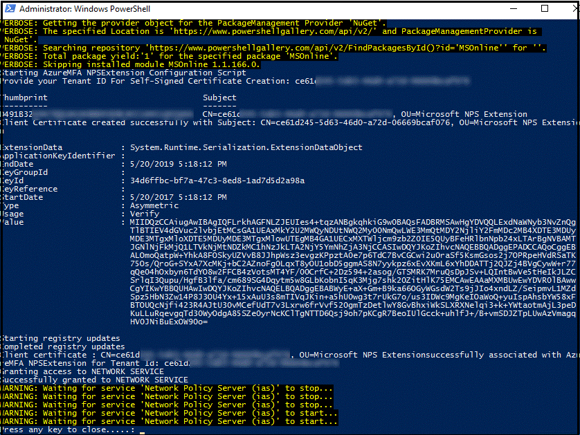

7. Reboot the server.
 
### Verify configuration
To verify the configuration, you need to establish a new VPN connection with VPN server. Upon successfully entering your credentials for primary authentication, the VPN connection waits for the secondary authentication to succeed before the connection is established, as shown below. 

 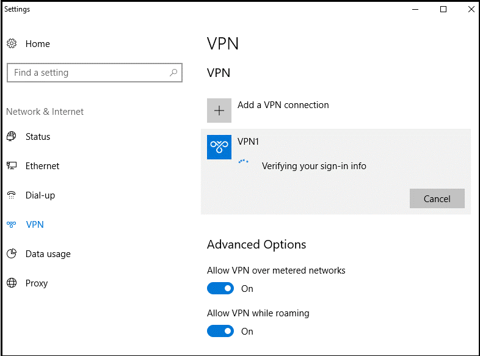

If you successfully authenticate with the secondary verification method you previously configured in Azure MFA, you are connected to the resource. However, if the secondary authentication is not successful, you are denied access to resource. 

In the example below, the Authenticator app on a Windows phone is used to provide the secondary authentication.

 

Once you have successfully authenticated using the secondary method, you are granted access to the virtual port on the VPN server. However, because you were required to use a secondary authentication method using a mobile app on a trusted device, the log in process is more secure than it would be using only a username / password combination.

### View Event Viewer logs for successful logon events
To view the successful logon events in the Windows Event Viewer logs, you can issue the following Windows PowerShell command to query the Windows Security log on the NPS server.

To query successful logon events in the Security event viewer logs, use the following command,
* _Get-WinEvent -Logname Security_ | where {$_.ID -eq '6272'} | FL 

 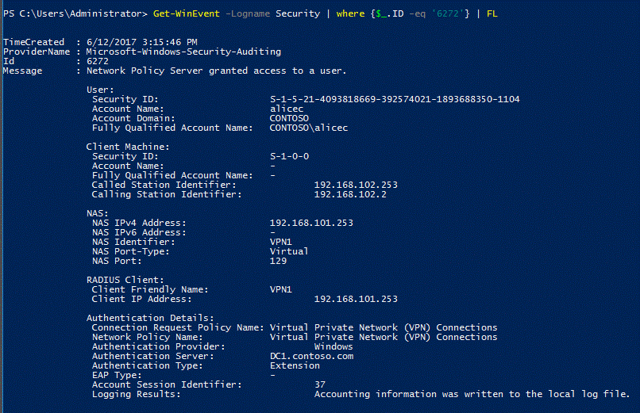
 
You can also view the Security log or the Network Policy and Access Services custom view, as shown below:

 

On the server where you installed the NPS extension for Azure MFA, you can find Event Viewer application logs specific to the extension at **Application and Services Logs\Microsoft\AzureMfa**. 

* _Get-WinEvent -Logname Security_ | where {$_.ID -eq '6272'} | FL

 

## Troubleshoot Guide
If the configuration is not working as expected, a good place to start to troubleshoot is to verify that the user is configured to use Azure MFA. Have the user connect to [https://portal.azure.com](https://portal.azure.com). If they are prompted for secondary authentication and can successfully authenticate, you can eliminate an incorrect configuration of Azure MFA.

If Azure MFA is working for the user(s), you should review the relevant Event logs. These include the Security Event, Gateway operational, and Azure MFA logs that are discussed in the previous section. 

Below is an example output of Security log showing a failed logon event (Event ID 6273):

 

Below is a related event from the AzureMFA logs:

 

To perform advanced troubleshoot options, consult the NPS database format log files where the NPS service is installed. These log files are created in _%SystemRoot%\System32\Logs_ folder as comma-delimited text files. For a description of these log files, see [Interpret NPS Database Format Log Files](https://technet.microsoft.com/library/cc771748.aspx). 

The entries in these log files are difficult to interpret without importing them into a spreadsheet or a database. You can find a number of IAS parsers online to assist you in interpreting the log files. Below is the output of one such downloadable [shareware application](http://www.deepsoftware.com/iasviewer): 

 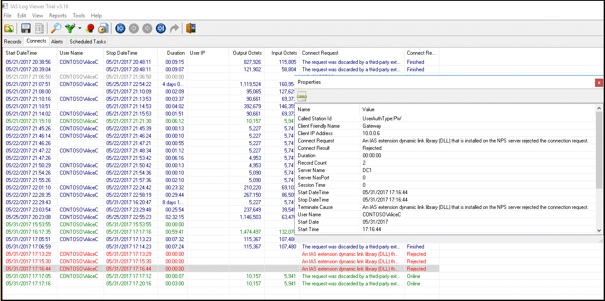

Finally, for additional troubleshoot options, you can use a protocol analyzer such as Wireshark or [Microsoft Message Analyzer](https://technet.microsoft.com/library/jj649776.aspx). The following image from Wireshark shows the RADIUS messages between the VPN server and the NPS server.

 

For more information, see [Integrate your existing NPS infrastructure with Azure Multi-Factor Authentication](multi-factor-authentication-nps-extension.md).  

## Next steps
[How to get Azure Multi-Factor Authentication](multi-factor-authentication-versions-plans.md)

[Remote Desktop Gateway and Azure Multi-Factor Authentication Server using RADIUS](multi-factor-authentication-get-started-server-rdg.md)

[Integrate your on-premises directories with Azure Active Directory](../active-directory/connect/active-directory-aadconnect.md)

