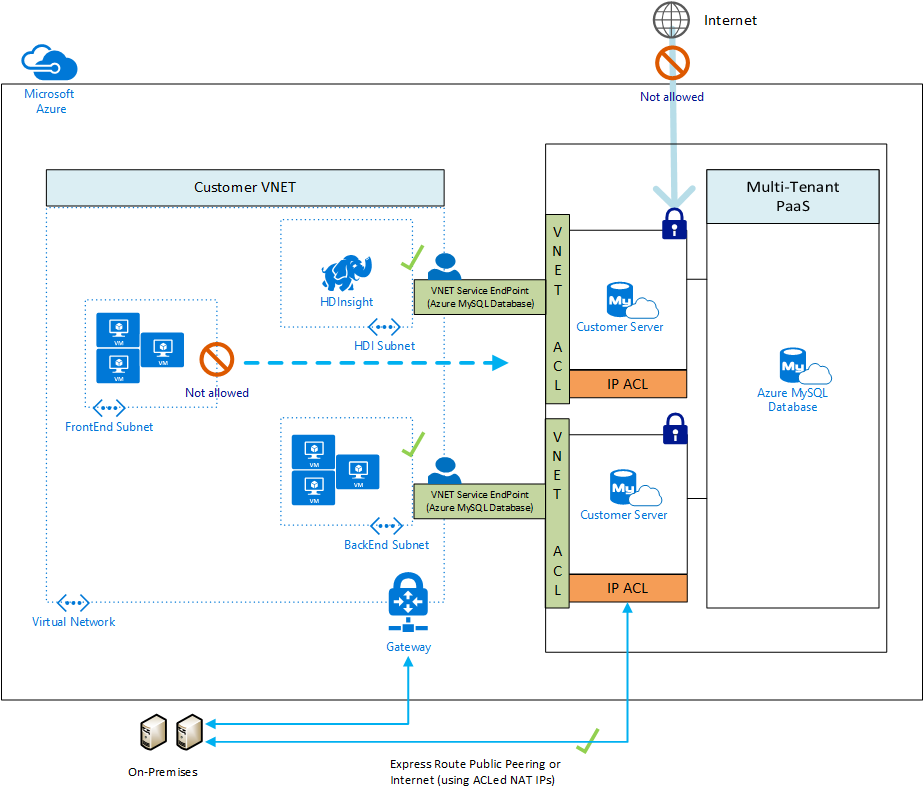

# Use Virtual Network service endpoints and rules for Azure Database for MySQL

*Virtual network rules* are one firewall security feature that controls whether your Azure Database for MySQL server accepts communications that are sent from particular subnets in virtual networks. This article explains why the virtual network rule feature is sometimes your best option for securely allowing communication to your Azure Database for MySQL server.

To create a virtual network rule, there must first be a [virtual network][vm-virtual-network-overview] (VNet) and a [virtual network service endpoint][vm-virtual-network-service-endpoints-overview-649d] for the rule to reference. The following picture illustrates how a Virtual Network service endpoint works with Azure Database for MySQL:

> [!NOTE]
> This feature is available in all regions of Azure where Azure Database for MySQL is deployed for General Purpose and Memory Optimized servers.
> In case of VNet peering, if traffic is flowing through a common VNet Gateway with service endpoints and is supposed to flow to the peer, please create an ACL/VNet rule to allow Azure Virtual Machines in the Gateway VNet to access the Azure Database for MySQL server.

<a name="anch-terminology-and-description-82f" />

## Terminology and description

**Virtual network:** You can have virtual networks associated with your Azure subscription.

**Subnet:** A virtual network contains **subnets**. Any Azure virtual machines (VMs) that you have are assigned to subnets. One subnet can contain multiple VMs or other compute nodes. Compute nodes that are outside of your virtual network cannot access your virtual network unless you configure your security to allow access.

**Virtual Network service endpoint:** A [Virtual Network service endpoint][vm-virtual-network-service-endpoints-overview-649d] is a subnet whose property values include one or more formal Azure service type names. In this article we are interested in the type name of **Microsoft.Sql**, which refers to the Azure service named SQL Database. This service tag also applies to the Azure Database for MySQL and PostgreSQL services. It is important to note when applying the **Microsoft.Sql** service tag to a VNet service endpoint it will configure service endpoint traffic for all Azure SQL Database, Azure Database for MySQL and Azure Database for PostgreSQL servers on the subnet. 

**Virtual network rule:** A virtual network rule for your Azure Database for MySQL server is a subnet that is listed in the access control list (ACL) of your Azure Database for MySQL server. To be in the ACL for your Azure Database for MySQL server, the subnet must contain the **Microsoft.Sql** type name.

A virtual network rule tells your Azure Database for MySQL server to accept communications from every node that is on the subnet.

<a name="anch-benefits-of-a-vnet-rule-68b" />

## Benefits of a virtual network rule

Until you take action, the VMs on your subnets cannot communicate with your Azure Database for MySQL server. One action that establishes the communication is the creation of a virtual network rule. The rationale for choosing the VNet rule approach requires a compare-and-contrast discussion involving the competing security options offered by the firewall.

### A. Allow access to Azure services

The Connection security pane has an **ON/OFF** button that is labeled **Allow access to Azure services**. The **ON** setting allows communications from all Azure IP addresses and all Azure subnets. These Azure IPs or subnets might not be owned by you. This **ON** setting is probably more open than you want your Azure Database for MySQL Database to be. The virtual network rule feature offers much finer granular control.

### B. IP rules

The Azure Database for MySQL firewall allows you to specify IP address ranges from which communications are accepted into the Azure Database for MySQL Database. This approach is fine for stable IP addresses that are outside the Azure private network. But many nodes inside the Azure private network are configured with *dynamic* IP addresses. Dynamic IP addresses might change, such as when your VM is restarted. It would be folly to specify a dynamic IP address in a firewall rule, in a production environment.

You can salvage the IP option by obtaining a *static* IP address for your VM. For details, see [Configure private IP addresses for a virtual machine by using the Azure portal][vm-configure-private-ip-addresses-for-a-virtual-machine-using-the-azure-portal-321w].

However, the static IP approach can become difficult to manage, and it is costly when done at scale. Virtual network rules are easier to establish and to manage.

### C. Cannot yet have Azure Database for MySQL on a subnet without defining a service endpoint

If your **Microsoft.Sql** server was a node on a subnet in your virtual network, all nodes within the virtual network could communicate with your Azure Database for MySQL server. In this case, your VMs could communicate with Azure Database for MySQL without needing any virtual network rules or IP rules.

However as of August 2018, the Azure Database for MySQL service is not yet among the services that can be assigned directly to a subnet.

<a name="anch-details-about-vnet-rules-38q" />

## Details about virtual network rules

This section describes several details about virtual network rules.

### Only one geographic region

Each Virtual Network service endpoint applies to only one Azure region. The endpoint does not enable other regions to accept communication from the subnet.

Any virtual network rule is limited to the region that its underlying endpoint applies to.

### Server-level, not database-level

Each virtual network rule applies to your whole Azure Database for MySQL server, not just to one particular database on the server. In other words, virtual network rule applies at the server-level, not at the database-level.

### Security administration roles

There is a separation of security roles in the administration of Virtual Network service endpoints. Action is required from each of the following roles:

- **Network Admin:** &nbsp; Turn on the endpoint.
- **Database Admin:** &nbsp; Update the access control list (ACL) to add the given subnet to the Azure Database for MySQL server.

*RBAC alternative:*

The roles of Network Admin and Database Admin have more capabilities than are needed to manage virtual network rules. Only a subset of their capabilities is needed.

You have the option of using [role-based access control (RBAC)][rbac-what-is-813s] in Azure to create a single custom role that has only the necessary subset of capabilities. The custom role could be used instead of involving either the Network Admin or the Database Admin. The surface area of your security exposure is lower if you add a user to a custom role, versus adding the user to the other two major administrator roles.

> [!NOTE]
> In some cases the Azure Database for MySQL and the VNet-subnet are in different subscriptions. In these cases you must ensure the following configurations:
> - Both subscriptions must be in the same Azure Active Directory tenant.
> - The user has the required permissions to initiate operations, such as enabling service endpoints and adding a VNet-subnet to the given Server.

## Limitations

For Azure Database for MySQL, the virtual network rules feature has the following limitations:

- A Web App can be mapped to a private IP in a VNet/subnet. Even if service endpoints are turned ON from the given VNet/subnet, connections from the Web App to the server will have an Azure public IP source, not a VNet/subnet source. To enable connectivity from a Web App to a server that has VNet firewall rules, you must Allow Azure services to access server on the server.

- In the firewall for your Azure Database for MySQL, each virtual network rule references a subnet. All these referenced subnets must be hosted in the same geographic region that hosts the Azure Database for MySQL.

- Each Azure Database for MySQL server can have up to 128 ACL entries for any given virtual network.

- Virtual network rules apply only to Azure Resource Manager virtual networks; and not to [classic deployment model][arm-deployment-model-568f] networks.

- Turning ON virtual network service endpoints to Azure Database for MySQL using the **Microsoft.Sql** service tag also enables the endpoints for all Azure Database services: Azure Database for MySQL, Azure Database for PostgreSQL, Azure SQL Database and Azure SQL Data Warehouse.

- Support for VNet service endpoints is only for General Purpose and Memory Optimized servers.

- On the firewall, IP address ranges do apply to the following networking items, but virtual network rules do not:
    - [Site-to-Site (S2S) virtual private network (VPN)][vpn-gateway-indexmd-608y]
    - On-premises via [ExpressRoute][expressroute-indexmd-744v]

## ExpressRoute

If your network is connected to the Azure network through use of [ExpressRoute][expressroute-indexmd-744v], each circuit is configured with two public IP addresses at the Microsoft Edge. The two IP addresses are used to connect to Microsoft Services, such as to Azure Storage, by using Azure Public Peering.

To allow communication from your circuit to Azure Database for MySQL, you must create IP network rules for the public IP addresses of your circuits. In order to find the public IP addresses of your ExpressRoute circuit, open a support ticket with ExpressRoute by using the Azure portal.

## Adding a VNET Firewall rule to your server without turning On VNET Service Endpoints

Merely setting a Firewall rule does not help secure the server to the VNet. You must also turn VNet service endpoints **On** for the security to take effect. When you turn service endpoints **On**, your VNet-subnet experiences downtime until it completes the transition from **Off** to **On**. This is especially true in the context of large VNets. You can use the **IgnoreMissingServiceEndpoint** flag to reduce or eliminate the downtime during transition.

You can set the **IgnoreMissingServiceEndpoint** flag by using the Azure CLI or portal.

## Related articles
- [Azure virtual networks][vm-virtual-network-overview]
- [Azure virtual network service endpoints][vm-virtual-network-service-endpoints-overview-649d]

## Next steps
For articles on creating VNet rules, see:
- [Create and manage Azure Database for MySQL VNet rules using the Azure portal](howto-manage-vnet-using-portal.md)
- [Create and manage Azure Database for MySQL VNet rules using Azure CLI](howto-manage-vnet-using-cli.md)

<!-- Link references, to text, Within this same GitHub repo. -->
[arm-deployment-model-568f]: ../azure-resource-manager/resource-manager-deployment-model.md

[vm-virtual-network-overview]: ../virtual-network/virtual-networks-overview.md

[vm-virtual-network-service-endpoints-overview-649d]: ../virtual-network/virtual-network-service-endpoints-overview.md

[vm-configure-private-ip-addresses-for-a-virtual-machine-using-the-azure-portal-321w]: ../virtual-network/virtual-networks-static-private-ip-arm-pportal.md

[rbac-what-is-813s]: ../active-directory/role-based-access-control-what-is.md

[vpn-gateway-indexmd-608y]: ../vpn-gateway/index.yml

[expressroute-indexmd-744v]: ../expressroute/index.yml
