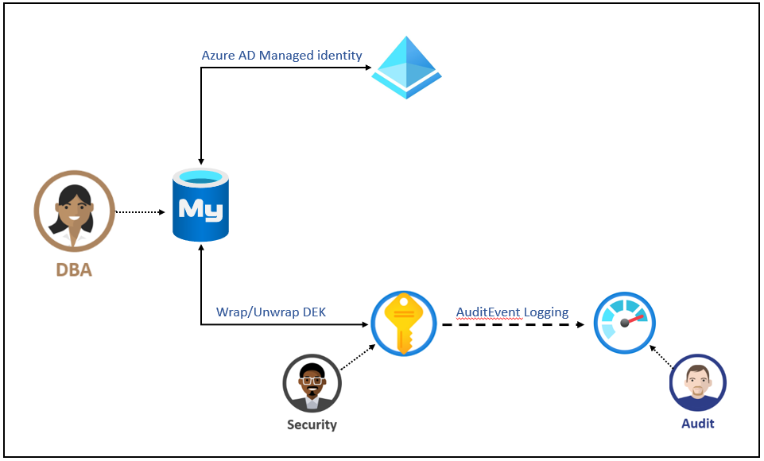

# Azure Database for MySQL Data Encryption with customer-managed key

> [!NOTE]
> At this time, you must request access to use this capability. To do so, please contact AskAzureDBforMySQL@service.microsoft.com.

Azure Database for MySQL Data Encryption with customer-managed key enables you to Bring Your Own Key (BYOK) for data protection at rest, and allows organizations to implement separation of duties in the management of keys and data. With customer-managed encryption, you are responsible for and in a full control of a key's lifecycle (key creation, upload, rotation, deletion), key usage permissions, and auditing of operations on keys.

For Azure Database for MySQL, the Data Encryption is set at the server-level. With this form of data encryption, the key is used to in the encryption of the Database Encryption Key (DEK), which is a customer-managed asymmetric key stored in a customer-owned and customer-managed [Azure Key Vault (AKV)](../key-vault/key-Vault-secure-your-key-Vault.md), a cloud-based external key management system. AKV is highly available and provides scalable secure storage for RSA cryptographic keys, optionally backed by FIPS 140-2 Level 2 validated hardware security modules (HSMs). It doesn't allow direct access to a stored key but provides services of encryption/decryption using the key to the authorized entities. The key can be generated by the Key Vault, imported, or [transferred to the Key Vault from an on-prem HSM device](../key-vault/key-Vault-hsm-protected-keys.md).

> [!NOTE]
> This feature is available in all Azure regions where Azure Database for MySQL supports General Purpose and Memory Optimized pricing tiers.

## Benefits

Data Encryption for Azure Database for MySQL provides the following benefits:

* Increased transparency, granular control, and management for the encryption key.
* Central management and organization of keys by hosting them in Azure Key Vault.
* Ability to implement separation of duties in the management of keys and data within the organization.
* Separate key management from data management within an organization, so Key Vault administrator can revoke key access permissions to make encrypted database inaccessible.
* Greater trust from your end customers, since Azure Key Vault is designed such that Microsoft cannot see nor extract encryption keys.

## Terminology and description

**Data Encryption Key (DEK)** – A symmetric AES256 key used to encrypt a partition or block of data. Encrypting each block of data with a different key makes crypto analysis attacks more difficult. Access to DEKs is needed by the resource provider or application instance that is encrypting and decrypting a specific block. When a DEK is replaced with a new key, only the data in its associated block must be re-encrypted with the new key.

**Key Encryption Key (KEK)** - An encryption key used to encrypt the Data Encryption Keys. Use of a Key Encryption Key that never leaves Key Vault, allows the data encryption keys themselves to be encrypted and controlled. The entity that has access to the KEK may be different than the entity that requires the DEK. Since the KEK is required to decrypt the DEKs, the KEK is effectively a single point by which DEKs can be effectively deleted by deletion of the KEK.

The Data Encryption Keys, encrypted with the Key Encryption Keys are stored separately and only an entity with access to the Key Encryption Key can decrypt these Data Encryption Keys. For more information, see [security in encryption at rest](../security/fundamentals/encryption-atrest.md).

## How Data Encryption with customer-managed key works

For a MySQL server to be able to use customer-managed keys stored in AKV for encryption of the DEK, a Key Vault administrator needs to give the following access rights to the server using its unique identity:

* **get** - for retrieving the public part and properties of the key in the Key Vault
* **wrapKey** - to be able to protect (encrypt) DEK
* **unwrapKey** - to be able to unprotect (decrypt) DEK

Key Vault administrator can also [enable logging of Key Vault audit events](../azure-monitor/insights/azure-key-vault.md), so they can be audited later.

When the server is configured to use the customer-managed key that is stored in the Key Vault, the server sends the DEK to the Key Vault for encryptions. Key Vault returns the encrypted DEK, which is stored in the user database. Similarly, when needed, server sends protected DEK to the Key Vault for decryption. Auditors can use Azure Monitor to review Key Vault AuditEvent logs, if logging is enabled.

## Requirements for configuring Data Encryption for Azure Database for MySQL

### Requirements for configuring AKV

* Key Vault and Azure Database for MySQL must belong to the same Azure Active Directory (AAD) tenant. Cross-tenant Key Vault and server interactions are not supported. Moving resources afterwards requires you to reconfigure the data encryption. Learn more about moving resources.
* Soft-delete feature must be enabled on the Key Vault, to protect from data loss accidental key (or Key Vault) deletion happens. Soft-deleted resources are retained for 90 days, unless recovered or purged by the customer in the meantime. The recover and purge actions have their own permissions associated in a Key Vault access policy. Soft-delete feature is off by default and can be enabled via Powershell or CLI. It cannot be enabled via Azure portal.
* Grant the Azure Database for MySQL access to the Key Vault with the **get, wrapKey, unwrapKey** permissions using its unique managed identity. When using Azure portal, the unique identify gets automatically created when data encryption is enabled on the MySQL. See [Configure Data Encryption for MySQL](howto-data-encryption-portal.md) for detailed step-by-step instructions when using Azure portal.

* When using firewall with AKV, you must enable option *Allow trusted Microsoft services to bypass the firewall*.

### Requirements for configuring customer key

* The customer-managed key to be used for encrypting the DEK can be only asymmetric, RSA 2028.
* The key activation date (if set) must be a date and time in the past. Expiration date (if set) must be a future date and time.
* The key must be in the *Enabled* state.
* If you are importing existing key into the Key Vault, make sure to provide it in the supported file formats (`.pfx`, `.byok`, `.backup`).

## Recommendations when using Data Encryption using customer-managed key

### Recommendation for configuring AKV

* Set a resource lock on the Key Vault to control who can delete this critical resource and prevent accidental or unauthorized deletion. Learn more about resource locks.
* Enable auditing and reporting on all encryption keys: Key Vault provides logs that are easy to inject into other security information and event management tools. Azure Monitor Log Analytics is one example of a service that is already integrated.

* Ensure that the Key Vault and the Azure Database for MySQL reside in the same region to ensure a faster access for DEK wrap/unwrap operations.

### Recommendation for configuring customer-managed key

* Keep a copy of the customer-managed key (KEK) on a secure place or escrow it to the escrow service.

* If the key is generated in the Key Vault, create a key backup before using the key in AKV for the first time. Backup can be restored to an Azure Key Vault only. Learn more about the [Backup-AzKeyVaultKey](https://docs.microsoft.com/powershell/module/az.keyVault/backup-azkeyVaultkey) command.

## Inaccessible customer-managed key condition

When data encryption is configured with customer-managed key in the Azure Key Vault (AKV), continuous access to this key is required for the server to stay online. If the server loses access to the customer-managed key in AKV, within 10 minutes, the server will begin denying all connections with the corresponding error message and change the server state to **Inaccessible**. The only action allowed on a database in the Inaccessible state is deleting it.

### Accidental key access revocation from the Azure Key Vault (AKV)

It may happen that someone with sufficient access rights to the Key Vault accidentally disables server access to the key by:

* revoking Key Vault's get, wrapKey, unwrapKey permissions from the server
* deleting the key
* deleting the Key Vault
* changing Key Vault's firewall rules

* deleting the managed identity of the server in Azure Active Directory

## Monitoring of the customer-managed key in the Key Vault

To monitor database state and to enable alerting for loss of TDE protector access, configure the following Azure features:

* [Azure Resource Health](../service-health/resource-health-overview.md) - An inaccessible database that has lost access to the customer key will show as "Inaccessible" after the first connection to the database has been denied.
* [Activity Log](../service-health/alerts-activity-log-service-notifications.md) - When access to the customer key in the customer-managed Key Vault fails, entries are added to the activity log. Creating alerts for these events will enable you to reinstate access as soon as possible.

* [Action groups](../azure-monitor/platform/action-groups.md) can be defined to send you notifications and alerts based on your preferences, for example Email/SMS/Push/Voice, Logic App, Webhook, ITSM, or Automation Runbook.

## Restore and replica with customer's managed key in the Key Vault

Once an Azure Database for MySQL is encrypted with customer's managed key stored in the Key Vault, any newly created copy of the server (either though local or geo-restore operation or through read replicas) is also encrypted with the same customer's managed key. However, they can be changed to reflect new customer's managed key for encryption. When the customer-managed key is changed, old backups of the server will start using the latest key.

To avoid issues while establishing setting up customer-managed data encryption during restore or read replica creation, it is important to follow these steps on the master and restores/replica server:

* Initiate the restore or read replica creation process from the master Azure Database for MySQL.
* The newly created server (restored/replica) is kept an Inaccessible state since its unique identity has not yet been given permissions to the Azure Key Vault (AKV)
* On the restored/replica server, revalidate the customer-managed key in the data encryption settings to ensure that the newly created server is given wrap/unwrap permissions to the key stored in AKV.

* Both the steps above must be done to ensure that the data encryption is preserved on the master as well as the restored/replica server.

## Next steps

Learn how to [setup data encryption with customer-managed key for your Azure database for MySQL using the Azure portal](howto-data-encryption-portal.md).
