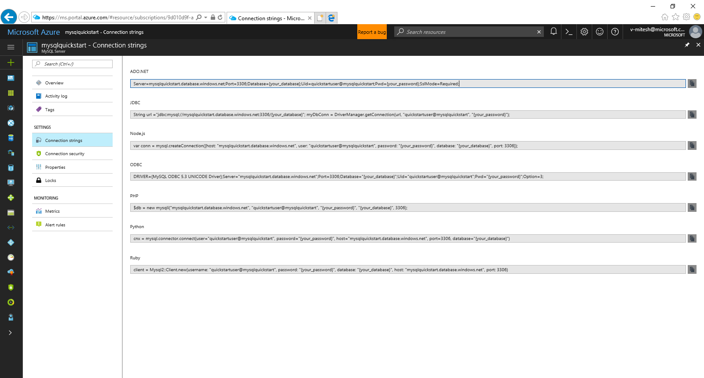

# Migrate your MySQL database to Azure Database for MySQL using dump and restore
This article explains two common ways to back up and restore databases in your Azure Database for MySQL
- Back up and restore from the command-line (using mysqldump) 
- Back up and restore using PHPMyAdmin 

## Before you begin
To step through this how-to guide, you need to have:
- [Create Azure Database for MySQL server - Azure portal](quickstart-create-mysql-server-database-using-azure-portal.md)
- [mysqldump](https://dev.mysql.com/doc/refman/5.7/en/mysqldump.html) command-line utility installed on a machine
- MySQL Workbench [MySQL Workbench Download](https://dev.mysql.com/downloads/workbench/), Toad, Navicat or any third-party MySQL tool

## Use common tools
Use common tools such as MySQL Workbench, mysqldump, Toad, or Navicat to remotely connect and restore data into Azure Database for MySQL. Use such tools on your client machine with an internet connection to connect to the Azure Database for MySQL. Use an SSL encrypted connection for best security practices, see also [Configure SSL connectivity in Azure Database for MySQL](concepts-ssl-connection-security.md). You do not need to move the dump files to any special cloud location when migrating to Azure Database for MySQL. 

## Create a backup file from the command-line using mysqldump
To back up an existing MySQL database on-prem or in a VM, run the following command: 
```bash
$ mysqldump --opt -u [uname] -p[pass] [dbname] > [backupfile.sql]
```

The parameters to provide are:
- [uname] Your database username 
- [pass] The password for your database (note there is no space between -p and the password) 
- [dbname] The name of your database 
- [backupfile.sql] The filename for your database backup 
- [--opt] The mysqldump option 

For example, to back up a database named 'testdb' with the username 'testuser' and with no password to a file testdb_backup.sql, use the following command. This command will back up the 'testdb' database into a file called testdb_backup.sql which will contain all the SQL statements needed to re-create the database. 

```bash
$ mysqldump -u root -p testdb > testdb_backup.sql
```
To select specific tables in your database to back up, list the table names separated by spaces. For example, to back up only table1 and table2 tables from the 'testdb', follow this example: 
```bash
$ mysqldump -u root -p testdb table1 table2 > testdb_tables_backup.sql
```

To back up more than one database at once, use the --database switch and list the database names separated by spaces. 
```bash
$ mysqldump -u root -p --databases testdb1 testdb3 testdb5 > testdb135_backup.sql 
```
To back up all the databases in the server at one time, you should use the --all-databases option.
```
$ mysqldump -u root -p --all-databases > alldb_backup.sql 
```

## Create a database on the target Azure MySQL server
You must create an empty database on the target Azure Database for MySQL server where you want to migrate the data using MySQL Workbench, Toad, Navicat or any third-party tool for MySQL. The database can have the same name as the database that is contained the dumped data or you can create a database with a different name.




## Restore your MySQL database using command-line or MySQL Workbench
Once you have created the target database, you can use the mysql command or MySQL Workbench to restore the data into the specific newly created database from the dump file.
```bash
mysql -u [uname] -p[pass] [db_to_restore] < [backupfile.sql]
```
In this example, we will restore the data to the newly created database testdb3 on target server.
```bash
$ mysql -u root -p testdb3 < testdb_backup.sql
```

## Export using PHPMyAdmin
To export, you can use the common tool phpMyAdmin which you may already have installed locally in your environment. To export your MySQL database using PHPMyAdmin:
- Open phpMyAdmin.
- Select your database by clicking the database name in the list on the left of the screen. 
- Click the Export link. This should bring up a new screen that says View dump of database. 
- In the Export area, click the Select All link to choose all of the tables in your database. 
- In the SQL options area, click the right options. 
- Click on the Save as file option and the corresponding compression option and then click the 'Go' button. A dialog box should appear prompting you to save the file locally.

## Import using PHPMyAdmin
Importing your database is similar to exporting. Do the following actions:
- Open phpMyAdmin. 
- Create an appropriately named database and select it by clicking the database name in the list on the left of the screen. If you would like to rewrite the import over an existing database then click on the database name, select all the check boxes next to the table names and select Drop to delete all existing tables in the database. 
- Click the SQL link. This should bring up a new screen where you can type in SQL commands, or upload your SQL file. 
- Use the browse button to find the database file. 
- Click the Go button. This will export the backup, execute the SQL commands and re-create your database.

## Next steps

[Create an Azure Database for MySQL server using Azure portal](quickstart-create-mysql-server-database-using-azure-portal.md) 
[Create an Azure Database for MySQL server using Azure CLI](quickstart-create-mysql-server-database-using-azure-cli.md)
