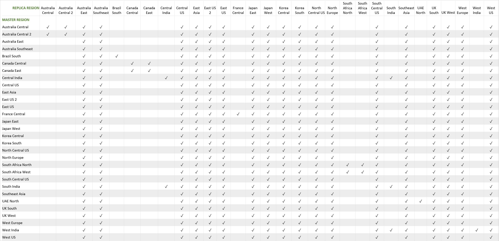

# Read replicas in Azure Database for MySQL

The read replica feature allows you to replicate data from an Azure Database for MySQL server to a read-only server. You can replicate from the master server to up to five replicas. Replicas are updated asynchronously using the MySQL engine's native binary log (binlog) file position-based replication technology. To learn more about binlog replication, see the [MySQL binlog replication overview](https://dev.mysql.com/doc/refman/5.7/en/binlog-replication-configuration-overview.html).

Replicas are new servers that you manage similar to regular Azure Database for MySQL servers. For each read replica, you're billed for the provisioned compute in vCores and storage in GB/ month.

To learn more about MySQL replication features and issues, see the [MySQL replication documentation](https://dev.mysql.com/doc/refman/5.7/en/replication-features.html).

> [!NOTE]
> Bias-free communication
>
> Microsoft supports a diverse and inclusionary environment. This article contains references to the word _slave_. The Microsoft [style guide for bias-free communication](https://github.com/MicrosoftDocs/microsoft-style-guide/blob/master/styleguide/bias-free-communication.md) recognizes this as an exclusionary word. The word is used in this article for consistency because it's currently the word that appears in the software. When the software is updated to remove the word, this article will be updated to be in alignment.
>

## When to use a read replica

The read replica feature helps to improve the performance and scale of read-intensive workloads. Read workloads can be isolated to the replicas, while write workloads can be directed to the master.

A common scenario is to have BI and analytical workloads use the read replica as the data source for reporting.

Because replicas are read-only, they don't directly reduce write-capacity burdens on the master. This feature isn't targeted at write-intensive workloads.

The read replica feature uses MySQL asynchronous replication. The feature isn't meant for synchronous replication scenarios. There will be a measurable delay between the master and the replica. The data on the replica eventually becomes consistent with the data on the master. Use this feature for workloads that can accommodate this delay.

## Cross-region replication
You can create a read replica in a different region from your master server. Cross-region replication can be helpful for scenarios like disaster recovery planning or bringing data closer to your users.

You can have a master server in any [Azure Database for MySQL region](https://azure.microsoft.com/global-infrastructure/services/?products=mysql).  A master server can have a replica in its paired region or the universal replica regions. The picture below shows which replica regions are available depending on your master region.

[ ](media/concepts-read-replica/read-replica-regions.png#lightbox)

### Universal replica regions
You can create a read replica in any of the following regions, regardless of where your master server is located. The supported universal replica regions include:

Australia East, Australia Southeast, Central US, East Asia, East US, East US 2, Japan East, Japan West, Korea Central, Korea South, North Central US, North Europe, South Central US, Southeast Asia, UK South, UK West, West Europe, West US, West US 2, West Central US.

### Paired regions
In addition to the universal replica regions, you can create a read replica in the Azure paired region of your master server. If you don't know your region's pair, you can learn more from the [Azure Paired Regions article](../best-practices-availability-paired-regions.md).

If you are using cross-region replicas for disaster recovery planning, we recommend you create the replica in the paired region instead of one of the other regions. Paired regions avoid simultaneous updates and prioritize physical isolation and data residency.  

However, there are limitations to consider: 

* Regional availability: Azure Database for MySQL is available in France Central, UAE North, and Germany Central. However, their paired regions are not available.
	
* Uni-directional pairs: Some Azure regions are paired in one direction only. These regions include West India, Brazil South, and US Gov Virginia. 
   This means that a master server in West India can create a replica in South India. However, a master server in South India cannot create a replica in West India. This is because West India's secondary region is South India, but South India's secondary region is not West India.

## Create a replica

> [!IMPORTANT]
> The read replica feature is only available for Azure Database for MySQL servers in the General Purpose or Memory Optimized pricing tiers. Ensure the master server is in one of these pricing tiers.

If a master server has no existing replica servers, the master will first restart to prepare itself for replication.

When you start the create replica workflow, a blank Azure Database for MySQL server is created. The new server is filled with the data that was on the master server. The creation time depends on the amount of data on the master and the time since the last weekly full backup. The time can range from a few minutes to several hours. The replica server is always created in the same resource group and same subscription as the master server. If you want to create a replica server to a different resource group or different subscription, you can [move the replica server](https://docs.microsoft.com/azure/azure-resource-manager/management/move-resource-group-and-subscription) after creation.

Every replica is enabled for storage [auto-grow](concepts-pricing-tiers.md#storage-auto-grow). The auto-grow feature allows the replica to keep up with the data replicated to it, and prevent an interruption in replication caused by out-of-storage errors.

Learn how to [create a read replica in the Azure portal](howto-read-replicas-portal.md).

## Connect to a replica

At creation, a replica inherits the firewall rules of the master server. Afterwards, these rules are independent from the the master server.

The replica inherits the admin account from the master server. All user accounts on the master server are replicated to the read replicas. You can only connect to a read replica by using the user accounts that are available on the master server.

You can connect to the replica by using its hostname and a valid user account, as you would on a regular Azure Database for MySQL server. For a server named **myreplica** with the admin username **myadmin**, you can connect to the replica by using the mysql CLI:

```bash
mysql -h myreplica.mysql.database.azure.com -u myadmin@myreplica -p
```

At the prompt, enter the password for the user account.

## Monitor replication

Azure Database for MySQL provides the **Replication lag in seconds** metric in Azure Monitor. This metric is available for replicas only.

This metric is calculated using the `seconds_behind_master` metric available in MySQL's `SHOW SLAVE STATUS` command.

Set an alert to inform you when the replication lag reaches a value that isn’t acceptable for your workload.

## Stop replication

You can stop replication between a master and a replica. After replication is stopped between a master server and a read replica, the replica becomes a standalone server. The data in the standalone server is the data that was available on the replica at the time the stop replication command was started. The standalone server doesn't catch up with the master server.

When you choose to stop replication to a replica, it loses all links to its previous master and other replicas. There is no automated failover between a master and its replica.

> [!IMPORTANT]
> The standalone server can't be made into a replica again.
> Before you stop replication on a read replica, ensure the replica has all the data that you require.

Learn how to [stop replication to a replica](howto-read-replicas-portal.md).

## Considerations and limitations

### Pricing tiers

Read replicas are currently only available in the General Purpose and Memory Optimized pricing tiers.

> [!NOTE]
> The cost of running the replica server is based on the region where the replica server is running.

### Master server restart

When you create a replica for a master that has no existing replicas, the master will first restart to prepare itself for replication. Take this into consideration and perform these operations during an off-peak period.

### New replicas

A read replica is created as a new Azure Database for MySQL server. An existing server can't be made into a replica. You can't create a replica of another read replica.

### Replica configuration

A replica is created by using the same server configuration as the master. After a replica is created, several settings can be changed independently from the master server: compute generation, vCores, storage, and backup retention period. The pricing tier can also be changed independently, except to or from the Basic tier.

> [!IMPORTANT]
> Before a master server configuration is updated to new values, update the replica configuration to equal or greater values. This action ensures the replica can keep up with any changes made to the master.

Firewall rules and parameter settings are inherited from the master server to the replica when the replica is created. Afterwards, the replica's rules are independent.

### Stopped replicas

If you stop replication between a master server and a read replica, the stopped replica becomes a standalone server that accepts both reads and writes. The standalone server can't be made into a replica again.

### Deleted master and standalone servers

When a master server is deleted, replication is stopped to all read replicas. These replicas automatically become standalone servers and can accept both reads and writes. The master server itself is deleted.

### User accounts

Users on the master server are replicated to the read replicas. You can only connect to a read replica using the user accounts available on the master server.

### Server parameters

To prevent data from becoming out of sync and to avoid potential data loss or corruption, some server parameters are locked from being updated when using read replicas.

The following server parameters are locked on both the master and replica servers:
- [`innodb_file_per_table`](https://dev.mysql.com/doc/refman/5.7/en/innodb-multiple-tablespaces.html) 
- [`log_bin_trust_function_creators`](https://dev.mysql.com/doc/refman/5.7/en/replication-options-binary-log.html#sysvar_log_bin_trust_function_creators)

The [`event_scheduler`](https://dev.mysql.com/doc/refman/5.7/en/server-system-variables.html#sysvar_event_scheduler) parameter is locked on the replica servers. 

To update one of the above parameters on the master server, please delete replica servers, update the parameter value on the master, and recreate replicas.

### Other

- Global transaction identifiers (GTID) are not supported.
- Creating a replica of a replica is not supported.
- In-memory tables may cause replicas to become out of sync. This is a limitation of the MySQL replication technology. Read more in the [MySQL reference documentation](https://dev.mysql.com/doc/refman/5.7/en/replication-features-memory.html) for more information.
- Ensure the master server tables have primary keys. Lack of primary keys may result in replication latency between the master and replicas.
- Review the full list of MySQL replication limitations in the [MySQL documentation](https://dev.mysql.com/doc/refman/5.7/en/replication-features.html)

## Next steps

- Learn how to [create and manage read replicas using the Azure portal](howto-read-replicas-portal.md)
- Learn how to [create and manage read replicas using the Azure CLI and REST API](howto-read-replicas-cli.md)
