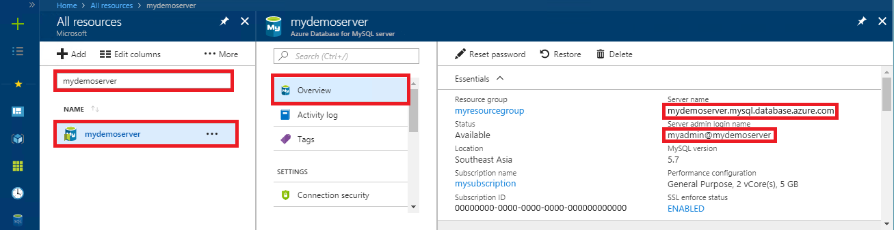

# Azure Database for MySQL: Use .NET (C#) to connect and query data
This quickstart demonstrates how to connect to an Azure Database for MySQL by using a C# application. It shows how to use SQL statements to query, insert, update, and delete data in the database. This topic assumes that you are familiar with developing using C# and that you are new to working with Azure Database for MySQL.

## Prerequisites
This quickstart uses the resources created in either of these guides as a starting point:
- [Create an Azure Database for MySQL server using Azure portal](./quickstart-create-mysql-server-database-using-azure-portal.md)
- [Create an Azure Database for MySQL server using Azure CLI](./quickstart-create-mysql-server-database-using-azure-cli.md)

You also need to:
- Install [.NET](https://www.microsoft.com/net/download). Follow the steps in the linked article to install .NET specifically for your platform (Windows, Ubuntu Linux, or macOS). 
- Install [Visual Studio](https://www.visualstudio.com/downloads/).

> [!IMPORTANT] 
> Ensure the IP address you're connecting from has been added the server's firewall rules using the [Azure portal](./howto-manage-firewall-using-portal.md) or [Azure CLI](./howto-manage-firewall-using-cli.md)

## Create a C# project
At a command prompt, run:

```
mkdir AzureMySqlExample
cd AzureMySqlExample
dotnet new console
dotnet add package MySqlConnector
```

## Get connection information
Get the connection information needed to connect to the Azure Database for MySQL. You need the fully qualified server name and login credentials.

1. Log in to the [Azure portal](https://portal.azure.com/).
2. From the left-hand menu in Azure portal, click **All resources**, and then search for the server you have created (such as **mydemoserver**).
3. Click the server name.
4. From the server's **Overview** panel, make a note of the **Server name** and **Server admin login name**. If you forget your password, you can also reset the password from this panel.
 

## Connect, create table, and insert data
Use the following code to connect and load the data by using `CREATE TABLE` and  `INSERT INTO` SQL statements. The code uses the `MySqlConnection` class with method [OpenAsync()](https://docs.microsoft.com/dotnet/api/system.data.common.dbconnection.openasync#System_Data_Common_DbConnection_OpenAsync) to establish a connection to MySQL. Then the code uses method [CreateCommand()](https://docs.microsoft.com/dotnet/api/system.data.common.dbconnection.createcommand), sets the CommandText property, and calls method [ExecuteNonQueryAsync()](https://docs.microsoft.com/dotnet/api/system.data.common.dbcommand.executenonqueryasync) to run the database commands. 

Replace the `Server`, `Database`, `UserID`, and `Password` parameters with the values that you specified when you created the server and database. 

```csharp
using System;
using System.Threading.Tasks;
using MySql.Data.MySqlClient;

namespace AzureMySqlExample
{
    class MySqlCreate
    {
        static async Task Main(string[] args)
        {
            var builder = new MySqlConnectionStringBuilder
            {
                Server = "YOUR-SERVER.mysql.database.azure.com",
                Database = "YOUR-DATABASE",
                UserID = "USER@YOUR-SERVER",
                Password = "PASSWORD",
                SslMode = MySqlSslMode.Required,
            };

            using (var conn = new MySqlConnection(builder.ConnectionString))
            {
                Console.WriteLine("Opening connection");
                await conn.OpenAsync();

                using (var command = conn.CreateCommand())
                {
                    command.CommandText = "DROP TABLE IF EXISTS inventory;";
                    await command.ExecuteNonQueryAsync();
                    Console.WriteLine("Finished dropping table (if existed)");

                    command.CommandText = "CREATE TABLE inventory (id serial PRIMARY KEY, name VARCHAR(50), quantity INTEGER);";
                    await command.ExecuteNonQueryAsync();
                    Console.WriteLine("Finished creating table");

                    command.CommandText = @"INSERT INTO inventory (name, quantity) VALUES (@name1, @quantity1),
                        (@name2, @quantity2), (@name3, @quantity3);";
                    command.Parameters.AddWithValue("@name1", "banana");
                    command.Parameters.AddWithValue("@quantity1", 150);
                    command.Parameters.AddWithValue("@name2", "orange");
                    command.Parameters.AddWithValue("@quantity2", 154);
                    command.Parameters.AddWithValue("@name3", "apple");
                    command.Parameters.AddWithValue("@quantity3", 100);

                    int rowCount = await command.ExecuteNonQueryAsync();
                    Console.WriteLine(String.Format("Number of rows inserted={0}", rowCount));
                }

                // connection will be closed by the 'using' block
                Console.WriteLine("Closing connection");
            }

            Console.WriteLine("Press RETURN to exit");
            Console.ReadLine();
        }
    }
}
```

## Read data

Use the following code to connect and read the data by using a `SELECT` SQL statement. The code uses the `MySqlConnection` class with method [OpenAsync()](https://docs.microsoft.com/dotnet/api/system.data.common.dbconnection.openasync#System_Data_Common_DbConnection_OpenAsync) to establish a connection to MySQL. Then the code uses method [CreateCommand()](https://docs.microsoft.com/dotnet/api/system.data.common.dbconnection.createcommand) and method [ExecuteReaderAsync()](https://docs.microsoft.com/dotnet/api/system.data.common.dbcommand.executereaderasync) to run the database commands. Next the code uses [ReadAsync()](https://docs.microsoft.com/dotnet/api/system.data.common.dbdatareader.readasync#System_Data_Common_DbDataReader_ReadAsync) to advance to the records in the results. Then the code uses GetInt32 and GetString to parse the values in the record.

Replace the `Server`, `Database`, `UserID`, and `Password` parameters with the values that you specified when you created the server and database. 

```csharp
using System;
using System.Threading.Tasks;
using MySql.Data.MySqlClient;

namespace AzureMySqlExample
{
    class MySqlRead
    {
        static async Task Main(string[] args)
        {
            var builder = new MySqlConnectionStringBuilder
            {
                Server = "YOUR-SERVER.mysql.database.azure.com",
                Database = "YOUR-DATABASE",
                UserID = "USER@YOUR-SERVER",
                Password = "PASSWORD",
                SslMode = MySqlSslMode.Required,
            };

            using (var conn = new MySqlConnection(builder.ConnectionString))
            {
                Console.WriteLine("Opening connection");
                await conn.OpenAsync();

                using (var command = conn.CreateCommand())
                {
                    command.CommandText = "SELECT * FROM inventory;";

                    using (var reader = await command.ExecuteReaderAsync())
                    {
                        while (await reader.ReadAsync())
                        {
                            Console.WriteLine(string.Format(
                                "Reading from table=({0}, {1}, {2})",
                                reader.GetInt32(0),
                                reader.GetString(1),
                                reader.GetInt32(2)));
                        }
                    }
                }

                Console.WriteLine("Closing connection");
            }

            Console.WriteLine("Press RETURN to exit");
            Console.ReadLine();
        }
    }
}
```

## Update data
Use the following code to connect and read the data by using an `UPDATE` SQL statement. The code uses the `MySqlConnection` class with method [OpenAsync()](https://docs.microsoft.com/dotnet/api/system.data.common.dbconnection.openasync#System_Data_Common_DbConnection_OpenAsync) to establish a connection to MySQL. Then the code uses method [CreateCommand()](https://docs.microsoft.com/dotnet/api/system.data.common.dbconnection.createcommand), sets the CommandText property, and calls method [ExecuteNonQueryAsync()](https://docs.microsoft.com/dotnet/api/system.data.common.dbcommand.executenonqueryasync) to run the database commands. 

Replace the `Server`, `Database`, `UserID`, and `Password` parameters with the values that you specified when you created the server and database. 

```csharp
using System;
using System.Threading.Tasks;
using MySql.Data.MySqlClient;

namespace AzureMySqlExample
{
    class MySqlUpdate
    {
        static async Task Main(string[] args)
        {
            var builder = new MySqlConnectionStringBuilder
            {
                Server = "YOUR-SERVER.mysql.database.azure.com",
                Database = "YOUR-DATABASE",
                UserID = "USER@YOUR-SERVER",
                Password = "PASSWORD",
                SslMode = MySqlSslMode.Required,
            };

            using (var conn = new MySqlConnection(builder.ConnectionString))
            {
                Console.WriteLine("Opening connection");
                await conn.OpenAsync();

                using (var command = conn.CreateCommand())
                {
                    command.CommandText = "UPDATE inventory SET quantity = @quantity WHERE name = @name;";
                    command.Parameters.AddWithValue("@quantity", 200);
                    command.Parameters.AddWithValue("@name", "banana");

                    int rowCount = await command.ExecuteNonQueryAsync();
                    Console.WriteLine(String.Format("Number of rows updated={0}", rowCount));
                }

                Console.WriteLine("Closing connection");
            }

            Console.WriteLine("Press RETURN to exit");
            Console.ReadLine();
        }
    }
}
```

## Delete data
Use the following code to connect and delete the data by using a `DELETE` SQL statement. 

The code uses the `MySqlConnection` class with method [OpenAsync()](https://docs.microsoft.com/dotnet/api/system.data.common.dbconnection.openasync#System_Data_Common_DbConnection_OpenAsync) to establish a connection to MySQL. Then the code uses method [CreateCommand()](https://docs.microsoft.com/dotnet/api/system.data.common.dbconnection.createcommand), sets the CommandText property, and calls method [ExecuteNonQueryAsync()](https://docs.microsoft.com/dotnet/api/system.data.common.dbcommand.executenonqueryasync) to run the database commands. 

Replace the `Server`, `Database`, `UserID`, and `Password` parameters with the values that you specified when you created the server and database. 

```csharp
using System;
using System.Threading.Tasks;
using MySql.Data.MySqlClient;

namespace AzureMySqlExample
{
    class MySqlDelete
    {
        static async Task Main(string[] args)
        {
            var builder = new MySqlConnectionStringBuilder
            {
                Server = "YOUR-SERVER.mysql.database.azure.com",
                Database = "YOUR-DATABASE",
                UserID = "USER@YOUR-SERVER",
                Password = "PASSWORD",
                SslMode = MySqlSslMode.Required,
            };

            using (var conn = new MySqlConnection(builder.ConnectionString))
            {
                Console.WriteLine("Opening connection");
                await conn.OpenAsync();

                using (var command = conn.CreateCommand())
                {
                    command.CommandText = "DELETE FROM inventory WHERE name = @name;";
                    command.Parameters.AddWithValue("@name", "orange");

                    int rowCount = await command.ExecuteNonQueryAsync();
                    Console.WriteLine(String.Format("Number of rows deleted={0}", rowCount));
                }

                Console.WriteLine("Closing connection");
            }

            Console.WriteLine("Press RETURN to exit");
            Console.ReadLine();
        }
    }
}
```

## Next steps
> [!div class="nextstepaction"]
> [Migrate your MySQL database to Azure Database for MySQL using dump and restore](concepts-migrate-dump-restore.md)
