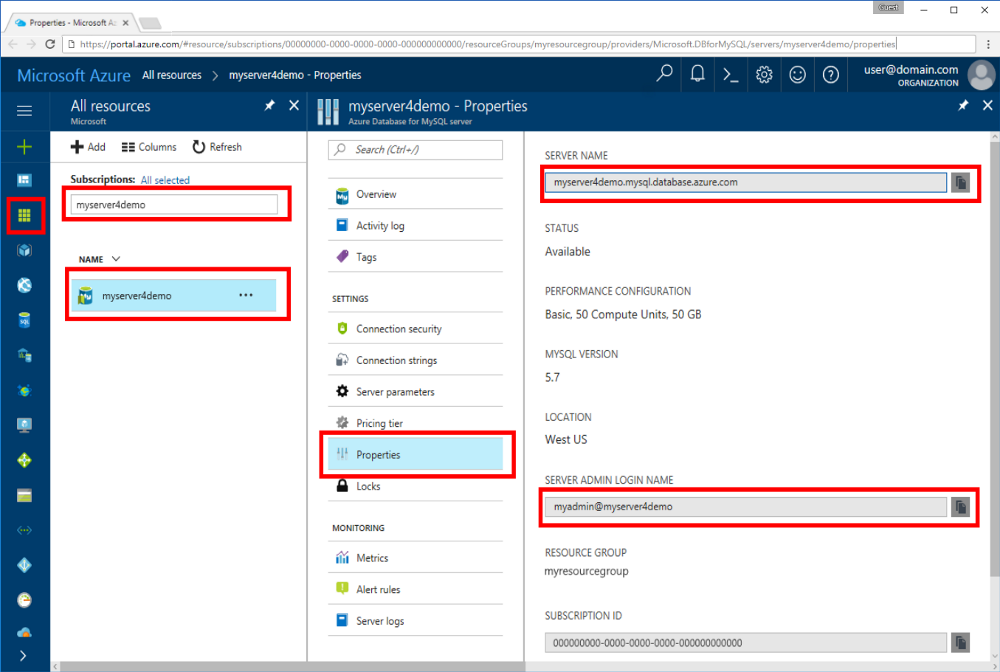

# Azure Database for MySQL: Use Go language to connect and query data
This quickstart demonstrates how to connect to an Azure Database for MySQL using code written in the [Go](https://golang.org/) language. It shows how to use SQL statements to query, insert, update, and delete data in the database. This article assumes you are familiar with development using Go, but that you are new to working with Azure Database for MySQL.

## Prerequisites
This quickstart uses the resources created in either of these guides as a starting point:
- [Create an Azure Database for MySQL server using Azure portal](./quickstart-create-mysql-server-database-using-azure-portal.md)
- [Create an Azure Database for MySQL server using Azure CLI](./quickstart-create-mysql-server-database-using-azure-cli.md)

## Install Go and MySQL connector
- Download and install Go according to the [installation instructions](https://golang.org/doc/install)  matching your platform.
- Make a folder for your project such as `mkdir C:\mysqlgo\` or `mkdir /c/mysqlgo/`. 
- Launch the command line or bash, change directory into the project folder, such as `cd C:\mysqlgo\` or `cd /c/mysqlgo/`.
- Install the [go-sql-driver for mysql](https://github.com/go-sql-driver/mysql#installation)

```cmd / bash
go get github.com/go-sql-driver/mysql`
```

## Get connection information
Get the connection information needed to connect to the Azure Database for MySQL. You need the fully qualified server name and login credentials.

1. Log in to the [Azure portal](https://portal.azure.com/).
2. From the left-hand menu in Azure portal, click **All resources** and search for the server you have creased, such as **myserver4demo**.
3. Click the server name **myserver4demo**.
4. Select the server's **Properties** page. Make a note of the **Server name** and **Server admin login name**.
 
5. If you forget your server login information, navigate to the **Overview** page to view the Server admin login name and, if necessary, reset the password.
   

## Build and run Go code 
- Save the code from the sections below into a text file with extension *.go into your project folder, such as `C:\mysqlgo\createtable.go`.
- To run the code, change directory into your project folder `cd mysqlgo`, then type the command `go run createtable.go` to compile the application and run it.
- To build the code into a native application, `go build createtable.go`, then launch createtable.exe to run the application.

## Connect, create table, and insert data
Use the following code to connect to the server, create a table, and load the data using an **INSERT** SQL statement. 

The code imports three packages: the [sql package](https://golang.org/pkg/database/sql/), the [go sql driver for mysql](https://github.com/go-sql-driver/mysql#installation) as a driver to communicate with the Azure Database for MySQL, and the [fmt package](https://golang.org/pkg/fmt/) for printed input and output on the command line.

The code calls method [sql.Open()](http://go-database-sql.org/accessing.html) to connect to Azure Database for MySQL, and checks the connection using method [db.Ping()](https://golang.org/pkg/database/sql/#DB.Ping). A [database handle](https://golang.org/pkg/database/sql/#DB) is used throughout, holding the connection pool for the database server. The code calls the [Exec()](https://golang.org/pkg/database/sql/#DB.Exec) method several times to run several DDL commands. The code also uses the [Prepare()](http://go-database-sql.org/prepared.html) and Exec() to run prepared statements with different parameters to insert 3 rows. Each time a custom checkError() method to check if an error occurred and panic to exit if an error occurs.

Replace the `HOST`, `DATABASE`, `USER`, and `PASSWORD` parameters with your own values. 

```Go
package main

import (
	"database/sql"
	"fmt"

	_ "github.com/go-sql-driver/mysql"
)

const (
	HOST     = "myserver4demo.mysql.database.azure.com"
	DATABASE = "quickstartdb"
	USER     = "myadmin@myserver4demo"
	PASSWORD = "yourpassword"
)

func checkError(err error) {
	if err != nil {
		panic(err)
	}
}

func main() {

	// Initialize connection string.
	var connectionString = fmt.Sprintf("%s:%s@tcp(%s:3306)/%s?allowNativePasswords=true", USER, PASSWORD, HOST, DATABASE)

	// Initialize connection object.
	db, err := sql.Open("mysql", connectionString)
	checkError(err)

	err = db.Ping()
	checkError(err)
	fmt.Println("Successfully created connection to database.")

	// Drop previous table of same name if one exists.
	_, err = db.Exec("DROP TABLE IF EXISTS inventory;")
	checkError(err)
	fmt.Println("Finished dropping table (if existed).")

	// Create table.
	_, err = db.Exec("CREATE TABLE inventory (id serial PRIMARY KEY, name VARCHAR(50), quantity INTEGER);")
	checkError(err)
	fmt.Println("Finished creating table.")

	// Insert some data into table.
	sqlstatement, err := db.Prepare("INSERT INTO inventory (name, quantity) VALUES (?, ?);")
	res, err := sqlstatement.Exec("banana", 150)
	checkError(err)
	rowCnt, err := res.RowsAffected()
	fmt.Printf("Inserted %d row(s) of data.\n", rowCnt)

	res, err = sqlstatement.Exec("orange", 154)
	checkError(err)
	rowCnt, err = res.RowsAffected()
	fmt.Printf("Inserted %d row(s) of data.\n", rowCnt)

	res, err = sqlstatement.Exec("apple", 100)
	checkError(err)
	rowCnt, err = res.RowsAffected()
	fmt.Printf("Inserted %d row(s) of data.\n", rowCnt)
}

```

## Read data
Use the following code to connect and read the data using a **SELECT** SQL statement. 

The code imports three packages: the [sql package](https://golang.org/pkg/database/sql/), the [go sql driver for mysql](https://github.com/go-sql-driver/mysql#installation) as a driver to communicate with the Azure Database for MySQL, and the [fmt package](https://golang.org/pkg/fmt/) for printed input and output on the command line.

The code calls method [sql.Open()](http://go-database-sql.org/accessing.html) to connect to Azure Database for MySQL, and checks the connection using method [db.Ping()](https://golang.org/pkg/database/sql/#DB.Ping). A [database handle](https://golang.org/pkg/database/sql/#DB) is used throughout, holding the connection pool for the database server. The code calls the [Exec()](https://golang.org/pkg/database/sql/#DB.Exec) method several times to run several DDL commands. The code also uses the [Prepare()](http://go-database-sql.org/prepared.html) and Exec() to run prepared statements with different parameters to insert 3 rows. Each time a custom checkError() method to check if an error occurred and panic to exit if an error occurs.

Replace the `HOST`, `DATABASE`, `USER`, and `PASSWORD` parameters with your own values. 
```Go
package main

import (
	"database/sql"
	"fmt"

	_ "github.com/go-sql-driver/mysql"
)

const (
	HOST     = "myserver4demo.mysql.database.azure.com"
	DATABASE = "quickstartdb"
	USER     = "myadmin@myserver4demo"
	PASSWORD = "yourpassword"
)

func checkError(err error) {
	if err != nil {
		panic(err)
	}
}

func main() {

	// Initialize connection string.
	var connectionString = fmt.Sprintf("%s:%s@tcp(%s:3306)/%s?allowNativePasswords=true", USER, PASSWORD, HOST, DATABASE)

	// Initialize connection object.
	db, err := sql.Open("mysql", connectionString)
	checkError(err)

	err = db.Ping()
	checkError(err)
	fmt.Println("Successfully created connection to database.")

	// Variables for printing column data when scanned.
	var (
		id       int
		name     string
		quantity int
	)

	// Read some data from the table.
	rows, err := db.Query("SELECT id, name, quantity from inventory;")
	checkError(err)
	defer rows.Close()
	fmt.Println("Reading data:")
	for rows.Next() {
		err := rows.Scan(&id, &name, &quantity)
		checkError(err)
		fmt.Printf("Data row = (%d, %s, %d)\n", id, name, quantity)
	}
	err = rows.Err()
	checkError(err)
	fmt.Println("Done.")
}
```

## Update data
Use the following code to connect and update the data using a **UPDATE** SQL statement. 

The code imports three packages: the [sql package](https://golang.org/pkg/database/sql/), the [go sql driver for mysql](https://github.com/go-sql-driver/mysql#installation) as a driver to communicate with the Azure Database for MySQL, and the [fmt package](https://golang.org/pkg/fmt/) for printed input and output on the command line.

The code calls method [sql.Open()](http://go-database-sql.org/accessing.html) to connect to Azure Database for MySQL, and checks the connection using method [db.Ping()](https://golang.org/pkg/database/sql/#DB.Ping). A [database handle](https://golang.org/pkg/database/sql/#DB) is used throughout, holding the connection pool for the database server. The code calls the [Exec()](https://golang.org/pkg/database/sql/#DB.Exec) method several times to run several DDL commands. The code also uses the [Prepare()](http://go-database-sql.org/prepared.html) and Exec() to run prepared statements with different parameters to insert 3 rows. Each time a custom checkError() method to check if an error occurred and panic to exit if an error occurs.

Replace the `HOST`, `DATABASE`, `USER`, and `PASSWORD` parameters with your own values. 

```Go
package main

import (
	"database/sql"
	"fmt"

	_ "github.com/go-sql-driver/mysql"
)

const (
	HOST     = "myserver4demo.mysql.database.azure.com"
	DATABASE = "quickstartdb"
	USER     = "myadmin@myserver4demo"
	PASSWORD = "yourpassword"
)

func checkError(err error) {
	if err != nil {
		panic(err)
	}
}

func main() {

	// Initialize connection string.
	var connectionString = fmt.Sprintf("%s:%s@tcp(%s:3306)/%s?allowNativePasswords=true", USER, PASSWORD, HOST, DATABASE)

	// Initialize connection object.
	db, err := sql.Open("mysql", connectionString)
	checkError(err)

	err = db.Ping()
	checkError(err)
	fmt.Println("Successfully created connection to database.")

	// Modify some data in table.
	rows, err := db.Exec("UPDATE inventory SET quantity = ? WHERE name = ?", 200, "banana")
	checkError(err)
	rowcount, err := rows.RowsAffected()
	fmt.Printf("Updated %d row(s) of data.\n", rowcount)
	fmt.Println("Done.")
}
```

## Delete data
Use the following code to connect and remove data using a **DELETE** SQL statement. 

The code imports three packages: the [sql package](https://golang.org/pkg/database/sql/), the [go sql driver for mysql](https://github.com/go-sql-driver/mysql#installation) as a driver to communicate with the Azure Database for MySQL, and the [fmt package](https://golang.org/pkg/fmt/) for printed input and output on the command line.

The code calls method [sql.Open()](http://go-database-sql.org/accessing.html) to connect to Azure Database for MySQL, and checks the connection using method [db.Ping()](https://golang.org/pkg/database/sql/#DB.Ping). A [database handle](https://golang.org/pkg/database/sql/#DB) is used throughout, holding the connection pool for the database server. The code calls the [Exec()](https://golang.org/pkg/database/sql/#DB.Exec) method several times to run several DDL commands. The code also uses the [Prepare()](http://go-database-sql.org/prepared.html) and Exec() to run prepared statements with different parameters to insert 3 rows. Each time a custom checkError() method to check if an error occurred and panic to exit if an error occurs.

Replace the `HOST`, `DATABASE`, `USER`, and `PASSWORD` parameters with your own values. 

```Go
package main

import (
	"database/sql"
	"fmt"
	_ "github.com/go-sql-driver/mysql"
)

const (
	HOST     = "myserver4demo.mysql.database.azure.com"
	DATABASE = "quickstartdb"
	USER     = "myadmin@myserver4demo"
	PASSWORD = "yourpassword"
)

func checkError(err error) {
	if err != nil {
		panic(err)
	}
}

func main() {

	// Initialize connection string.
	var connectionString = fmt.Sprintf("%s:%s@tcp(%s:3306)/%s?allowNativePasswords=true", USER, PASSWORD, HOST, DATABASE)

	// Initialize connection object.
	db, err := sql.Open("mysql", connectionString)
	checkError(err)

	err = db.Ping()
	checkError(err)
	fmt.Println("Successfully created connection to database.")

	// Modify some data in table.
	rows, err := db.Exec("DELETE FROM inventory WHERE name = ?", "orange")
	checkError(err)
	rowcount, err := rows.RowsAffected()
	fmt.Printf("Deleted %d row(s) of data.\n", rowcount)
	fmt.Println("Done.")
}
```

## Next steps
> [!div class="nextstepaction"]
> [Migrate your database using Export and Import](./concepts-migrate-import-export.md)
