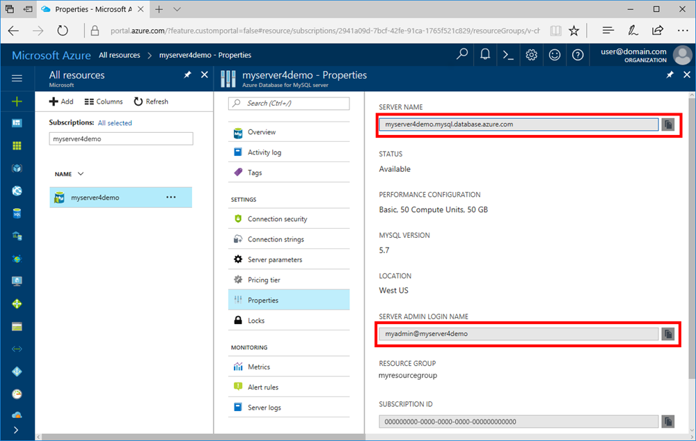

# Azure Database for MySQL: Use PHP to connect and query data
This quickstart demonstrates how to connect to an Azure Database for MySQL using a [PHP](http://php.net/manual/intro-whatis.php) application. It shows how to use SQL statements to query, insert, update, and delete data in the database. This article assumes you are familiar with development using PHP, but that you are new to working with Azure Database for MySQL.

## Prerequisites
This quickstart uses the resources created in either of these guides as a starting point:
- [Create an Azure Database for MySQL server using Azure portal](./quickstart-create-mysql-server-database-using-azure-portal.md)
- [Create an Azure Database for MySQL server using Azure CLI](./quickstart-create-mysql-server-database-using-azure-cli.md)

## Install PHP
Install PHP on your own server, or create an Azure [web app](https://docs.microsoft.com/en-us/azure/app-service-web/app-service-web-overview) that includes PHP.

### MacOS
- Download [PHP 7.1.4 version](http://php.net/downloads.php)
- Install PHP and refer to the [PHP manual](http://php.net/manual/install.macosx.php) for further configuration

### Linux (Ubuntu)
- Download [PHP 7.1.4 non-thread safe (x64) version](http://php.net/downloads.php)
- Install PHP and refer to the [PHP manual](http://php.net/manual/install.unix.php) for further configuration

### Windows
- Download [PHP 7.1.4 non-thread safe (x64) version](http://windows.php.net/download#php-7.1)
- Install PHP and refer to the [PHP manual](http://php.net/manual/install.windows.php) for further configuration

## Get connection information
Get the connection information needed to connect to the Azure Database for MySQL. You need the fully qualified server name and login credentials.

1. Log in to the [Azure portal](https://portal.azure.com/).
2. From the left-hand menu in Azure portal, click **All resources** and search for the server you have created, such as **myserver4demo**.
3. Click the server name.
4. Select the server's **Properties** page. Make a note of the **Server name** and **Server admin login name**.
 
5. If you forget your server login information, navigate to the **Overview** page to view the Server admin login name and, if necessary, reset the password.

## Connect and create a table
Use the following code to connect and create a table using **CREATE TABLE** SQL statement. 

The code uses the **MySQL Improved extension** (mysqli) class included in PHP. The code call methods [mysqli_init](http://php.net/manual/mysqli.init.php) and [mysqli_real_connect](http://php.net/manual/mysqli.real-connect.php) to connect to MySQL. Then it calls method 
[mysqli_query](http://php.net/manual/mysqli.query.php) to run the query. Then it calls method [mysqli_close](http://php.net/manual/mysqli.close.php) to close the connection.

Replace the host, username, password, and db_name parameters with your own values. 

```php
<?php
$host = 'myserver4demo.mysql.database.azure.com';
$username = 'myadmin@myserver4demo';
$password = 'your_password';
$db_name = 'your_database';

//Establishes the connection
$conn = mysqli_init();
mysqli_real_connect($conn, $host, $username, $password, $db_name, 3306);
if (mysqli_connect_errno($conn)) {
die('Failed to connect to MySQL: '.mysqli_connect_error());
}

// Run the create table query
if (mysqli_query($conn, '
CREATE TABLE Products (
`Id` INT NOT NULL AUTO_INCREMENT ,
`ProductName` VARCHAR(200) NOT NULL ,
`Color` VARCHAR(50) NOT NULL ,
`Price` DOUBLE NOT NULL ,
PRIMARY KEY (`Id`)
);
')) {
printf("Table created\n");
}

//Close the connection
mysqli_close($conn);
?>
```

## Insert data
Use the following code to connect and insert data using an **INSERT** SQL statement.

The code uses the **MySQL Improved extension** (mysqli) class included in PHP. The code uses method [mysqli_prepare](http://php.net/manual/mysqli.prepare.php) to create a prepared insert statement, then binds the parameters for each inserted column value using method [mysqli_stmt_bind_param](http://php.net/manual/mysqli-stmt.bind-param.php). The code runs the statement using method [mysqli_stmt_execute](http://php.net/manual/mysqli-stmt.execute.php) and afterwards closes the statement using method [mysqli_stmt_close](http://php.net/manual/mysqli-stmt.close.php).

Replace the host, username, password, and db_name parameters with your own values. 

```php
<?php
$host = 'myserver4demo.mysql.database.azure.com';
$username = 'myadmin@myserver4demo';
$password = 'your_password';
$db_name = 'your_database';

//Establishes the connection
$conn = mysqli_init();
mysqli_real_connect($conn, $host, $username, $password, $db_name, 3306);
if (mysqli_connect_errno($conn)) {
die('Failed to connect to MySQL: '.mysqli_connect_error());
}

//Create an Insert prepared statement and run it
$product_name = 'BrandNewProduct';
$product_color = 'Blue';
$product_price = 15.5;
if ($stmt = mysqli_prepare($conn, "INSERT INTO Products (ProductName, Color, Price) VALUES (?, ?, ?)")) {
mysqli_stmt_bind_param($stmt, 'ssd', $product_name, $product_color, $product_price);
mysqli_stmt_execute($stmt);
printf("Insert: Affected %d rows\n", mysqli_stmt_affected_rows($stmt));
mysqli_stmt_close($stmt);
}

// Close the connection
mysqli_close($conn);
?>
```

## Read data
Use the following code to connect and read the data using a **SELECT** SQL statement.  The code uses the **MySQL Improved extension** (mysqli) class included in PHP. The code uses method [mysqli_query](http://php.net/manual/mysqli.query.php) perform the sql query, and uses [mysqli_fetch_assoc](http://php.net/manual/mysqli-result.fetch-assoc.php) method to fetch the resulting rows.

Replace the host, username, password, and db_name parameters with your own values. 

```php
<?php
$host = 'myserver4demo.mysql.database.azure.com';
$username = 'myadmin@myserver4demo';
$password = 'your_password';
$db_name = 'your_database';

//Establishes the connection
$conn = mysqli_init();
mysqli_real_connect($conn, $host, $username, $password, $db_name, 3306);
if (mysqli_connect_errno($conn)) {
die('Failed to connect to MySQL: '.mysqli_connect_error());
}

//Run the Select query
printf("Reading data from table: \n");
$res = mysqli_query($conn, 'SELECT * FROM Products');
while ($row = mysqli_fetch_assoc($res)) {
var_dump($row);
}

//Close the connection
mysqli_close($conn);
?>
```

## Update data
Use the following code to connect and update the data using a **UPDATE** SQL statement.

The code uses the **MySQL Improved extension** (mysqli) class included in PHP. The code uses method [mysqli_prepare](http://php.net/manual/mysqli.prepare.php) to create a prepared update statement, then binds the parameters for each updated column value using method [mysqli_stmt_bind_param](http://php.net/manual/mysqli-stmt.bind-param.php). The code runs the statement using method [mysqli_stmt_execute](http://php.net/manual/mysqli-stmt.execute.php) and afterwards closes the statement using method [mysqli_stmt_close](http://php.net/manual/mysqli-stmt.close.php).

Replace the host, username, password, and db_name parameters with your own values. 

```php
<?php
$host = 'myserver4demo.mysql.database.azure.com';
$username = 'myadmin@myserver4demo';
$password = 'your_password';
$db_name = 'your_database';

//Establishes the connection
$conn = mysqli_init();
mysqli_real_connect($conn, $host, $username, $password, $db_name, 3306);
if (mysqli_connect_errno($conn)) {
die('Failed to connect to MySQL: '.mysqli_connect_error());
}

//Run the Update statement
$product_name = 'BrandNewProduct';
$new_product_price = 15.1;
if ($stmt = mysqli_prepare($conn, "UPDATE Products SET Price = ? WHERE ProductName = ?")) {
mysqli_stmt_bind_param($stmt, 'ds', $new_product_price, $product_name);
mysqli_stmt_execute($stmt);
printf("Update: Affected %d rows\n", mysqli_stmt_affected_rows($stmt));

//Close the connection
mysqli_stmt_close($stmt);
}

mysqli_close($conn);
?>
```


## Delete data
Use the following code to connect and read the data using a **DELETE** SQL statement. 

The code uses the **MySQL Improved extension** (mysqli) class included in PHP. The code uses method [mysqli_prepare](http://php.net/manual/mysqli.prepare.php) to create a prepared delete statement, then binds the parameters for the where clause in the statement using method [mysqli_stmt_bind_param](http://php.net/manual/mysqli-stmt.bind-param.php). The code runs the statement using method [mysqli_stmt_execute](http://php.net/manual/mysqli-stmt.execute.php) and afterwards closes the statement using method [mysqli_stmt_close](http://php.net/manual/mysqli-stmt.close.php).

Replace the host, username, password, and db_name parameters with your own values. 

```php
<?php
$host = 'myserver4demo.mysql.database.azure.com';
$username = 'myadmin@myserver4demo';
$password = 'your_password';
$db_name = 'your_database';

//Establishes the connection
$conn = mysqli_init();
mysqli_real_connect($conn, $host, $username, $password, $db_name, 3306);
if (mysqli_connect_errno($conn)) {
die('Failed to connect to MySQL: '.mysqli_connect_error());
}

//Run the Delete statement
$product_name = 'BrandNewProduct';
if ($stmt = mysqli_prepare($conn, "DELETE FROM Products WHERE ProductName = ?")) {
mysqli_stmt_bind_param($stmt, 's', $product_name);
mysqli_stmt_execute($stmt);
printf("Delete: Affected %d rows\n", mysqli_stmt_affected_rows($stmt));
mysqli_stmt_close($stmt);
}

//Close the connection
mysqli_close($conn);
?>
```

## Next steps
> [!div class="nextstepaction"]
> [Build a PHP and MySQL web app in Azure](../app-service-web/app-service-web-tutorial-php-mysql.md?toc=%2fazure%2fmysql%2ftoc.json)
