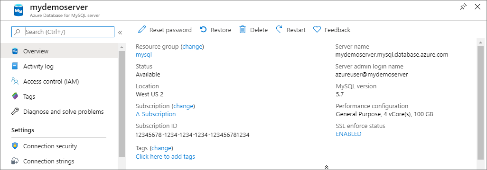

# Quickstart: Use Python to connect and query data with Azure Database for MySQL
This quickstart demonstrates how to use [Python](https://python.org) to connect to an Azure Database for MySQL. The article uses SQL statements to query, insert, update, and delete data in the database from Mac OS, Ubuntu Linux, and Windows platforms. 

This article assumes that you're familiar with developing using Python, but you're new to working with Azure Database for MySQL.

## Create an Azure Database for MySQL 
Create an Azure Database for MySQL server and database by following the procedures at [Create an Azure Database for MySQL server using Azure portal](quickstart-create-mysql-server-database-using-azure-portal.md) or [Create an Azure Database for MySQL server using Azure CLI](quickstart-create-mysql-server-database-using-azure-cli.md). 

## Install Python and the MySQL connector
Install [Python](https://www.python.org/downloads/) and the [MySQL connector for Python](https://dev.mysql.com/downloads/connector/python/) on your computer by using the following steps, depending on your platform. 

> [!NOTE]
> This quickstart uses a raw SQL query approach to connect to MySQL. If you're using a web framework, use the recommended connector for the framework, for example, [mysqlclient](https://pypi.org/project/mysqlclient/) for Django.
>

### Windows
1. Download and install Python 3.7 from [python.org](https://www.python.org/downloads/windows/). 
1. Open a command prompt, and check the Python version number by running `C:\python37\python.exe -V` with the uppercase V switch.
1. Install the corresponding version Python connector for MySQL from [mysql.com](https://dev.mysql.com/downloads/connector/python/).

### Linux (Ubuntu) or MacOS
1. Python is usually part of the default Linux (Ubuntu) or MacOS installation.
1. Check the Python version number by launching a `bash` shell and running `python -V` with the uppercase V switch.
1. The `pip` package installer is included in some versions of Python. Check the `pip` installation by running `pip show pip -V` to see the version number. If `pip` isn't installed, install the [pip](https://pip.pypa.io/en/stable/installing/) package by running `sudo apt-get install python-pip`.
1. Update `pip` to the latest version by running `pip install -U pip`.
1. Install the MySQL connector for Python and its dependencies by using `pip`:

   ```bash
   sudo pip install mysql-connector-python-rf
   ```

## Get connection information
Get the connection information you need to connect to Azure Database for MySQL from the Azure portal. You need the server name, database name, and login credentials.

1. Sign in to the [Azure portal](https://portal.azure.com/).
2. From the Search bar, search for the Azure Database for MySQL server you created, such as **mydemoserver**.
3. Select the server name.
4. From the server's **Overview** page, make a note of the **Server name** and **Server admin login name**. If you forget your password, you can also reset the password from this page.
   

## Run the Python examples
For each code example in this article:

1. Create a new file in a text editor.
   
1. Add the code example to the file. In the code, replace the `<mydemoserver>`, `<myadmin>`, `<mypassword>`, and `<quickstartdb>` placeholders with the values for your MySQL server and database.
   
1. Save the file in a project folder with a *.py* extension, such as *C:\pythonmysql\createtable.py* or */home/username/pythonmysql/createtable.py*.
   
1. To run the code, open a command prompt or `bash` shell and change directory into your project folder, for example `cd pythonmysql`. Type the `python` command followed by the file name, for example `python createtable.py`, and press Enter. 
   
   > [!NOTE]
   > On Windows, if *python.exe* is not found, you may need to add the Python path into your PATH environment variable, or provide the full path to *python.exe*, for example `C:\python27\python.exe createtable.py`.

## Create a table and insert data
Use the following code to connect to the server and database, create a table, and load data by using an **INSERT** SQL statement. 

The code imports the mysql.connector library, and uses the [connect()](https://dev.mysql.com/doc/connector-python/en/connector-python-api-mysql-connector-connect.html) function to connect to Azure Database for MySQL using the [connection arguments](https://dev.mysql.com/doc/connector-python/en/connector-python-connectargs.html) in the config collection. The code uses a cursor on the connection, and the [cursor.execute()](https://dev.mysql.com/doc/connector-python/en/connector-python-api-mysqlcursor-execute.html) method executes the SQL query against the MySQL database. 

```python
import mysql.connector
from mysql.connector import errorcode

# Obtain connection string information from the portal
config = {
  'host':'<mydemoserver>.mysql.database.azure.com',
  'user':'<myadmin>@<mydemoserver>',
  'password':'<mypassword>',
  'database':'<quickstartdb>'
}

# Construct connection string
try:
   conn = mysql.connector.connect(**config)
   print("Connection established")
except mysql.connector.Error as err:
  if err.errno == errorcode.ER_ACCESS_DENIED_ERROR:
    print("Something is wrong with the user name or password")
  elif err.errno == errorcode.ER_BAD_DB_ERROR:
    print("Database does not exist")
  else:
    print(err)
else:
  cursor = conn.cursor()

  # Drop previous table of same name if one exists
  cursor.execute("DROP TABLE IF EXISTS inventory;")
  print("Finished dropping table (if existed).")

  # Create table
  cursor.execute("CREATE TABLE inventory (id serial PRIMARY KEY, name VARCHAR(50), quantity INTEGER);")
  print("Finished creating table.")

  # Insert some data into table
  cursor.execute("INSERT INTO inventory (name, quantity) VALUES (%s, %s);", ("banana", 150))
  print("Inserted",cursor.rowcount,"row(s) of data.")
  cursor.execute("INSERT INTO inventory (name, quantity) VALUES (%s, %s);", ("orange", 154))
  print("Inserted",cursor.rowcount,"row(s) of data.")
  cursor.execute("INSERT INTO inventory (name, quantity) VALUES (%s, %s);", ("apple", 100))
  print("Inserted",cursor.rowcount,"row(s) of data.")

  # Cleanup
  conn.commit()
  cursor.close()
  conn.close()
  print("Done.")
```

## Read data
Use the following code to connect and read the data by using a **SELECT** SQL statement. 

The code imports the mysql.connector library, and uses the [connect()](https://dev.mysql.com/doc/connector-python/en/connector-python-api-mysql-connector-connect.html) function to connect to Azure Database for MySQL using the [connection arguments](https://dev.mysql.com/doc/connector-python/en/connector-python-connectargs.html) in the config collection. The code uses a cursor on the connection, and the [cursor.execute()](https://dev.mysql.com/doc/connector-python/en/connector-python-api-mysqlcursor-execute.html) method executes the SQL query against the MySQL database. 

The code reads the data rows using the [fetchall()](https://dev.mysql.com/doc/connector-python/en/connector-python-api-mysqlcursor-fetchall.html) method, keeps the result set in a collection row, and uses a `for` iterator to loop over the rows.

```python
import mysql.connector
from mysql.connector import errorcode

# Obtain connection string information from the portal
config = {
  'host':'<mydemoserver>.mysql.database.azure.com',
  'user':'<myadmin>@<mydemoserver>',
  'password':'<mypassword>',
  'database':'<quickstartdb>'
}

# Construct connection string
try:
   conn = mysql.connector.connect(**config)
   print("Connection established")
except mysql.connector.Error as err:
  if err.errno == errorcode.ER_ACCESS_DENIED_ERROR:
    print("Something is wrong with the user name or password")
  elif err.errno == errorcode.ER_BAD_DB_ERROR:
    print("Database does not exist")
  else:
    print(err)
else:
  cursor = conn.cursor()

  # Read data
  cursor.execute("SELECT * FROM inventory;")
  rows = cursor.fetchall()
  print("Read",cursor.rowcount,"row(s) of data.")

  # Print all rows
  for row in rows:
  	print("Data row = (%s, %s, %s)" %(str(row[0]), str(row[1]), str(row[2])))

  # Cleanup
  conn.commit()
  cursor.close()
  conn.close()
  print("Done.")
```

## Update data
Use the following code to connect and update the data by using an **UPDATE** SQL statement. 

The code imports the mysql.connector library, and uses the [connect()](https://dev.mysql.com/doc/connector-python/en/connector-python-api-mysql-connector-connect.html) function to connect to Azure Database for MySQL using the [connection arguments](https://dev.mysql.com/doc/connector-python/en/connector-python-connectargs.html) in the config collection. The code uses a cursor on the connection, and the [cursor.execute()](https://dev.mysql.com/doc/connector-python/en/connector-python-api-mysqlcursor-execute.html) method executes the SQL query against the MySQL database. 

```python
import mysql.connector
from mysql.connector import errorcode

# Obtain connection string information from the portal
config = {
  'host':'<mydemoserver>.mysql.database.azure.com',
  'user':'<myadmin>@<mydemoserver>',
  'password':'<mypassword>',
  'database':'<quickstartdb>'
}

# Construct connection string
try:
   conn = mysql.connector.connect(**config)
   print("Connection established")
except mysql.connector.Error as err:
  if err.errno == errorcode.ER_ACCESS_DENIED_ERROR:
    print("Something is wrong with the user name or password")
  elif err.errno == errorcode.ER_BAD_DB_ERROR:
    print("Database does not exist")
  else:
    print(err)
else:
  cursor = conn.cursor()

  # Update a data row in the table
  cursor.execute("UPDATE inventory SET quantity = %s WHERE name = %s;", (200, "banana"))
  print("Updated",cursor.rowcount,"row(s) of data.")

  # Cleanup
  conn.commit()
  cursor.close()
  conn.close()
  print("Done.")
```

## Delete data
Use the following code to connect and remove data by using a **DELETE** SQL statement. 

The code imports the mysql.connector library, and uses the [connect()](https://dev.mysql.com/doc/connector-python/en/connector-python-api-mysql-connector-connect.html) function to connect to Azure Database for MySQL using the [connection arguments](https://dev.mysql.com/doc/connector-python/en/connector-python-connectargs.html) in the config collection. The code uses a cursor on the connection, and the [cursor.execute()](https://dev.mysql.com/doc/connector-python/en/connector-python-api-mysqlcursor-execute.html) method executes the SQL query against the MySQL database. 

```python
import mysql.connector
from mysql.connector import errorcode

# Obtain connection string information from the portal
config = {
  'host':'<mydemoserver>.mysql.database.azure.com',
  'user':'<myadmin>@<mydemoserver>',
  'password':'<mypassword>',
  'database':'<quickstartdb>'
}

# Construct connection string
try:
   conn = mysql.connector.connect(**config)
   print("Connection established.")
except mysql.connector.Error as err:
  if err.errno == errorcode.ER_ACCESS_DENIED_ERROR:
    print("Something is wrong with the user name or password.")
  elif err.errno == errorcode.ER_BAD_DB_ERROR:
    print("Database does not exist.")
  else:
    print(err)
else:
  cursor = conn.cursor()

  # Delete a data row in the table
  cursor.execute("DELETE FROM inventory WHERE name=%(param1)s;", {'param1':"orange"})
  print("Deleted",cursor.rowcount,"row(s) of data.")

  # Cleanup
  conn.commit()
  cursor.close()
  conn.close()
  print("Done.")
```

## Next steps
> [!div class="nextstepaction"]
> [Migrate your database using Export and Import](./concepts-migrate-import-export.md)
