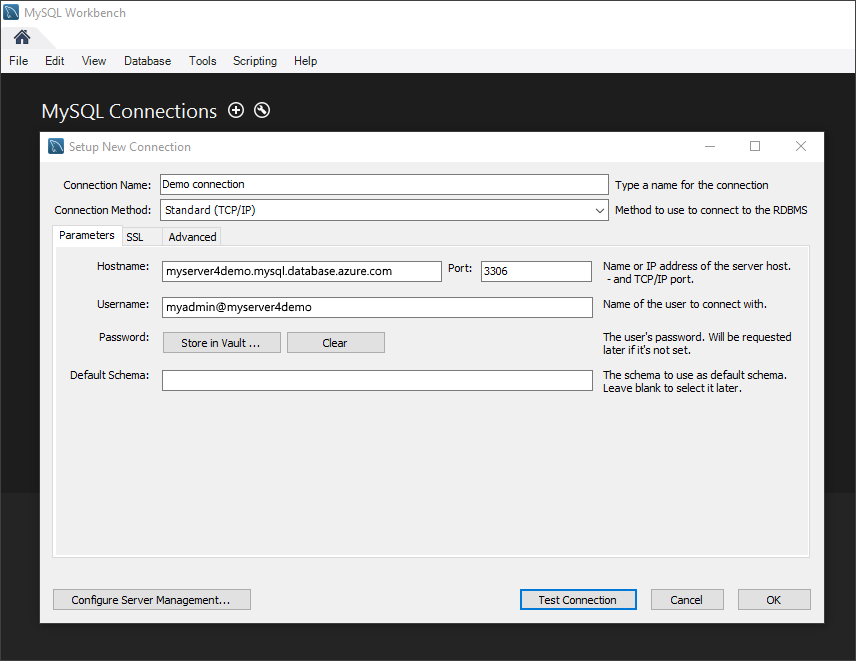

# Azure Database for MySQL: Use MySQL Workbench to connect and query data
This quickstart demonstrates how to connect to an Azure Database for MySQL using the MySQL Workbench application. 

## Prerequisites
This quickstart uses the resources created in either of these guides as a starting point:
- [Create an Azure Database for MySQL server using Azure portal](./quickstart-create-mysql-server-database-using-azure-portal.md)
- [Create an Azure Database for MySQL server using Azure CLI](./quickstart-create-mysql-server-database-using-azure-cli.md)

## Install MySQL Workbench
Download and install MySQL Workbench on your computer from [the MySQL website](https://dev.mysql.com/downloads/workbench/).

## Get connection information
Get the connection information needed to connect to the Azure Database for MySQL. You need the fully qualified server name and login credentials.

1. Log in to the [Azure portal](https://portal.azure.com/).

2. From the left-hand menu in Azure portal, click **All resources**, and then search for the server you have created (such as **mydemoserver**).

3. Click the server name.

4. From the server's **Overview** panel, make a note of the **Server name** and **Server admin login name**. If you forget your password, you can also reset the password from this panel.
 

## Connect to the server by using MySQL Workbench 
To connect to Azure MySQL Server by using the GUI tool MySQL Workbench:

1.	Launch the MySQL Workbench application on your computer. 

2.	In **Setup New Connection** dialog box, enter the following information on the **Parameters** tab:

    

    | **Setting** | **Suggested value** | **Field description** |
    |---|---|---|
    |	Connection Name | Demo Connection | Specify a label for this connection. |
    | Connection Method | Standard (TCP/IP) | Standard (TCP/IP) is sufficient. |
    | Hostname | *server name* | Specify the server name value that was used when you created the Azure Database for MySQL earlier. Our example server shown is mydemoserver.mysql.database.azure.com. Use the fully qualified domain name (\*.mysql.database.azure.com) as shown in the example. Follow the steps in the previous section to get the connection information if you do not remember your server name.  |
    | Port | 3306 | Always use port 3306 when connecting to Azure Database for MySQL. |
    | Username |  *server admin login name* | Type in the server admin login username supplied when you created the Azure Database for MySQL earlier. Our example username is myadmin@mydemoserver. Follow the steps in the previous section to get the connection information if you do not remember the username. The format is *username\@servername*.
    | Password | your password | Click **Store in Vault...** button to save the password. |

3.   Click **Test Connection** to test if all parameters are correctly configured. 

4.   Click **OK** to save the connection. 

5.   In the listing of **MySQL Connections**, click the tile corresponding to your server, and then wait for the connection to be established.

        A new SQL tab opens with a blank editor where you can type your queries.
    
        > [!NOTE]
        > By default, SSL connection security is required and enforced on your Azure Database for MySQL server. Although typically no additional configuration with SSL certificates is required for MySQL Workbench to connect to your server, we recommend binding the SSL CA certification with MySQL Workbench. For more information on how to download and bind the certification, see [Configure SSL connectivity in your application to securely connect to Azure Database for MySQL](./howto-configure-ssl.md).  If you need to disable SSL, visit the Azure portal and click the Connection security page to disable the Enforce SSL connection toggle button.

## Create a table, insert data, read data, update data, delete data
1. Copy and paste the sample SQL code into a blank SQL tab to illustrate some sample data.

    This code creates an empty database named quickstartdb, and then creates a sample table named inventory. It inserts some rows, then reads the rows. It changes the data with an update statement, and reads the rows again. Finally it deletes a row, and then reads the rows again.
    
    ```sql
    -- Create a database
    -- DROP DATABASE IF EXISTS quickstartdb;
    CREATE DATABASE quickstartdb;
    USE quickstartdb;
    
    -- Create a table and insert rows
    DROP TABLE IF EXISTS inventory;
    CREATE TABLE inventory (id serial PRIMARY KEY, name VARCHAR(50), quantity INTEGER);
    INSERT INTO inventory (name, quantity) VALUES ('banana', 150);
    INSERT INTO inventory (name, quantity) VALUES ('orange', 154);
    INSERT INTO inventory (name, quantity) VALUES ('apple', 100);
    
    -- Read
    SELECT * FROM inventory;
    
    -- Update
    UPDATE inventory SET quantity = 200 WHERE id = 1;
    SELECT * FROM inventory;
    
    -- Delete
    DELETE FROM inventory WHERE id = 2;
    SELECT * FROM inventory;
    ```

    The screenshot shows an example of the SQL code in SQL Workbench and the output after it has been run.
    
    

2. To run the sample SQL Code, click the lightening bolt icon in the toolbar of the **SQL File** tab.
3. Notice the three tabbed results in the **Result Grid** section in the middle of the page. 
4. Notice the **Output** list at the bottom of the page. The status of each command is shown. 

Now, you have connected to Azure Database for MySQL by using MySQL Workbench, and you have queried data using the SQL language.

## Next steps
> [!div class="nextstepaction"]
> [Migrate your database using Export and Import](./concepts-migrate-import-export.md)
