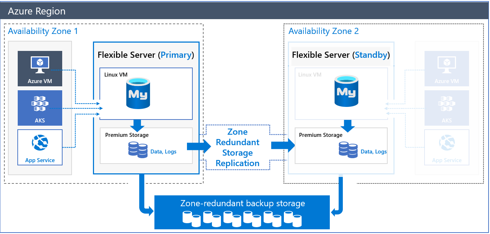

# High availability concepts in Azure Database for MySQL Flexible Server

Azure Database for MySQL Flexible Server, which is currently in public preview, allows configuring high availability with automatic failover using **zone redundant** high availability option. When deployed in a zone redundant configuration, flexible server automatically provisions and manages a standby replica in a different availability zone. Using storage level replication, the data is **synchronously replicated** to the standby server in the secondary zone to enable zero data loss after a failover.

Zone redundant high availability configuration enables automatic failover capability during planned events such as user-initiated scale compute operation, and also when unplanned events such as underlying hardware and software faults, network failures, and even availability zone failures.

## Zone redundant high availability architecture

Primary database server is deployed in the region and the availability zone of your choice. When the high availability is chosen, a standby replica server with the same configuration as that of the primary server is automatically deployed, including compute tier, compute size, storage size, and network configuration. The log data is replicated in synchronous mode to the standby replica to ensure that their is 0 data loss in any failure situation. Automatic backups, both snapshots and log backups, are performed from the primary database server. 

The health of the HA is continuously monitored and reported on the overview page.

The various replication status are listed below:
| **Status** | **Description** |
| :----- | :------ |
| <b>NotEnabled | Zone redundant HA is not enabled |
| <b>CreatingStandby | In the process of creating a new standby |
| <b>ReplicatingData | After the standby is created, it is catching up with the primary server. |
| <b>FailingOver | The database server is in the process of failing over from the primary to the standby. |
| <b>Healthy | Zone redundant HA is in steady state and healthy. |
| <b>RemovingStandby | Based on user action, the standby replica is in the process of deletion.| 

## Steady-state operations

Applications are connected to the primary server using the database server name. The standby replica information is not exposed for direct access. Commits and writes are acknowledged to the application only after the log files are persisted on both the primary server's disk and the standby replica in a synchronous manner. Due to this additional round-trip requirement, applications can expect elevated latency for writes and commits. You can monitor the health of the high availability on the portal.

## Failover process - planned events

Planned downtime events include activities scheduled by Azure such as periodic software updates, minor version upgrades or that are initiated by customers such as scale compute and scale storage operations. All these changes are first applied to the standby replica. During that time, the applications continue to access primary server. Once the standby replica is updated, primary server connections are drained, a failover is triggered which activates the standby replica to be the primary with the same database server name by updating the DNS record. Client connections are disconnected and they will have to reconnect and can resume their operations. A new standby server will be established in the same zone as the old primary. The overall failover time is expected to be 60-120s. 

### Reducing planned downtime with managed maintenance window

Flexible servers offer maintenance scheduling capability wherein you can choose a 30 minute window in a day of your preference during which the Azure maintenance works such as patching or minor version upgrades would happen. For your flexible servers configured with high availability, these maintenance activities are performed on the standby replica first. 

## Failover process - unplanned outage
Unplanned outages include software bugs that or infrastructure faults such as compute, network, storage failures, or power outages impacts the availability of the database. In the event of the database unavailability, the replication to the standby replica is severed and the standby replica is activated to be the primary database. DNS is updated, and clients then reconnect to the database server and resume their operations. The overall failover time is expected to take 60-120s. However, depending on the activity in the primary database server at the time of the failover such as large transactions and recovery time, the failover may take longer.

## Point-in-time restore 
As flexible servers configured in high availability replicates data in real time, the standby data will be up-to-date with the primary. Any user errors on the primary - such as an accidental drop of a table or incorrect updates are faithfully replicated to the standby. Hence, you cannot use standby to recover from such logical faults. To recover from these logical errors, you have to perform point-in-time restore to the time right before the error occurred. Using flexible server's point-in-time restore capability, when you restore the database configured with high availability, a new database server will be restored as a new flexible server with a user-provided name. You can then export the object from the database server and import it to your production database server. Similarly, if you want to clone your database server for testing and development purposes, or you want to restore for any other purposes, you can either choose the latest restore point or a custom restore point. The restore operation will create a single zone flexible server.

## Mitigation when not configured with high availability

Planned outages such as scheduled patches, minor version upgrades or the user initiated operations such as scale compute incurs downtime. To mitigate application impact for Azure initiated maintenance tasks, you can choose to schedule them during the day of the week and time which least impacts the application. 

During unplanned downtime events such as database crash or the server failure, the impacted server will be restarted within the same zone. Though rare, if the entire zone is impacted, you can restore the database on another zone within the region. 

## High availability - features

-   Standby replica will be deployed in an exact VM configuration as that of primary. This includes vCores, storage, network settings (VNET, Firewall), etc.
-   Ability to remove standby replica by disabling high availability.
-   Ability to stop, start, and restart both primary and standby database servers.
-   Automatic backups are performed from the primary database server and stored in a zone redundant storage.
-   In the event of a failover, a new standby replica is provisioned in the original primary availability zone.
-   Clients always connect to the primary database server.
-   In the event of a database crash or node failure, restarting will be attempted first on the same node. If that fails, then the automatic failover is triggered.
-   Ability to restart the server to pick up any static server parameter changes.

## High availability - considerations

-   High availability can **only** be set during flexible server create time.
-   High availability is not supported in burstable compute tier.
-   Due to synchronous replication to another availability zone, primary database server can experience elevated write and commit latency.
-   Standby replica cannot be used for read-only queries.
-   Depending on the activity on the primary server at the time of failover, it might take up to 2 minutes or longer for the failover to complete.
-   Restarting the primary database server to pick up static parameter changes also restarts standby replica.
-   Configuring read replicas are not supported
-   Configuring customer initiated management tasks cannot be scheduled during managed maintenance window.
-   Planned events such as scale compute and minor version upgrades happen in both primary and standby at the same time. 

## Next steps

-   Learn about [business continuity](./concepts-business-continuity.md)
-   Learn about [zone redundant high availability](./concepts-high-availability.md)
-   Learn about [backup and recovery](./concepts-backup-restore.md)