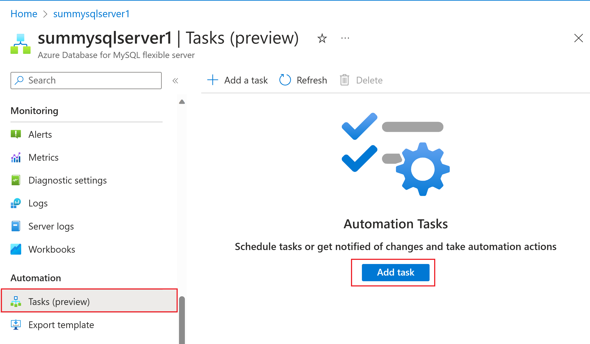
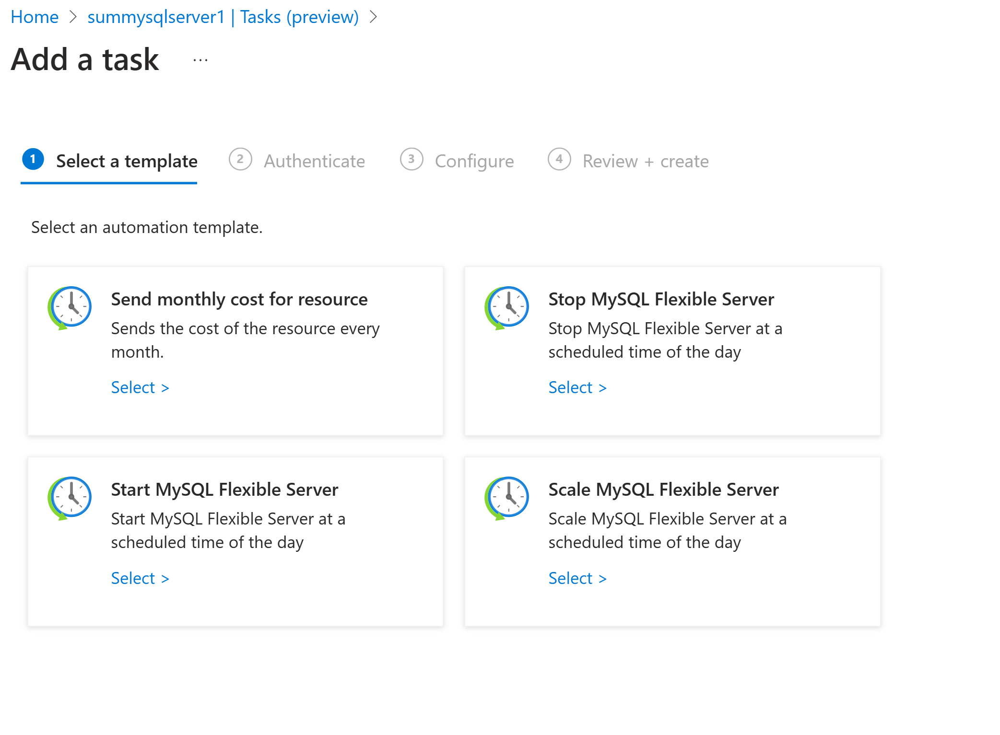
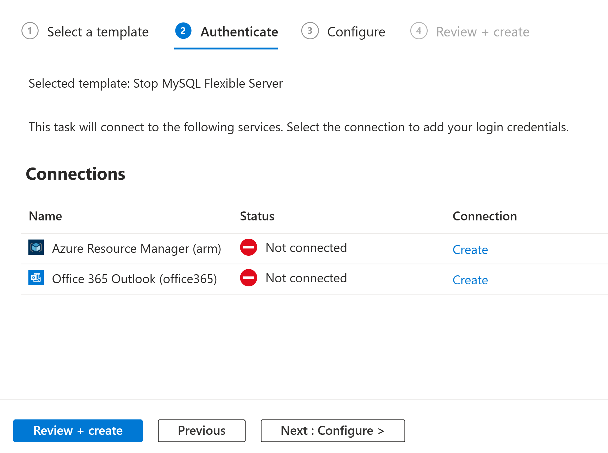
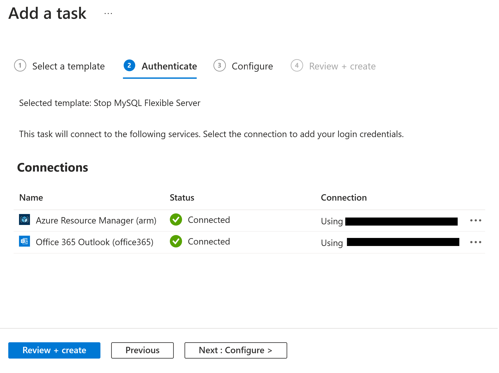
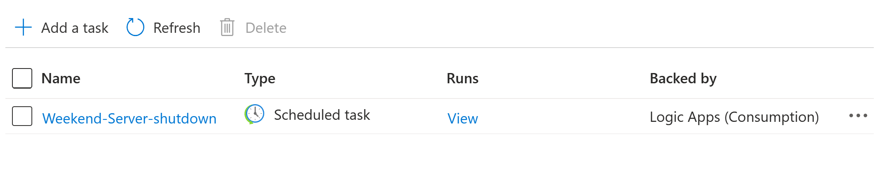
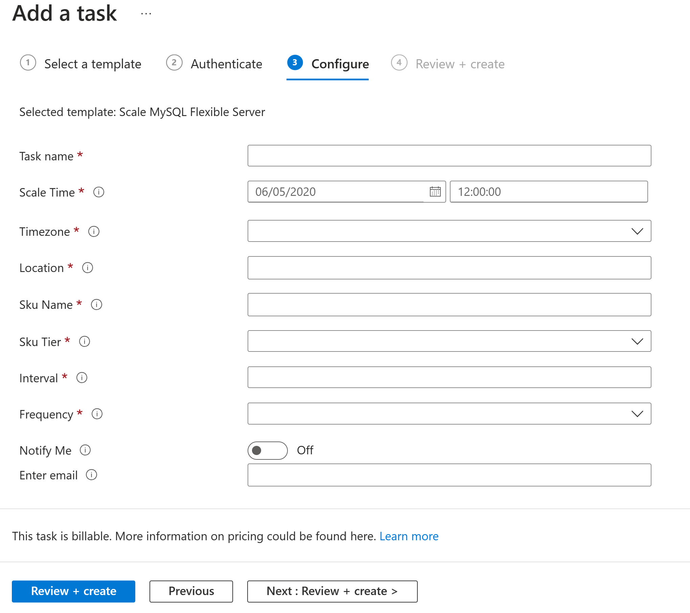

# Manage Azure Database for MySQL - Flexible Server using automation tasks (preview)

[!INCLUDE[applies-to-mysql-flexible-server](../includes/applies-to-mysql-flexible-server.md)]

> [!IMPORTANT]
> This capability is in preview and is subject to [Supplemental Terms of Use for Microsoft Azure Previews](https://azure.microsoft.com/support/legal/preview-supplemental-terms/).

To help you manage [Azure Database for MySQL Flexible Server](./overview.md) resources more efficiently, you can create automation tasks for your Flexible Server. One example of such tasks can be starting or stopping the MySQL Flexible Server on a predefined schedule. You can set this task to start or stop the server automatically for a specific number of times every day, week, or month by setting the Interval and Frequency values. The automation task continues to work until you delete or disable the task.

## How do automation tasks differ from Azure Automation?

Automation tasks are more basic and lightweight than [Azure Automation](../../automation/overview.md). Currently, you can create an automation task only at the Azure resource level. An automation task is actually a logic app resource that runs a workflow, powered by the [multi-tenant Azure Logic Apps service](../../logic-apps/logic-apps-overview.md). You can view and edit the underlying workflow by opening the task in the workflow designer after it has completed at least one run.

In contrast, Azure Automation is a comprehensive cloud-based automation and configuration service that provides consistent management across your Azure and non-Azure environments. 

## Pricing

Creating an automation task doesn't immediately incur charges. The automation task is powered by a workflow in a logic app resource hosted in multi-tenant Azure Logic Apps, hence the [Consumption pricing model](../../logic-apps/logic-apps-pricing.md) applies to automation tasks. Metering and billing are based on the trigger and action executions in the underlying logic app workflow. 

## Prerequisites

* An Azure account and subscription.
* Azure Database for MySQL Flexible Server that you want to manage.

## Create an automation task

1. In the [Azure portal](https://portal.azure.com), find the MySQL Flexible Server resource that you want to manage.
1. On the resource navigation menu, in the **Automation** section, select **Tasks (preview)**. Select **Add a task** to select a task template.

1. Under **Select a template**, select one of the tasks available to automate for your MySQL Flexible Server.
   

   |Task Type| Details |
   |---------|---------|
   |**Send monthly cost**| Send email about the monthly cost for your MySQL Flexible Server.|
   |**Stop server**| Allows you to stop a server based on a given schedule, for example you want to stop it on a weekend to optimize cost.|
   |**Start server**| Allows you to start a server based on a given schedule, for example you want to start a server if it is stopped during the weekend.|
   |**Scale server**|Allows you to scale up or down a server on a given schedule. For example you have use scale down during weekends or scale up during an event you can use this task.|
   |||

## Stop server task
Here's an example to configure stop tasks for a MySQL Flexible Server.

1. Select  **Stop MySQL Flexible server** task. 

1. Under **Authenticate**, in the **Connections** section, select **Create** for every connection that appears in the task so that you can provide authentication credentials for all the connections.  The types of connections in each task vary based on the task.

1. When you're prompted, **sign in with your Azure account** credentials.

1. Each successfully authenticated connection looks similar to this example:

1. After you authenticate all the connections, select Next: **Configure**.

1. Under **Configure**, provide a name for the task and any other information required for the task. When you're done, select **Review + create**.

1. Tasks that send email notifications require an email address.

> [!NOTE]
> You can't change the task name after creation, so consider a name that still applies if you edit the underlying workflow. Changes that you make to the underlying workflow apply only to the task that you created, not the task template.
>
> For example, if you name your task `Stop-Instance-Weekly`, but you later edit the underlying workflow to run daily, you can't change your task's name to `Stop-Instance-Daily`.

The task you've created, which is automatically live and running, will appear on the **Tasks** list.

>[!NOTE]
>The server will not start automatically and hence you need to create a **Start MySQL Flexible Server** task to start the server on first Monday after the server was stopped by the **stop** task.

## Scale a server task
You can scale a server up or down based on a recurring time schedule. You need to provide the following information when creating a scale MySQL Flexible Server task:

|Field|Description|
|------|----------|
|Scale Time| Time when to start the operation.|
|Location| Region of your MySQL Flexible server.| 
|Sku Name| Choose a Service tier name in this format Standard_B1ms. See [the full list of skus available.](./concepts-service-tiers-storage.md#service-tiers-size-and-server-types)|
|Sku Tier| Choose from Burstable, General purpose and Memory Optimized (same as Business critical Sku tier in MySQL Flexible Server).|
|Interval| How frequent to run this task. Enter a numeric value. If you enter 1, the task will run 1 time based on the frequency.|
|Frequency| You can run this task once a month/week/day/hour/minute/second. |
|Notify Me| Turn on or off to receive notifications.|
|Enter email| Provide email to receive notifications.|

Here's a screenshot of the Scale automation task:

## Review task history

To view a task's history of runs along with their status:

1. In the [Azure portal](https://portal.azure.com), find the MySQL Flexible Server resource that you want to manage.
2. On the resource navigation menu, in the **Automation** section, select **Tasks (preview)**.
3. In the tasks list, find the task that you want to review. In that task's **Runs** column, select **View**.

Here the possible statuses for a run:

   | Status | Description |
   |--------|-------------|
   | **Canceled** | The task was canceled while running. |
   | **Failed** | The task has at least one failed action, but no subsequent actions existed to handle the failure. |
   | **Running** | The task is currently running. |
   | **Succeeded** | All actions succeeded. A task can still finish successfully if an action failed, but a subsequent action existed to handle the failure. |
   | **Waiting** | The run hasn't started yet and is paused because an earlier instance of the task is still running. |
   |||

   For more information, see [Review runs history in monitoring view](../../logic-apps/monitor-logic-apps.md#review-runs-history).

## Edit the task

To change a task, you have these options:

* Edit the task "inline" so that you can change the task's properties, such as connection information or configuration information, for example, your email address.
* Edit the task's underlying workflow in the workflow designer.

### Edit the task inline

1. In the [Azure portal](https://portal.azure.com), find the MySQL Flexible Server resource that you want to manage.
1. On the resource navigation menu, in the **Automation** section, select **Tasks (preview)**.
1. In the tasks list, find the task that you want to update. Open the task's ellipses (**...**) menu, and select **Edit in-line**.
1. By default, the **Authenticate** tab appears and shows the existing connections.
1. To add new authentication credentials or select different existing authentication credentials for a connection, open the connection's ellipses (**...**) menu, and select either **Add new connection** or if available, different authentication credentials.
1. To update other task properties, select **Next: Configure**.
1. When you're done, select **Save**

### Edit the task's underlying workflow

* For details on editing the underlying workflow, please refer [Edit the task's underlying workflow](../../logic-apps/create-automation-tasks-azure-resources.md#edit-the-tasks-underlying-workflow)

## Next steps

* [Manage logic apps in the Azure portal](../../logic-apps/manage-logic-apps-with-azure-portal.md)

