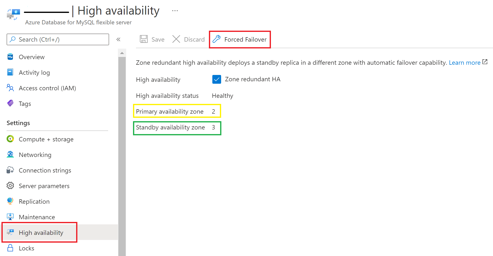

# Manage zone redundant high availability in Azure Database for MySQL - Flexible Server 

[[!INCLUDE[applies-to-mysql-flexible-server](../includes/applies-to-mysql-flexible-server.md)]

This article describes how you can enable or disable zone redundant high availability configuration in your flexible server.

High availability feature provisions physically separate primary and standby replica in different zones. For more details, see [high availability concepts documentation](./concepts/../concepts-high-availability.md).

> [!IMPORTANT]
> You can only enable zone redundant high availability during flexible server creation.

This page provides guidelines how you can enable or disable high availability. This operation does not change your other settings including VNET configuration, firewall settings, and backup retention. Similarly, disabling of high availability is an online operation and does not impact your application connectivity and operations.

> [!IMPORTANT]
> Zone redundant high availability is available in limited set of regions : Southeast Asia, WestUS 2, West Europe and East US.  

## Enable high availability during server creation

This section provides details specifically for HA-related fields. You can follow these steps to deploy high availability while creating your flexible server.

1. In the [Azure portal](https://portal.azure.com/), choose flexible Server and Select **Create**.  For details on how to fill details such as **Subscription**, **Resource group**, **Server name**, **Region**, and other fields, see how-to documentation for the server creation.

2. Select the checkbox for **Zone redundant high availability** in the Availability option.

3. If you want to change the default compute and storage, Select  **Configure server**.

4. If high availability option is checked, the burstable tier will not be available to choose. You can choose either
    **General purpose** or **Business Critical** compute tiers.

    > [!IMPORTANT]
    > We only support zone redundant high availability for the ***General purpose*** and ***Business Critical*** pricing tier.

5. Select the **Compute size** for your choice from the dropdown.

6. Select **Storage size** in GiB using the sliding bar and select the **Backup retention period** between 7 days and 35 days.   

## Disable high availability

Follow these steps to disable high availability for your flexible server that is already configured with zone redundancy.

1. In the [Azure portal](https://portal.azure.com/), select your existing Azure Database for MySQL - Flexible Server.

2. On the flexible server page, Select **High Availability** from the front panel to open high availability page.

3. Select on the **zone redundant high availability** checkbox to disable the option and Select **Save** to save the change.

4. A confirmation dialog will be shown where you can confirm disabling HA.

5. Select **Disable HA** button to disable the high availability.

6. A notification will show up decommissioning of the high availability deployment is in progress.

## Forced failover

Follow these steps to force failover from your primary to standby flexible server

1. In the [Azure portal](https://portal.azure.com/), select your existing Azure Database for MySQL - Flexible Server which has high availability feature enabled.

2. On the flexible server page, Select **High Availability** from the front panel to open high availability page.

3. Check the **Primary availability zone** and the **Standby availability zone**

4. Select on **Forced Failover** to initiate the manual failover procedure. A pop up will inform you on the failover expected time depending on the current workload on the primary and the recency of the last checkpoint, read the message and Select Ok.

5. A notification will show up mentioning that failover is in progress.

6. Once failover to the standby server is successful, a notification will pop up.

7. Check the new **Primary availability zone** and the **Standby availability zone**.

 

## Next steps

- Learn about [business continuity](./concepts-business-continuity.md)
- Learn about [zone redundant high availability](./concepts-high-availability.md)
