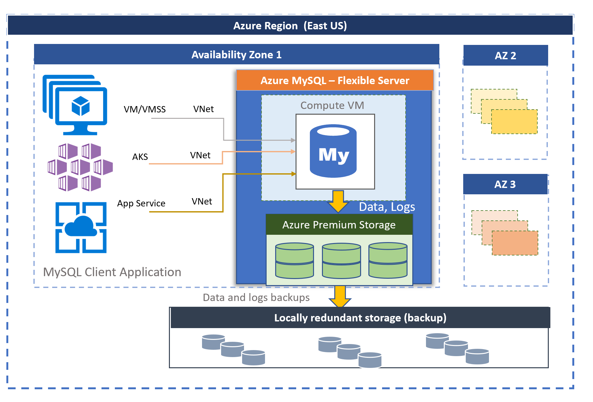

# Azure Database for MySQL - Flexible Server

[!INCLUDE[applies-to-mysql-flexible-server](../includes/applies-to-mysql-flexible-server.md)]

> [!VIDEO https://aka.ms/docs/player?id=492c7a41-5f0a-4482-828b-72be1b38e691]

Azure Database for MySQL powered by the MySQL community edition is available in two deployment modes:

- Flexible Server
- Single Server

In this article, we'll provide an overview and introduction to core concepts of flexible server deployment model. For information on how to decide what deployment option is appropriate for your workload, see [choosing the right MySQL server option in Azure](./../select-right-deployment-type.md).

## Overview

Azure Database for MySQL - Flexible Server is a fully managed production-ready database service designed for more granular control and flexibility over database management functions and configuration settings. The flexible server architecture allows users to opt for high availability within single availability zone and across multiple availability zones. Flexible servers provide better cost optimization controls with the ability to stop/start server and burstable compute tier, ideal for workloads that don’t need full-compute capacity continuously. Flexible Server also supports reserved instances allowing you to save up to 63% cost, ideal for production workloads with predictable compute capacity requirements. The service supports community version of MySQL 5.7 and 8.0. The service is generally available today in wide variety of [Azure regions](overview.md#azure-regions).

The Flexible Server deployment option offers three compute tiers: Burstable, General Purpose, and Business Critical. Each tier offers different compute and memory capacity to support your database workloads. You can build your first app on a burstable tier for a few dollars a month, and then adjust the scale to meet the needs of your solution. Dynamic scalability enables your database to transparently respond to rapidly changing resource requirements. You only pay for the resources you need, and only when you need them. See [Compute and Storage](concepts-compute-storage.md) for details.

Flexible servers are best suited for
- Ease of deployments, simplified scaling, and low database management overhead for functions like backups, high availability, security, and monitoring
- Application developments requiring community version of MySQL with better control and customizations
- Production workloads with same-zone, zone-redundant high availability and managed maintenance windows
- Simplified development experience 
- Enterprise grade security, compliance, and privacy

For latest updates on Flexible Server, refer to [What's new in Azure Database for MySQL - Flexible Server](whats-new.md).

 

## Free 12-month offer

With an [Azure free account](https://azure.microsoft.com/free/), you can use Flexible Server for free for 12 months with monthly limits of up to:
* **750 hours of Burstable B1MS instance**, enough hours to run a database instance continuously each month.
* **32 GB** storage and **32 GB** backup storage. 

You can take advantage of this offer to develop and deploy applications that use Azure Database for MySQL – Flexible Server. To learn how to create and use a flexible server for free using Azure free account, refer [this tutorial](how-to-deploy-on-azure-free-account.md). 

## High availability within and across availability zones

Azure Database for MySQL - Flexible Server allows configuring high availability with automatic failover. The high availability solution is designed to ensure that committed data is never lost due to failures, and improve overall uptime for your application. When high availability is configured, flexible server automatically provisions and manages a standby replica. You're billed for the provisioned compute and storage for both the primary and secondary replica. There are two high availability-architectural models: 

- **Zone Redundant High Availability (HA):** This option is preferred for complete isolation and redundancy of infrastructure across multiple availability zones. It provides highest level of availability, but it requires you to configure application redundancy across zones. Zone redundant HA is preferred when you want to achieve highest level of availability against any infrastructure failure in the availability zone and where latency across the availability zone is acceptable. Zone redundant HA is available in [subset of Azure regions](overview.md#azure-regions) where the region supports multiple Availability Zones and Zone redundant Premium file shares are available. 

:::image type="content" source="./media/concepts-high-availability/1-flexible-server-overview-zone-redundant-ha.png" alt-text="zone redundant ha":::

- **Same-Zone High Availability (HA):** This option is preferred for infrastructure redundancy with lower network latency as both primary and standby server will be in the same availability zone. It provides high availability without configuring application redundancy across zones. Same-Zone HA is preferred when you want to achieve highest level of availability within a single Availability zone with the lowest network latency. Same-Zone HA is available in [all Azure regions](overview.md#azure-regions) where we can create  Azure Database for MySQL - Flexible Server. 

:::image type="content" source="./media/concepts-high-availability/flexible-server-overview-same-zone-ha.png" alt-text="same redundant high availability":::

For more information, see [high availability concepts](concepts-high-availability.md).

## Automated patching with managed maintenance window

The service performs automated patching of the underlying hardware, OS, and database engine. The patching includes security and software updates. For MySQL engine, minor version upgrades are also included as part of the planned maintenance release. Users can configure the patching schedule to be system managed or define their custom schedule. During the maintenance schedule, the patch is applied and server may require a restart as part of the patching process to complete the update. With the custom schedule, users can make their patching cycle predictable and choose a maintenance window with minimum impact to the business. In general, the service follows monthly release schedule as part of the continuous integration and release.

See [Scheduled Maintenance](concepts-maintenance.md) for more details. 

## Automatic backups

The flexible server service automatically creates server backups and stores them in user configured locally redundant or geo-redundant storage. Backups can be used to restore your server to any point-in-time within the backup retention period. The default backup retention period is seven days. The retention can be optionally configured between 1-35 days. All backups are encrypted using AES 256-bit encryption.

See [Backup concepts](concepts-backup-restore.md) to learn more.

## Network Isolation

You have two networking options to connect to your Azure Database for MySQL - Flexible Server. The options are **private access (VNet integration)** and **public access (allowed IP addresses)**. 

- **Private access (VNet Integration)** – You can deploy your flexible server into your [Azure Virtual Network](../../virtual-network/virtual-networks-overview.md). Azure virtual networks provide private and secure network communication. Resources in a virtual network can communicate through private IP addresses.

  Choose the VNet Integration option if you want the following capabilities:

  - Connect from Azure resources in the same virtual network to your flexible server using private IP addresses
  - Use VPN or ExpressRoute to connect from non-Azure resources to your flexible server
  - No public endpoint

- **Public access (allowed IP addresses)** – You can deploy your flexible server with a public endpoint. The public endpoint is a publicly resolvable DNS address. The phrase "allowed IP addresses" refers to a range of IPs you choose to give permission to access your server. These permissions are called **firewall rules**.

See [Networking concepts](concepts-networking.md) to learn more.

## Adjust performance and scale within seconds

The flexible server service is available in three SKU tiers: Burstable, General Purpose, and Business Critical. The Burstable tier is best suited for low-cost development and low concurrency workloads that don't need full-compute capacity continuously. The General Purpose and Business Critical are better suited for production workloads requiring high concurrency, scale, and predictable performance. You can build your first app on a small database for a few dollars a month, and then seamlessly adjust the scale to meet the needs of your solution. The storage scaling is online and supports storage autogrowth. Flexible Server enables you to provision additional IOPS up to 80K IOPs above the complimentary IOPS limit independent of storage. Using this feature, you can increase or decrease the number of IOPS provisioned based on your workload requirements at any time. Dynamic scalability enables your database to transparently respond to rapidly changing resource requirements. You only pay for the resources you consume. 

See [Compute and Storage concepts](concepts-compute-storage.md) to learn more.

## Scale out your read workload with up to 10 read replicas

MySQL is one of the popular database engines for running internet-scale web and mobile applications. Many of our customers use it for their online education services, video streaming services, digital payment solutions, e-commerce platforms, gaming services, news portals, government, and healthcare websites. These services are required to serve and scale as the traffic on the web or mobile application increases.

On the applications side, the application is typically developed in Java or PHP and migrated to run on [Azure virtual machine scale sets](../../virtual-machine-scale-sets/overview.md) or [Azure App Services](../../app-service/overview.md) or are containerized to run on [Azure Kubernetes Service (AKS)](../../aks/intro-kubernetes.md). With virtual machine scale set, App Service or AKS as underlying infrastructure, application scaling is simplified by instantaneously provisioning new VMs and replicating the stateless components of applications to cater to the requests but often, database ends up being a bottleneck as centralized stateful component.

The read replica feature allows you to replicate data from an Azure Database for MySQL - Flexible Server to a read-only server. You can replicate from the source server to **up to 10 replicas**. Replicas are updated asynchronously using the MySQL engine's native [binary log (binlog) file position-based replication technology](https://dev.mysql.com/doc/refman/5.7/en/replication-features.html). You can use a load balancer proxy solution like [ProxySQL](https://techcommunity.microsoft.com/t5/azure-database-for-mysql/load-balance-read-replicas-using-proxysql-in-azure-database-for/ba-p/880042) to seamlessly scale out your application workload to read replicas without any application refactoring cost. 

For more information, see [Read Replica concepts](concepts-read-replicas.md).

## Setup Hybrid or Multi-Cloud Data synchronization with Data-in replication

Data-in replication allows you to synchronize data from an external MySQL server into the Azure Database for MySQL Flexible Server. The external server can be on-premises, in virtual machines, Azure Database for MySQL Single Server, or a database service hosted by other cloud providers. Data-in replication is based on the binary log (binlog) file position-based. The main scenarios to consider about using Data-in replication are:
* Hybrid Data Synchronization
* Multi-Cloud Synchronization
* [Minimal downtime migration to Flexible Server](../../mysql/howto-migrate-single-flexible-minimum-downtime.md)

For more information, see [Data-in replication concepts](concepts-data-in-replication.md).

## Stop/Start server to optimize cost

The flexible server service allows you to stop and start server on-demand to optimize cost. The compute tier billing is stopped immediately when the server is stopped. This can allow you to have significant cost savings during development, testing and for time-bound predictable production workloads. The server remains in stopped state for 30 days unless restarted sooner.

For more information, see [Server concepts](concept-servers.md).

## Enterprise grade security, compliance, and privacy

The flexible server service uses the FIPS 140-2 validated cryptographic module for storage encryption of data at-rest. Data, including backups, and temporary files created while running queries are encrypted. The service uses the AES 256-bit cipher included in Azure storage encryption, and the keys can be system managed (default).

The service encrypts data in-motion with transport layer security enforced by default. Flexible Server by default supports encrypted connections using Transport Layer Security (TLS 1.2) and all incoming connections with TLS 1.0 and TLS 1.1 will be denied. SSL enforcement can be disabled by setting the require_secure_transport server parameter and you can set the minimum tls_version for your server.

For more information, see [how to use encrypted connections to flexible servers](how-to-connect-tls-ssl.md).

Flexible Server allows full-private access to the servers using [Azure virtual network](../../virtual-network/virtual-networks-overview.md) (VNet) integration. Servers in Azure virtual network can only be reached and connected through private IP addresses. With VNet integration, public access is denied and servers can’t be reached using public endpoints.

For more information, see [Networking concepts](concepts-networking.md).

## Monitoring and alerting

The flexible server service is equipped with built-in performance monitoring and alerting features. All Azure metrics have a one-minute frequency, and each metric provides 30 days of history. You can configure alerts on the metrics. The service exposes host server metrics to monitor resources utilization, allows configuring slow query logs. Using these tools, you can quickly optimize your workloads, and configure your server for best performance. Azure Database for MySQL - Flexible Server allows you to visualize the slow query and audit logs data using Azure Monitor workbooks. With workbooks, you get a flexible canvas for analyzing data and creating rich visual reports within the Azure portal. Azure Database for MySQL - Flexible Server provides three available workbook templates out of the box viz Server Overview, [Auditing](tutorial-configure-audit.md) and [Query Performance Insights](tutorial-query-performance-insights.md). [Query Performance Insights](tutorial-query-performance-insights.md) workbook is designed to help you spend less time troubleshooting database performance by providing such information as:

* Top N long-running queries and their trends.
* The query details: view the query text as well as the history of execution with minimum, maximum, average, and standard deviation query time.
* The resource utilizations (CPU, memory, and storage).

In addition, you can use and integrate with community monitoring tools like [Percona Monitoring and Management with your MySQL Flexible Server](https://techcommunity.microsoft.com/t5/azure-database-for-mysql/monitor-azure-database-for-mysql-using-percona-monitoring-and/ba-p/2568545).

For more information, see [Monitoring concepts](concepts-monitoring.md).

## Migration

The service runs the community version of MySQL. This allows full application compatibility and requires minimal refactoring cost to migrate existing applications developed on MySQL engine to Flexible Server. Migration to Flexible Server can be performed using the following option:

### Offline Migrations
*	Using Azure Data Migration Service when network bandwidth between source and Azure is good (for example: High-speed ExpressRoute). Learn more with step-by-step instructions - [Migrate MySQL to Azure Database for MySQL offline using DMS - Azure Database Migration Service](../../dms/tutorial-mysql-azure-mysql-offline-portal.md)
*	Use mydumper/myloader to take advantage of compression settings to efficiently move data over low speed networks (such as public internet). Learn more with step-by-step instructions [Migrate large databases to Azure Database for MySQL using mydumper/myloader](../../mysql/concepts-migrate-mydumper-myloader.md)

### Online or Minimal downtime migrations
Use data-in replication with mydumper/myloader consistent backup/restore for initial seeding. Learn more with step-by-step instructions - [Tutorial: Minimal Downtime Migration of Azure Database for MySQL – Single Server to Azure Database for MySQL – Flexible Server](../../mysql/howto-migrate-single-flexible-minimum-downtime.md)

To migrate from Azure Database for MySQL - Single Server to Flexible Server in five easy steps, refer to [this blog](https://techcommunity.microsoft.com/t5/azure-database-for-mysql/migrate-from-azure-database-for-mysql-single-server-to-flexible/ba-p/2674057).

For more information, see [Select the right tools for migration to Azure Database for MySQL](../../mysql/how-to-decide-on-right-migration-tools.md)

## Azure regions

One advantage of running your workload in Azure is its global reach. The flexible server for Azure Database for MySQL is available today in following Azure regions:

| Region | Availability | Same Zone HA | Zone redundant HA | Geo-redundant backup |
| --- | --- | --- | --- | --- |
| Australia Central | :heavy_check_mark: | :heavy_check_mark: | :x: | :x: |
| Australia East | :heavy_check_mark: | :heavy_check_mark: | :heavy_check_mark: | :heavy_check_mark: |
| Australia Southeast | :heavy_check_mark: | :heavy_check_mark: | :x: | :heavy_check_mark: |
| Brazil South | :heavy_check_mark: | :heavy_check_mark: | :heavy_check_mark: | :x: |
| Canada Central | :heavy_check_mark: | :heavy_check_mark: | :x: | :heavy_check_mark: |
| Canada East | :heavy_check_mark: | :heavy_check_mark: | :x: | :heavy_check_mark: |
| Central India | :heavy_check_mark: | :heavy_check_mark: | :x: | :heavy_check_mark: |
| Central US | :heavy_check_mark: | :heavy_check_mark: | :x: | :heavy_check_mark: |
| China East 2 | :heavy_check_mark: | :heavy_check_mark: | :x: | :x: |
| China East 3 | :heavy_check_mark: | :heavy_check_mark: | :x: | :heavy_check_mark: |
| China North 2 | :heavy_check_mark: | :heavy_check_mark: | :x: | :x: |
| China North 3 | :heavy_check_mark:  | :heavy_check_mark: | :x: | :heavy_check_mark: |
| East Asia (Hong Kong SAR) | :heavy_check_mark: | :heavy_check_mark: | :heavy_check_mark:  | :heavy_check_mark: |
| East US | :heavy_check_mark: | :heavy_check_mark: | :heavy_check_mark: | :heavy_check_mark: |
| East US 2 | :heavy_check_mark: | :heavy_check_mark: | :heavy_check_mark: | :heavy_check_mark: |
| France Central | :heavy_check_mark: | :heavy_check_mark: | :heavy_check_mark: | :heavy_check_mark: |
| France South | :heavy_check_mark: | :heavy_check_mark: | :x: | :heavy_check_mark: |
| Germany West Central | :heavy_check_mark: | :heavy_check_mark: | :x: | :heavy_check_mark: |
| Japan East | :heavy_check_mark: | :heavy_check_mark: | :heavy_check_mark: | :heavy_check_mark: |
| Japan West | :heavy_check_mark: | :heavy_check_mark: | :x: | :heavy_check_mark: |
| Korea Central | :heavy_check_mark: | :heavy_check_mark: | :heavy_check_mark: | :heavy_check_mark: |
| Korea South | :heavy_check_mark: | :heavy_check_mark: | :x: | :heavy_check_mark: |
| North Central US | :heavy_check_mark: | :heavy_check_mark: | :x: | :heavy_check_mark: |
| North Europe | :heavy_check_mark: | :heavy_check_mark: | :heavy_check_mark: | :heavy_check_mark: |
| Norway East | :heavy_check_mark: | :heavy_check_mark: | :x: | :x: |
| Norway West | :heavy_check_mark: | :heavy_check_mark: | :x: | :x: |
| Qatar Central | :heavy_check_mark: | :heavy_check_mark: | :heavy_check_mark: | :x: |
| South Africa North | :heavy_check_mark: | :heavy_check_mark: | :x: | :x: |
| South Central US | :heavy_check_mark: | :heavy_check_mark: | :heavy_check_mark: | :heavy_check_mark: |
| South India | :heavy_check_mark: | :heavy_check_mark: | :x: | :heavy_check_mark: |
| Southeast Asia | :heavy_check_mark: | :heavy_check_mark: | :heavy_check_mark: | :heavy_check_mark: |
| Sweden Central | :heavy_check_mark: | :heavy_check_mark: | :x: | :x: |
| Switzerland North | :heavy_check_mark: | :heavy_check_mark: | :x: | :heavy_check_mark: |
| Switzerland West | :heavy_check_mark: | :heavy_check_mark: | :x: | :heavy_check_mark: 
| UAE North | :heavy_check_mark: | :heavy_check_mark: | :x: | :x: |
| UK South | :heavy_check_mark: | :heavy_check_mark: | :heavy_check_mark: | :heavy_check_mark: |
| UK West | :heavy_check_mark: | :heavy_check_mark: | :x: | :heavy_check_mark: |
| USGov Virginia | :heavy_check_mark: | :heavy_check_mark: | :x: | :x: |
| USGov Arizona | :heavy_check_mark: | :heavy_check_mark: | :x: | :heavy_check_mark: |
| USGov Texas | :heavy_check_mark: | :heavy_check_mark: | :x: | :heavy_check_mark: |
| West Central US | :heavy_check_mark: | :heavy_check_mark: | :x: | :heavy_check_mark: |
| West Europe | :heavy_check_mark: | :heavy_check_mark: | :heavy_check_mark: | :heavy_check_mark: |
| West US | :heavy_check_mark: | :heavy_check_mark: | :x: | :heavy_check_mark: |
| West US 2 | :heavy_check_mark: | :heavy_check_mark: | :heavy_check_mark: | :heavy_check_mark: |
| West US 3 | :heavy_check_mark: | :heavy_check_mark: | :x: | :x: |

## Contacts

For any questions or suggestions you might have on Azure Database for MySQL - Flexible Server, send an email to the Azure Database for MySQL Team ([@Ask Azure DB for MySQL](mailto:AskAzureDBforMySQL@service.microsoft.com)). This email address isn't a technical support alias.

In addition, consider the following points of contact as appropriate:

- To contact Azure Support, [file a ticket from the Azure portal](https://portal.azure.com/?#blade/Microsoft_Azure_Support/HelpAndSupportBlade).
- To fix an issue with your account, file a [support request](https://portal.azure.com/#blade/Microsoft_Azure_Support/HelpAndSupportBlade/newsupportrequest) in the Azure portal.
- To provide feedback or to request new features, create an entry via [UserVoice](https://feedback.azure.com/d365community/forum/47b1e71d-ee24-ec11-b6e6-000d3a4f0da0).

## Next steps

Now that you've read an introduction to Azure Database for MySQL - Single-Server deployment mode, you're ready to:

- Create your first server.
  - [Create an Azure Database for MySQL - Flexible Server using Azure portal](quickstart-create-server-portal.md)
  - [Create an Azure Database for MySQL - Flexible Server using Azure CLI](quickstart-create-server-cli.md)
  - [Manage an Azure Database for MySQL - Flexible Server using the Azure CLI](how-to-manage-server-portal.md)

- Build your first app using your preferred language:
  - [Python](connect-python.md)
  - [PHP](connect-php.md)
