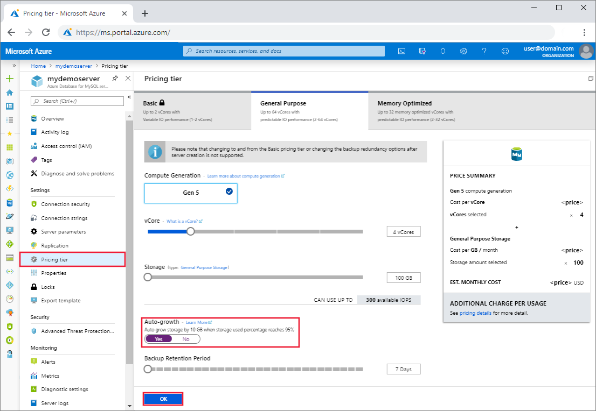

# Auto grow storage in Azure Database for MySQL using the Azure portal
This article describes how you can configure an Azure Database for MySQL server storage to grow without impacting the workload.

When a server reaches the allocated storage limit, the server is marked as read-only. However, if you enable storage auto grow, the server storage increases to accommodate the growing data. For servers with less than 100 GB provisioned storage, the provisioned storage size is increased by 5 GB as soon as the free storage is below the greater of 1 GB or 10% of the provisioned storage. For servers with more than 100 GB of provisioned storage, the provisioned storage size is increased by 5% when the free storage space is below 5% of the provisioned storage size. Maximum storage limits as specified [here](https://docs.microsoft.com/azure/mysql/concepts-pricing-tiers#storage) apply.

## Prerequisites
To complete this how-to guide, you need:
- An [Azure Database for MySQL server](quickstart-create-mysql-server-database-using-azure-portal.md)

## Enable storage auto grow 

Follow these steps to set MySQL server storage auto grow:

1. In the [Azure portal](https://portal.azure.com/), select your Azure Database for MySQL server.

2. On the MySQL server page, under **Settings** heading, click **Pricing tier** to open the Pricing tier page.

3. In the Auto-growth section, select **Yes** to enable storage auto grow.

    

4. Click **OK** to save the changes.

5. A notification will confirm that auto grow was successfully enabled.

    

## Next steps

Learn about [how to create alerts on metrics](howto-alert-on-metric.md).
