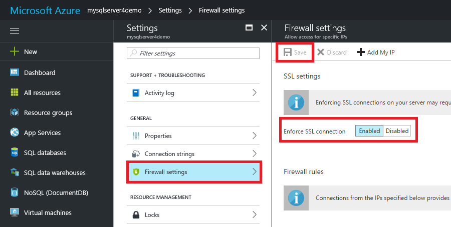
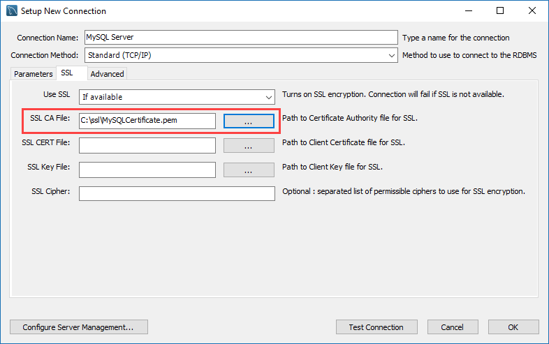

# Configure SSL connectivity in your application to securely connect to Azure Database for MySQL
Azure Database for MySQL supports connecting your Azure Database for MySQL server to client applications using Secure Sockets Layer (SSL). Enforcing SSL connections between your database server and your client applications helps protect against "man in the middle" attacks by encrypting the data stream between the server and your application.

By default, the database service should be configured to require SSL connections when connecting to Azure Database for MySQL server.  Avoid disabling the SSL option whenever possible.

## Enforcing SSL connections
When provisioning a new Azure Database for MySQL server through the Azure portal or CLI, enforcement of SSL connections is enabled by default.

Likewise, connection strings that are pre-defined in the "Connection Strings" settings under your server in the Azure portal include the required parameters for common languages to require SSL. The SSL parameter varies based on the connector, for example "ssl=true" or "sslmode=require" or "sslmode=required" and other variations.

## Configure Enforcement of SSL
You can disable or enable Enforcing SSL. Microsoft Azure recommends to always enable Enforce SSL connection setting for enhanced security.

### Using Azure portal
Using the Azure portal, visit your Azure Database for MySQL server and click **Connection security**. Use the toggle button to enable or disable the **Enforce SSL connection** setting. Then click **Save**. Microsoft recommends to always enable **Enforce SSL connection** setting for enhanced security.


You can confirm the setting by viewing the **Overview** page to see the **SSL enforce status** indicator.

### Using Azure CLI
You can enable or disable the **ssl-enforcement** parameter using Enabled or Disabled values respectively in Azure CLI.
```azurecli-interactive
az mysql server update --resource-group myresource --name mysqlserver4demo --ssl-enforcement Enabled
```
## Ensure your application or framework supports SSL connections
Many common applications that use MySQL for database services, such as Wordpress, Drupal, and Magento, do not enable SSL by default during installation. Enable SSL connectivity in those applications after installation or through CLI commands specific to the application. If your MySQL server enforces SSL connections, when the associated application is not configured properly it may fail to connect to your database server. Consult your application's documentation to learn how to enable SSL connections.

## Applications that require a local certificate for SSL connectivity
In some cases, applications require a local certificate file (.pem) generated from a Certificate Authority (CA) certificate file (.cer) to connect securely.  See the following steps to obtain the .cer file, generate the local .pem file, and bind it to your application.

### Download the certificate file from the Certificate Authority (CA)
The certificate needed to communicate over SSL with your Azure Database for MySQL server is located [here](https://www.digicert.com/CACerts/BaltimoreCyberTrustRoot.crt).  Download the certificate file to your local drive (with this tutorial, we use **c:\ssl**).

### Download and install OpenSSL on your PC
To generate the local **.pem** file needed for your application to connect securely to your database server, you need to install OpenSSL on your local computer.  

The following sections describe the approach you could use. You can use either a Linux or Windows PC, depending on your preferred OS. You only need to follow one method.

### Linux Users - Download and install OpenSSL using a Linux PC
The OpenSSL libraries are provided in source code directly from the [OpenSSL Software Foundation](http://www.openssl.org).  The following instructions guide you through the steps necessary to install OpenSSL on your Linux PC.  For this guide, we show commands for Ubuntu 12.04 and higher.

Open a terminal session and install OpenSSL
```bash
wget http://www.openssl.org/source/openssl-1.1.0e.tar.gz
```  
Extract the files from the download package
```bash
tar -xvzf openssl-1.1.0e.tar.gz
```
Enter the directory where the files were extracted.  By default, it should be as follows.

```bash
cd openssl-1.1.0e
```
Configure OpenSSL by executing the following command:  If you want the files in a folder different than /usr/local/openssl, make sure to change the following command as appropriate.

```bash
./config --prefix=/usr/local/openssl --openssldir=/usr/local/openssl
```
Now that OpenSSL is configured properly, you need to compile it to convert your certificate.  To compile, run the following command:

```bash
make
```
Once compiling is complete, you're ready to install OpenSSL as an executable by running the following command:
```bash
make install
```
To confirm that you've successfully installed OpenSSL on your system, run the following command. Check to make sure you get the same output.

```bash
/usr/local/openssl/bin/openssl version
```
If successful you should see the following message:
```bash
OpenSSL 1.1.0e 7 Apr 2014
```

### Windows PC users - Download and install OpenSSL using a Windows PC
To generate the local **.pem** file needed for your application to connect securely to your database server, you need to install OpenSSL on your local computer.

The OpenSSL libraries are provided in source code directly from the [OpenSSL Software Foundation](http://www.openssl.org). The following instructions guide you through the steps necessary to install OpenSSL on your Linux PC.

Installing OpenSSL on a Windows PC can be done in the following ways:

1. **(Recommended)** Using the built-in Bash for Windows functionality in Window 10 and above, OpenSSL is installed by default.  Instructions on how to enable Bash for Windows functionality in Windows 10 can be found [here](https://msdn.microsoft.com/commandline/wsl/install_guide).

2. Through downloading a Win32/64 application provided by the community. While the OpenSSL Software Foundation does not provide or endorse any specific Windows installers, they provide a list of available installers [here](https://wiki.openssl.org/index.php/Binaries)

### Convert your .cer certificate to a local .pem
The downloaded Root CA file has the **.cer** format. Use OpenSSL to convert the cert file to a **.pem**.  To do so, execute the openssl.exe command-line tool and execute the following command:

```dos
OpenSSL>x509 -inform DER -in BaltimoreCyberTrustRoot.cer -out MyServerCACert.pem
```
Now that you have successfully created your certificate file (MyServerCACert.pem), you can now connect to your database server securely over SSL.

The following examples show how to connect to your MySQL server through both the MySQL command-line interface and through using MySQL Workbench, using the **MyServerCACert.pem** file.

### Connecting to server using the MySQL CLI over SSL
Using the MySQL command-line interface, execute the following command:

```dos
mysql.exe -h mysqlserver4demo.mysql.database.azure.com -uUsername@mysqlserver4demo -pYourPassword --ssl-ca=c:\ssl\MyServerCACert.pem
```
Execute the mysql **status** command to verify that you have connected to your MySQL server using SSL:

```dos
mysql> status
--------------
mysql.exe  Ver 14.14 Distrib 5.7.18, for Win64 (x86_64)

Connection id:          65535
Current database:
Current user:           jason@66.235.55.141
SSL:                    Cipher in use is AES256-SHA
Using delimiter:        ;
Server version:         5.6.26.0 MySQL Community Server (GPL)
Protocol version:       10
Connection:             janderserver.mysql.sqltest-eg1.mscds.com via TCP/IP
Server characterset:    latin1
Db     characterset:    latin1
Client characterset:    cp850
Conn.  characterset:    cp850
TCP port:               3306
Uptime:                 1 day 19 hours 9 min 43 sec

Threads: 4  Questions: 26082  Slow queries: 0  Opens: 112  Flush tables: 1  Open tables: 105  Queries per second avg: 0.167
--------------
```

> [!NOTE]
> Currently, there is a known issue if you use "--ssl-mode=VERIFY_IDENTITY" option in your mysql.exe connection to the service, the connection fails with the following error:
> _ERROR 2026 (HY000): SSL connection error: SSL certificate validation failure_
> Downgrade to "--ssl-mode=VERIFY_CA" or lesser [SSL modes](https://dev.mysql.com/doc/refman/5.7/en/secure-connection-options.html#option_general_ssl-mode). If you require to use "--ssl-mode=VERIFY_IDENTITY", use the regional server name instead until this issue is resolved. Ping your server name to determine the regional server, such as `westeurope1-a.control.database.windows.net`, and use that regional server name in the connection. We plan to remove this limitation in the future.

### Connecting to server using the MySQL Workbench over SSL
Configure MySQL Workbench to connect securely over SSL. Navigate to the **SSL** tab in the MySQL Workbench on the Setup New Connection dialogue. Enter the file location of the **MyServerCACert.pem** in the **SSL CA File:** field.


## Next steps
Review various application connectivity options following [Connection libraries for Azure Database for MySQL](concepts-connection-libraries.md)
