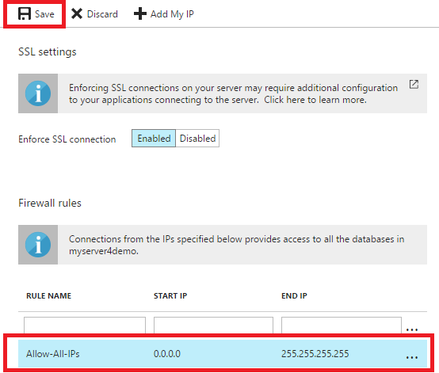
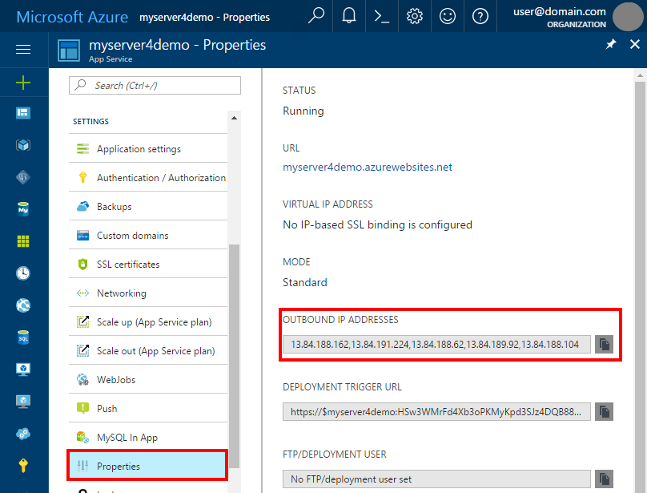
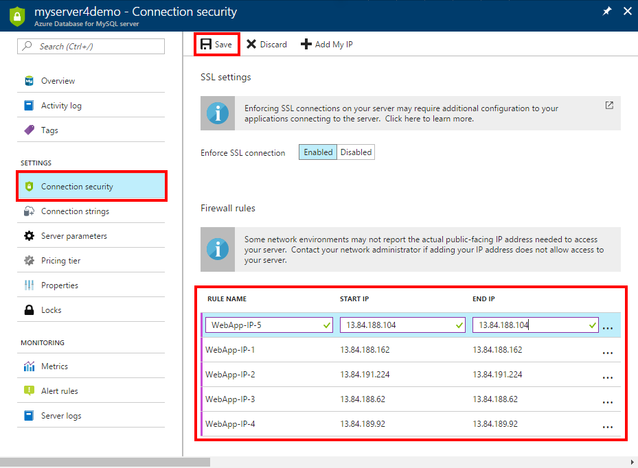

# Connect an existing Azure App Service to Azure Database for MySQL server
This document explains how to connect an existing Azure App Service to your Azure Database for MySQL server.

## Before you begin
Log in to the [Azure portal](https://portal.azure.com). Create an Azure Database for MySQL server. For details, refer to [How to create Azure Database for MySQL server from Portal](quickstart-create-mysql-server-database-using-azure-portal.md) or [How to create Azure Database for MySQL server using CLI](quickstart-create-mysql-server-database-using-azure-cli.md).

Currently there are two solutions to enable access from an Azure App Service to an Azure Database for MySQL. Both solutions involve setting up server-level firewall rules.

## Solution 1 - Create a firewall rule to allow all IPs
Azure Database for MySQL provides access security using a firewall to protect your data. When connecting from an Azure App Service to Azure Database for MySQL server, keep in mind that the outbound IPs of App Service are dynamic in nature. 

To ensure the availability of your Azure App Service, we recommend using this solution to allow ALL IPs.

> [!NOTE]
> Microsoft is working for a long-term solution to avoid allowing all IPs for Azure services to connect to Azure Database for MySQL.

1. On the MySQL server blade, under Settings heading, click **Connection Security** to open the Connection Security blade for the Azure Database for MySQL.

   

2. Enter **RULE NAME**, **START IP**, and **END IP**. Then click **Save**.
   - Rule name: Allow-All-IPs
   - Start IP: 0.0.0.0
   - End IP: 255.255.255.255

   

## Solution 2 - Create a firewall rule to explicitly allow outbound IPs
You can explicitly add all the outbound IPs of your Azure App Service.

1. On the App Service Properties blade, view your **OUTBOUND IP ADDRESS**.

   

2. On the MySQL Connection security blade, add outbound IPs one by one.

   

3. Remember to **Save** your firewall rules.

Though the Azure App service attempts to keep IP addresses constant over time, there are cases where the IP addresses may change. For example, when the app recycles or a scale operation occurs, or when new machines are added in Azure regional data centers to increase the capacity. When the IP addresses change, the app could experience downtime in the event it can no longer connect to the MySQL server. Consider this potential when choosing one of the preceding solutions.

## SSL configuration
Azure Database for MySQL has SSL Enabled by default. If your application is not using SSL to connect to the database, then you need to disable SSL on MySQL server. For details on how to configure SSL, See [Using SSL with Azure Database for MySQL](howto-configure-ssl.md).

## Next steps
For more information about connection strings, refer to [Connection Strings](howto-connection-string.md).
