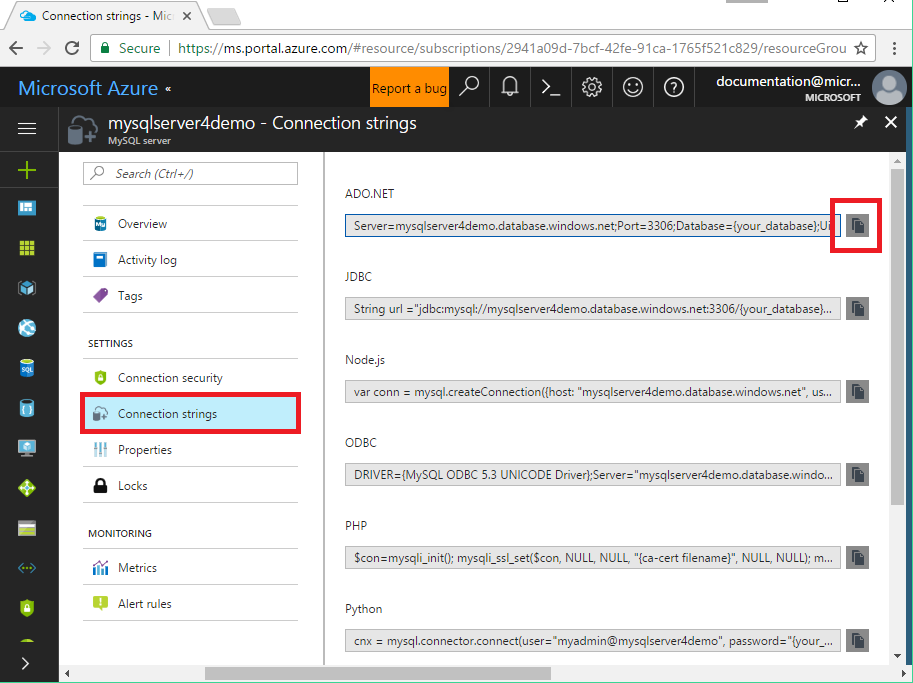

# How to connect applications to Azure Database for MySQL
This document lists all connection string types supported by Azure Database for MySQL, together with templates and examples. You may have different parameters and different settings in your connection string.

- Please refer to document [How to configure SSL](./howto-configure-ssl.md) to obtain the cert
- {your_host} = <servername>.mysql.database.azure.com

## ADO.NET
```ado.net
Server={your_host};Port={your_port};Database={your_database};Uid={your_username};Pwd={your_password};[SslMode=Required;]
```

For example, assuming server name is **wpdemo**, database name is **wpdb**, user name is **WPAdmin**, password is **orcas!2**.

Then, the connection string shoud be:

```ado.net
Server= "wpdemo.mysql.database.azure.com"; Port=3306; Database= "wpdb"; Uid= "WPAdmin@wpdemo"; Pwd="orcas!2"; SslMode=Required;
```

## JDBC
```jdbc
String url ="jdbc:mysql://%s:%s/%s[?verifyServerCertificate=true&useSSL=true&requireSSL=true]",{your_host},{your_port},{your_database}"; myDbConn = DriverManager.getConnection(url, {your_username}, {your_password}";
```

## Node.JS
```node.js
var conn = mysql.createConnection({host: {your_host}, user: {your_username}, password: {your_password}, database: {your_database}, Port: {your_port}[, ssl:{ca:fs.readFileSync({ca-cert filename})}}]);
```

## ODBC
```odbc
DRIVER={MySQL ODBC 5.3 UNICODE Driver};Server={your_host};Port={your_port};Database={your_database};Uid={your_username};Pwd={your_password}; [sslca={ca-cert filename}; sslverify=1; Option=3;]
```

## PHP
```php
$con=mysqli_init(); [mysqli_ssl_set($con, NULL, NULL, {ca-cert filename}, NULL, NULL);] mysqli_real_connect($con, {your_host}, {your_username}, {your_password}, {your_database}, {your_port});
```

## Python
```python
cnx = mysql.connector.connect(user={your_username}, password={your_password}, host={your_host}, port={your_port}, database={your_database}[, ssl_ca={ca-cert filename}, ssl_verify_cert=true])
```

## Ruby
```ruby
client = Mysql2::Client.new(username: {your_username}, password: {your_password}, database: {your_database}, host: {your_host}, port: {your_port}[, sslca:{ca-cert filename}, sslverify:false, sslcipher:'AES256-SHA'])
```

## Get Connection String from Portal
In [Azure portal](https://portal.azure.com), go to your Azure Database for MySQL and click **Connection strings** to get your string list for your instance:


The string provides details such as the driver, server, and other database connection parameters. Copy the connection string in your demand, then modify with your own parameters like database name, password, etc. Then you can use this string to connect to server.

## Next steps
- For more information regarding connection library, please refer to [Concepts - Connection libraries](./concepts-connection-libraries.md)
