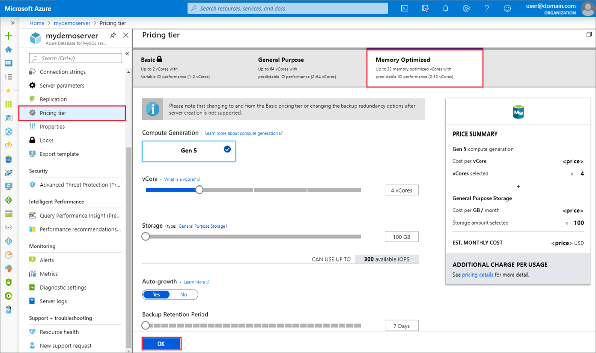

# Manage an Azure Database for MySQL server using the Azure portal
This article shows you how to create a new Azure Database for MySQL server and how to manage your server. Management tasks include compute and storage scaling, admin password reset, and viewing server details.

## Sign in
Sign in to the [Azure portal](https://portal.azure.com).

## Create an Azure Database for MySQL server
Follow these steps to create an Azure Database for MySQL server named “mydemoserver”.

1. Select **Create a resource**, located in the upper left corner of the Azure portal homepage.

2. Select **Databases**. Then select **Azure Database for MySQL**. 

   

3. Select **Create** in the **Single server** deployment option.

4. Fill in the required details. 
   
   

   The following are sample values:

    | **Field** | **Sample value** |
    |----------------|-----------------------|
    | *Server name* | mydemoserver |
    | *Subscription* | mysubscription |
    | *Resource group* | myresourcegroup |
    | *Select source* | Blank |
    | *Server admin login* | myadmin |
    | *Password* | set admin account password |
    | *Confirm password* | confirm admin account password |
    | *Location* | Southeast Asia |
    | *Version* | 11 |

5. Select **Configure server** to review compute and storage options. You can approve the default options, or adjust the selections to suit your needs. 

   

   Learn more about the available [compute and storage options](concepts-pricing-tiers.md).

6. Select **Review + create** to validate your entries. Select **Create** to provision the server. Provisioning may take a few minutes.

## Scaling compute and storage

After server creation you can scale between the General Purpose and Memory Optimized tiers as your needs change. You can also scale compute and memory by increasing or decreasing vCores. You can scale storage up (however, storage cannot be scaled down).

### Scale between General Purpose and Memory 

You can scale from General Purpose to Memory Optimized and vice-versa. Changing to and from the Basic tier after server creation is not supported. 

1. Select your server in the Azure portal. Select **Pricing tier**, located in the **Settings** section.

2. Select **General Purpose** or **Memory Optimized**, depending on what you are scaling to. 

    

    > [!NOTE]
    > Changing tiers causes a server restart.

4. Select **OK** to save changes.

### Scale vCores up or down

1. Select your server in the Azure portal. Select **Pricing tier**, located in the **Settings** section.

2. Change the **vCore** setting by moving the slider to your desired value.

    

    > [!NOTE]
    > Scaling vCores causes a server restart.

3. Select **OK** to save changes.

### Scale storage up

1. Select your server in the Azure portal. Select **Pricing tier**, located in the **Settings** section.

2. Change the **Storage** setting by moving the slider up to your desired value.

    

    > [!NOTE]
    > Storage cannot be scaled down.

3. Select **OK** to save changes.

## Update admin password
You can change the adminstrator role's password using the Azure portal.

1. Select your server in the Azure portal. In the **Overview** window select **Reset password**.

   

2. Enter a new password and confirm the password. The textbox will prompt you about password complexity requirements.

   

3. Select **OK** to save the new password.

## Delete an Azure Database for MySQL server

1. Select your server in the Azure portal. In the **Overview** window select **Delete**.

    

2. Type the name of the server into the input box to confirm that this is the server you want to delete.

    

3. Select **Delete**.

## Next steps
- Learn about [backups and server restore](howto-restore-server-portal.md)
- Learn about [tuning and monitoring options in Azure Database for MySQL](concepts-monitoring.md)